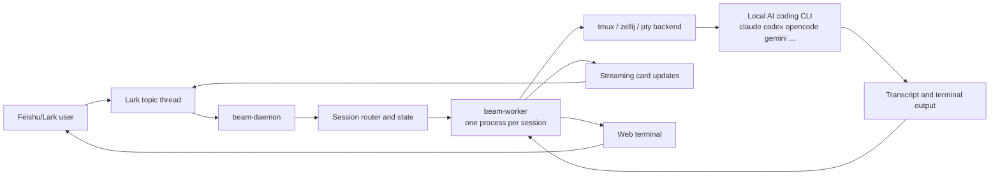

# beam

<p align="center">
  
</p>

<p align="center">
  <a href="LICENSE"></a>
  <a href="https://github.com/deepcoldy/beam"></a>
</p>

[中文](README.md) | English

---

**`beam` is a simplified Rust fork of [botmux](https://github.com/deepcoldy/botmux).**

**It does not invent another agent.** It connects existing AI coding CLIs to Feishu/Lark topic threads, then adds persistent sessions, streaming cards, and a web terminal.

In one line, the defining idea is: **one Lark thread becomes one local AI coding session.**

## What beam is for

beam is built for teams that already work in Feishu/Lark and want to use coding agents without leaving chat:

- Start a new coding session from a Lark topic
- Keep one isolated CLI runtime per thread or task
- Watch progress from streaming cards instead of polling logs
- Open a writable web terminal when the agent needs manual help
- Let multiple bots coexist in the same group without mixing sessions
- Survive daemon restarts without killing the underlying CLI process

## How it works



One Lark thread becomes one managed coding session. `beam-daemon` routes the message, `beam-worker` owns the live CLI process, and the results flow back as streaming cards plus an optional browser terminal.

## Feature Overview

### Thread-native agent sessions

Each Lark topic maps to a `beam` session. The daemon routes new messages, creates or reuses the correct session, and spawns a dedicated worker process for that conversation.

This gives you:

- clear per-thread isolation
- separate working directories and CLI arguments per bot
- safer restart and recovery boundaries

### Streaming Lark cards

beam continuously updates a Lark card with the current terminal state. The card can show session status, screenshots, retry hints, terminal links, and common actions like refresh, restart, or close.

This is the default "watch mode" for long-running coding tasks.

### Interactive web terminal

Every active session can expose a browser terminal backed by the same live CLI process. That makes it practical to:

- inspect output in full
- type directly into the running session
- recover from interactive prompts or TUI states

### Persistent sessions with `tmux` or `zellij`

beam supports `tmux`, `pty`, and `zellij` backends. `tmux` is the default production path, while `zellij` is also supported for managed and adopted sessions.

With persistent backends:

- daemon restarts do not kill the CLI
- sessions can be reattached after recovery
- long jobs can continue in the background

### Session adopt

beam can adopt an already-running terminal session and bring it under Lark control. This is useful when work started manually in `tmux` or `zellij` and later needs cards, terminal proxying, or chat-driven follow-up.

### Multi-bot collaboration

Multiple bots can live in the same group. beam keeps routing explicit and isolated:

- mention-based bot selection
- per-bot permissions and grants
- independent worker processes and session state

### CLI passthrough

beam reserves only a small set of daemon-side slash commands such as `/close`, `/restart`, `/card`, `/adopt`, and `/workflow`.

Other `/slash` commands are forwarded to the underlying CLI unchanged, so you can keep using CLI-native commands inside chat-driven sessions.

### Workflow, hooks, and scheduling

The Rust workspace already includes:

- workflow execution and resume APIs
- ask/report hooks for CLI integration
- schedule management commands
- connector and webhook plumbing

These are available, but the core product experience is still centered on the Lark thread -> local CLI session loop.

## Quick Start

```bash
cargo build -p beam-cli --release
beam setup
beam start
beam autostart enable
```

**Prerequisites:**
- Rust toolchain
- AI coding CLI installed (`opencode`, `claude`, `codex`, `gemini`, etc. on PATH)
- `tmux` or `zellij` if you want persistent sessions

## Common Commands

```bash
beam start        # Start daemon
beam stop         # Stop daemon
beam restart      # Restart daemon
beam logs         # View logs
beam status       # Check status
beam list         # List active sessions
beam send <msg>   # Send message to current thread
beam bots list    # List bots in group
beam setup        # Setup wizard
beam dashboard    # Open dashboard
```

## Supported Runtime Shape

At a high level, beam runs as:

1. `beam-daemon`: receives Lark events, manages sessions, updates cards, serves APIs
2. `beam-worker`: one process per session, owns the backend, terminal stream, and CLI adapter
3. `beam-cli`: local operator commands such as `start`, `send`, `dashboard`, `workflow`, and `session`

That split is intentional. A stuck or noisy CLI should not take down the entire daemon.

## Documentation

- Architecture: [docs/design/beam-architecture.md](docs/design/beam-architecture.md)
- Core runtime design: [docs/design/beam.md](docs/design/beam.md)
- Current parity status: [docs/design/beam-parity-plan.md](docs/design/beam-parity-plan.md)
- Platform and team collaboration: [docs/platform-design.md](docs/platform-design.md)
- Cross-deployment federation: [docs/federation-design.md](docs/federation-design.md)

## License

[MIT](LICENSE)
