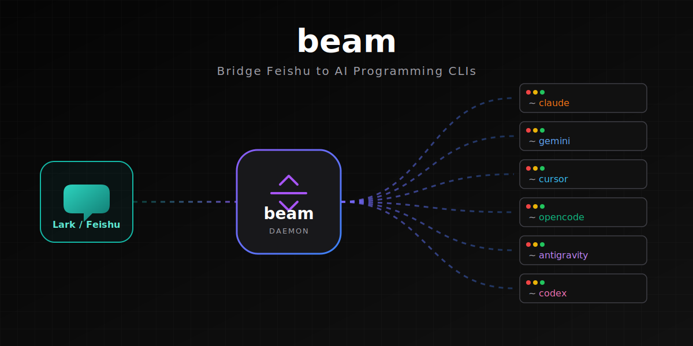
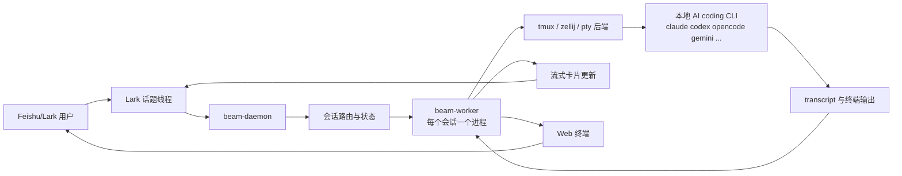

# beam

<p align="center">
  
</p>

<p align="center">
  <a href="LICENSE"></a>
  <a href="https://github.com/deepcoldy/beam"></a>
</p>

[中文](README.md) | <a href="README.en.md">English</a>

---

**`beam` 是 [botmux](https://github.com/deepcoldy/botmux) 的一个简化版 Rust fork。**

**它不是在发明另一个 agent。** 它做的事情是把现有 AI coding CLI 接到 Feishu/Lark 话题线程里，再补上持久会话、流式卡片和 Web 终端。

一句话讲最大的特点：**一个 Lark 线程，就是一个本地 AI 编程会话。**

## 这个项目是做什么的

`beam` 面向已经在 Feishu/Lark 里协作、又希望直接复用本地 AI 编程 CLI 的团队：

- 在 Lark 话题里直接启动新的编程会话
- 让每个线程或任务拥有独立的 CLI 运行时
- 用流式卡片看进度，而不是反复翻日志
- 需要人工介入时直接打开可写 Web 终端
- 让多个 bot 在同一个群里协作而不串会话
- daemon 重启后不杀掉底层 CLI 进程

## 它是怎么工作的



一个 Lark 线程会变成一个受控的本地编程会话。`beam-daemon` 负责路由消息，`beam-worker` 持有真实 CLI 进程，结果再通过流式卡片和可选的浏览器终端回到用户。

## 功能概览

### 线程原生的 agent 会话

每个 Lark 话题都映射到一个 `beam` session。daemon 会根据消息创建或复用正确的会话，并为它启动独立 worker 进程。

这样带来的直接收益是：

- 每个线程天然隔离
- 每个 bot 可以有独立的工作目录和 CLI 参数
- restart / recovery 的边界更清楚

### 流式 Lark 卡片

beam 会持续更新 Lark 卡片，展示当前终端状态。卡片里可以带上会话状态、截图、重试提示、终端链接，以及 refresh / restart / close 这类常用操作。

这就是它处理长任务时的默认观察界面。

### 可交互的 Web 终端

每个活跃会话都可以暴露一个浏览器终端，背后连接的是同一个真实 CLI 进程。适合：

- 完整查看终端输出
- 直接向运行中的会话输入内容
- 处理中途出现的交互式提示或 TUI 场景

### 用 `tmux` 或 `zellij` 持久化会话

beam 支持 `tmux`、`pty` 和 `zellij` 三种 backend。默认生产路径仍然是 `tmux`，但 `zellij` 也支持 managed 和 adopted session。

使用持久后端时：

- daemon 重启不会杀掉 CLI
- 会话可以在恢复后重新接回
- 长任务可以继续在后台跑

### Session adopt

beam 可以把一个已经在运行的终端会话接进来，纳入 Lark 控制。适合那些一开始手动在 `tmux` 或 `zellij` 里启动、后来又希望补上卡片、终端代理和聊天接力的场景。

### 多 bot 协作

多个 bot 可以共处同一个群，beam 会把路由边界维持清楚：

- 基于 @mention 的 bot 选择
- 每个 bot 独立的权限与 grant
- 每个 bot 独立的 worker 进程和会话状态

### CLI 命令透传

beam 自己只保留少量 daemon 侧 `/slash` 命令，例如 `/close`、`/restart`、`/card`、`/adopt`、`/workflow`。

其他未知的 `/slash` 命令会原样转发给底层 CLI，所以你仍然可以在聊天驱动的会话里使用 CLI 自己的命令体系。

### Workflow、hooks 和 schedule

当前 Rust workspace 里已经包含：

- workflow 执行与 resume API
- 给 CLI 集成用的 ask/report hooks
- schedule 管理命令
- connector 与 webhook 基础设施

这些能力已经存在，但项目的核心产品体验仍然围绕着 `Lark 线程 -> 本地 CLI 会话` 这条主链路。

## 快速开始

```bash
cargo build -p beam-cli --release
beam setup
beam start
beam autostart enable
```

**前置要求：**
- Rust toolchain
- AI 编程 CLI 已安装（`opencode`、`claude`、`codex`、`gemini` 等在 PATH 中）
- 如果你需要持久会话，安装 `tmux` 或 `zellij`

## 常用命令

```bash
beam start        # 启动 daemon
beam stop         # 停止 daemon
beam restart      # 重启 daemon
beam logs         # 查看日志
beam status       # 查看状态
beam list         # 列出活跃会话
beam send <msg>   # 向当前线程发消息
beam bots list    # 列出群内机器人
beam setup        # 配置向导
beam dashboard    # 打开 dashboard
```

## 运行时形态

从高层看，beam 由三部分组成：

1. `beam-daemon`：接收 Lark 事件、管理 session、更新卡片、提供 API
2. `beam-worker`：每个 session 一个进程，持有 backend、terminal stream 和 CLI adapter
3. `beam-cli`：本地操作命令，例如 `start`、`send`、`dashboard`、`workflow`、`session`

这个拆分是有意为之的。某个 CLI 卡死或输出异常，不应该把整个 daemon 一起拖垮。

## 文档

- 架构说明：[docs/design/beam-architecture.md](docs/design/beam-architecture.md)
- 核心运行时设计：[docs/design/beam.md](docs/design/beam.md)
- 当前对标状态：[docs/design/beam-parity-plan.md](docs/design/beam-parity-plan.md)
- 平台与团队协作：[docs/platform-design.md](docs/platform-design.md)
- 跨部署 federation：[docs/federation-design.md](docs/federation-design.md)

## 许可证

[MIT](LICENSE)
