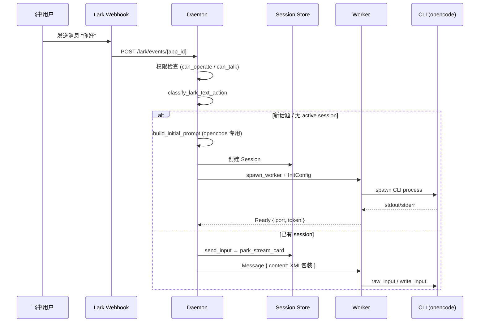
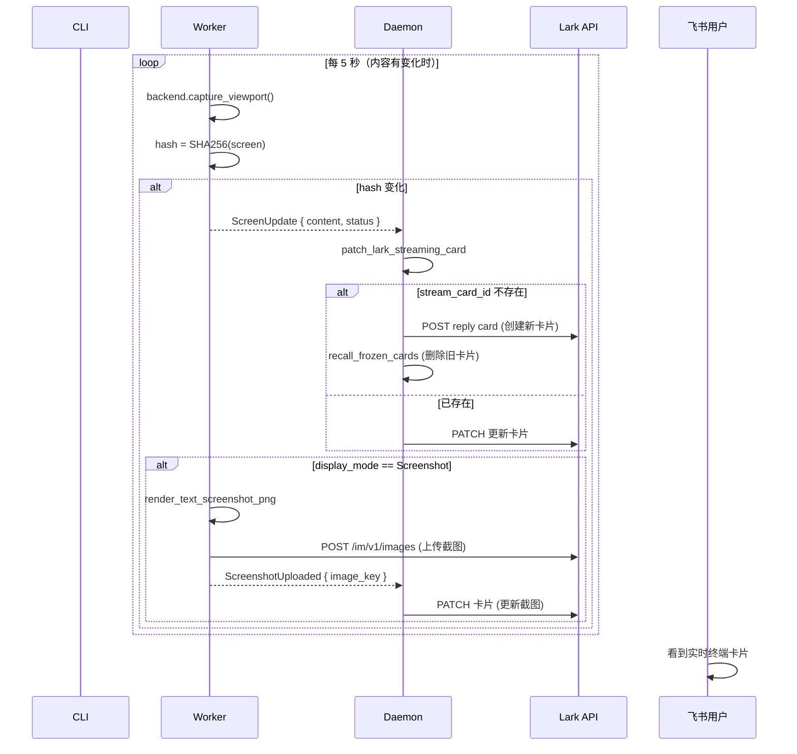
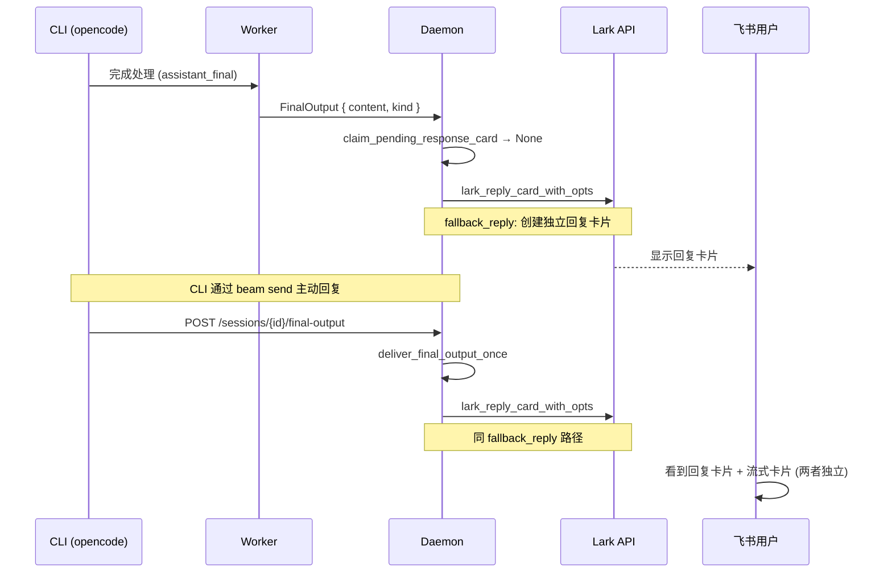
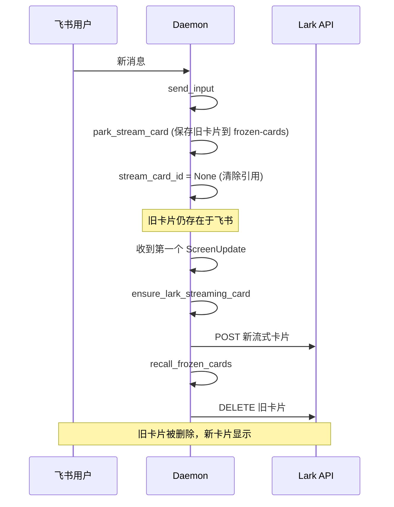
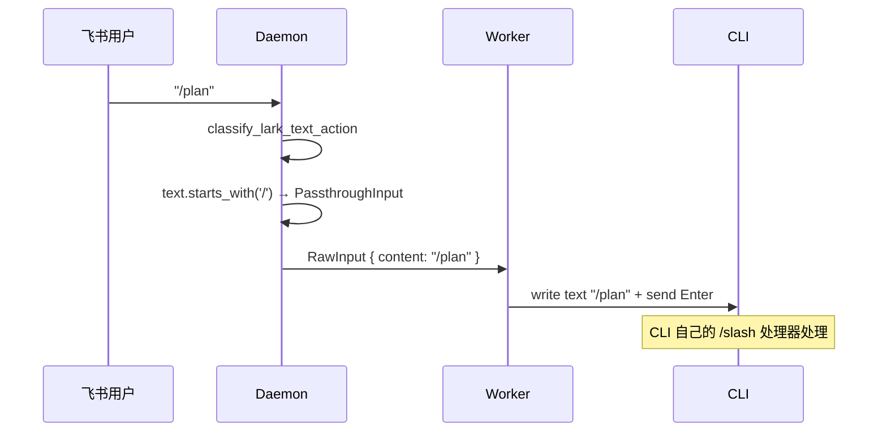
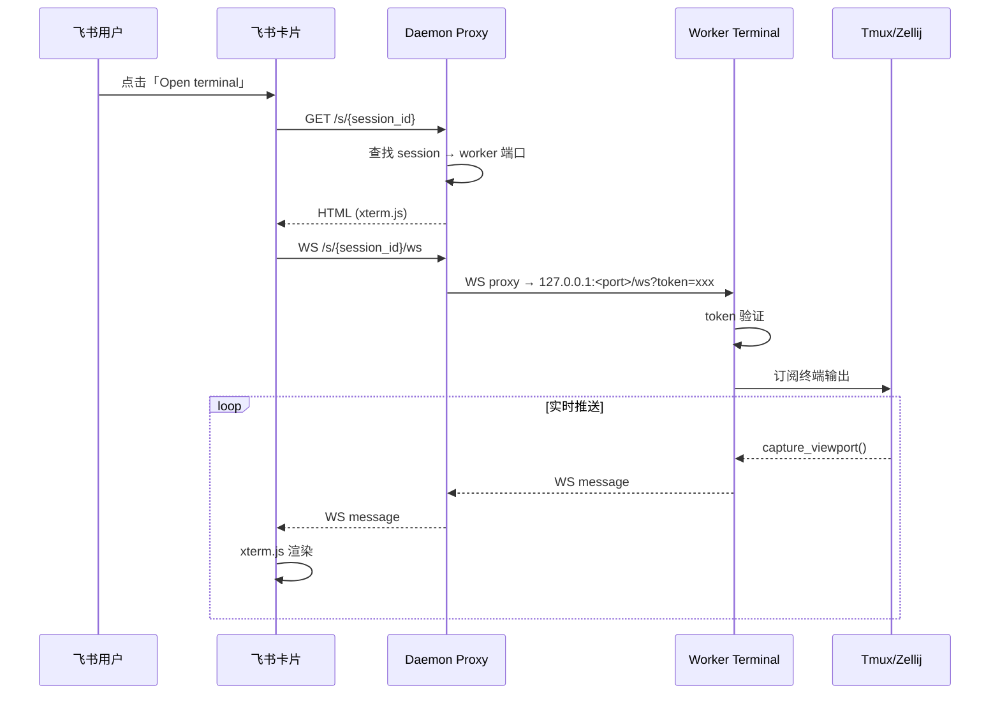

# beam 架构

## 核心实体

### 进程架构

```
┌─────────────────────────────────────────────────────┐
│                   beam-cli                      │
│   start / stop / restart / send / bots / workflow    │
│   logs / status / attach / schedule / dashboard      │
└─────────┬───────────────────────────────┬────────────┘
          │ 管理生命周期                    │ send 透传
          ▼                                ▼
┌─────────────────────────────────────────────────────┐
│                beam-daemon                      │
│  ┌──────────┐  ┌──────────┐  ┌───────────────────┐ │
│  │Lark WS   │  │HTTP API  │  │Session & Card     │ │
│  │receiver  │  │server    │  │Lifecycle Manager  │ │
│  └──────────┘  └──────────┘  └───────────────────┘ │
│       │              │                   │           │
│       ▼              ▼                   ▼           │
│  ┌──────────────────────────────────────────────┐   │
│  │              AppState                         │   │
│  │  sessions  │  workers  │  bots  │  config     │   │
│  │  paths     │  http     │  schedules          │   │
│  └──────────────────────────────────────────────┘   │
└─────────┬───────────────────────────────────────────┘
          │ stdin/stdout JSON IPC
          ▼
┌─────────────────────────────────────────────────────┐
│                beam-worker                       │
│  ┌──────────────┐  ┌──────────────┐  ┌────────────┐ │
│  │CLI Adapter   │  │Screen Capture│  │Terminal Web│ │
│  │(opencode/    │  │+ Screenshot  │  │Server      │ │
│  │ claude/codex)│  │Upload Loop   │  │(xterm.js)  │ │
│  └──────┬───────┘  └──────┬───────┘  └────────────┘ │
│         │                 │                          │
│         ▼                 ▼                          │
│  ┌──────────────────────────────────────────────┐   │
│  │            SessionBackend                     │   │
│  │   TmuxPipeBackend / ZellijBackend / PtyBackend│   │
│  └──────────────────────────────────────────────┘   │
└─────────────────────────────────────────────────────┘
```

### 终端代理（Terminal Proxy）

每个 Worker 在 `127.0.0.1` 随机端口启动一个 WebSocket + HTTP 终端服务（`worker/src/terminal.rs`），提供 xterm.js 网页终端。Daemon 对外暴露一个统一的 **Terminal Proxy**（`daemon/src/terminal_proxy.rs`），负责鉴权和路由。

```
外部浏览器                    Daemon Proxy                 Worker Terminal
┌──────────┐    HTTP/WS     ┌──────────────────┐   WS    ┌──────────────┐
│ xterm.js │ ─────────────> │ /s/{session_id}  │ ──────> │ :random_port │
│          │ <───────────── │ /s/{session_id}/ │ <────── │ /ws          │
│ 飞书卡片  │                │ ws               │         │              │
│ "Open     │                │                  │         │  token 鉴权   │
│ terminal" │                │ 查找 session →    │         │              │
│          │                │ worker 地址       │         │ real-time    │
│          │                │                  │         │ terminal     │
└──────────┘                └──────────────────┘         └──────────────┘
```

- **Worker Terminal Server**: 每 session 一个，`127.0.0.1:<随机端口>`，通过 `token` query 参数鉴权，WebSocket 推送终端内容
- **Daemon Terminal Proxy**: 唯一对外入口，`<host>:<proxy_base_port>`，路由 `/s/{session_id}` 和 `/s/{session_id}/ws` → worker 地址。proxy 本身不额外做会话鉴权，读写权限仍由转发到 worker 的 query token 决定。
- 飞书流式卡片上的「Open terminal」按钮跳转到 proxy 地址

### 配置

```
Config
├── DaemonConfig      # 守护进程全局配置
│   ├── bind_host / bind_port
│   ├── backend_type: Tmux | Zellij | Pty
│   ├── working_dirs
│   └── screen_analyzer
├── BotConfig         # 每个机器人的配置
│   ├── lark_app_id / lark_app_secret
│   ├── cli_id / cli_bin / cli_args
│   ├── backend_type
│   ├── allowed_users / allowed_chat_groups
│   └── chat_grants / global_grants
└── BeamPaths         # 文件系统路径布局
    ├── root / bots.json / config.toml
    ├── run/          # 运行时临时文件
    ├── sessions/     # 会话持久化
    └── schedules/
```

### Session

```
Session
├── session_id / title
├── chat_id / chat_type (p2p|group|topic)
├── root_message_id / quote_target_id
├── scope: Thread | Chat
├── status: Active | Closed
├── lark_app_id / owner_open_id
├── cli_id / cli_bin / cli_args
├── backend_type
├── display_mode: Hidden | Screenshot
├── stream_card_id / stream_card_nonce   ← 飞书流式卡片
├── current_image_key                    ← 最新截图的 image_key
├── current_screen / last_screen_status
├── worker_pid / web_port / worker_token
├── adopted_from
├── pending_response_card_id / pending_response_card_state
├── last_final_output
├── frozen_cards: HashMap<nonce, FrozenCard>
└── last_cli_input / bot_name / bot_open_id
```

### IPC（Daemon ↔ Worker 通信）

```
InitConfig              # 启动 Worker 时的初始化参数
├── session_id / title / chat_id / root_message_id
├── working_dir / cli_id / cli_bin / cli_args
├── backend_type / prompt / initial_prompt
├── lark_app_id / lark_app_secret
├── model / locale
└── resume / resume_session_id / adopted_from

DaemonToWorker          # Daemon → Worker
├── Init(InitConfig)
├── Message { content, turn_id }      ← 用户消息（包 XML 标签）
├── RawInput { content, turn_id }     ← 透传命令（原样）
├── Close / Restart
├── SetDisplayMode { mode }
├── TermAction { key }
├── RefreshScreen
└── SpecialKeys / TuiKeys / TuiTextInput

WorkerToDaemon          # Worker → Daemon
├── Ready { port, token }
├── ScreenUpdate { content, status, usage_limit }
├── ScreenshotUploaded { image_key, status, usage_limit }
├── PromptReady
├── FinalOutput { content, turn_id, kind, user_text }
├── CliExit { code, signal }
├── CliSessionId { cli_session_id }
├── AdoptPreamble { user_text, assistant_text }
└── Error { message }
```

### CLI 适配器

```
Adapter trait
├── create_state → 创建 CLI 特定状态
├── build_spawn_spec → 构建启动参数
├── write_input → 写入用户输入
├── poll → 轮询输出（bridge/transcript 检查）
└── 适配器：
    ├── opencode    → SQLite transcript bridge
    ├── claude      → JSONL bridge
    ├── codex       → structured bridge
    ├── coco        → structured bridge
    ├── gemini      → structured bridge
    ├── hermes      → structured bridge
    ├── antigravity → structured bridge
    └── generic     → passthrough
```

### 飞书卡片的两种形态

```
流式卡片 (Streaming Card)           │   回复卡片 (Final Output Card)
────────────────────────────────────┼───────────────────────────────────
创建：ensure_lark_streaming_card    │   创建：deliver_final_output_once
      → POST 到 thread 根消息        │         → fallback_reply
生命周期：整个 turn 持续更新          │         → lark_reply_card_with_opts
      同 turn PATCH 更新终端内容      │   生命周期：一次性，不再更新
      新 turn park → delete → 重建   │
内容：终端截图 + 状态 + 操作按钮      │   内容：Markdown 文本 + 脚注
操作：显示/隐藏截图、刷新、终端、     │   操作：无（纯展示）
      重启、关闭会话                   │
```

---

## 完整流程

### 1. 消息接收 → 会话创建



### 2. 终端输出 → 飞书卡片



### 3. CLI 回复 → 卡片处理



### 4. 第二轮消息 → 卡片轮替



### 5. 透传命令 (`/review`, `/plan`, 等)



### 6. 终端代理



---

## 关键设计决定

| 决策 | 原因 |
|------|------|
| 流式卡片 ≠ 回复卡片 | 回复走独立卡片，不 PATCH 覆盖流式卡片 |
| 所有非 beam 的 `/` 命令一律透传 | 不维护白名单，新 CLI 命令自动支持 |
| 截图固定 5s 间隔 | 自适应间隔过于频繁，5s + hash 去重避免无效请求 |
| `/final-output` 在 open_routes | CLI `send` 无需 dashboard token |
| `lark_app_secret` 从 `state.bots` 查 | `create_session_internal` 不能传空 secret |
| Worker 终端 + Daemon 代理双层架构 | Worker 内网端口不暴露，Daemon 统一入口路由 |
```
