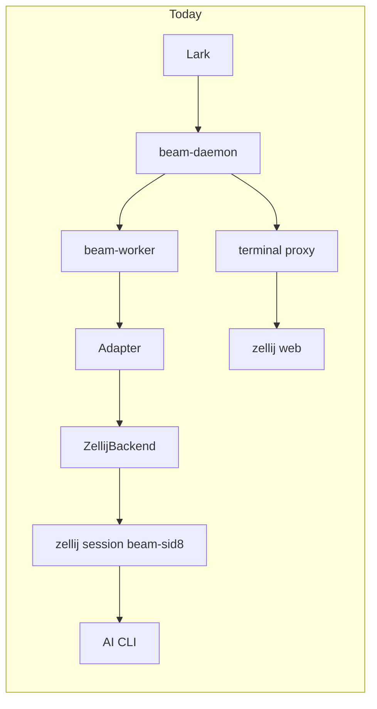
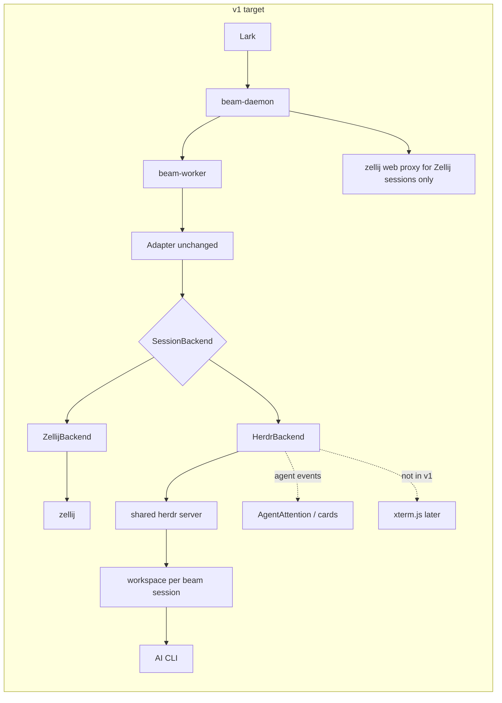
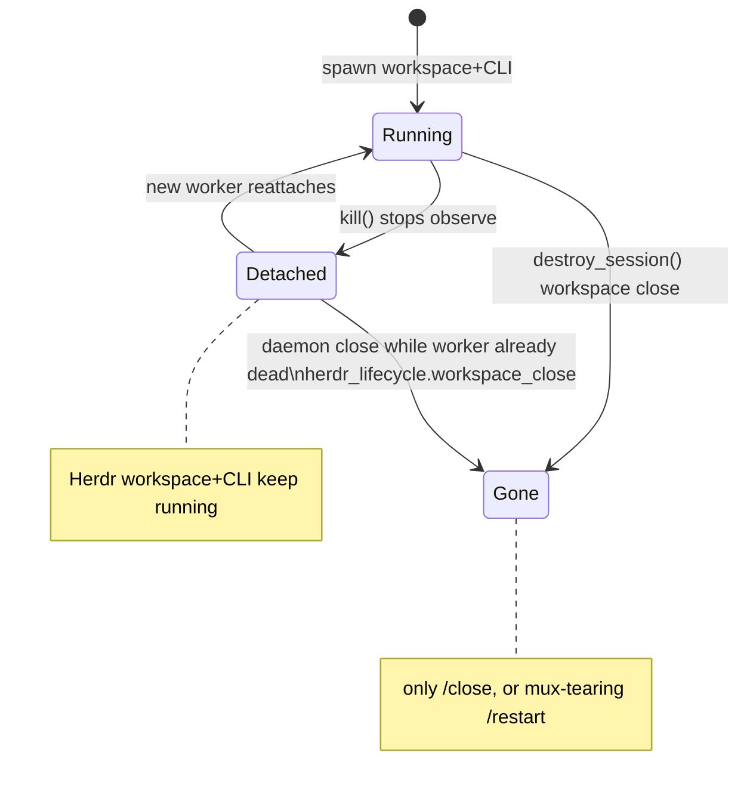

# Beam integration of Herdr as a terminal / agent runtime backend

Chinese: [herdr-backend.md](herdr-backend.md)

- Date: 2026-08-29
- Author: TBD
- Status: Draft
- Product decisions: 2026-08-29, open questions 1–6 confirmed and folded into the body (see the Open Questions section)
- Scope: Add Herdr as a first-class `SessionBackend` alongside Zellij; do not replace the default path in v1

## Overview

Beam today maps each Feishu/Lark topic onto a dedicated worker, which then hosts an AI coding CLI inside **Zellij**. That path already covers managed sessions, adopt, screenshot cards, transcript delivery, and the zellij-web terminal. Zellij is a general multiplexer, though, not an agent runtime: it has no first-class agent state, panes expose no pid/cwd/argv, the screen path is `dump-screen` / `subscribe` snapshots, `/adopt` has to parse dump-layout plus a process tree, and spawn still needs timeouts around `attach --create-background` plus retries for "failed to find terminal fd".

[Herdr](https://herdr.dev) (Apache-2.0, latest stable **v0.8.2**, 2026-08-19) is a terminal runtime aimed at coding agents: panes are still real terminals; it auto-detects Claude / Codex / Grok / OpenCode / Kimi / Hermes and others (heavy overlap with Beam adapters); it surfaces `working` / `blocked` / `done` / `idle` / `unknown`; the CLI plus Unix-socket API can spawn, type, read, and subscribe; `pane.process_info` returns pid/argv/cwd; and third-party bridges get `herdr terminal session observe|control` (NDJSON + base64 ANSI). It does **not** ship a zellij-web-style browser UI.

This design adds Herdr as a first-class `SessionBackend` next to Zellij, rather than ripping Zellij out in one move. CLI adapters, the transcript bridge, and Lark cards stay multiplexer-agnostic. v1 delivers managed + adopt + screenshot cards + Herdr `blocked` → Feishu attention. Web-terminal parity is not a gate for managed/adopt. **Screenshot cards can only post if `terminal_url` is decoupled from the card-delivery gate** (see card-ready below); hiding the terminal button is not enough. The default backend for existing deployments stays Zellij, and new installs also default to Zellij (Q1 confirmed); `beam setup` asks only when a herdr probe succeeds. Optional `BotConfig.backend` lets one bot dogfood Herdr. The v1 daemon **still requires zellij web to start** unless a later explicit skip switch lands.

## Background & Motivation

### Code reality (Rust is authoritative; older docs are not)

These design docs have drifted from the code and **must not** be treated as implementation truth:

| What the docs say | What the code does |
| --- | --- |
| `docs/design/beam.md`: production default is `TmuxPipeBackend`; backends are `tmux` / `pty` / `zellij` | `crates/beam-worker/src/backend/` contains **only** `zellij.rs` / `observe.rs` / `subscribe.rs`. `backend.rs` re-exports only `ZellijBackend` and `ZellijObserveBackend`. There is no live tmux/pty backend in the tree |
| `docs/design/beam-architecture.md`: `DaemonConfig.backend_type: Tmux \| Zellij \| Pty`; `Session` / `InitConfig` also have `backend_type`; `Ready { port, token }` | `DaemonConfig` in `crates/beam-core/src/config.rs` has only `quiet_restart` / `working_dirs`. `BotConfig` has **no** `backend_type`. `InitConfig` has **no** `backend_type`. `WorkerToDaemon::Ready` is actually `{ zellij_session: String }` |
| README: three backends, tmux still the production default | The worker unconditionally constructs Zellij. `run_loop.rs` hard-codes the session name `beam-{sid8}` |

The real main path today:

```
Feishu/Lark
  -> beam-daemon (Lark WS, sessions, cards, terminal proxy)
  -> per-session beam-worker (stdin/stdout JSON IPC)
  -> Adapter (claude/codex/grok/kimi/hermes/opencode/…)
  -> ZellijBackend | ZellijObserveBackend
  -> CLI inside zellij session `beam-{sid8}`
```

Implementation anchors:

- **Backend trait:** `SessionBackend` in `crates/beam-worker/src/backend.rs`. Every method takes `&self` and synchronizes internally, so one `Arc<dyn SessionBackend>` can be shared across `write_input`, screenshots, and subscribe without a long paste blocking capture.
- **Adapters are mux-agnostic:** `write_input(&mut self, backend: &dyn SessionBackend, content)` / `poll()` in `crates/beam-worker/src/adapter.rs`. Final replies come from on-disk CLI transcripts, not screen scraping. Cross-crate metadata lives in `crates/beam-core/src/cli_specs.rs`.
- **Managed spawn:** `run_loop.rs` does `ZellijBackend::new(session_name)`; `launch.rs` wraps the CLI as `/usr/bin/env …` or, on Linux, `systemd-run --user --scope --slice=…`. Zellij runs that command from a temporary KDL layout (`ZellijBackend::write_runtime_files`).
- **Ready IPC:** the worker sends `WorkerToDaemon::Ready { zellij_session }`. The daemon (`worker_lifecycle.rs`) logs it and sets `terminal_url` / `ScreenStatus::Starting`; it does **not** persist the zellij session name onto `Session`. Later code reconstructs `beam-{session_id[..8]}` or `adopted_from.zellij_session` (`session_zellij_target`, `zellij_session_for_beam`).
- **Screen:** `capture_viewport()` = `zellij action dump-screen --ansi --pane-id` (no `--full`). `subscribe()` runs `zellij subscribe --pane-id --ansi --format json`, turns `pane_update` viewports into clear+home ANSI chunks, and fires `Trigger::PaneUpdate` on the screenshot coordinator. This is snapshot-ish, not a tmux `pipe-pane` raw byte stream.
- **Status machine:** `ScreenStatus = Starting | Working | Idle | Analyzing | Limited`. `Analyzing` comes from Beam's own screen analyzer (`worker_runtime/analyzer.rs`) for TUI permission/option cards. `AgentAttention` (`authz|decision|blocked|help`) is mostly written by `beam send --attention`, not pushed by the multiplexer.
- **Web terminal:** the daemon starts local `zellij web` (`zellij_web.rs`, port `web.proxy_base_port + 1`) and fronts it with Beam's terminal proxy (ticket/cookie bridge, read-only anchor, 160×50 resize). The worker does **not** host an xterm.js server.
- **`/adopt`:** `zellij_adopt.rs` joins `list-sessions` + `dump-layout` + `list-panes --json` + `ps`. Zellij `list-panes` has no pid/cwd/command. `AdoptedFrom` still carries unused `tmux_target` (`lark_replies.rs` still falls back to it).
- **Lifecycle:** `kill()` only stops subscribe and removes the temp config; it does **not** delete the zellij session. `destroy_session()` runs `zellij delete-session -f` for managed sessions and is a no-op for observe/adopt. The worker handles both `Close` and `Restart` with `destroy_session()`. Daemon `session_actions.rs` has **three** hard-coded `zellij delete-session -f` sites: close when `ensure_worker` fails (~L85), close after waiting for the worker (~L118), and restart (~L159). Unexpected worker exit / `CliExit` (`apply_reported_cli_exit` only clears `worker_pid`) keeps `SessionStatus::Active`; the next message `ensure_worker` reattaches.
- **Card-delivery gate:** `decide_lark_card_delivery` (`lark_replies.rs`) returns `NotReady` when `session.terminal_url.is_none()`; `begin_lark_turn_card` (`lark_session_cards.rs`) returns on the same check. Screenshot cards work today only because Ready **always** writes a zellij-web URL (`worker_lifecycle.rs` ~194–198). `build_streaming_card` unconditionally emits "Choose read-only terminal entry / Send write link privately", and those actions still proxy to zellij web.
- **Zellij spawn fragility** (constants in `backend.rs` + `zellij.rs`): `ZELLIJ_SPAWN_TIMEOUT=30s` (`attach --create-background` retries the socket forever if the server panics), at most 2 spawn attempts (to absorb "failed to find terminal fd for id 0"), a locked temp config dir, and an 8s timeout on every `zellij action`, which rebuilds subscribe on timeout.

Local verification: `command -v herdr` failed. The design must include a capability probe and an install path.

### Why Herdr fits the agent case better

| Cost Beam pays today | What Herdr offers |
| --- | --- |
| Homegrown analyzer + polling dump-screen to guess "waiting for the user?" | Native agent state; `blocked` can become Feishu attention directly |
| `/adopt` parses KDL dump-layout and matches a process tree on (cliId, cwd) | `herdr agent list` + `pane.process_info` (shell pid, foreground pids, argv, cwd) |
| One zellij server per topic (`beam-{sid8}`); humans attach one-by-one | One Herdr server; workspace sidebar rolls up the whole herd |
| `dump-screen` / subscribe snapshots | `terminal session observe` pushes base64 ANSI; `pane read --format ansi` pulls the visible screen |
| No programmatic "wait until blocked/idle" | `agent.wait` / `events.subscribe` (**but** headless `idle` vs `done` has seen-semantics; see below) |
| Spawn is sensitive to zellij 0.44.x pty races | `workspace.create` returns stable public ids (`w1` / `w1:p1`) |

Herdr does **not** wrap or replace CLIs; it owns their terminals. That is compatible with Beam's "adapter types into a PTY, transcript reads files on disk" model.

## Goals & Non-Goals

### Goals

1. Herdr becomes a first-class `SessionBackend` beside `ZellijBackend`, selected by config, with existing deployments still defaulting to Zellij.
2. Managed session: each Beam session occupies **one workspace** on a shared Herdr server (label `beam-{sid8}`), with the root pane running the existing launch spec (`env` / `systemd-run` + adapter argv).
3. Adopt session: discover candidates via `agent list` + `process_info`, observe/drive non-invasively; `/close` does not tear down the user's workspace/pane. Discovery includes panes without Herdr agent detection whose argv matches `CLI_SPECS` (Q5 confirmed).
4. Input keeps going through `SessionBackend::{send_text,send_keys,paste_text,raw_input}` → `pane send-text` / `pane send-keys`. **Do not** use `agent.prompt` as the v1 primary path.
5. Screen: `observe` frames drive `Trigger::PaneUpdate`; `capture_viewport` is a full visible screen (`pane read --source visible --format ansi`, or a verified full-frame cache). The PNG screenshot renderer keeps the current SGR path. Herdr sessions must be able to Post/Patch screenshot cards **without** `terminal_url` (card-ready decoupled from `terminal_url`).
6. Map Herdr `blocked` onto `AgentAttention { kind: "blocked" }` (default reason; see mapping). **v1 must not write `ScreenStatus` from Herdr.** The analyzer / transcript `PromptReady` / usage-limit classifier remain ScreenStatus authority (Q4 confirmed: the analyzer stays on).
7. Capability probe: binary, version ≥ 0.8.2, socket; **`herdr api schema` is mandatory on any Herdr path**. Probe failure makes Herdr unselectable for that bot/session; Zellij is unaffected.
8. Neutral mux identity in IPC/session (`backend_kind` + Herdr workspace/pane/session ids), with Zellij fields kept for compatibility. `AdoptedFrom.backend_kind` selects the adopt worker's mux; it does not follow the daemon default.
9. `kill()` vs `destroy_session()` vs daemon restart, and a **dead-CLI next `ensure_worker` that still delivers the user message into a new process**, written as an explicit state machine.

### Non-Goals (v1)

- Making Herdr the replacement default, or silently migrating existing machines off Zellij.
- Making Beam a Herdr plugin (that inverts control: the Feishu daemon must own session lifecycle).
- Reusing the zellij-web proxy as Herdr's browser UI. Herdr has no HTTP terminal.
- Vendoring / forking Herdr, or wrapping CLIs inside Herdr in a way that breaks transcripts / `beam send`.
- Replacing the adapter `write_input` confirm loop with `agent.prompt` in v1.
- Making Herdr agent state the authority for `ScreenStatus`, or overwriting Beam Working/Idle/Analyzing from Herdr `working`/`done`/`idle` (Q4 confirmed: the analyzer is not turned off).
- Implementing a full Herdr TUI or SSH remote client inside Beam.
- One named Herdr session per Feishu topic (that hides agents from the default sidebar). `Session.herdr_session` is reserved for an escape hatch; v1 still defaults to the shared default session.
- Changing the adapter registry or transcript formats.
- **Advertising a standalone herdr-only deploy in v1.** `ensure_zellij_web` in `crates/beam-daemon/src/lib.rs` ~828–837 remains a hard start dependency until PR5's `web.zellij_web = false` lands and is tested.

## Proposed Design

### Control: Beam orchestrates, Herdr runs terminals





Beam daemon still:

- Owns Feishu sessions, cards, `/close` `/restart` `/adopt`, worker supervision, `beam send`.
- Chooses backend kind (bot override beats daemon default) and writes identity into `InitConfig` / `Session`.
- Does **not** write a zellij-web `terminal_url` for Herdr sessions. Card delivery uses card-ready (below); card copy may point at `herdr` / `herdr agent attach` instead of terminal buttons.

Herdr still:

- Owns PTYs, layout, agent detection, persist-across-detach.
- Is driven by the worker through the CLI (ordinary control) and the socket (subscriptions).

### Topology: shared server + one workspace per Beam session

```
Herdr default session (one Unix socket; sidebar sees every agent)
├── workspace label=beam-deadbeef   pane w1:p1  → topic A's claude
├── workspace label=beam-cafebabe   pane w2:p1  → topic B's grok
└── workspace label=my-manual-repo  pane w3:p1  → user's own agent (/adopt candidate)
```

Why:

- A human attaches once with `herdr` and sees the whole Beam herd. That is the core UX upgrade over "one zellij session per topic".
- Public ids (`w1:p1`) are stable **inside this one** Herdr session; a respawned worker reconnects using persisted workspace/pane ids.
- A named session (`herdr session attach beam-<sid>`) gives each topic its own socket/state, and the default sidebar cannot see them. Use that only as optional blast-radius isolation, not as the default.

The isolation boundary is the workspace, not a Feishu-topic-level Herdr session.

**Product-confirmed (Q2): v1 defaults to the shared default session with one workspace per Beam session; named sessions are only a reserved escape hatch via `Session.herdr_session` / `HerdrConfig.session`, not a v1 default.**

### Module boundaries

Suggested layout (keep ~800 lines/file; default-split past 1500):

| Module | Responsibility |
| --- | --- |
| `crates/beam-core/src/backend_kind.rs` (new, or fold into `session.rs`) | `BackendKind { Zellij, Herdr }`, serde `snake_case`, default `zellij` |
| `crates/beam-core/src/config.rs` | TOML snake_case: `DaemonConfig.backend`, `WebConfig.zellij_web`; `HerdrConfig { min_version, session, socket_path }`. `BotConfig.backend` (optional `bots.json` `"backend": "herdr"`) |
| `crates/beam-core/src/ipc.rs` / `session.rs` | Mux fields on `InitConfig` / `Session` / `Ready` / `AdoptedFrom`; `WorkerToDaemon::MuxAgentState` |
| `crates/beam-worker/src/backend/herdr/` | `mod.rs` (`HerdrBackend`), `cli.rs` (JSON CLI wrapper), `observe.rs`, `ids.rs`, `spawn.rs` |
| `crates/beam-worker/src/worker_runtime/run_loop.rs` | Select HerdrBackend only in **PR2** (PR1 adds types; default remains Zellij) |
| `crates/beam-daemon/src/herdr_probe.rs` | Binary/version/socket/**mandatory** schema probe |
| `crates/beam-daemon/src/herdr_adopt.rs` | Adopt discovery + `/adopt herdr:` grammar |
| `crates/beam-daemon/src/herdr_lifecycle.rs` | Ensure server, idempotent force-close; used by close/restart/restore |
| `crates/beam-cli/src/cli_commands/setup.rs` | Probe, install hint, write `config.toml` / `bots.json` backend |

**Do not** put the Herdr protocol inside adapters. Adapters keep seeing only `SessionBackend`.

### Herdr control surface: CLI first, socket only for subscriptions

Official guidance: start automation with CLI wrappers; use the raw socket for long-lived subscriptions. Beam matches that:

| Use | Mechanism | Why |
| --- | --- | --- |
| Workspace/pane CRUD, send-text/keys, read, process_info, agent list/get | `herdr …`, parse JSON stdout | Debuggable, matches documented examples, schema ships with the binary |
| Screen push | `herdr terminal session observe <pane> --cols 160 --rows 50` | Built for third-party bridges; many observers; does not own input/resize |
| Agent-state push | Unix socket `events.subscribe` (long-lived inside the worker) | CLI has no equivalent long subscribe; fall back to polling `agent get` |
| Writable web terminal (later) | `herdr terminal session control --takeover` | Only one controller at a time |

Constraints:

- Every CLI call has a timeout (align with `ZELLIJ_ACTION_TIMEOUT`, suggest 8s; create/run may go to 30s).
- When the worker invokes herdr, **unset** `HERDR_PANE_ID` / `HERDR_TAB_ID` / `HERDR_WORKSPACE_ID` so `--current` does not resolve to the daemon's own pane (the daemon may have been started via `beam restart` from a Herdr TUI).
- Target the server with explicit `--session <name>` and/or `HERDR_SOCKET_PATH`. The default session uses `~/.config/herdr/herdr.sock` (or `$XDG_CONFIG_HOME/herdr/herdr.sock`).
- **Do not** open `terminal session control --takeover` for managed input: that steals input/resize from a human TUI. v1 injection uses `pane.send_*`.
- Do not vendor Herdr. Depend on an installed binary. Minimum **0.8.2** (the release that has observe/control + `process_info`; GitHub latest is this tag).

### `SessionBackend` → Herdr mapping

| `SessionBackend` | Herdr | Notes |
| --- | --- | --- |
| `spawn(bin, args, opts)` | See next section | Managed create or reattach; adopt only starts observe |
| `send_text` | `herdr pane send-text <pane_id> <text>` | Low-level, non-submitting |
| `send_enter` | `herdr pane send-keys <pane_id> enter` | |
| `send_special_keys` | `pane send-keys`; full table below | Cover every key `ZellijBackend` / `ZellijObserveBackend` already accepts |
| `paste_text` | See paste contract | **Do not** takeover. v1 assumes only `pane run` is documented to honor bracketed paste; `send-text` may not |
| `write_raw` | socket `pane.send_input` (preferred) or CSI bytes via `send-text` | Use the socket when raw bytes are required |
| `raw_input` | Same as today: paste + 200ms + enter | **Do not** use `pane run` (that is a shell command); **do not** use `agent.prompt` |
| `capture_viewport` | `herdr pane read <pane> --source visible --format ansi` | Full visible screen, aligned with dump-screen. Observe cache is a fast path only after frames are proven complete |
| `capture_current_screen` | Same as `capture_viewport` | |
| `is_alive` | See "dead CLI next turn" predicate | Probe failure / unknown → **alive**. Pane present and foreground confirmed empty → **dead**. Workspace confirmed missing → **dead** |
| `child_pid` | `pane.process_info` foreground pids | Prefer the non-shell, recognized-agent pid for the cli-pid marker |
| `kill` | Stop observe/event children; **do not** close the workspace | Worker SIGTERM, daemon restart |
| `destroy_session` | Managed: force-close workspace (see implementation gate); adopt: no-op | Only `/close` and mux-tearing `/restart` |
| `cursor_position` | `Ok(None)` if the schema has no cursor field | Does not block v1 |
| `subscribe` | Observe NDJSON → `broadcast::Sender<String>` | Drives `Trigger::PaneUpdate` |

`agent.start --kind` is **not** the primary spawn path: it uses Herdr's canonical executable, does not wrap Beam's `cli_bin` / `cli_args` / `systemd-run`, and returns `agent_not_ready` if detection reports blocked during startup.

`agent.prompt` is **not** the primary `write_input` path: if the agent is already `blocked` it returns `agent_blocked` **without sending**, which breaks permission dialogs and the adapter transcript confirm loop. It can be an optional fast path in a later PR after proving it does not swallow TUI confirms.

#### Zellij → Herdr `send_special_keys` table

Every key `ZellijBackend` / `ZellijObserveBackend` already accepts must reach a Herdr pane (missing one breaks TUI confirm cards):

| Beam key (adapter / `TermAction`) | Herdr `pane send-keys` |
| --- | --- |
| `Enter` | `enter` |
| `Down` / `Up` / `Left` / `Right` | `down` / `up` / `left` / `right` |
| `PageUp` / `PageDown` | If Herdr has no name, CSI via `write_raw`: `\x1b[5~` / `\x1b[6~` (same as today's Zellij path) |
| `M-Enter` | `\x1b\r` via `write_raw` / `pane.send_input` |
| `Tab` | `tab` |
| `Space` | `space` |
| `Escape` / `Esc` | `esc` (docs also accept `escape`) |
| `C-c` | `ctrl+c` (Herdr aliases `C-c`/`c-c`; still emit `ctrl+c`) |
| Single character | `pane send-text` that character |

Unknown key → `bail!`, same as Zellij.

#### `paste_text` contract

Zellij `paste --pane-id` is bracketed paste; large `write_input` depends on it. Herdr docs only guarantee that **`pane run` honors live bracketed-paste**; `pane send-text` is unspecified. v1:

1. Spawn env still comes from launch-spec argv; paste is only for later user/adapter input.
2. `paste_text` tries `pane send-text` first. PR2 live tests must paste a ≥2KiB prompt with newlines and confirm the CLI transcript is one turn, not line-by-line.
3. If `send-text` does not bracket: wrap `\x1b[200~` … `\x1b[201~` and `pane.send_input`, then retest. Do not `--takeover` to paste.

### Card-ready: decouple from `terminal_url`

Today `terminal_url` means both "web terminal is available" and "cards may be delivered". Herdr v1 has no web terminal; if Ready stops writing a URL, the existing gate leaves streaming/screenshot cards `NotReady` forever.

v1 contract (must land in **the same PR** that stops setting Herdr `terminal_url`, i.e. PR2):

```rust
fn session_card_ready(session: &Session) -> bool {
    if session.lark_app_id == "local" || session.root_message_id.is_empty() {
        return false;
    }
    match session.backend_kind {
        BackendKind::Zellij => session.terminal_url.is_some(),
        BackendKind::Herdr => {
            session.herdr_workspace_id.is_some() && session.herdr_pane_id.is_some()
        }
    }
}
```

Changes:

- `decide_lark_card_delivery` and `begin_lark_turn_card` use `session_card_ready` instead of treating `terminal_url.is_none()` as a universal gate.
- `build_streaming_card`: when `backend_kind=herdr`, do not emit "Choose read-only terminal entry / Send write link privately"; replace it with **herdr-attach help copy** (open question 6 confirmed = show; copy and i18n land in PR5).
- `terminal_proxy`: **404** sessions with `backend_kind=herdr`; never map them to a `beam-{sid8}` zellij name.
- Tests: Herdr session with `terminal_url=None` but workspace/pane ids → `PostNew`/`PatchExisting`; missing ids → `NotReady`.

Zellij path unchanged: Ready still writes `terminal_url`.

### Managed spawn sequence

```mermaid
sequenceDiagram
  participant D as beam-daemon
  participant W as beam-worker
  participant H as herdr CLI
  participant S as herdr server
  participant C as AI CLI
  D->>W: InitConfig { backend_kind=herdr, session_id, … }
  W->>H: status / api schema (probe)
  H->>S: herdr server if needed
  W->>H: workspace list (dedupe by label beam-sid8)
  alt workspace exists and foreground process is still alive
    W->>H: workspace get / pane get / process_info
    W->>H: terminal session observe pane_id
  else workspace exists, pane present, foreground process dead (or pane empty)
    W->>H: wait for shell ready (pane wait-output)
    W->>H: pane run pane_id "<posix-quoted launch spec>" (InitConfig.resume + adapter resume argv)
    W->>W: wait_for_tui_ready
    W->>H: terminal session observe
  else workspace missing
    W->>H: workspace create --cwd WD --label beam-sid8 --no-focus
    H-->>W: .result.workspace.workspace_id / .result.tab.tab_id / .result.root_pane.pane_id
    W->>H: pane wait-output (shell prompt)
    W->>H: pane run … launch spec
    W->>W: wait_for_tui_ready
    W->>H: terminal session observe pane_id --cols 160 --rows 50
  end
  W->>D: Ready { backend_kind, zellij_session: "beam-sid8", herdr_workspace_id, herdr_pane_id }
  D->>D: persist Herdr ids; do not write terminal_url for Herdr; session_card_ready becomes true
```

JSON pointers (pin in PR1 fixtures; re-check against a real `herdr api schema --json` at implementation time):

- Create: `.result.workspace.workspace_id`, `.result.tab.tab_id`, `.result.root_pane.pane_id`
- List: workspace `workspace_id` + `label`

The launch spec is reused from `worker_runtime/launch.rs`. Today Zellij writes `bin + args` into KDL; Herdr `pane run` is documented as **one command string**. v1 **implements string + POSIX quote** unless the schema clearly offers argv (prefer argv if present). Implementation must:

1. A unit-testable POSIX quoter (spaces, quotes, `cliArgs`).
2. **Launch-spec argv is the env authority** (`/usr/bin/env KEY=VAL …` or `systemd-run … -- /usr/bin/env …`), including `maybe_inject_term` (codex/traex `TERM=xterm-256color`), `BEAM_SESSION_ID` / `BEAM_HOME` / `BEAM_BIN` / `PATH`. `run_loop.rs` today always passes `SpawnOpts.env` as an **empty `Vec`**; v1 **keeps it empty** unless trait usage changes. Do not put env only on `workspace.create --env` and drop it from the launch spec.
3. `workspace.create --env` is optional and redundant, not authoritative.
4. **Before every create**, scan `workspace list` for label `beam-{sid8}`. On hit, reuse; never create a second workspace with the same label (idempotent if the worker dies before Ready is persisted).
5. `workspace.create` yields a **shell** root pane. Before `pane run`, wait for the shell. v1 pins a concrete rule (**do not invent a brittle `$`-only matcher**): `herdr pane wait-output --regex <pattern> <pane>` (0.8.2 measured: `--match` is a **literal substring** matcher, so `--regex` is required; the flag comes before the pane id) with a documented shell-prompt regex, default `[\$#%] ?$` (tail prompt common to bash/zsh/sh/fish). After `HERDR_SHELL_READY_TIMEOUT` (default 10s) **still proceed to `pane run`** — `wait-output` only lowers the race probability; it is not a hard precondition. PR2's `live_herdr_backend` must lock all three: a real prompt match, `pane run` succeeding after timeout, and the CLI accepting input once `pane run` returns. This is the Herdr analogue of zellij's "failed to find terminal fd" race and belongs in spawn retry, not "create returned so we can type".
6. `pane run` failure: backoff and retry on the **same** labeled workspace; do not create another.
7. cgroup: run `systemd-run --user --scope … -- /usr/bin/env … cli` inside the pane. `--scope` holds the foreground. Covered by PR2 live tests.
8. Keep Herdr-injected `HERDR_SOCKET_PATH` / `HERDR_ENV=1` / `HERDR_WORKSPACE_ID` / `HERDR_TAB_ID` / `HERDR_PANE_ID` on the CLI process; do not strip them.

### Dead-CLI next-turn state machine (managed)

Zellij `is_alive` is **session-scoped** (an empty session still counts as alive; the worker stays up; the user types into a dead pane until `/restart`). Herdr can see the foreground process. **If** "process dead → `CliExit` → next worker only observes and does not `pane run`", the user message is dropped: `apply_reported_cli_exit` only clears `worker_pid`, the next message `ensure_worker` + `InitConfig.resume=true` spawns a new worker, and that worker immediately `CliExit`s again.

v1 **chooses option (2)**: when the workspace still exists but the foreground process is gone, the next `ensure_worker` **must** `pane run` the CLI back, using `InitConfig.resume` + adapter resume argv, so that inbound message can still `write_input` after Ready. If the workspace is gone, create a new labeled workspace.

(Precondition: the daemon-side `ensure_worker_for_session` gate must dispatch on `backend_kind` first — see "Daemon-side gate" — otherwise the worker never reaches spawn.)

`is_alive` predicate (unknown leans alive, to avoid false `CliExit`):

| Observation | `is_alive` | Next `spawn()` |
| --- | --- | --- |
| Probe timeout / unreadable JSON | `true` (unknown) | Observe only; do not `pane run` a second copy |
| Workspace confirmed missing | `false` | Create labeled workspace + `pane run` resume |
| Workspace present, pane confirmed missing | `false` | Create a pane in that workspace or a new workspace, then `pane run` resume |
| Pane present, `process_info` confirms empty foreground (non-shell CLI gone) | `false` | **Same pane `pane run` resume** (after shell ready) |
| Pane present, foreground process alive | `true` | Observe only |
| Herdr already restored the CLI via native session id | `true` | Observe only; **do not** start a second CLI |

Adopt: **never** `pane run`. If an adopted pane's process dies → `CliExit`, session stays Active, next turn still only observes; the user must `/restart` or re-adopt. That keeps Beam from launching a second CLI inside someone else's Herdr workspace.

`close_on_exit` is a **PR2 implementation gate**. Live-lock whether the pane/workspace still exists after CLI exit. If Herdr closes the pane by default, the "pane missing" row becomes the common path and create-vs-reuse must be tested with it.

If the Herdr **server** crashed: snapshot restore brings layout back; processes are gone by default (unless native agent resume / `pane_history`). Beam still treats its own `InitConfig.resume` + adapter `--resume/--session` as conversation authority. If native resume already brought the CLI back, do not spawn another.

### kill / destroy / daemon restart



| Event | Worker | Herdr | Beam Session |
| --- | --- | --- | --- |
| Worker SIGTERM / daemon restart (not `/close`) | `kill()`: stop observe/events | Workspace+CLI stay | Active; restore forks a new worker |
| Worker crash / `CliExit` | Process exits | Depends on `close_on_exit` (PR2 live lock) | Active; **next message `ensure_worker` `pane run`s resume per the table above; must not drop the user message** |
| `/close` with a live worker | `DaemonToWorker::Close` → `destroy_session()` | Managed: force-close workspace (see gate); adopt: leave it | Closed |
| `/close` with a dead worker | Daemon `herdr_lifecycle` force-closes the managed workspace | Same | Closed |
| `/restart` | Close/destroy first, then a new worker spawn | Managed workspace is closed and recreated (new pane ids; persist updates) | Stays Active |
| Herdr server stop | Observe EOF | Layout may restore; processes are gone by default | Active until probes fail; card says Herdr is unreachable |

Today's hard-coded `zellij delete-session -f` must dispatch on `session.backend_kind`. **All three sites must change** (`session_actions.rs`):

1. `close_session`: `ensure_worker` failed and not adopt (~L85)
2. `close_session`: after waiting for the worker, not adopt (~L118)
3. `restart_session`: not adopt (~L159)

The Zellij path stays. The adopt path continues to **never** close the user's mux object. `ZellijObserveBackend::destroy_session` is already a no-op; `HerdrObserveBackend` is the same.

#### Daemon-side gate: dispatch `ensure_worker_for_session` on `backend_kind`

The three `delete-session` sites above tear down the mux; the **spawn gate** lives in `ensure_worker_for_session` (`crates/beam-daemon/src/lark_ingress/session_actions.rs` ~445–471). Today it `bail!`s when `zellij_has_session(&session_zellij_target(&session))` is false. `session_zellij_target` (`zellij_adopt.rs` ~410) only returns `adopted_from.zellij_session` or `beam-{sid8}` and **never looks at Herdr ids** — so every Herdr session hits this bail and no worker is ever spawned: not after `CliExit`, not after a worker crash, not even when the Herdr workspace is still healthy. The dead-CLI state machine cannot run until this gate changes.

PR2 dispatches `ensure_worker_for_session` on `session.backend_kind`:

| `session.backend_kind` | Gate | Notes |
| --- | --- | --- |
| `Zellij` | Keep today's `zellij_has_session(session_zellij_target(&session))` | Behavior unchanged |
| `Herdr` (managed) | Do **not** require a zellij session; spawn even if the workspace/pane is gone | The next spawn follows the worker-side `is_alive` table: create, or `pane run` resume on the same pane |
| `Herdr` (adopt) | Persisted `herdr_workspace_id` / `herdr_pane_id` must still exist (`pane get` / `process_info`); missing → fail and tell the user to re-`/adopt` | **Never `pane run`**; a dead adopted pane can only be observed or re-adopted |

The managed branch depends on PR2's Ready persistence (`Session.herdr_workspace_id` / `herdr_pane_id`, the same fields card-ready uses); `ensure_worker` passes the persisted ids to the worker via `InitConfig`.

**Do not** merge `ensure_worker_for_session`'s "missing ⇒ refuse" with restore's `mux_target_alive` into one predicate: on daemon restart (restore), a missing mux object may still mark the session `Closed` (see Data Model); a live daemon whose managed Herdr workspace is missing has the worker create a new labeled one. The two semantics are opposite; keep them separate.

#### Implementation gate: does `workspace close` kill the CLI?

KD7 analogizes `herdr workspace close` to `zellij delete-session -f`, but Herdr docs in the worktree section say close "closes only Herdr state", and `ui.confirm_close` defaults true and may return `confirmation_required`. **This is not a product question; it is a v1 implementation gate and must be live-locked in PR2 before coding destroy semantics:**

1. Run a real CLI (e.g. `sleep 3600`) in a managed workspace, call `workspace close` (no flag) and the force form. Record whether the process dies and whether the pane remains.
2. Pin the force API: CLI `--force` and/or a socket field. `herdr_lifecycle` always uses force; on `confirmation_required`, retry force. Hermetic tests use a fake CLI: first unforced call → `confirmation_required`, `--force` → 0.
3. If close **does not** kill: managed destroy must also `pane close` and/or signal `child_pid` (SIGTERM then SIGKILL) until `is_alive=false`. Adopt remains a no-op.
4. Write the gate result into PR2 test comments (one sentence in this design at implementation time). Do not claim `/close` parity with zellij until locked.

**Measured calibration (2026-08-29, herdr 0.8.2 + `live_herdr_backend`): the gate is locked.** The real CLI's `workspace close <id>` has **no `--force` flag** (passing `--force` exits 2 with a usage error); the no-flag call succeeds immediately and **kills the workspace's processes** (`sleep 3600` and the pane disappear together). No `confirmation_required` exists. The implementation does "no flag first; if `confirmation_required` is returned, retry with `--force`" for forward compatibility; the daemon-side `herdr_lifecycle` follows the same rule.

Other measured corrections (0.8.2):

- `pane process-info` takes **`--pane <id>`** (a positional arg exits 2 with `unknown option`); its JSON nests under `.result.process_info.foreground_processes[0].{pid,argv,cwd}` (`argv` is an array), falling back to `shell_pid` when the foreground is empty.
- `agent get` / `agent list` report state as **`agent_status`** (`unknown` / `idle` / `working` / `blocked` / `done`), not `state`; `agent get <pane>` on an undetected agent returns `agent_not_found` (exit 1), which polling treats as no signal.
- `workspace get` payloads do **not embed the root pane id**; the reuse path recovers it via `pane list` (`.result.panes[]` carries `workspace_id` + `pane_id`). `workspace get` on a deleted workspace exits 1 with `workspace_not_found`, which drives `is_alive` false (other probe failures stay alive).
- `herdr api schema --json` names methods via `schemas.request.oneOf[].properties.method.const`; **0.8.2's schema has no `pane.run`** (the CLI still has the subcommand), so the probe's required-method list must drop `pane.run` or real-machine probing always fails.
- `terminal session observe` frames are `{"type":"terminal.frame","bytes":"<b64>","full":true,…}` (base64 lives in **`bytes`**); the live test pins `full:true` = full-screen renders, so frames may be cached.
- `herdr server` is a **foreground** process; `start_server` must spawn detached (stdout/stderr redirected to the beam log) and poll `status server`, never wait for `output()` to exit (that 30s-times-out and kills the freshly started server).

### Agent state → ScreenStatus / AgentAttention

Herdr states (official docs):

| Herdr | Meaning |
| --- | --- |
| `working` | Actively running |
| `blocked` | Recognized an approval / question UI |
| `done` | Underlying idle, but the tab has **not** been seen in a focused Herdr UI |
| `idle` | Same ready/finished state, and it has been seen |
| `unknown` | An agent is present but classification is not confident; **not** success |

**Headless trap (must be handled, not papered over):** a tab is marked seen when it is focused, or via `pane focus` / `agent focus`. **Reading through the CLI does not mark it seen.** A Beam worker is headless, so an agent that finished in the background will sit on `done` and almost never become `idle`, unless a human Herdr TUI is looking, or we focus it (that steals human focus — forbidden in v1).

So v1 **must not** use Herdr as the `ScreenStatus` authority, and **must not** treat `agent.wait`'s default `idle|done|blocked` as "this turn is finished". Final-output authority remains transcript `poll()`. Today Idle comes from transcript `PromptReady`, Working/Analyzing from the capture loop + analyzer (`run_loop.rs`). Writing Idle from Herdr `done`/`idle` will flicker before the transcript turn finishes and fight `Analyzing`.

v1 `map_herdr_agent_state` returns **side effects only**, not `ScreenStatus`:

| Herdr | Write `ScreenStatus`? | Side effect |
| --- | --- | --- |
| `working` | **No** | None (do not auto-clear attention; today it clears on inbound user messages) |
| `blocked` | **No** | `AgentAttention { kind: "blocked", reason }`. reason = Herdr message (trimmed), or **`"herdr agent blocked"`** if empty; then `normalize_attention_reason` to 500 chars. `set_session_attention` rejects empty reason, so a default is required. Optionally nudge a screenshot. If the analyzer finds options, still emit `TuiPrompt` |
| `done` | **No** | None. Do not treat as Feishu Idle |
| `idle` | **No** | None. **Herdr idle-fallbacks unrecognized prompts on known agents** (`default_known_agent_idle_fallback`). `idle` ≠ "not waiting for the user". The analyzer must still catch those UIs |
| `unknown` | **No** | None |

**Product-confirmed (Q4): Beam's own analyzer stays on; Herdr state remains side-effect-only and is never a `ScreenStatus` source. TUI option cards and idle-fallback prompts are still caught by the analyzer.**

`Limited` still comes only from Beam's usage-limit classifier.

Implementation: the worker subscribes to agent state (socket `events.subscribe`; fall back to 1–2s `agent get` polls). **Do not** piggy-back mux state on `ScreenUpdate`: that message only fires on hash/status/usage_limit change and will miss `blocked` when the screen is still. A new `type` **must** land on worker + daemon in the same PR (`worker_lifecycle.rs` matches known variants; serde failures are parse-error logs):

```rust
WorkerToDaemon::MuxAgentState {
    state: String,              // working|blocked|done|idle|unknown
    agent_name: Option<String>,
    pane_id: String,
    #[serde(default)]
    message: Option<String>,
}
```

Daemon: only when `state == "blocked"` and attention is not already set, `set_session_attention(..., "blocked", reason)`. Other mux states are logs/metrics at most.

### Screenshots and observe frames

Today:

- The coordinator is a pure state machine (`coordinator.rs`); the runtime calls `capture_viewport` on pane debounce / message grace / 5s fallback.
- The subscribe task writes a **full viewport ANSI** chunk into `latest_raw_screen` (comment: "latest wins: the chunk is the full viewport (not incremental)").
- The PNG renderer (`screenshot_ansi.rs`) parses SGR.

Herdr observe docs: stream the current rendered state, then live ANSI frames. They do not freeze a contract that every frame is a full screen.

v1 contract:

1. **Authoritative viewport** = `pane read --source visible --format ansi` (or the equivalent socket `pane.read`). Semantics match `dump-screen --ansi`.
2. Observe is a **change signal** (`Trigger::PaneUpdate`). If live probing proves frames are full screens (clear/home, or a fixed-size buffer), they may be cached into `latest_raw_screen` like zellij subscribe.
3. Default observe size: `DEFAULT_TERMINAL_COLS/ROWS` (160×50), same as the zellij anchor, so card and terminal viewports do not drift too far.
4. Multiple observers are safe; do not resize, do not takeover.
5. `kill()` must tear down the observe child (`kill_on_drop` plus handling `terminal.closed`).

That live test lands with **PR2 observe wiring** (`live_herdr_observe`), not a later tests-only PR.

### `/adopt`

Today `/adopt <target>` splits on the first colon (`classify_lark_text_action` → `AdoptZellij`; `session_actions.rs` ~585–588 `split_once(':')`) and always calls `adopt_zellij_session`. Herdr public pane ids are `w1:p1`. **`/adopt w1:p1` would parse as zellij session `w1`, pane `p1` — a grammar collision that needs a prefix.**

#### Command grammar (unambiguous)

```
/adopt                              → list candidates
/adopt list                         → same
/adopt herdr:<pane_id>              → Herdr, pane_id is the public id (e.g. /adopt herdr:w1:p1)
/adopt <zellij_session>:<pane_id>   → existing Zellij (e.g. /adopt my-session:terminal_0)
```

Parser (pure function, unit-tested in PR3):

1. Trim; first line only (keep today's tolerance for multi-line pasted lists).
2. If the target starts with `herdr:` (case-insensitive): the remainder must match `^w[0-9]+:p[0-9]+$` (Herdr public pane id). `herdr:w1:p1` → workspace `w1`, pane `w1:p1`. Otherwise error; **do not** treat it as a zellij session named `herdr`.
3. Else keep today's `split_once(':')`: `my-session:terminal_0` → zellij. No colon → pane defaults to `terminal_0` (existing behavior).
4. Bare `w1:p1` (no `herdr:` prefix) is **not** Herdr. List copy must print prefixed commands so users do not paste a naked id.

Fixtures at least: `w1:p1` (zellij session w1 / pane p1, **not** herdr), `herdr:w1:p1`, `my-session:terminal_0`, `herdr:not-a-pane` (error), `HERDR:w2:p3` (case).

#### List scope

Bare `/adopt` lists **both**:

- If `zellij` is present: existing zellij candidates (skip `beam-*` sessions), command `/adopt {session}:{pane}`.
- If `herdr` probes successfully (daemon default need not be herdr): live Herdr agent/pane candidates (skip Beam-managed workspaces labeled `beam-*`), command `/adopt herdr:{pane_id}`.

So a Zellij-default daemon can still adopt a hand-started Herdr pane (one-bot dogfood / mixed-mux entry).

`InitConfig.backend_kind` comes from **the chosen candidate / `AdoptedFrom.backend_kind`**, not the daemon default. Zellij candidate → `zellij`; `herdr:` candidate → `herdr`.

```mermaid
sequenceDiagram
  participant U as user /adopt
  participant D as daemon
  participant H as herdr
  participant W as worker
  U->>D: /adopt or /adopt herdr:w1:p1
  D->>H: agent list + pane list + pane process_info (if herdr available)
  D->>D: skip beam-* workspaces; match argv via CLI_SPECS
  D->>U: list (zellij and herdr commands on separate lines)
  U->>D: /adopt herdr:w1:p1
  D->>D: persist AdoptedFrom { backend_kind=herdr, herdr_workspace_id, herdr_pane_id, pid, cwd }
  D->>W: InitConfig { backend_kind=herdr, adopted_from }
  W->>W: HerdrObserveBackend: observe + send_*, no pane run
  W->>D: Ready { backend_kind, zellij_session, herdr ids }
```

Discovery (much cleaner than zellij dump-layout):

1. `herdr agent list` — recognized agents + state + pane id.
2. `herdr pane list --workspace …` + `pane process_info` — unrecognized CLIs can still match on argv/cwd. **Q5 confirmed: panes without Herdr agent detection still qualify as candidates when argv matches `CLI_SPECS[].adopt_command_patterns`** (see rule 3), so "less tested" agents such as Gemini do not disappear.
3. Match argv[0] basename with `CLI_SPECS[].adopt_command_patterns` (same as `cli_id_from_zellij_command`).
4. Skip workspaces whose label matches `beam-*`, so we do not adopt Beam's own managed panes.
5. Ambiguity (same cwd, multiple same cli) → reject or list, matching zellij "reject if >1 match".
6. If a pid is required and `process_info` cannot supply one → refuse adopt (do not guess).

`HerdrObserveBackend`:

- `spawn()` only starts observe (like `ZellijObserveBackend`).
- `destroy_session()` / daemon close: **do not** `workspace close`.
- `kill()` stops observe.
- Input is addressed to the persisted pane id, not TUI focus.

### Web terminal: phased, not a v1 gate

Herdr remote is SSH / `herdr --remote`, not HTTP. Third parties already wrap the Herdr socket in HTTP (e.g. herdr-controller); Beam does **not** take that as a dependency.

**Product-confirmed (Q3): the web terminal is deferred; xterm.js does not ship in v1. PR6 is a separate design/PR outside v1 success criteria.**

| Phase | Behavior |
| --- | --- |
| v1 | Herdr sessions get **no** `terminal_url`. Screenshot cards use card-ready (PR2), not the URL. Zellij sessions keep the existing proxy. **Daemon start still calls `ensure_zellij_web`** (`lib.rs` ~828–837); a machine without zellij cannot start beam even with `backend=herdr`. That is a v1 constraint, not something a config switch already solves, until PR5's `web.zellij_web = false` lands and is tested. Do not advertise v1 as herdr-only |
| v2 (separate design/PR) | A Beam-owned xterm.js page fed by `terminal session observe` (read-only) or `control --takeover` (write). Reuse tickets/cookies, but the **upstream is no longer zellij web**. Resize goes through `terminal.resize` JSON. Do not build this in v1 (Q3 confirmed: deferred) |

v1 success **does not** include browser-terminal parity, and **does not** include a daemon with no zellij binary. Managed + adopt + cards must be mergeable without a Herdr web terminal.

### Capability probe and setup

`herdr_probe.rs` runs on **any path that is about to use Herdr** (daemon start if `daemon.backend=herdr` or any bot overrides to herdr; and before every Herdr worker spawn). A Zellij-default deploy does **not** probe herdr and must not fail for a missing herdr.

When the call needs Herdr, **every** probe step is mandatory (hard fail, clear ERROR; no third "optional schema" posture):

1. `herdr` on `PATH` (configurable absolute path).
2. `herdr --version` ≥ `HerdrConfig.min_version` (default `0.8.2`). Re-check the tag and license on the binary you pin; do not trust this document's dates alone.
3. Socket: `herdr status server`; if down, `herdr server` (headless) with a timeout.
4. **`herdr api schema --json` is mandatory.** Required methods:
   - `workspace.create` / `workspace.list` / `workspace.get` / `workspace.close`
   - `pane.process_info` (or CLI `pane process-info` equivalent)
   - `pane.send_text` / `pane.send_keys` / `pane.read` / `pane.run` (or CLI wrapper equivalents)
   - `agent.list`
   - `events.subscribe` **or** a documented `agent get` poll fallback (WARN once if subscribe is absent)
5. Missing required methods → hard fail. PR1 commits schema/response JSON fixtures (captured on a machine that has herdr; CI need not).

`beam setup`:

- Probe `herdr`. If missing, print the official install: `curl -fsSL https://herdr.dev/install.sh | sh` (plus brew/mise).
- Ask for the **daemon** backend: `zellij` (default) / `herdr`. **Ask only after a successful herdr probe** (Q1 confirmed: new installs default to Zellij, never silently to herdr); choosing herdr after a failed probe refuses to write `config.toml`.
- Ask whether **this bot** overrides backend (Enter = follow daemon). Write `"backend"` into `bots.json`.
- After a successful probe, **inform** the user that official integration hooks exist (`herdr integration install claude`, etc.): they can improve blocked detection / native resume but mutate CLI config on the user's machine; **do not auto-install**, leave the choice to the user.
- Do not make herdr a hard dependency unless the daemon or that bot selected it.

If `InitConfig.backend_kind == Herdr` and the probe fails, the worker fails with `WorkerToDaemon::Error` **before** falling back to zellij. Silent fallback would hide misconfig and open the session on the wrong mux.

### Configuration

`DaemonConfig` / `WebConfig` are **TOML snake_case** (existing `quiet_restart`, `working_dirs`, `proxy_base_port`). Do not camelCase them to match `BotConfig` — that is the `bots.json` JSON convention.

```toml
[daemon]
# Existing deploys default to zellij. Do not change the default on upgrade.
backend = "zellij"          # "zellij" | "herdr"

[web]
# v1 defaults true. false skips ensure_zellij_web (PR5).
# zellij_web = true

[herdr]
min_version = "0.8.2"
session = "default"          # named-session escape hatch; persist on Session.herdr_session
# socket_path = "~/.config/herdr/herdr.sock"
```

Optional `bots.json` override (JSON field name `backend`):

```json
{ "larkAppId": "…", "cliId": "claude-code", "backend": "herdr" }
```

Resolve `backend_kind` for a new session:

1. Adopt: `AdoptedFrom.backend_kind` (from `/adopt herdr:` vs zellij grammar).
2. Else `BotConfig.backend` if set.
3. Else `DaemonConfig.backend`.
4. Default `zellij`.

**Persist `backend_kind` on the session at create/adopt.** Resolution lives in `create_session_internal` (`session_creation.rs`): adopt uses `AdoptedFrom.backend_kind`, else bot override, else daemon default; when the backend is Herdr, write `HerdrConfig.session` into `Session.herdr_session` and round-trip it on `InitConfig`. Restore / `build_init_from_session` only read the frozen session value, even if config later flips herdr↔zellij. That makes one-bot dogfood possible (daemon still zellij, one bot `"backend": "herdr"`) and keeps mixed restore on the right mux.

### Compatibility with cgroup / `HERDR_ENV`

- **The worker does not run inside a Herdr pane.** It is a daemon child talking over CLI/socket. Do not `herdr pane run` the worker itself.
- If the daemon was started from a Herdr TUI, inherited `HERDR_ENV=1` is useful (same default session) but inherited `HERDR_PANE_ID` is harmful (`--current` points at the wrong pane). Worker spawn already strips `BEAM_SESSION_ID` and friends; for the Herdr backend also strip pane/tab/workspace ids.
- Nesting: the CLI inside the pane will have `HERDR_ENV=1` and may use the Herdr skill to open more panes. Allow that as a user/agent feature; Beam does not use a Herdr plugin as the primary Feishu notify path.
- `systemd-run --scope` must be live-verified: does a Herdr pane PTY allow a user systemd scope, does the slice propagate, and do failures surface back to the worker?

## API / Interface Changes

### `BackendKind`

```rust
#[derive(Debug, Clone, Copy, Serialize, Deserialize, PartialEq, Eq, Default)]
#[serde(rename_all = "snake_case")]
pub enum BackendKind {
    #[default]
    Zellij,
    Herdr,
}
```

### `InitConfig`

New fields, all defaulted, so old init JSON still parses:

```rust
#[serde(default)]
pub backend_kind: BackendKind,
#[serde(default)]
pub herdr_session: Option<String>,
#[serde(default)]
pub herdr_workspace_id: Option<String>,
#[serde(default)]
pub herdr_pane_id: Option<String>,
```

`herdr_session` round-trips with `Session.herdr_session`: the named-session escape hatch must survive restore even if v1 does not use it by default.

### `WorkerToDaemon::Ready`

**Do not** introduce `mux_session`. Keep the field name `zellij_session` (the Zellij path and `live_codex_term.rs` still read it). For Herdr, fill the workspace **label** (`beam-{sid8}`); real identity is the two Options below. Sequence diagrams and code must use this name.

```rust
Ready {
    zellij_session: String, // Zellij: session name; Herdr: workspace label (beam-{sid8})
    #[serde(default)]
    backend_kind: BackendKind,
    #[serde(default)]
    herdr_workspace_id: Option<String>,
    #[serde(default)]
    herdr_pane_id: Option<String>,
}
```

The daemon **must persist** Herdr ids onto `Session`. Ready currently only logs, which works for Zellij because the name is derived from `sid8`; Herdr's `w1:p1` **cannot** be derived from the session id. Herdr Ready does **not** write `terminal_url` (same PR as card-ready).

### `Session`

```rust
#[serde(default)]
pub backend_kind: BackendKind,
#[serde(default, skip_serializing_if = "Option::is_none")]
pub herdr_session: Option<String>,
#[serde(default, skip_serializing_if = "Option::is_none")]
pub herdr_workspace_id: Option<String>,
#[serde(default, skip_serializing_if = "Option::is_none")]
pub herdr_pane_id: Option<String>,
```

`terminal_url`: stay `None` for Herdr v1. Card delivery uses `session_card_ready`; "tolerate a missing button" is not enough.

### `AdoptedFrom`

```rust
#[serde(default)]
pub backend_kind: BackendKind,          // default zellij; herdr adopt must set Herdr
pub tmux_target: Option<String>,        // leftover, keep deserializing
pub zellij_session: Option<String>,
pub zellij_pane_id: Option<String>,
#[serde(default)]
pub herdr_workspace_id: Option<String>,
#[serde(default)]
pub herdr_pane_id: Option<String>,
pub original_cli_pid: i32,
pub cwd: String,
// …
```

`lark_replies.rs` already-adopted copy: prefer `backend_kind` + herdr pane id, then zellij `session/pane`, then leftover `tmux_target`.

Backend selection in `run_loop.rs`: `init.backend_kind` (from session / adopt); Herdr + `herdr_pane_id` → observe; Zellij + `zellij_pane_id` → `ZellijObserveBackend`. Do not guess across muxes from "a pane field is set".

### `SessionBackend` trait

**Do not** change the trait in v1. Herdr agent state goes through a private task plus a **dedicated** `MuxAgentState` IPC (not a `ScreenUpdate` field). If a third mux later needs agent state, add an optional method with a default.

## Data Model Changes

Persistence stays in the existing session JSON (`BeamPaths` sessions dir). Migration:

- Missing `backend_kind` → `zellij`.
- Active Herdr session missing Herdr ids: restore by label `beam-{sid8}`; if still missing, treat the mux object as lost (the reconcile path may mark the session Closed, matching `reconcile_restored_sessions_with` when a zellij session is gone).
- No breaking schema change; no offline migration job.

No new database. Herdr's `session.json` remains Herdr's; Beam does not read it.

## Alternatives Considered

### A. Replace Zellij entirely with Herdr in v1

Tear out every zellij assumption in worker and daemon; reroute or delete the web terminal.

- Pros: one mux, no dual backend.
- Cons: zellij web + proxy + anchor + tickets is a large working subsystem; Herdr has no browser UI; existing deploys are bound to `beam-{sid8}` zellij sessions. High risk; blocks adopt/cards.
- **Rejected** for v1.

### B. Beam as a Herdr plugin (Feishu notify pushed out of Herdr)

Like `agent-telegram-notify`: Herdr owns agents, the plugin calls Feishu.

- Pros: matches Herdr's plugin model; sidebar as primary UI.
- Cons: inverts control. Beam's value is Feishu topic lifecycle, cards, grants, workflows, `beam send`, transcripts. A plugin cannot be the daemon and cannot own `/close` semantics or per-thread workers.
- **Rejected** as the primary architecture. A plugin could later be extra notify only.

### C. One named Herdr session per Beam session

`herdr session attach beam-{sid8}`, independent socket.

- Pros: Herdr crash blast radius is one topic; simpler socket ACL.
- Cons: default `herdr` attach **cannot see** those agents — giving up Herdr's main product reason. Resource-wise this is close to today's one zellij server per topic.
- **Rejected** as the default (Q2 confirmed: shared server in v1). May exist as `[herdr] session_mode = "per_beam_session"` escape hatch.

### D. First-class `SessionBackend` alongside Zellij (recommended)

- Pros: adapters/transcripts/cards stay mux-agnostic; zellij web keeps serving Zellij sessions; Herdr's unique capabilities map onto the backend plus a few IPC fields; existing deploys keep their default.
- Cons: two backend paths to test; daemon close/restore must dispatch; docs have to catch up to "actually only zellij" and then add herdr.
- **Chosen.**

### E. Rebuild tmux/pty in Beam and then add Herdr

Older docs still call tmux the default. The code no longer has it.

- Pros: three backends on paper.
- Cons: there is no production tmux path to restore; the user asked for Herdr, not tmux.
- **Rejected.** Do not resurrect tmux in this work. Record the drift here; a follow-up docs PR should fix `beam.md` / architecture / README.

## Security & Privacy Considerations

| Threat | Severity | Mitigation |
| --- | --- | --- |
| Shared Herdr Unix socket is callable by other processes of the same user (workspace.close every Beam pane) | High (local same-user) | Accept the same trust model as `~/.config/herdr/herdr.sock`; document it. Never expose the socket on TCP. Named-session mode later |
| `terminal session control --takeover` steals input from a human or another bridge | High | v1 does not use control. v2 takeovers only when the user clicked a writable terminal ticket |
| Observe frames contain secrets, prompts, tokens | Medium | Same as today's dump-screen: frames enter Beam logs/cards. Keep log redaction (`docs/design/logging.md`). Do not log raw base64 frames at INFO |
| `pane_history` writes screens into Herdr `session-history.json` | Medium | Beam does not enable it; that is the user's Herdr config |
| `HERDR_ENV=1` on the in-pane CLI lets the agent drive the same Herdr server (open panes, read neighbors) | Medium | Same-user local machine is already the trust boundary; document it. Do not widen it from the daemon host |
| `herdr` CLI injection (label/cwd/env) | Medium | Pass user-controlled strings as argv, never as shell. `pane run` strings must be POSIX-quoted |
| Capability probe runs whatever `herdr` is on PATH | Low | Same as today's `zellij`. Configurable absolute path |
| Web-terminal tickets accidentally applied to Herdr | Low | v1 does not issue zellij URLs for Herdr sessions. `terminal_proxy` must ignore `backend_kind=herdr` sessions and not map them onto a `beam-{sid8}` zellij name |

License: Herdr announced the switch from AGPL-3.0 to **Apache-2.0** on 2026-07-22, and it landed in the v0.8.0 release (published 2026-08-02), which is compatible with Beam. Still do not vendor the source.

## Observability

Align with `docs/design/logging.md`: worker tracing on stderr; stdout is JSON IPC only.

Suggested fields: `backend_kind`, `herdr_session`, `workspace_id`, `pane_id`, `herdr_version`, `probe_ok`.

Logs:

- INFO: probe result, workspace create/close, Ready identity, reattach, blocked→attention.
- WARN: observe disconnect+reconnect, schema missing `events.subscribe` so polling `agent get`, `process_info` without pid, agent state `unknown` / idle-fallback.
- ERROR: probe failure on a Herdr path (including mandatory schema), `workspace create` failure, pane run failure, repeated wedged probes, `workspace close` without force returning `confirmation_required` and force also failing.

Metrics (reuse daemon counters if they exist; otherwise logs first):

- `herdr_probe_failures`
- `herdr_workspace_create_ms`
- `herdr_observe_reconnects`
- `herdr_blocked_attention_total`

Alerting: if any bot or the daemon is configured for herdr and the probe fails → that Herdr path fail-closes (worker Error / refuse to write herdr as default). **Do not** fail the whole daemon for a herdr probe unless `daemon.backend=herdr`. Zellij-default deploys do not probe herdr. The v1 daemon may still fail to start because of **zellij web** (the v1 daemon still calls `ensure_zellij_web` on startup; see Web terminal / Key Decision 11).

## Rollout Plan

1. **Default off:** `daemon.backend` defaults to `zellij`. Upgrades do not change mux; new installs also default to Zellij, and `beam setup` asks only after a successful herdr probe (Q1 confirmed).
2. **PR-sized landing** (see PR Plan below). Each PR is independently reviewable/mergeable.
3. **Internal dogfood:** keep `daemon.backend = "zellij"`, set **one** bot's `bots.json` `"backend": "herdr"`. Needs PR2 session-sticky `backend_kind` plus PR1 types. Without a per-bot field, "Zellij bots continue" is impossible.
4. **Live tests:** ignored `live_herdr_*` **merge with the feature PR they pin**, requiring local `herdr` ≥ 0.8.2. CI does not install Herdr; hermetic tests use PR1's fake shim. `scripts/check-all.sh` stays free of live mux.
5. **Rollback:** drop the bot override / set daemon back to `zellij` and `beam restart`. Existing Herdr sessions still follow `session.backend_kind` until `/close`. Do not auto `workspace close` everything on rollback.
6. **Docs:** this file is authoritative. After merge, fix stale "tmux is default" claims in `beam.md` / `beam-architecture.md` / README (PR0).

The feature flag is `daemon.backend` plus optional `BotConfig.backend`; no extra runtime flag.

## Risks and mitigations

| Risk | Severity | Mitigation |
| --- | --- | --- |
| Shared Herdr server is blast radius: one crash kills every Beam topic | High | Document it; liveness + clear cards; Beam restores conversations via adapter resume; optional named-session mode; do not default to per-session servers in v1 |
| `idle` vs `done` breaks wait/status when headless | High | **Do not write ScreenStatus**; do not use `agent.wait` as turn completion; never focus to "mark seen"; idle-fallback ≠ not waiting |
| `agent.prompt` drops input while blocked | High | Do not use it in v1; keep `pane.send_*` + adapter confirm loop |
| Observe frames are incremental and screenshots smear | Medium | Authoritative `capture_viewport` via full `pane read` snapshot; observe is a trigger until the frame shape is pinned |
| Web-terminal gap vs zellij web | Medium | Explicitly defer in v1 (Q3 confirmed); screenshot cards use card-ready. v2 xterm.js. Daemon may still fail to start without zellij |
| Young project (~5 months, 0.8.x) will drift protocol | Medium | Pin ≥ 0.8.2; schema probe at start; do not assume undocumented socket fields |
| Keybind interception: a nested TUI client swallows Ctrl-C | High | Managed input only through socket/CLI `pane.send_*`, never `herdr` TUI attach |
| `HERDR_ENV=1` makes `--current` point at the wrong pane | Medium | Strip pane-scoped env on worker/daemon herdr invocations |
| `systemd-run` fails inside a Herdr pane | Medium | Live test; fail with Error, do not silently drop the slice |
| Herdr wrapping the CLI as an agent and breaking transcript paths | Medium | Run the **real** `cli_bin` in the pane; do not default to `agent.start` |
| `workspace close` does not kill / `confirmation_required` | High (gate) | PR2 live-locks fate + force flag; else `pane close`/signal; fake CLI covers confirm→force |
| Double close: worker `destroy_session` plus daemon `delete-session` | Low | Extract `herdr_lifecycle`, make the second close idempotent |
| daemon `ensure_worker_for_session` remains a zellij gate, so Herdr workers can never spawn | High | PR2 dispatches the gate on `backend_kind`; Zellij keeps `zellij_has_session`; Herdr managed requires no zellij session; Herdr adopt requires the pane/workspace to exist or fails |

## Open Questions

All open questions 1–6 were confirmed by the product owner on 2026-08-29 and are folded into the body:

1. **Default backend for new installs → keep Zellij (agree).** Existing deploys stay put; new installs do not silently default to herdr. `beam setup` asks only after a successful herdr probe and writes herdr only when the user explicitly chooses it (see Capability probe and setup, Rollout, PR5).
2. **Shared server + one workspace per session vs named sessions → shared server.** v1 defaults to a shared Herdr server with one workspace per Beam session; `Session.herdr_session` / `HerdrConfig.session` remain a reserved escape hatch, not a v1 default (see Topology, Alternatives C, Key Decisions 3).
3. **Web terminal in v1 → defer (agree).** No xterm.js in v1; PR6 is a separate design/PR outside v1 success criteria (see Web terminal, PR6).
4. **Turn the analyzer off entirely? → no, keep using Beam's analyzer.** Herdr agent state drives side effects only and never writes `ScreenStatus`; TUI options and idle-fallback prompts are still caught by the analyzer (see Agent state → ScreenStatus / AgentAttention, Non-Goals, PR4).
5. **Should adopt include panes with no Herdr agent detection but argv matching `CLI_SPECS`? → yes, include them.** Panes whose argv matches `CLI_SPECS` are candidates even without Herdr agent detection (see /adopt discovery, Key Decisions 15).
6. **Should cards without a web terminal show "attach with herdr" help? → yes, show it.** Cards display herdr-attach help copy when there is no web terminal (copy and i18n land in PR5); the v1 minimum remains not emitting buttons that hit zellij web (see Card-ready, PR5).

Demoted from product question to implementation gate: whether `workspace close` kills processes (PR2 live lock).

Decided (2026-08-29): do not auto-install Herdr's official integration hooks; after a successful probe `beam setup` **informs** the user that the option exists and that it mutates CLI config on their machine, leaving the choice to them (see PR5).

## Implementation notes (an engineer can start PR1 from here)

1. This repo's dev machine currently has no `herdr`. PR1 **must not** depend on capturing schema locally; commit fixtures + a fake shim. Developers who have a binary should re-check `herdr --version`, `herdr api schema --json`, and the license before implementing.
2. Do **not** dump Herdr constants into the zellij timeout cluster in `backend.rs`; Herdr gets its own timeout module.
3. In `run_loop.rs`, `session_name = format!("beam-{}", …)` is a Herdr **label**; Ready's `zellij_session` holds that label. Selection logic changes only in PR2.
4. Do not break `live_codex_term.rs` when testing `Ready`: Zellij still requires `zellij_session`.
5. Daemon `zellij delete-session -f` has **three** sites (`session_actions.rs` ~L85 / L118 / L159); PR2 dispatches all of them on `backend_kind`. **The same PR** dispatches the `ensure_worker_for_session` spawn gate (~445–471) on `backend_kind`: Zellij keeps `zellij_has_session`; Herdr managed does not require a zellij session; Herdr adopt requires the pane/workspace to still exist or it fails. Restore's `mux_target_alive` stays a separate predicate; do not merge them.
6. Restore: `reconcile_restored_sessions_with` is Zellij-specific. Extract `mux_target_alive(session) -> bool`.
7. Line count: split from the start as `backend/herdr/{mod,cli,observe,spawn}.rs`.
8. Keep `SpawnOpts.env` empty; env only travels on launch-spec argv.

### Fake `herdr` shim contract (PR1 hermetic tests)

A test stand-in on PATH (script or small binary) with state in a temp dir:

| Invocation | Behavior | Exit |
| --- | --- | --- |
| `--version` | stdout `herdr 0.8.2` | 0 |
| `api schema --json` | print committed fixture `crates/beam-worker/tests/fixtures/herdr/api-schema-0.8.2.json` | 0 |
| `status server` | ok JSON if sentinel exists; else stderr error | 0 / 1 |
| `server` | create sentinel | 0 |
| `workspace create … --label L --no-focus` | return existing id for label L; else allocate `wN`. stdout JSON: `.result.workspace.workspace_id`, `.result.tab.tab_id`, `.result.root_pane.pane_id` | 0 |
| `workspace list` / `get` / `close` | list/get from store. `close` succeeds without a flag; a fixture may return `confirmation_required` (on stderr), in which case the implementation retries with `--force` and succeeds | 0 / 1 |
| `pane run ID CMD` | record CMD; may fail once as shell-not-ready | 0 / 1 |
| `pane send-text` / `send-keys` | append to pane input log | 0 |
| `pane read … --format ansi` | return fixture viewport | 0 |
| `pane process-info --pane ID` | fixture pid/argv/cwd (nested `foreground_processes`); tests can switch to empty foreground | 0 |
| `agent list` / `get` | fixture agent state (`agent_status` field) | 0 |
| `terminal session observe ID --cols N --rows N` | one stdout `terminal.frame` (base64 in `bytes`, `full:true`), then block until SIGTERM, then `terminal.closed` | 0 |
| `pane wait-output` | succeed immediately; fixtures may delay past the timeout (locks the "`pane run` anyway after timeout" path) | 0 / 1 |

Stderr server errors exit 1; usage errors exit 2. Unknown subcommands exit 2. The shim does **not** run a real PTY.

## References

- Herdr site: https://herdr.dev
- Docs: https://herdr.dev/docs/ (concepts, CLI reference, socket API, persistence-remote, session-state, agent-automation)
- GitHub: https://github.com/herdrdev/herdr (latest release v0.8.2, 2026-08-19; Apache-2.0)
- Install: `curl -fsSL https://herdr.dev/install.sh | sh`
- Beam code: `crates/beam-worker/src/backend.rs`, `backend/zellij.rs`, `backend/observe.rs`, `backend/subscribe.rs`, `worker_runtime/run_loop.rs`, `adapter.rs`, `worker_runtime/launch.rs`
- Beam daemon: `worker_lifecycle.rs`, `zellij_adopt.rs`, `zellij_web.rs`, `terminal_proxy/`, `lark_ingress/session_actions.rs`, `final_output/attention.rs`
- Beam core: `ipc.rs` (`InitConfig`, `WorkerToDaemon::Ready`), `session.rs` (`AdoptedFrom`, `AgentAttention`), `config.rs`, `cli_specs.rs`
- Design docs (some drifted): `docs/design/beam.md`, `docs/design/beam-architecture.md`, `docs/zellij-backend-poc.md`, `docs/design/terminal-proxy.md`, `docs/design/add-cli-adapter.md`

## Key Decisions

1. **Herdr is a sibling first-class `SessionBackend`, not a v1 replacement for Zellij.** Adapters, transcripts, and Lark cards stay mux-agnostic; zellij web keeps serving Zellij sessions. A wholesale swap would bind a working web-terminal subsystem and every existing session to a mux with no browser UI.
2. **Existing deployments keep Zellij as the default.** `DaemonConfig.backend` defaults to `zellij`. Upgrades must not silently change the user's mux; new installs also default to Zellij and `beam setup` asks after a successful probe (Q1 confirmed). **v1 adds optional `BotConfig.backend`**; sessions freeze `backend_kind` at create/adopt so one bot can dogfood Herdr.
3. **Shared Herdr server, one workspace per Beam session (label `beam-{sid8}`) (Q2 confirmed).** A human attaches once and sees the whole herd. Named sessions per topic would hide agents from the sidebar; `Session.herdr_session` is reserved for round-trip, unused by default in v1.
4. **Beam remains the orchestrator; Herdr remains the terminal runtime.** No Herdr-plugin primary path. Feishu lifecycle, grants, workflows, and `beam send` stay in the daemon.
5. **Managed input uses `pane.send_text` / `pane.send_keys`, not `agent.prompt` and not `terminal session control`.** `agent.prompt` refuses to send while `blocked`; control `--takeover` steals the human TUI. The adapter `write_input` confirm loop must remain.
6. **Run the real launch spec (env / systemd-run + `cli_bin`) inside the pane, not `agent.start --kind`.** User `cli_bin` / `cli_args` / cgroup slice must be honored.
7. **`kill()` detaches (stops observe); `destroy_session()` tears down the managed terminal only on `/close` (and mux-tearing `/restart`).** Adopt never closes the user's workspace. Whether `workspace close` kills processes is a **PR2 implementation gate** (force flag; else `pane close`/signal). Do not claim parity with `zellij delete-session -f` until locked.
8. **Persist Herdr workspace/pane/session ids on `Session`.** Zellij could derive the name from `sid8`, so Ready used to be log-only; Herdr public ids cannot be derived. The Ready field name stays `zellij_session` (Herdr fills the label); there is no `mux_session`.
9. **Herdr agent state produces side effects only (`blocked` → `AgentAttention`); v1 does not write `ScreenStatus` (Q4 confirmed: the analyzer stays on).** Dedicated `MuxAgentState` IPC. idle-fallback ≠ not waiting. Default reason `"herdr agent blocked"`. Transcript / analyzer remain turn and TUI authority.
10. **v1 screen path: observe for change signals, `pane read --format ansi` for the authoritative viewport.** Do not assume observe frames are full screens until the frame contract is pinned.
11. **No Herdr web terminal in v1 (Q3 confirmed: deferred), and card-ready must be decoupled from `terminal_url`.** There is no zellij-web equivalent. Screenshot cards use `session_card_ready` (Herdr ids). The same PR stops writing Herdr `terminal_url`, hides zellij terminal buttons, and makes the proxy ignore herdr sessions. Herdr cards without a web terminal show `herdr attach` help copy (Q6 confirmed = show). **The v1 daemon still requires zellij web to start** unless PR5 `web.zellij_web = false`.
12. **Depend on an installed `herdr` ≥ 0.8.2; schema probe is mandatory on Herdr paths.** Do not vendor. PR1 commits JSON fixtures + a fake shim. Setup that chooses herdr must fail cleanly and print install instructions.
13. **CLI wrappers are the default control surface; the raw socket is for event/observe streams.** Every call has a timeout; strip `HERDR_PANE_ID`-class scoped env on herdr invocations.
14. **Dead CLI: the next `ensure_worker` must `pane run` resume and must not drop the user message.** Daemon `ensure_worker_for_session` gates on `backend_kind` first: Zellij keeps `zellij_has_session`; Herdr managed does not require a zellij session and spawns even when the workspace is gone; Herdr adopt requires the pane/workspace to still exist, else fail. `is_alive` unknown leans alive; pane present and foreground confirmed empty → dead → `pane run` on the same pane. Scan labels before create; wait for the shell before `pane run`.
15. **`/adopt herdr:<pane_id>` (e.g. `herdr:w1:p1`) disambiguates; Zellij keeps `session:pane`.** Bare `w1:p1` is not Herdr. `AdoptedFrom.backend_kind` selects the worker mux. Bare `/adopt` lists zellij candidates plus Herdr candidates when herdr is available. Discovery includes panes whose argv matches `CLI_SPECS` without agent detection (Q5 confirmed).
16. **Launch-spec argv is the env authority; `SpawnOpts.env` stays empty.** `workspace.create --env` is redundant.

## PR Plan

Each PR should be independently reviewable and mergeable, and should keep the Zellij default path green. **PR1 must not let the worker actually select Herdr** (config fields may exist, default zellij, `run_loop` still constructs Zellij). Worker spawn and daemon Ready/close/restore/**card-ready** land in the same PR. Live tests travel with the feature they pin; there is no after-the-fact "PR6 tests" dump.

### PR0 — Docs: record the current mux reality (optional but recommended first)

- **Title:** `docs: record that the Rust runtime only has a Zellij backend`
- **Files:** `docs/design/beam.md`, `docs/design/beam.en.md`, `docs/design/beam-architecture.md`, `docs/design/beam-architecture.en.md`, `README.md`, `README.en.md` (note that tmux/pty/`backend_type` have drifted; Zellij is the only live backend). This Herdr design already lands bilingually.
- **Depends on:** none
- **Description:** Stops parallel work from implementing a fictional tmux default. No code behavior change.

### PR1 — Types, probe, fake herdr, fixtures (not selectable)

- **Title:** `feat(core): add Herdr types, probe, and a fake CLI wrapper`
- **Files / components:**
  - `crates/beam-core/src/config.rs`, `ipc.rs`, `session.rs` (`BackendKind`, `DaemonConfig.backend`, `BotConfig.backend`, `HerdrConfig`, extra Ready fields, mux fields on `Session`/`AdoptedFrom`/`InitConfig`, `MuxAgentState` variant)
  - **Same-PR compile fix:** the `worker_lifecycle.rs` stdout reader is an **exhaustive `match`** on `WorkerToDaemon` (`Ready`…`Heartbeat`, no wildcard); the new variant needs a noop arm (log/ignore) in the same PR or the workspace build fails; cover any other exhaustive matches / test enum construction
  - `session_creation.rs` (`Session` ~L174, `InitConfig` ~L240 explicit struct literals) gains the new defaulted fields (`backend_kind: Zellij`, herdr fields `None`); test `Session` literals (e.g. `make_session` in `crates/beam-daemon/src/tests/test_helpers.rs`, ~L282) updated too
  - `crates/beam-daemon/src/herdr_probe.rs` (mandatory schema method list)
  - `crates/beam-worker/src/backend/herdr/cli.rs` + `ids.rs` (JSON parse, POSIX quote, key table). **Do not** select HerdrBackend in `run_loop.rs`
  - Fixtures: `tests/fixtures/herdr/api-schema-0.8.2.json`, workspace create / process_info / observe frames
  - Fake shim + hermetic tests (contract above)
  - Unit tests: serde defaults; `session_card_ready` as a pure function can live in beam-core or a daemon test module; adopt **parser stays PR3**
- **Depends on:** none (PR0 is docs only)
- **Description:** Zero behavior change on the default path. Config can deserialize `backend = "herdr"` but worker/daemon still run Zellij. CI does not need a real herdr.

### PR2 — Worker HerdrBackend + daemon persist/close/restore + card-ready

- **Title:** `feat(runtime): wire Herdr backend and decouple card delivery from terminal_url`
- **Files / components:**
  - `backend/herdr/{mod,observe,spawn}.rs`; `run_loop.rs` selects on `init.backend_kind`
  - `worker_lifecycle.rs` Ready: persist herdr ids; **do not write `terminal_url` for Herdr**
  - `session_card_ready` plugged into `decide_lark_card_delivery` and `begin_lark_turn_card`
  - `build_streaming_card`: Herdr does not emit zellij terminal buttons; show herdr-attach help copy instead (Q6 confirmed = show; copy/i18n in PR5)
  - `terminal_proxy`: ignore `backend_kind=herdr`
  - `herdr_lifecycle.rs`: ensure server, label dedupe, idempotent force-close
  - `session_actions.rs` **three** `delete-session` sites (L85 / L118 / L159) dispatch; `ensure_worker_for_session` (~445–471) dispatches the spawn gate on `backend_kind` (see "Daemon-side gate")
  - `session_creation.rs` `create_session_internal`: resolve and persist `session.backend_kind` (adopt → bot override → daemon default) and `herdr_session` (from `HerdrConfig.session`), put them on `InitConfig`; restore only reads the frozen values
  - Extract `mux_target_alive` from `zellij_adopt.rs`; `build_init_from_session` passes kind + herdr ids (including `herdr_session`)
  - Dead-CLI state machine: `is_alive` + spawn resume `pane run`; shell `wait-output`; label scan
  - Tests: Herdr `terminal_url=None` still Post/Patch screenshot cards; fake close `confirmation_required`→force; POSIX quote; spawn retry does not double-create
  - **Ignored live tests in this PR:** `live_herdr_backend` (create / wait-output / pane run / input / read / kill / destroy / systemd-run), `live_herdr_observe` (frame shape), `close_on_exit` and `workspace close` process fate
- **Depends on:** PR1
- **Description:** First reachable Herdr path. Zellij default stays green. Do not stop writing Herdr `terminal_url` until card-ready is done.

### PR3 — `/adopt herdr:w1:p1`

- **Title:** `feat(daemon): adopt Herdr panes`
- **Files / components:**
  - `lark_parse.rs` / `LarkEventOutcome` gain a Herdr target; **parser unit tests** for `w1:p1` vs `herdr:w1:p1` vs `my-session:terminal_0`
  - `herdr_adopt.rs` discovery; list includes zellij plus herdr when available
  - `HerdrObserveBackend` wiring; `AdoptedFrom.backend_kind`
  - `lark_replies.rs` already-adopted copy
  - Fixtures: agent list / process_info JSON; hermetic discover tests
  - Ignored live adopt only if it cannot be hermetic
- **Depends on:** PR2
- **Description:** Skip `beam-*` workspaces. Discovery includes panes without agent detection whose argv matches `CLI_SPECS` (Q5 confirmed). Reject on ambiguity or missing pid. `InitConfig.backend_kind` comes from the candidate.

### PR4 — `blocked` → attention (dedicated MuxAgentState IPC)

- **Title:** `feat(daemon): map Herdr blocked state to agent attention`
- **Files / components:**
  - Worker `events.subscribe` or `agent get` polling
  - `WorkerToDaemon::MuxAgentState` (swap PR1's noop arm for real logic: only `blocked` → attention, everything else logs/metrics only)
  - `worker_lifecycle.rs` + `final_output/attention.rs`; default reason `"herdr agent blocked"`
  - `map_herdr_agent_state` unit tests: side effects only; idle-fallback does not write ScreenStatus
- **Depends on:** PR2
- **Description:** Can land in parallel with PR3. Do not remove the analyzer (Q4 confirmed: keep it on). Do not use `agent.wait` as turn completion. Do not `pane focus`. Do not piggy-back mux state on `ScreenUpdate`.

### PR5 — Setup, bot-override UX, optional zellij-web skip

- **Title:** `feat(cli): setup probes Herdr and allows daemon/bot backend choice`
- **Files / components:**
  - `crates/beam-cli/src/cli_commands/setup.rs` (daemon backend + per-bot override)
  - `setup.rs`: integration-hook notice (after a successful probe, tell the user `herdr integration install` exists and mutates CLI config; **do not auto-install**)
  - `WebConfig.zellij_web` (default true); `lib.rs` skips `ensure_zellij_web` only when `false` (**tested** before claiming herdr-only can start)
  - Product copy: herdr-attach help when there is no web terminal (open question 6 confirmed = show)
- **Depends on:** PR2 (card-ready already landed in PR2; this PR does not own the delivery gate)
- **Description:** New installs default to Zellij; setup asks about herdr only after a successful probe (Q1 confirmed). A failed probe cannot write herdr as default. **No automatic `herdr integration install`; after a successful probe setup tells the user the option exists and that it mutates their CLI config, leaving the choice to them.** Until this switch lands, v1 still requires zellij web.

### PR6 — Later: xterm.js + observe/control (not a v1 gate)

- **Title:** `feat(web): serve a web terminal from Herdr observe/control`
- **Files / components:** a new Beam terminal page (no TypeScript in this repo), a `terminal_proxy` bypass, ticket permission → observe vs control
- **Depends on:** PR2
- **Description:** Product confirmed the v1 deferral (Q3); this PR is outside v1 success criteria. Separate design. Do not reuse the zellij-web cookie bridge. Control uses `--takeover` only for writable tickets.

v1 mergeable slice = PR1–5 (PR5's zellij_web skip can wait for dogfood and does not block managed/adopt/cards). PR6 is explicitly outside v1 success criteria.
