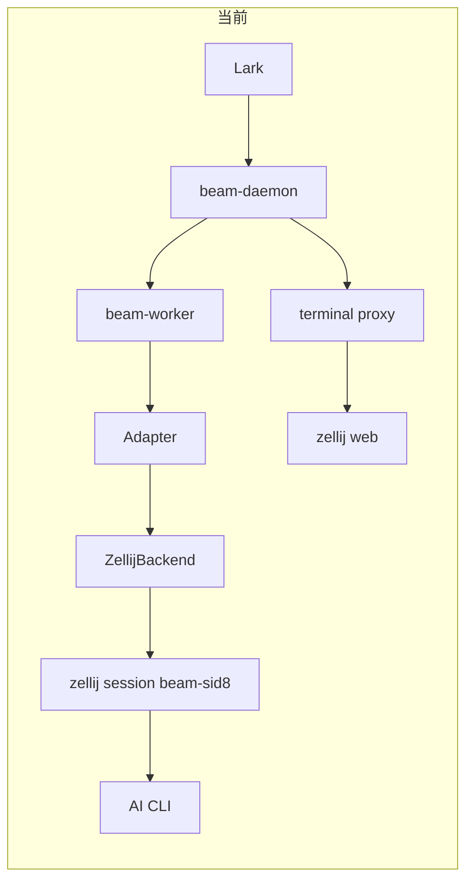
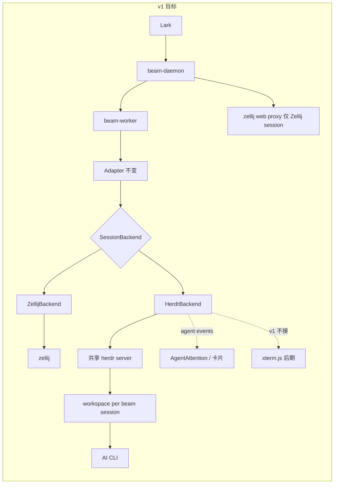
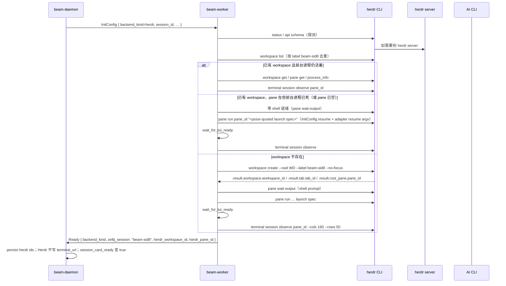
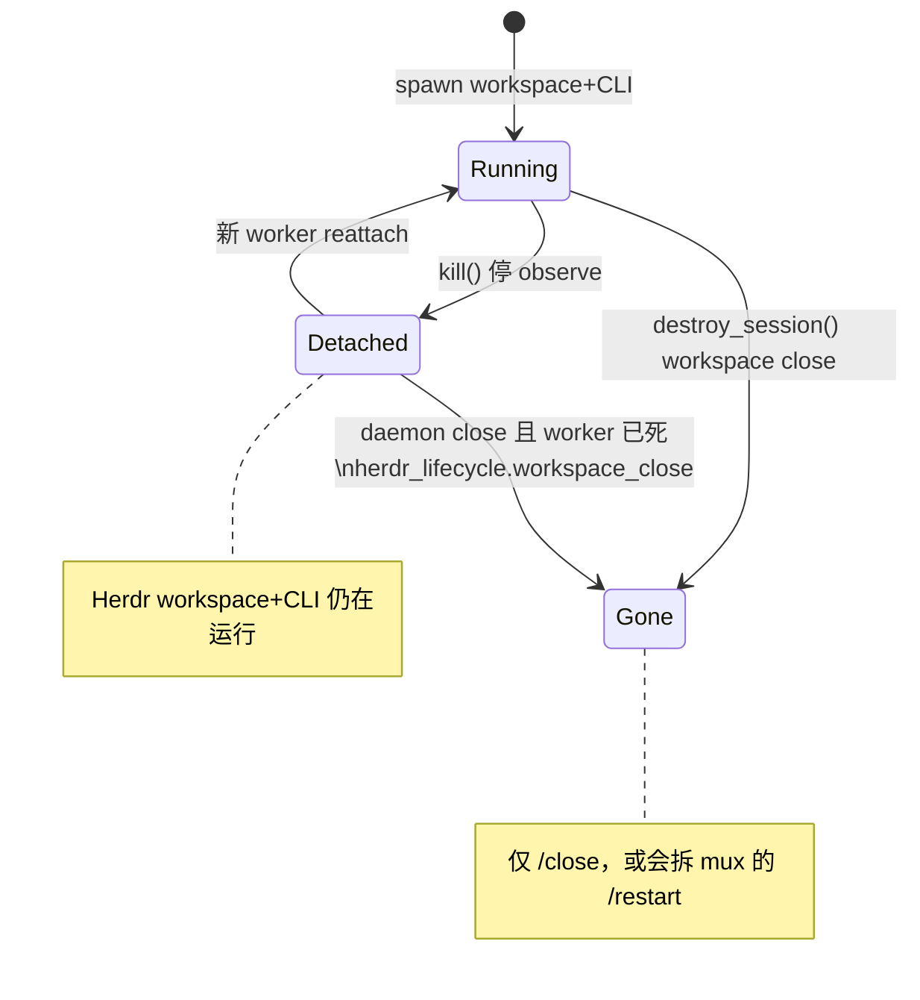
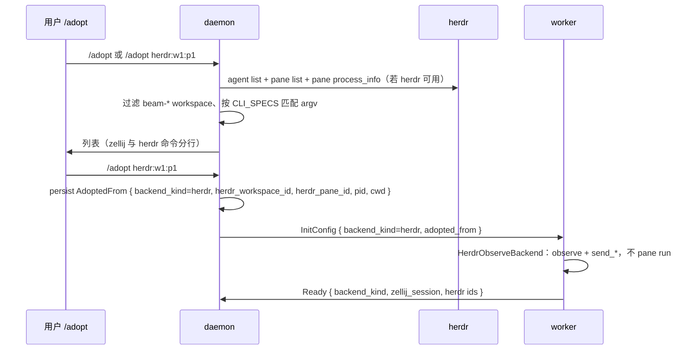

# Beam 接入 Herdr 作为终端 / agent 运行时后端

English: [herdr-backend.en.md](herdr-backend.en.md)

- 日期：2026-08-29
- 作者：待定
- 状态：Draft
- 产品决策：2026-08-29 已确认开放问题 1–6，并折入正文（见 Open Questions 节）
- 范围：在现有 `SessionBackend` 上增加 Herdr 一等后端，与 Zellij 并存；不在 v1 替换默认路径

## Overview

Beam 今天把每个飞书话题接到一个独立 worker，再由 worker 在 **Zellij** 里托管 AI coding CLI。这条链路能跑通 managed / adopt / 截图卡片 / transcript 回传 / zellij web 终端，但 Zellij 对 agent 场景是通用 multiplexer：没有一等 agent 状态、pane 没有 pid/cwd/argv、画面是 `dump-screen` / `subscribe` 快照、`/adopt` 要靠 dump-layout + 进程树启发式，spawn 还有 `attach --create-background` 超时和 “failed to find terminal fd” 重试。

[Herdr](https://herdr.dev)（Apache-2.0，最新稳定版 **v0.8.2**，2026-08-19）是面向 coding agent 的终端运行时：pane 仍是真实终端，自动识别 Claude / Codex / Grok / OpenCode / Kimi / Hermes 等（与 Beam adapter 高度重叠），暴露 `working` / `blocked` / `done` / `idle` / `unknown`，CLI + Unix socket API 可 spawn / 送输入 / 读输出 / 订阅事件，`pane.process_info` 返回 pid/argv/cwd，并提供给第三方桥用的 `herdr terminal session observe|control`（NDJSON + base64 ANSI）。它**没有** zellij-web 那种浏览器 UI。

本设计把 Herdr 做成与 Zellij 并列的一等 `SessionBackend`，而不是一次性拆掉 Zellij。CLI adapter、transcript bridge、飞书卡片保持 multiplexer 无关。v1 交付 managed + adopt + 截图卡片 + Herdr `blocked` → 飞书 attention；web 终端不作为 managed/adopt 的门禁。**截图卡片能发出去的前提是把 `terminal_url` 从卡片投递门闩上解耦**（见下文 card-ready），不能只藏终端按钮。默认后端对现有部署保持 Zellij，新安装同样默认 Zellij（Q1 已确认）；`beam setup` 在 herdr 探测成功后询问是否选用。`BotConfig.backend` 可选覆盖，方便单 bot 狗食。v1 daemon **仍然依赖 zellij web 才能启动**，除非后续加上显式 skip 开关。

## Background & Motivation

### 代码现状（以 Rust 为准，不是旧文档）

下列设计文档已经和代码漂移，**不能当实现权威**：

| 文档说法 | 代码事实 |
| --- | --- |
| `docs/design/beam.md`：生产默认 `TmuxPipeBackend`，支持 `tmux` / `pty` / `zellij` | `crates/beam-worker/src/backend/` **只有** `zellij.rs` / `observe.rs` / `subscribe.rs`。`backend.rs` 只 re-export `ZellijBackend`、`ZellijObserveBackend`。仓库里没有 live tmux/pty backend |
| `docs/design/beam-architecture.md`：`DaemonConfig.backend_type: Tmux \| Zellij \| Pty`，`Session` / `InitConfig` 也有 `backend_type`；`Ready { port, token }` | `crates/beam-core/src/config.rs` 的 `DaemonConfig` 只有 `quiet_restart` / `working_dirs`。`BotConfig` **没有** `backend_type`。`InitConfig` **没有** `backend_type`。`WorkerToDaemon::Ready` 实际是 `{ zellij_session: String }` |
| README：三种 backend，tmux 仍是默认生产路径 | worker 无条件构造 Zellij。`run_loop.rs` 里 session 名固定 `beam-{sid8}` |

当前真实主链路：

```
Feishu/Lark
  -> beam-daemon（Lark WS、session、卡片、terminal proxy）
  -> per-session beam-worker（stdin/stdout JSON IPC）
  -> Adapter（claude/codex/grok/kimi/hermes/opencode/…）
  -> ZellijBackend | ZellijObserveBackend
  -> zellij session `beam-{sid8}` 里的 CLI
```

关键实现锚点：

- **Backend trait**：`crates/beam-worker/src/backend.rs` `SessionBackend`。方法全部 `&self`，内部自己同步，所以 `Arc<dyn SessionBackend>` 可以在 `write_input`、截图、subscribe 之间共享，不会被一次长 paste 卡住。
- **Adapter 与 mux 无关**：`crates/beam-worker/src/adapter.rs` 的 `write_input(&mut self, backend: &dyn SessionBackend, content)` / `poll()`。最终回复走 CLI 落盘 transcript，不是屏幕刮字。跨 crate 元数据在 `crates/beam-core/src/cli_specs.rs`。
- **Managed spawn**：`crates/beam-worker/src/worker_runtime/run_loop.rs` 里 `ZellijBackend::new(session_name)`；`launch.rs` 把 CLI 包成 `/usr/bin/env …` 或 Linux 上 `systemd-run --user --scope --slice=…`。zellij 用临时 KDL layout 跑这条命令（`ZellijBackend::write_runtime_files`）。
- **Ready IPC**：worker 发送 `WorkerToDaemon::Ready { zellij_session }`。daemon（`worker_lifecycle.rs`）只打日志并设 `terminal_url` / `ScreenStatus::Starting`，**并不把 zellij session 名写入 `Session`**。之后用 `beam-{session_id[..8]}` 或 `adopted_from.zellij_session` 反推（`session_zellij_target`、`zellij_session_for_beam`）。
- **画面**：`capture_viewport()` = `zellij action dump-screen --ansi --pane-id`（无 `--full`）。`subscribe()` 跑 `zellij subscribe --pane-id --ansi --format json`，把 `pane_update` viewport 拼成清屏+home 的 ANSI chunk，触发截图 coordinator 的 `Trigger::PaneUpdate`。这是快照模型，不是 tmux `pipe-pane` 裸字节流。
- **状态机**：`ScreenStatus = Starting | Working | Idle | Analyzing | Limited`。`Analyzing` 来自 Beam 自己的 screen analyzer（`worker_runtime/analyzer.rs`），用来做 TUI 权限/选项卡片。`AgentAttention`（`authz|decision|blocked|help`）目前主要由 `beam send --attention` 写入，不是 multiplexer 推送。
- **Web 终端**：daemon 启动本地 `zellij web`（`zellij_web.rs`，端口 `web.proxy_base_port + 1`），前面挂 Beam terminal proxy（ticket/cookie bridge、read-only anchor、160×50 resize）。worker **没有**内置 xterm.js 服务。
- **`/adopt`**：`zellij_adopt.rs` 用 `list-sessions` + `dump-layout` + `list-panes --json` + `ps` 拼候选。zellij `list-panes` 没有 pid/cwd/command。`AdoptedFrom` 仍留着未使用的 `tmux_target`（`lark_replies.rs` 还当 fallback）。
- **生命周期**：`kill()` 只停 subscribe、删临时 config，**不**删 zellij session。`destroy_session()` 对 managed 调 `zellij delete-session -f`，observe/adopt 是 no-op。worker 收到 `Close`/`Restart` 都走 `destroy_session()`。daemon `session_actions.rs` 有 **三处** 硬编码 `zellij delete-session -f`：close 且 `ensure_worker` 失败（约 L85）、close 在 worker wait 之后（约 L118）、restart（约 L159）。worker 意外退出 / `CliExit`（`apply_reported_cli_exit` 只清 `worker_pid`）保持 `SessionStatus::Active`，下一条消息 `ensure_worker` 再 attach。
- **卡片投递门闩**：`decide_lark_card_delivery`（`lark_replies.rs`）在 `session.terminal_url.is_none()` 时返回 `NotReady`；`begin_lark_turn_card`（`lark_session_cards.rs`）同样直接 return。今天能发截图卡，只是因为 Ready **总会**写 zellij-web URL（`worker_lifecycle.rs` ~194–198）。`build_streaming_card` 无条件放出「选择只读终端入口 / 私发可写链接」，动作仍代理到 zellij web。
- **Zellij spawn 的脆弱点**（`backend.rs` 常量 + `zellij.rs`）：`ZELLIJ_SPAWN_TIMEOUT=30s`（`attach --create-background` 在 server panic 时会永远重试 socket）、最多 2 次 spawn（消化 “failed to find terminal fd for id 0”）、临时 config dir、所有 `zellij action` 8s 超时，超时会重建 subscribe。

本机验证：`command -v herdr` 失败，设计必须包含能力探测和安装路径。

### 为什么 Herdr 更适合 agent 场景

对照当前痛点：

| Beam 今天的成本 | Herdr 提供的能力 |
| --- | --- |
| 自研 analyzer + 轮询 dump-screen 猜 “是不是在等用户” | 原生 agent 状态；`blocked` 可直接变成飞书 attention |
| `/adopt` 解析 KDL dump-layout + 按 (cliId, cwd) 对进程树 | `herdr agent list` + `pane.process_info`（shell pid、前台 pid、argv、cwd） |
| 每话题一个 zellij server（`beam-{sid8}`），人类要一个个 attach | 一个 Herdr server，workspace 级 sidebar 汇总整群 agent |
| `dump-screen` / subscribe 快照 | `terminal session observe` 推送 base64 ANSI；`pane read --format ansi` 拉可见屏 |
| 没有程序化 “等到 blocked/idle” | `agent.wait` / `events.subscribe`（**但** headless 下 `idle` vs `done` 有 seen 语义，见下文） |
| spawn 对 zellij 0.44.x pty race 敏感 | workspace.create 返回稳定 public id（`w1` / `w1:p1`） |

Herdr **不**包装、不替换 CLI；它拥有 CLI 的终端。这和 Beam “adapter 写 PTY、transcript 读落盘” 的模型兼容。

## Goals & Non-Goals

### Goals

1. Herdr 成为一等 `SessionBackend`，与 `ZellijBackend` 并存，由配置选择，现有部署默认仍是 Zellij。
2. Managed session：每个 Beam session 在共享 Herdr server 里占 **一个 workspace**（label `beam-{sid8}`），根 pane 跑现有 launch spec（`env` / `systemd-run` + adapter argv）。
3. Adopt session：用 `agent list` + `process_info` 发现候选，非侵入观察/驱动；`/close` 不拆用户的 workspace/pane。发现包含无 Herdr agent 检测但 argv 匹配 `CLI_SPECS` 的 pane（Q5 已确认）。
4. 输入继续走 `SessionBackend::{send_text,send_keys,paste_text,raw_input}` → `pane send-text` / `pane send-keys`。**不**把 `agent.prompt` 当 v1 主路径。
5. 画面：`observe` 推帧驱动 `Trigger::PaneUpdate`；`capture_viewport` 以完整可见屏为准（`pane read --source visible --format ansi`，或已验证的全帧 cache）。截图 PNG 渲染器保持现有 SGR 路径。Herdr session 的截图卡必须在 **没有** `terminal_url` 时也能 Post/Patch（card-ready 与 `terminal_url` 解耦）。
6. 把 Herdr `blocked` 映射到 `AgentAttention { kind: "blocked" }`（默认 reason，见映射节）。**v1 禁止用 Herdr 状态写 `ScreenStatus`。** Analyzer / transcript `PromptReady` / usage-limit 分类器仍是 ScreenStatus 权威（Q4 已确认：analyzer 保持开启）。
7. 能力探测：binary、版本 ≥ 0.8.2、socket；**当该 session 走 Herdr 时 `herdr api schema` 强制**。探测失败则该 bot/session 不可选 Herdr，Zellij 不受影响。
8. IPC / session 身份 multiplexer 中性化（`backend_kind` + Herdr workspace/pane/session id），Zellij 字段向后兼容。`AdoptedFrom.backend_kind` 决定 adopt worker 的 mux，不跟 daemon 默认走。
9. `kill()` vs `destroy_session()` vs daemon 重启、以及 **死 CLI 的下一轮 `ensure_worker` 必须能把用户消息送进新进程**，写成明确状态机。

### Non-Goals（v1）

- 把 Herdr 做成 Beam 的替代默认后端，或从现有机器静默切走 Zellij。
- 把 Beam 做成 Herdr plugin（控制权会颠倒：飞书 daemon 必须拥有 session 生命周期）。
- 复用 zellij web proxy 当 Herdr 的浏览器 UI。Herdr 没有 HTTP 终端。
- Vendor / fork Herdr；或把 CLI 包进 Herdr 以至于 transcript / `beam send` 失效。
- v1 用 `agent.prompt` 替代 adapter `write_input` 确认环。
- v1 让 Herdr agent 状态成为 `ScreenStatus` 的权威，或用 Herdr `working`/`done`/`idle` 覆盖 Beam 的 Working/Idle/Analyzing（Q4 已确认：analyzer 不关）。
- 在 Beam 里实现完整 Herdr TUI 或远程 SSH 客户端。
- 每个飞书话题一个 named Herdr session（会把 agent 藏出默认 sidebar）。`Session.herdr_session` 预留字段做逃逸舱，v1 默认仍是共享 default session。
- 修改 adapter 注册表或 transcript 格式。
- **v1 不宣称 herdr-only 可独立部署。** `crates/beam-daemon/src/lib.rs` ~828–837 的 `ensure_zellij_web` 仍是 daemon 启动硬依赖，直到 PR5 的 `web.zellij_web = false` 落地并测过。

## Proposed Design

### 控制权：Beam 编排，Herdr 跑终端





Beam daemon 继续：

- 拥有飞书 session、卡片、`/close` `/restart` `/adopt`、worker 监督、`beam send`。
- 决定 backend kind（bot 覆盖优先于 daemon 默认），把 identity 写入 `InitConfig` / `Session`。
- 对 Herdr session **不**写 zellij-web `terminal_url`。卡片投递改走 card-ready（见下节），卡片文案可用 `herdr` / `herdr agent attach` 代替终端按钮。

Herdr 继续：

- 拥有 PTY、布局、agent 检测、持久 detach。
- 通过 CLI（常规控制）和 socket（订阅）被 worker 驱动。

### 拓扑：共享 server + 每 Beam session 一个 workspace

```
Herdr default session（一个 Unix socket，sidebar 能看见所有 agent）
├── workspace label=beam-deadbeef   pane w1:p1  → 话题 A 的 claude
├── workspace label=beam-cafebabe   pane w2:p1  → 话题 B 的 grok
└── workspace label=my-manual-repo  pane w3:p1  → 用户自己的 agent（/adopt 候选）
```

理由：

- 人类 `herdr` attach 一次就能看到整群 Beam agent，这是相对 “每话题一个 zellij session” 的核心 UX 升级。
- Public id（`w1:p1`）在**这一个** Herdr session 内稳定；worker 重启用持久化的 workspace/pane id 重连。
- Named session（`herdr session attach beam-<sid>`）会给每个话题单独 socket/state，默认 sidebar 看不见它们。只作为可选爆破半径隔离，默认不做。

隔离边界是 workspace，不是 Feishu 话题级 Herdr session。

**产品已确认（Q2）：v1 默认共享 default session + 每 Beam session 一个 workspace；named session 只是 `Session.herdr_session` / `HerdrConfig.session` 保留的逃逸舱，不是 v1 默认。**

### 模块边界

建议落地（遵守 ~800 行/文件，超过 1500 行默认拆）：

| 模块 | 职责 |
| --- | --- |
| `crates/beam-core/src/backend_kind.rs`（新，或放进 `session.rs`） | `BackendKind { Zellij, Herdr }`，serde `snake_case`，缺省 `zellij` |
| `crates/beam-core/src/config.rs` | TOML snake_case：`DaemonConfig.backend`、`WebConfig.zellij_web`；`HerdrConfig { min_version, session, socket_path }`。`BotConfig.backend`（`bots.json` 可选 `"backend": "herdr"`） |
| `crates/beam-core/src/ipc.rs` / `session.rs` | `InitConfig` / `Session` / `Ready` / `AdoptedFrom` 增加 mux 字段；`WorkerToDaemon::MuxAgentState` |
| `crates/beam-worker/src/backend/herdr/` | `mod.rs`（`HerdrBackend`）、`cli.rs`（JSON CLI 包装）、`observe.rs`、`ids.rs`、`spawn.rs` |
| `crates/beam-worker/src/worker_runtime/run_loop.rs` | **PR2** 才按 `init.backend_kind` 选 backend（PR1 只加类型，默认仍 Zellij） |
| `crates/beam-daemon/src/herdr_probe.rs` | binary/version/socket/**强制** schema 探测 |
| `crates/beam-daemon/src/herdr_adopt.rs` | adopt 发现 + `/adopt herdr:` 语法 |
| `crates/beam-daemon/src/herdr_lifecycle.rs` | 确保 server、幂等 force-close；供 close/restart/restore 使用 |
| `crates/beam-cli/src/cli_commands/setup.rs` | 探测、安装提示、写 `config.toml` / `bots.json` backend |

**不要**把 Herdr 协议编进 adapter。Adapter 继续只看见 `SessionBackend`。

### Herdr 控制面：CLI 为主，socket 只用于订阅

官方建议自动化先走 CLI，原始 socket 留给长订阅。Beam 对齐：

| 用途 | 机制 | 原因 |
| --- | --- | --- |
| workspace/pane CRUD、send-text/keys、read、process_info、agent list/get | `herdr …`，解析 JSON stdout | 可调试、跟文档例子一致、schema 随 binary |
| 屏幕推送 | `herdr terminal session observe <pane> --cols 160 --rows 50` | 专为第三方桥设计；多观察者；不占 input/resize |
| agent 状态推送 | Unix socket `events.subscribe`（worker 内长连） | CLI 没有等价长订阅；退化为 `agent get` 轮询 |
| 可写 web 终端（v2，见 `herdr-web-terminal.md`） | `herdr terminal session control`（不带 `--takeover`） | 同一时刻只能有一个 controller；冲突返回 4001 + 只读降级 |

约束：

- 所有 CLI 调用有超时（对齐 `ZELLIJ_ACTION_TIMEOUT`，建议 8s；create/run 可到 30s）。
- worker 调 herdr 时 **unset** `HERDR_PANE_ID` / `HERDR_TAB_ID` / `HERDR_WORKSPACE_ID`，避免 `--current` 解析到 daemon 所在 pane（daemon 可能从某个 Herdr TUI 里 `beam restart` 拉起）。
- 目标 server 用显式 `--session <name>` 和/或 `HERDR_SOCKET_PATH`。默认 session 走 `~/.config/herdr/herdr.sock`（或 `$XDG_CONFIG_HOME/herdr/herdr.sock`）。
- **不要**对 managed 输入开 `terminal session control --takeover`：会抢走人类 TUI 的 input/resize。v1 注入走 `pane.send_*`。
- 不要 vendor Herdr。运行时依赖已安装 binary。最低 **0.8.2**（observe/control + `process_info` 所在版本；GitHub latest 即此 tag）。

### `SessionBackend` → Herdr 映射

| `SessionBackend` | Herdr | 备注 |
| --- | --- | --- |
| `spawn(bin, args, opts)` | 见下一节 | managed create 或 reattach；adopt 只启动 observe |
| `send_text` | `herdr pane send-text <pane_id> <text>` | 低级、不提交 |
| `send_enter` | `herdr pane send-keys <pane_id> enter` | |
| `send_special_keys` | `pane send-keys`，完整键表见下 | 覆盖 `ZellijBackend`/`ZellijObserveBackend` 已接受的每一个 key |
| `paste_text` | 见 paste 合同 | **不要** takeover。v1 默认假设 `pane run` 才保证 bracketed paste；`send-text` 可能不是 |
| `write_raw` | socket `pane.send_input`（优先）或 CSI 字节的 `send-text` | 原始字节需要时走 socket |
| `raw_input` | 与今天一样：paste + 200ms + enter | **不要**用 `pane run`（那是 shell 命令）；**不要**用 `agent.prompt` |
| `capture_viewport` | `herdr pane read <pane> --source visible --format ansi` | 完整可见屏，对齐 dump-screen。observe cache 只有在确认是全帧后才能当快路径 |
| `capture_current_screen` | 同 `capture_viewport` | |
| `is_alive` | 见「死 CLI 下一轮」谓词 | 探测失败 / 未知 → **活着**。pane 在且前台进程确认空 → **死**。workspace 确认不存在 → **死** |
| `child_pid` | `pane.process_info` 前台 pid | 优先非 shell、已识别 agent 的 pid，供 cli-pid marker |
| `kill` | 停 observe/event 子进程；**不**关 workspace | worker SIGTERM、daemon 重启 |
| `destroy_session` | managed：force-close workspace（见实现门闩）；adopt：no-op | 仅 `/close` 和会拆 mux 的 `/restart` |
| `cursor_position` | 若 schema 无 cursor 字段则 `Ok(None)` | 不阻塞 v1 |
| `subscribe` | observe NDJSON → `broadcast::Sender<String>` | 驱动 `Trigger::PaneUpdate` |

`agent.start --kind` **不是** spawn 主路径：它用 Herdr 自己的规范可执行文件，不套 Beam 的 `cli_bin` / `cli_args` / `systemd-run` 包装，blocked-during-start 还会返回 `agent_not_ready`。

`agent.prompt` **不是** `write_input` 主路径：已是 `blocked` 时返回 `agent_blocked` **且不发送**，这会弄坏权限对话框和 adapter 的 transcript 确认环。可以在单独 PR 里当可选快路径，还要证明不会吞 TUI 确认。

#### Zellij → Herdr `send_special_keys` 表

`ZellijBackend` / `ZellijObserveBackend` 已接受的 key 必须全部能送到 Herdr pane（漏一个就会弄坏 TUI 确认卡）：

| Beam key（adapter / `TermAction`） | Herdr `pane send-keys` |
| --- | --- |
| `Enter` | `enter` |
| `Down` / `Up` / `Left` / `Right` | `down` / `up` / `left` / `right` |
| `PageUp` / `PageDown` | Herdr 若无同名则发 CSI：`write_raw` `\x1b[5~` / `\x1b[6~`（与今天 Zellij 路径相同） |
| `M-Enter` | `\x1b\r` via `write_raw` / `pane.send_input` |
| `Tab` | `tab` |
| `Space` | `space` |
| `Escape` / `Esc` | `esc`（文档也接受 `escape`） |
| `C-c` | `ctrl+c`（Herdr 把 `C-c`/`c-c` 当别名，仍规范写成 `ctrl+c`） |
| 单字符 | `pane send-text` 该字符 |

未知 key → `bail!`，与 Zellij 一致。

#### `paste_text` 合同

Zellij `paste --pane-id` 走 bracketed paste，大段 `write_input` 依赖它。Herdr 文档只保证 **`pane run` 尊重 live bracketed-paste**；`pane send-text` 未保证。v1：

1. 权威路径仍是 launch-spec 的 argv（spawn），paste 只用于后续用户/adapter 输入。
2. `paste_text` 先试 `pane send-text`。PR2 live 测试必须贴一段 ≥2KiB、含换行的 prompt，确认 CLI transcript 是一条而不是逐行。
3. 若 `send-text` 不 bracket：worker 自己包 `\x1b[200~` … `\x1b[201~` 再 `pane.send_input`，并再测一次。不要为 paste 开 `--takeover`。

### Card-ready：与 `terminal_url` 解耦

今天 `terminal_url` **同时**表示「web 终端可用」和「卡片可以投递」。Herdr v1 没有 web 终端，若 Ready 不再写 URL，现有门闩会让 streaming/screenshot 卡永远 `NotReady`。

v1 合同（必须和「Herdr Ready 不再写 `terminal_url`」落在 **同一个 PR**，即 PR2）：

```rust
fn session_card_ready(session: &Session) -> bool {
    if session.lark_app_id == "local" || session.root_message_id.is_empty() {
        return false;
    }
    match session.backend_kind {
        BackendKind::Zellij => session.terminal_url.is_some(),
        BackendKind::Herdr => {
            session.herdr_workspace_id.is_some() && session.herdr_pane_id.is_some()
        }
    }
}
```

改动点：

- `decide_lark_card_delivery`、`begin_lark_turn_card` 用 `session_card_ready`，不再把 `terminal_url.is_none()` 当万能闸。
- `build_streaming_card`：`backend_kind=herdr` 时不发「选择只读终端入口 / 私发可写链接」，改为 **herdr attach 帮助文案**（开放问题 6 已确认 = 显示；文案与 i18n 在 PR5 落地）。
- `terminal_proxy`：解析到 `backend_kind=herdr` 的 session **404**，禁止映射成 `beam-{sid8}` zellij 名。
- 单测：Herdr session `terminal_url=None` 但有 workspace/pane id → `PostNew`/`PatchExisting`；缺 ids → `NotReady`。

Zellij 路径行为不变：仍靠 Ready 写 `terminal_url`。

### Managed spawn 时序



JSON 指针（PR1 fixture 钉死，实现时用真实 `herdr api schema --json` 复核）：

- 创建：`.result.workspace.workspace_id`、`.result.tab.tab_id`、`.result.root_pane.pane_id`
- 列表：workspace 的 `workspace_id` + `label`

Launch spec 复用 `worker_runtime/launch.rs`。今天 Zellij 把 `bin + args` 写进 KDL；Herdr `pane run` 文档是 **一条命令字符串**。v1 **默认按 string + POSIX quote** 实现，除非 schema 明确给出 argv 形式（有则优先 argv）。实现必须：

1. 可单测的 POSIX 引号拼接（空格、引号、`cliArgs`）。
2. **环境变量权威是 launch-spec argv**（`/usr/bin/env KEY=VAL …` 或 `systemd-run … -- /usr/bin/env …`），包含 `maybe_inject_term`（codex/traex `TERM=xterm-256color`）、`BEAM_SESSION_ID` / `BEAM_HOME` / `BEAM_BIN` / `PATH`。`run_loop.rs` 今天把 `SpawnOpts.env` **固定传空 `Vec`**；v1 **保持为空**，除非有人改 trait 用法。不要把 env 只放在 `workspace.create --env` 然后从 launch spec 拿掉。
3. `workspace.create --env` 可选、冗余，不是权威。
4. **每次 create 前**按 label `beam-{sid8}` 扫 `workspace list`。命中则复用，禁止再 create 第二个同名 workspace（worker 在 Ready 持久化前崩溃时的幂等）。
5. `workspace.create` 得到的是 **shell** 根 pane。`pane run` 之前必须等 shell 就绪。v1 固定规则（**不要发明脆弱的 `$`-only 匹配**）：`herdr pane wait-output --regex <pattern> <pane>`（0.8.2 实测：`--match` 是**字面子串**匹配，必须用 `--regex`；参数顺序是 flag 在前、pane 在后），默认 prompt 正则取文档化的 shell 末行提示符 `[\$#%] ?$`（bash/zsh/sh/fish 通用）；超时 `HERDR_SHELL_READY_TIMEOUT`（默认 10s）后**仍然继续 `pane run`**——`wait-output` 只降低竞态概率，不当作硬前提。PR2 的 `live_herdr_backend` 必须同时锁：真实 prompt 命中、超时后仍 `pane run` 成功、`pane run` 返回后 CLI 可输入。这是 Herdr 版的 zellij “failed to find terminal fd” race，必须写进 spawn 重试，而不是假定 create 返回就能敲命令。
6. `pane run` 失败：backoff 后在 **同一个** labeled workspace 上重试，不要再 create。
7. cgroup：pane 里跑 `systemd-run --user --scope … -- /usr/bin/env … cli`。`--scope` 前台持有。PR2 live 测试覆盖。
8. Herdr 注入的 `HERDR_SOCKET_PATH` / `HERDR_ENV=1` / `HERDR_WORKSPACE_ID` / `HERDR_TAB_ID` / `HERDR_PANE_ID` 留在 CLI 进程上，不要剥。

### 死 CLI 的下一轮状态机（managed）

Zellij 的 `is_alive` 以 **session 在不在** 为准（空 session 仍算活，worker 挂着，用户打字进死 pane，直到 `/restart`）。Herdr 能看见前台进程，**如果**「进程死 → `CliExit` → 下一轮 worker 只 observe 不 `pane run`」，用户消息会被丢掉：`apply_reported_cli_exit` 只清 `worker_pid`，下一条消息 `ensure_worker` + `InitConfig.resume=true` spawn 新 worker，新 worker 立刻再 `CliExit`。

v1 **选定方案（2）**：workspace 还在但前台进程没了时，下一次 `ensure_worker` **必须** `pane run` 把 CLI 拉回来，使用 `InitConfig.resume` + adapter resume argv，这样这条入站消息在 Ready 之后仍能 `write_input`。workspace 没了则按 label 新建。

（先决条件：daemon 侧 `ensure_worker_for_session` 的门闩必须按 `backend_kind` 放行，见「daemon 侧门闩」小节——否则 worker 连 spawn 都到不了。）

`is_alive` 谓词（未知偏活着，避免假 `CliExit`）：

| 观测 | `is_alive` | 下一轮 `spawn()` |
| --- | --- | --- |
| 探测超时 / JSON 不可读 | `true`（未知） | 只 observe；不要二次 `pane run` |
| workspace 确认不存在 | `false` | create labeled workspace + `pane run` resume |
| workspace 在、pane 确认不存在 | `false` | 在该 workspace 建 pane 或新建 workspace，然后 `pane run` resume |
| pane 在、`process_info` 确认前台为空（非 shell 占前台的 CLI 已退） | `false` | **同一 pane `pane run` resume**（等 shell 就绪） |
| pane 在、前台进程活着 | `true` | 只 observe |
| Herdr 已按 native session id 把 CLI 拉起来 | `true` | 只 observe，**禁止**第二份 CLI |

Adopt：**永不** `pane run`。adopt 的 pane 进程死了 → `CliExit`，session 保持 Active，但下一轮仍只 observe；用户需要 `/restart` 或重新 adopt。这避免 Beam 在别人的 Herdr workspace 里再拉起一份 CLI。

`close_on_exit`：**PR2 的实现门闩**。Live 锁住「CLI 退出后 pane/workspace 是否还在」。若 Herdr 默认关掉 pane，上表「pane 不存在」会变成主路径，create-vs-reuse 必须跟着测。

Herdr **server** 崩溃：snapshot restore 只恢复布局，进程默认没了（除非 native agent resume / `pane_history`）。Beam 仍以自己的 `InitConfig.resume` + adapter `--resume/--session` 为对话权威。Native resume 已把 CLI 拉起来时不要再 spawn。

### kill / destroy / daemon 重启



| 事件 | Worker | Herdr | Beam Session |
| --- | --- | --- | --- |
| worker SIGTERM / daemon 重启（非 `/close`） | `kill()`：停 observe/events | workspace+CLI 保持 | Active；restore 再 fork worker |
| worker 崩溃 / `CliExit` | 进程退出 | 取决于 `close_on_exit`（PR2 live 锁） | Active；**下一条消息 `ensure_worker` 按上表 `pane run` resume，不得丢用户消息** |
| `/close` 且 worker 活着 | `DaemonToWorker::Close` → `destroy_session()` | managed：force-close workspace（见门闩）；adopt：不动 | Closed |
| `/close` 且 worker 已死 | daemon `herdr_lifecycle` force-close managed workspace | 同上 | Closed |
| `/restart` | 先 Close/destroy，再新 worker spawn | managed workspace 关掉再建（新 pane id，更新持久化字段） | 保持 Active |
| Herdr server 停 | observe EOF | 布局可恢复，进程默认没了 | Active，直到探测失败；卡片提示 Herdr 不可达 |

Daemon 里今天写死的 `zellij delete-session -f` 必须按 `session.backend_kind` 分派。**三处都要改**（`session_actions.rs`）：

1. `close_session`：`ensure_worker` 失败且非 adopt（约 L85）
2. `close_session`：worker wait 之后、非 adopt（约 L118）
3. `restart_session`：非 adopt（约 L159）

Zellij 路径保持。Adopt 路径继续 **永不**关闭用户的 mux 对象。`ZellijObserveBackend::destroy_session` 已是 no-op；`HerdrObserveBackend` 同样。

#### daemon 侧门闩：`ensure_worker_for_session` 按 `backend_kind` 分派

上面三处 `delete-session` 只是拆 mux；**spawn 门闩**在 `ensure_worker_for_session`（`crates/beam-daemon/src/lark_ingress/session_actions.rs` ~445–471）。今天它在 `zellij_has_session(&session_zellij_target(&session))` 为假时 `bail!("zellij session is not available for …")`。`session_zellij_target`（`zellij_adopt.rs` ~410）只回 `adopted_from.zellij_session` 或 `beam-{sid8}`，**从不看 Herdr id**——所以每个 Herdr session 都会命中这个 bail，worker 永远起不来：`CliExit` 后起不来、worker 崩溃后起不来、甚至 Herdr workspace 还健康时也起不来。死 CLI 状态机要能执行，必须先改这扇门。

PR2 让 `ensure_worker_for_session` 按 `session.backend_kind` 分派：

| `session.backend_kind` | 门闩 | 备注 |
| --- | --- | --- |
| `Zellij` | 保持今天 `zellij_has_session(session_zellij_target(&session))` | 行为不变 |
| `Herdr`（managed） | **不**要求 zellij session；workspace/pane 不存在也照常 spawn | 下一轮 spawn 由 worker 端 `is_alive` 表决定：create 或同 pane `pane run` resume |
| `Herdr`（adopt） | 持久化的 `herdr_workspace_id` / `herdr_pane_id` 必须仍存在（`pane get` / `process_info`）；不在 → 失败，回复用户重新 `/adopt` | **永不 `pane run`**；adopt 的 pane 死了只能 observe 或重 adopt |

Herdr managed 分支的 spawn 依赖 PR2 的 Ready 持久化（`Session.herdr_workspace_id` / `herdr_pane_id`，与 card-ready 同一批字段）；`ensure_worker` 把持久化 id 随 `InitConfig` 交给 worker。

**不要**把 `ensure_worker_for_session` 的 “missing ⇒ refuse” 和 restore 的 `mux_target_alive` 合并成一个谓词：daemon 重启（restore）时 mux 对象丢失仍可能把 session 标 `Closed`（见 Data Model 节）；而 live daemon 对 managed Herdr workspace 丢失是 worker 按 label 新建。两个语义相反，各留各的。

#### 实现门闩：`workspace close` 是否杀掉 CLI

KD7 把 `herdr workspace close` 类比 `zellij delete-session -f`，但 Herdr 文档在 worktree 节写过 close「只关 Herdr 状态」，且 `ui.confirm_close` 默认 true，可能返回 `confirmation_required`。**这不是产品选择题，是 v1 实现门闩，必须在 PR2 编码 destroy 语义之前 live 锁住：**

1. 跑一个真实 CLI（如 `sleep 3600`）在 managed workspace，调 `workspace close`（无 flag）和带 force 的形式。记录：进程是否变成僵尸/消失、pane 是否还在。
2. 钉死 force API：CLI `--force` 和/或 socket 字段。`herdr_lifecycle` 永远走 force；对 `confirmation_required` 重试 force。Hermetic 测试用 fake CLI：第一次无 force → `confirmation_required`，`--force` → 0。
3. 若 close **不杀**进程：managed destroy 必须再 `pane close` 和/或对 `child_pid` 发信号（SIGTERM 再 SIGKILL），直到 `is_alive=false`。Adopt 仍 no-op。
4. 门闩结果写进 PR2 测试注释和本设计的短附录（实现时改一句即可）。未锁住之前不得宣称 `/close` 对等 zellij。

**实测校准（2026-08-29，herdr 0.8.2 + `live_herdr_backend`）：门闩已锁。** 真实 CLI 的 `workspace close <id>` **没有 `--force` 选项**（传 `--force` 直接 usage 报错退出 2），无 flag 调用立即成功且**杀掉** workspace 里的进程（`sleep 3600` 与 pane 一起消失），不存在 `confirmation_required`。实现按「先无 flag；若返回 `confirmation_required` 再补 `--force`」写，兼容未来版本；daemon 侧 `herdr_lifecycle` 同规则。

其它实测校准（0.8.2）：

- `pane process-info` 的 CLI 是 **`--pane <id>`**（位置参数会 `unknown option` 退出 2），JSON 是嵌套的 `.result.process_info.foreground_processes[0].{pid,argv,cwd}`（`argv` 是数组），空前台时回退 `shell_pid`。
- `agent get` / `agent list` 的状态字段是 **`agent_status`**（取值 `unknown` / `idle` / `working` / `blocked` / `done`），不是 `state`；agent 未识别时 `agent get <pane>` 返回 `agent_not_found`（退出 1），轮询按无信号处理。
- `workspace get` 的 payload **不含 root pane id**；复用路径用 `pane list`（`.result.panes[]` 带 `workspace_id` + `pane_id`）反查。`workspace get` 对已删 workspace 返回 exit 1 + `workspace_not_found`，`is_alive` 据此判死（其它探测失败偏活）。
- `herdr api schema --json` 的 `schemas.request.oneOf[].properties.method.const` 才是方法名；**0.8.2 的 schema 里没有 `pane.run`**（CLI 有该子命令），probe 必需方法列表必须去掉 `pane.run`，否则真机探测必失败。
- `terminal session observe` 帧是 `{"type":"terminal.frame","bytes":"<b64>","full":true,…}`（base64 在 **`bytes`** 字段）；live 测试已钉 `full:true` = 全屏渲染，帧可缓存。
- `herdr server` 是**前台**进程，`start_server` 必须 detached spawn（stdout/stderr 重定向到 beam 日志）+ 轮询 `status server`，不能等 `output()` 退出（会 30s 超时并杀掉刚起的 server）。

### Agent 状态 → ScreenStatus / AgentAttention

Herdr 状态（官方文档）：

| Herdr | 含义 |
| --- | --- |
| `working` | 正在跑 |
| `blocked` | 识别到审批/提问 UI |
| `done` | 底层已 idle，但该 tab **还没**在聚焦的 Herdr UI 里被看过 |
| `idle` | 同样的就绪/结束状态，且已经被看过 |
| `unknown` | 有 agent 但分类不自信；**不是**成功 |

**Headless 陷阱（必须处理，不能假装没有）：** 把 tab 标成 seen 的是聚焦该 tab，或 `pane focus` / `agent focus`。**经 CLI 读取不会标 seen。** Beam worker 是无头的，所以后台转完的 agent 会一直停在 `done`，几乎不会变成 `idle`，除非有人类 Herdr TUI 在看，或我们去 focus（那会抢人类焦点——v1 禁止）。

因此 v1 **不要**用 Herdr 当 `ScreenStatus` 权威，也 **不要**把 `agent.wait` 默认的 `idle|done|blocked` 当成 “这一轮结束”。最终回复权威仍是 transcript `poll()`。今天 Idle 来自 transcript `PromptReady`，Working/Analyzing 来自截图循环 + analyzer（`run_loop.rs`）。用 Herdr `done`/`idle` 去写 Idle，会在 transcript 回合结束前闪烁，并和 `Analyzing` 打架。

`map_herdr_agent_state` 在 v1 **只返回副作用**，不返回 `ScreenStatus`：

| Herdr | 写 `ScreenStatus`？ | 副作用 |
| --- | --- | --- |
| `working` | **否** | 无（不自动清 attention；今天是入站用户消息才清） |
| `blocked` | **否** | `AgentAttention { kind: "blocked", reason }`。reason = Herdr message（trim），空则 **`"herdr agent blocked"`**；再 `normalize_attention_reason` 截到 500 字符。`set_session_attention` 拒绝空 reason，必须有默认值。可选催截图。Analyzer 若扫到选项，照常 `TuiPrompt` |
| `done` | **否** | 无。不要当成飞书 Idle |
| `idle` | **否** | 无。**Herdr 对已知 agent 的未识别提问会 idle-fallback**（`default_known_agent_idle_fallback`）。`idle` ≠ 「没在等用户」。Analyzer 必须继续抓这些 UI |
| `unknown` | **否** | 无 |

**产品已确认（Q4）：Beam 自己的 analyzer 保持开启、不关；Herdr 状态永远只是副作用来源，`ScreenStatus` 权威不变。**

`Limited` 仍只来自 Beam 的 usage-limit 分类器。

实现：worker 订阅 agent 状态（socket `events.subscribe`；失败则 1–2s 轮询 `agent get`）。**不要**把 mux 状态塞进 `ScreenUpdate`：该消息只在 hash/status/usage_limit 变化时发，屏幕不变时会丢掉 `blocked`。新 `type` 必须 **worker + daemon 同一 PR** 落地（`worker_lifecycle.rs` match 已知 variant，serde 失败只打 parse 错误）：

```rust
WorkerToDaemon::MuxAgentState {
    state: String,              // working|blocked|done|idle|unknown
    agent_name: Option<String>,
    pane_id: String,
    #[serde(default)]
    message: Option<String>,
}
```

Daemon：仅当 `state == "blocked"` 且尚无 attention 时 `set_session_attention(..., "blocked", reason)`。其他 mux 状态最多打日志/指标。

### 截图与 observe 帧

今天：

- Coordinator 是纯状态机（`coordinator.rs`），runtime 在 pane debounce / message grace / 5s fallback 时调 `capture_viewport`。
- Subscribe 任务把 **完整 viewport ANSI** 写进 `latest_raw_screen`（注释写明 “latest wins: the chunk is the full viewport (not incremental)”）。
- PNG 渲染器（`screenshot_ansi.rs`）解析 SGR。

Herdr observe 文档：先流当前渲染状态，再流 live ANSI 帧。未写死每一帧都是全屏。

v1 合同：

1. **权威 viewport** = `pane read --source visible --format ansi`（或等价 socket `pane.read`）。语义对齐 `dump-screen --ansi`。
2. Observe 用于 **变更信号**（`Trigger::PaneUpdate`）。若 live 探测证明帧是全屏（带 clear/home，或固定尺寸 buffer），可以像 zellij subscribe 一样缓存进 `latest_raw_screen`。
3. 默认 observe 尺寸：`DEFAULT_TERMINAL_COLS/ROWS`（160×50），与 zellij anchor 一致，避免卡片和终端视口差太多。
4. 多个 observe 安全；不要 resize、不要 takeover。
5. `kill()` 必须杀掉 observe 子进程（`kill_on_drop` + 显式 `terminal.closed` 处理）。

该 live 测试随 **PR2 observe 接线** 落地（`live_herdr_observe`），不要放到事后的测试 PR。

### `/adopt`

今天 `/adopt <target>` 用第一个冒号切开（`classify_lark_text_action` → `AdoptZellij`；`session_actions.rs` ~585–588 `split_once(':')`），永远走 `adopt_zellij_session`。Herdr public pane id 是 `w1:p1`。**`/adopt w1:p1` 会被解析成 zellij session `w1`、pane `p1`，这是语法碰撞，必须用前缀消歧。**

#### 命令语法（非歧义）

```
/adopt                              → 列出候选
/adopt list                         → 同上
/adopt herdr:<pane_id>              → Herdr，pane_id 为 public id（例：/adopt herdr:w1:p1）
/adopt <zellij_session>:<pane_id>   → 现有 Zellij（例：/adopt my-session:terminal_0）
```

解析规则（纯函数，PR3 单测）：

1. trim，只取第一行（保持今天对多行粘贴列表的容忍）。
2. 若大小写不敏感地以 `herdr:` 开头：其余部分必须匹配 `^w[0-9]+:p[0-9]+$`（Herdr public pane id）。`herdr:w1:p1` → workspace `w1`、pane `w1:p1`。不符合 → 错误回复，**不要**当 zellij session 名为 `herdr`。
3. 否则保持今天的 `split_once(':')`：`my-session:terminal_0` → zellij。无冒号 → pane 默认 `terminal_0`（现有行为）。
4. 裸 `w1:p1`（无 `herdr:` 前缀）**不当 Herdr**。列表文案必须打印带前缀的命令，避免用户抄成裸 id。

测试夹具至少包括：`w1:p1`（zellij session w1 / pane p1，**不是** herdr）、`herdr:w1:p1`、`my-session:terminal_0`、`herdr:not-a-pane`（错误）、`HERDR:w2:p3`（大小写）。

#### 列表范围

裸 `/adopt` **同时**列出：

- 若本机有 `zellij`：现有 zellij 候选（跳过 `beam-*` session），命令 `/adopt {session}:{pane}`。
- 若 `herdr` 探测成功（不要求 `daemon.backend=herdr`）：live Herdr agent/pane 候选（跳过 label `beam-*` 的 Beam 托管 workspace），命令 `/adopt herdr:{pane_id}`。

这样 daemon 默认仍是 Zellij 时，用户也能 adopt 手动 Herdr pane（单 bot 狗食 / 混合 mux 的入口）。

`InitConfig.backend_kind` **来自被选中的候选 / `AdoptedFrom.backend_kind`**，不是 daemon 默认。Zellij 候选 → `zellij`；`herdr:` 候选 → `herdr`。



发现（比 zellij dump-layout 干净）：

1. `herdr agent list` — 已识别的 agent + 状态 + pane id。
2. `herdr pane list --workspace …` + `pane process_info` — 未识别的 CLI 仍能靠 argv/cwd 匹配。**Q5 已确认：即使没有 Herdr agent 检测，只要 argv 匹配 `CLI_SPECS[].adopt_command_patterns` 就列入候选**（见发现规则 3），避免 “less tested” agent（如 Gemini）从列表消失。
3. 用 `CLI_SPECS[].adopt_command_patterns` 对 argv[0] basename（与 `cli_id_from_zellij_command` 相同）。
4. 跳过 label 匹配 `beam-*` 的 workspace，避免 adopt 到 Beam 自己托管的 pane。
5. 歧义（同一 cwd 多个同 cli）→ 拒绝或列出，对齐 zellij “>1 匹配则拒绝”。
6. 需要 pid 时 `process_info` 给不出来 → 拒绝 adopt（不要猜）。

`HerdrObserveBackend`：

- `spawn()` 只启动 observe（类似 `ZellijObserveBackend`）。
- `destroy_session()` / daemon close：**不** `workspace close`。
- `kill()` 停 observe。
- 输入定向到持久化的 pane id，不依赖 TUI 焦点。

### Web 终端：分阶段，不挡 v1

Herdr 远程是 SSH / `herdr --remote`，不是 HTTP。第三方已经在 Herdr socket 外包 HTTP（例如 herdr-controller），Beam **不**把那当成依赖。

**产品已确认（Q3）：v1 推迟 web 终端，xterm.js 不进 v1；PR6 作为单独设计/PR，在 v1 成功标准之外。** v2 的 web 终端已独立成文：`docs/design/herdr-web-terminal.md`（PR-A0…PR-A6），并修订了本文件里「可写用 `control --takeover`」的 v2 定案（见下表与威胁模型）。

| 阶段 | 行为 |
| --- | --- |
| v1 | Herdr session **不设** `terminal_url`。截图卡靠 card-ready（PR2）而不是 URL。Zellij session 仍用现有 proxy。**daemon 启动仍调用 `ensure_zellij_web`**（`lib.rs` ~828–837）；没有 zellij 的机器即使用 `backend=herdr` 也起不来。这是 v1 约束，不是配置开关能解决的，直到 PR5 的 `web.zellij_web = false` 落地并测过。不要把 v1 宣传成 herdr-only |
| v2（单独设计，见 [herdr-web-access.md](herdr-web-access.md)） | Beam 自有 xterm.js 页，喂 `terminal session observe`（只读）或 `control --takeover`（可写）。复用 ticket/cookie，但 **上游不再是 zellij web**。resize 走 `terminal.resize` JSON。不要在 v1 做（Q3 已确认：v1 推迟） |

v1 成功标准 **不包括** 浏览器终端对等，也 **不包括** 无 zellij 二进制的 daemon。Managed + adopt + 卡片必须在没有 Herdr web 终端的情况下可合并。

### 能力探测与 setup

`herdr_probe.rs` 在 **即将使用 Herdr 的路径**上运行（daemon 启动时若 `daemon.backend=herdr` 或任一 bot 覆盖为 herdr；以及每次 Herdr worker spawn 前）。Zellij 默认部署 **不**探测 herdr，daemon 也不因缺 herdr 失败。

当该次调用需要 Herdr 时，探测 **全部强制**（缺一硬失败，清晰 ERROR，无“可选 schema”第三姿态）：

1. `PATH` 上的 `herdr`（可配置绝对路径）。
2. `herdr --version` ≥ `HerdrConfig.min_version`（默认 `0.8.2`）。实现时用你钉住的那颗 binary 复核 tag/许可证，不要只信本文日期。
3. Socket：`herdr status server`；若未运行则 `herdr server`（headless），带超时。
4. **`herdr api schema --json` 强制。** 所需方法：
   - `workspace.create` / `workspace.list` / `workspace.get` / `workspace.close`
   - `pane.process_info`（或 CLI `pane process-info` 等价）
   - `pane.send_text` / `pane.send_keys` / `pane.read` / `pane.run`（或 CLI 包装等价）
   - `agent.list`
   - `events.subscribe` **或**文档化的 `agent get` 轮询回退（schema 无 subscribe 时允许轮询，日志 WARN 一次）
5. 缺所需方法 → 硬失败。PR1 提交 schema/响应 JSON fixture（可在有 herdr 的机器上抓，不要求 CI 有 binary）。

`beam setup`：

- 探测 `herdr`。没有则打印官方安装：`curl -fsSL https://herdr.dev/install.sh | sh`（以及 brew/mise）。
- 问 **daemon** backend：`zellij`（默认）/ `herdr`。**只在 herdr 探测成功后才问**（Q1 已确认：新安装默认仍是 Zellij，不静默切到 herdr）；选了 herdr 但探测失败则拒绝写 `config.toml`。
- 问 **该 bot** 是否覆盖 backend（回车 = 跟随 daemon）。写入 `bots.json` 的 `"backend"`。
- 探测成功后**提示**官方 integration hook（`herdr integration install claude` 等）存在：说明它们可提升 blocked 检测 / native resume 质量，但会修改用户机器上的 CLI 配置；**不自动安装**，由用户自行决定。
- 不把 herdr 当硬依赖，除非 daemon 或该 bot 选了它。

Worker 在 `InitConfig.backend_kind == Herdr` 且探测失败时，在进 zellij 回退之前以 `WorkerToDaemon::Error` 失败。静默回退会掩盖配置错误、把 session 开到错误的 mux 里。

### 配置

`DaemonConfig` / `WebConfig` 是 **TOML snake_case**（现有 `quiet_restart`、`working_dirs`、`proxy_base_port`）。不要 camelCase 去对齐 `BotConfig`——那是 `bots.json` 的 JSON 约定。

```toml
[daemon]
# 现有部署默认 zellij。不要在升级时改默认值。
backend = "zellij"          # "zellij" | "herdr"

[web]
# v1 缺省 true。false 才能跳过 ensure_zellij_web（PR5）。
# zellij_web = true

[herdr]
min_version = "0.8.2"
session = "default"          # named session 逃逸舱；写入 Session.herdr_session
# socket_path = "~/.config/herdr/herdr.sock"
```

`bots.json` 可选覆盖（JSON 字段名 `backend`）：

```json
{ "larkAppId": "…", "cliId": "claude-code", "backend": "herdr" }
```

解析新 session 的 `backend_kind`：

1. Adopt：`AdoptedFrom.backend_kind`（由 `/adopt herdr:` vs zellij 语法决定）。
2. 否则 `BotConfig.backend`（若有）。
3. 否则 `DaemonConfig.backend`。
4. 缺省 `zellij`。

**Session 在 create/adopt 时持久化 `backend_kind`。** 解析放在 `create_session_internal`（`session_creation.rs`）：adopt 用 `AdoptedFrom.backend_kind`，否则 bot 覆盖，否则 daemon 默认；backend 为 Herdr 时把 `HerdrConfig.session` 写进 `Session.herdr_session`，并随 `InitConfig` 往返。restore / `build_init_from_session` 只读 session 上已固化的值，即使后来 config 从 herdr 翻回 zellij（或反过来）。这样单 bot 狗食（daemon 仍 zellij，一个 bot `backend=herdr`）可行，混合 restore 也不会走错 mux。

### 与 cgroup / `HERDR_ENV` 的兼容

- **Worker 不在 Herdr pane 里跑。** 它是 daemon 的子进程，通过 CLI/socket 说话。不要 `herdr pane run` worker 自己。
- 若 daemon 从 Herdr TUI 启动，继承的 `HERDR_ENV=1` 有用（指向同一默认 session），但继承的 `HERDR_PANE_ID` 有害（`--current` 会指错）。Spawn worker 时已经在剥 `BEAM_SESSION_ID` 等；对 Herdr 后端再剥 pane/tab/workspace id。
- 嵌套：pane 内 CLI 会带 `HERDR_ENV=1`，可能用 Herdr skill 去开更多 pane。允许，当作用户/agent 功能；Beam 不把 Herdr plugin 当飞书通知主路径。
- `systemd-run --scope` 必须 live 验证：Herdr 的 pane PTY 是否允许 user systemd scope、slice 是否传播、失败时错误是否回到 worker。

## API / Interface Changes

### `BackendKind`

```rust
#[derive(Debug, Clone, Copy, Serialize, Deserialize, PartialEq, Eq, Default)]
#[serde(rename_all = "snake_case")]
pub enum BackendKind {
    #[default]
    Zellij,
    Herdr,
}
```

### `InitConfig`

新增字段，全部带默认，旧 init JSON 继续能解析：

```rust
#[serde(default)]
pub backend_kind: BackendKind,
#[serde(default)]
pub herdr_session: Option<String>,
#[serde(default)]
pub herdr_workspace_id: Option<String>,
#[serde(default)]
pub herdr_pane_id: Option<String>,
```

`herdr_session` 与 `Session.herdr_session` 往返：named-session 逃逸舱即使 v1 默认不用，restore 也不能丢。

### `WorkerToDaemon::Ready`

**不**引入 `mux_session`。保持字段名 `zellij_session`（Zellij 路径和 `live_codex_term.rs` 还在读它）。Herdr 时填 workspace **label**（`beam-{sid8}`），真正身份靠下面两个 Option。时序图与实现必须用这个名字。

```rust
Ready {
    zellij_session: String, // Zellij：session 名；Herdr：workspace label（beam-{sid8}）
    #[serde(default)]
    backend_kind: BackendKind,
    #[serde(default)]
    herdr_workspace_id: Option<String>,
    #[serde(default)]
    herdr_pane_id: Option<String>,
}
```

Daemon **必须持久化** Herdr ids 到 `Session`。今天 Ready 只打日志，对 Zellij 能工作是因为名字派生自 `sid8`；Herdr 的 `w1:p1` **不能**从 session id 派生。Herdr Ready **不**写 `terminal_url`（与 card-ready 同一 PR）。

### `Session`

```rust
#[serde(default)]
pub backend_kind: BackendKind,
#[serde(default, skip_serializing_if = "Option::is_none")]
pub herdr_session: Option<String>,
#[serde(default, skip_serializing_if = "Option::is_none")]
pub herdr_workspace_id: Option<String>,
#[serde(default, skip_serializing_if = "Option::is_none")]
pub herdr_pane_id: Option<String>,
```

`terminal_url`：Herdr v1 保持 `None`。卡片投递走 `session_card_ready`，不是“容忍没有按钮”就够了。

### `AdoptedFrom`

```rust
#[serde(default)]
pub backend_kind: BackendKind,          // 缺省 zellij；herdr adopt 必须写成 Herdr
pub tmux_target: Option<String>,        // 遗留，保持反序列化
pub zellij_session: Option<String>,
pub zellij_pane_id: Option<String>,
#[serde(default)]
pub herdr_workspace_id: Option<String>,
#[serde(default)]
pub herdr_pane_id: Option<String>,
pub original_cli_pid: i32,
pub cwd: String,
// …
```

`lark_replies.rs` 的 already-adopted 文案：优先 `backend_kind` + herdr pane id，再 zellij `session/pane`，最后遗留 `tmux_target`。

`run_loop.rs` 的 backend 选择：`init.backend_kind`（来自 session / adopt），Herdr + `herdr_pane_id` → observe；Zellij + `zellij_pane_id` → `ZellijObserveBackend`。不要靠“有 pane 字段就 observe”跨 mux 猜。

### `SessionBackend` trait

v1 **不**改 trait。Herdr agent 状态走私有任务 + **独立** `MuxAgentState` IPC（不是 `ScreenUpdate` 字段）。以后若有第三个 mux 需要 agent 状态，再加带默认的可选方法。

## Data Model Changes

持久化落在现有 session JSON（`BeamPaths` sessions 目录）。迁移：

- 缺 `backend_kind` → `zellij`。
- 缺 Herdr ids 的活跃 Herdr session：restore 用 label `beam-{sid8}`；仍没有则当 mux 对象丢失（对账路径可把 session 标 Closed，对齐 `reconcile_restored_sessions_with` 在 zellij session 消失时的行为）。
- 无破坏性 schema 变更；不需要离线迁移作业。

不引入新数据库。Herdr 的 `session.json` 仍归 Herdr 管，Beam 不读。

## Alternatives Considered

### A. v1 用 Herdr 彻底替换 Zellij

把 worker 和 daemon 里的 zellij 假设全部撕掉，web 终端改道或删除。

- 优点：一个 mux，没有双后端。
- 缺点：zellij web + proxy + anchor + ticket 是已经在工作的大子系统；Herdr 没有浏览器 UI；现有部署都绑着 `beam-{sid8}` zellij session。高风险，阻塞 adopt/卡片。
- **不选**作为 v1。

### B. Beam 作为 Herdr plugin（Feishu 通知从 Herdr 往外推）

类似 `agent-telegram-notify`：Herdr 拥有 agent，plugin 调飞书。

- 优点：贴合 Herdr 的 plugin 模型；sidebar 当主 UI。
- 缺点：控制权颠倒。Beam 的价值是飞书话题生命周期、卡片、grant、workflow、`beam send`、transcript。Plugin 当不了 daemon，也接不住 `/close` 语义和 per-thread worker。
- **不选**作为主架构。Plugin 以后最多当附加通知。

### C. 每个 Beam session 一个 named Herdr session

`herdr session attach beam-{sid8}`，独立 socket。

- 优点：Herdr 崩溃的爆破半径是一个话题；socket ACL 更简单。
- 缺点：默认 `herdr` attach **看不见**这些 agent——丢掉 Herdr 最主要的产品理由。资源上接近今天每话题一个 zellij server。
- **不选**作为默认（Q2 已确认：v1 默认共享 server）。可作为 `[herdr] session_mode = "per_beam_session"` 的逃逸舱。

### D. 一等 `SessionBackend`，与 Zellij 并存（推荐）

- 优点：adapter/transcript/卡片保持 mux 无关；Zellij web 继续为 Zellij session 服务；Herdr 的独特能力映射到 backend + 少量 IPC；现有部署默认不变。
- 缺点：两条后端路径要测；daemon close/restore 必须分派；文档要追上 “其实只有 zellij” 的现实，同时再加 herdr。
- **选这个。**

### E. 在 Beam 里重建 tmux/pty 再加 Herdr

旧文档还提 tmux 默认。代码里已经没有。

- 优点：纸面上的三后端。
- 缺点：无生产 tmux 路径可恢复；用户明确要的是 Herdr，不是 tmux。
- **不选。** 不要在本工作里复活 tmux。漂移在本设计里记录；后续 doc PR 应修正 `beam.md` / architecture / README。

## Security & Privacy Considerations

| 威胁 | 严重度 | 缓解 |
| --- | --- | --- |
| 共享 Herdr Unix socket 可被同用户其他进程调用（workspace.close 所有 Beam pane） | 高（本地同用户） | 接受与 `~/.config/herdr/herdr.sock` 相同的信任模型；文档写明。不要把 socket 暴露到 TCP。后期 named session 模式 |
| `terminal session control --takeover` 从人类或另一个 bridge 抢输入 | 高 | v1 不用 control。v2 默认不 takeover：可写用 `control`（不带 `--takeover`），冲突返回 4001 + 只读降级；只有显式「接管」按钮动作才用 `--takeover`（见 `herdr-web-terminal.md`） |
| Observe 帧含密钥、prompt、token | 中 | 与今天 dump-screen 一样：帧进 Beam 日志/卡片。日志继续脱敏（见 `docs/design/logging.md`）。不要把原始 base64 帧打到 INFO |
| `pane_history` 把屏幕写到 Herdr `session-history.json` | 中 | Beam 不启用；那是用户的 Herdr 配置 |
| 给 pane 内 CLI 的 `HERDR_ENV=1` 让 agent 驱动同一 Herdr server（开 pane、读邻居） | 中 | 同用户本机本就是信任边界；文档写明。不要从 daemon 主机任意扩大 |
| `herdr` CLI 注入（label/cwd/env） | 中 | 把用户控制的字符串当 argv 参数，不要当 shell。`pane run` 字符串必须 POSIX quote |
| 能力探测跑任意 `herdr` 自 PATH | 低 | 与今天 `zellij` 相同。可配置绝对路径 |
| Web 终端 ticket 误用到 Herdr | 低 | v1 不为 Herdr session 发 zellij URL。`terminal_proxy` 必须忽略 `backend_kind=herdr` 的 session，不要把它们映射进 `beam-{sid8}` zellij 名 |

License：Herdr 于 2026-07-22 宣布从 AGPL-3.0 切换为 **Apache-2.0**，并在 v0.8.0（2026-08-02 发布）正式落地，与 Beam 兼容。仍不要 vendor 源码。

## Observability

对齐 `docs/design/logging.md`：worker 的 tracing 走 stderr；stdout 只给 JSON IPC。

建议字段：`backend_kind`、`herdr_session`、`workspace_id`、`pane_id`、`herdr_version`、`probe_ok`。

日志：

- INFO：探测结果、workspace create/close、Ready 身份、reattach、blocked→attention。
- WARN：observe 断开并重连、schema 无 `events.subscribe` 因而轮询 `agent get`、`process_info` 无 pid、agent 状态 `unknown` / idle-fallback。
- ERROR：Herdr 路径上探测失败（含强制 schema）、`workspace create` 失败、pane run 失败、反复假死、`workspace close` 非 force 返回 `confirmation_required` 且 force 也失败。

指标（若已有 daemon 计数则复用，否则先日志）：

- `herdr_probe_failures`
- `herdr_workspace_create_ms`
- `herdr_observe_reconnects`
- `herdr_blocked_attention_total`

告警：任一 bot 或 daemon 配置了 herdr 且探测失败 → 该 Herdr 路径 fail closed（worker Error / 拒绝把默认写成 herdr）。**不要**把 herdr 探测失败扩成整个 daemon 起不来，除非 `daemon.backend=herdr`。Zellij 默认部署不探测 herdr。v1 daemon 仍可能因 **zellij web** 起不来（v1 daemon 启动仍调用 `ensure_zellij_web`，见 Web 终端节 / Key Decision 11）。

## Rollout Plan

1. **默认关闭**：`daemon.backend` 缺省 `zellij`。升级不改 mux；新安装同样默认 Zellij，`beam setup` 在 herdr 探测成功后才询问（Q1 已确认）。
2. **PR 级落地**（见文末 PR Plan）。每个 PR 可单独审查/合并。
3. **内部狗食**：daemon 保持 `backend = "zellij"`，**一个** bot 的 `bots.json` `"backend": "herdr"`。需要 PR2 的 session-sticky `backend_kind` + PR1 类型。没有 per-bot 字段就做不到“Zellij bot 继续”。
4. **Live 测试**：ignored `live_herdr_*` **跟它所钉住的功能 PR 一起合**，需要本机 `herdr` ≥ 0.8.2。CI 不装 Herdr；hermetic 测试用 PR1 的 fake shim。`scripts/check-all.sh` 保持无 live mux。
5. **回滚**：去掉 bot 覆盖 / 把 daemon 设回 `zellij` 并 `beam restart`。已有 Herdr session 仍按 `session.backend_kind` 走 Herdr，直到 `/close`。不要在回滚时自动 `workspace close` 全部。
6. **文档**：本文件是权威。合并后修正 `beam.md` / `beam-architecture.md` / README 里过时的 tmux 默认说法（PR0）。

Feature flag 是 `daemon.backend` + 可选 `BotConfig.backend`，不另外做运行时 flag。

## 风险与缓解

| 风险 | 严重度 | 缓解 |
| --- | --- | --- |
| 共享 Herdr server 是爆破半径：一次崩溃干掉所有 Beam 话题 | 高 | 文档写明；liveness + 清晰卡片；Beam 用 adapter resume 恢复对话；可选 named-session 模式；不要在 v1 默认 per-session server |
| `idle` vs `done` 在无头模式下损坏 wait/状态 | 高 | **不写 ScreenStatus**；不用 `agent.wait` 当回合完成；禁止 focus 去 “标已读”；idle-fallback ≠ 没在等用户 |
| `agent.prompt` 在 blocked 时丢掉输入 | 高 | v1 不用；继续 `pane.send_*` + adapter confirm 环 |
| Observe 帧是增量，截图花了 | 中 | `capture_viewport` 权威走 `pane read` 全快照；observe 只当触发器，直到夹住帧形状 |
| Web 终端缺口 vs zellij web | 中 | v1 明确 defer（Q3 已确认）；截图卡靠 card-ready。v2 xterm.js。无 zellij 时 daemon 仍可能起不来 |
| 年轻项目（约 5 个月，0.8.x）协议会漂 | 中 | 钉死 ≥ 0.8.2；启动时 schema 探测；不要假设未文档化的 socket 字段 |
| 键位拦截：嵌套 TUI 客户端吞 Ctrl-C | 高 | 托管输入只走 socket/CLI `pane.send_*`，永不 `herdr` TUI attach |
| `HERDR_ENV=1` 让 `--current` 指到错误 pane | 中 | worker/daemon herdr 调用剥 pane 作用域 env |
| `systemd-run` 在 Herdr pane 里失败 | 中 | live 测试；失败则报 Error，不要静默去 slice |
| Herdr 把 CLI 当 agent 包装，弄坏 transcript 路径 | 中 | 在 pane 里跑 **真实** `cli_bin`，不用 `agent.start` 当默认 |
| `workspace close` 不杀进程 / `confirmation_required` | 高（门闩） | PR2 live 锁命运 + force flag；不够就 `pane close`/信号；fake CLI 覆盖 confirm→force |
| 双 close：worker `destroy_session` + daemon 再 `delete-session` | 低 | 抽 `herdr_lifecycle`，让第二次 close 幂等 |
| daemon `ensure_worker_for_session` 仍是 zellij 门闩，Herdr session 永远起不来 worker | 高 | PR2 按 `backend_kind` 分派门闩；Zellij 保 `zellij_has_session`；Herdr managed 不要求 zellij session；Herdr adopt 要求 pane/workspace 仍在否则失败 |

## Open Questions

2026-08-29 产品已确认开放问题 1–6，均已折入正文：

1. **新安装的默认后端 → 保持 Zellij（agree）。** 现有部署不变；新安装也不静默默认 herdr。`beam setup` 在 herdr 探测成功后才询问，用户明确选择才会写 herdr（见「能力探测与 setup」、Rollout、PR5）。
2. **共享 server + 每 session workspace vs named session → 共享 server。** v1 默认共享 Herdr server + 每 Beam session 一个 workspace；`Session.herdr_session` / `HerdrConfig.session` 保留为逃逸舱，不是 v1 默认（见「拓扑」、Alternatives C、Key Decisions 3）。
3. **Web 终端 v1 → 推迟（agree）。** v1 不做 xterm.js；PR6 是单独设计/PR，在 v1 成功标准之外（见「Web 终端」、PR6）。
4. **是否完全关掉 analyzer → 不关，继续用 Beam 自己的 analyzer。** Herdr agent 状态只驱动副作用，永不写 `ScreenStatus`；TUI 选项与 idle-fallback 提问仍由 analyzer 抓（见「Agent 状态 → ScreenStatus / AgentAttention」、Non-Goals、PR4）。
5. **adopt 是否包含无 agent 检测但 argv 匹配 `CLI_SPECS` 的 pane → 包含。** 即使没有 Herdr agent 检测，argv 匹配 `CLI_SPECS` 的 pane 也进候选（见「/adopt」发现规则、Key Decisions 15）。
6. **卡片无 web 终端时是否显示 “用 herdr attach” 帮助 → 显示。** 无 web 终端时卡片展示 herdr attach 帮助文案（文案与 i18n 在 PR5）；v1 最低要求仍是不发打到 zellij web 的按钮（见「Card-ready」、PR5）。

已降为实现门闩、不再当产品问题：`workspace close` 是否杀进程（PR2 live 锁）。

已决定（2026-08-29）：不自动安装 Herdr 官方 integration hook；`beam setup` 在探测成功后**提示**该选项存在、并说明会修改用户机器上的 CLI 配置，由用户自行决定是否安装（见 PR5）。

## 实现备忘（工程师可以从 PR1 开工）

1. 本仓库开发机当前没有 `herdr`。PR1 **不要**依赖本机抓 schema；提交 fixture + fake shim。有 binary 的开发者实现前复核 `herdr --version`、`herdr api schema --json`、许可证。
2. 在 `backend.rs` **不要**把 Herdr 常量塞进 zellij 超时那组；Herdr 用自己的超时模块。
3. `run_loop.rs` 里 `session_name = format!("beam-{}", …)` 对 Herdr 是 **label**，Ready 的 `zellij_session` 填这个 label。PR2 才改选择逻辑。
4. 测 `Ready` 时不要破坏 `live_codex_term.rs`：Zellij 继续要 `zellij_session`。
5. Daemon `zellij delete-session -f` **三处**（`session_actions.rs` 约 L85 / L118 / L159）在 PR2 全部按 `backend_kind` 分派。**同一 PR** 让 `ensure_worker_for_session`（~445–471）按 `backend_kind` 分派 spawn 门闩：Zellij 保 `zellij_has_session`；Herdr managed 不要求 zellij session；Herdr adopt 要求 pane/workspace 仍在否则 fail。restore 的 `mux_target_alive` 保持独立谓词，不合并。
6. Restore：`reconcile_restored_sessions_with` 是 Zellij 特化的。抽 `mux_target_alive(session) -> bool`。
7. 文件行数：一开始就按 `backend/herdr/{mod,cli,observe,spawn}.rs` 拆。
8. `SpawnOpts.env` 保持空；env 只走 launch-spec argv。

### Fake `herdr` shim 合同（PR1 hermetic 测试）

PATH 上的测试替身（脚本或小二进制），状态放 temp dir。约定：

| 调用 | 行为 | 退出码 |
| --- | --- | --- |
| `--version` | stdout `herdr 0.8.2` | 0 |
| `api schema --json` | 打印提交的 fixture `crates/beam-worker/tests/fixtures/herdr/api-schema-0.8.2.json` | 0 |
| `status server` | sentinel 在 → ok JSON；否则 stderr 错误 | 0 / 1 |
| `server` | 建 sentinel | 0 |
| `workspace create … --label L --no-focus` | 同 label 已存在则返回旧 id；否则分配 `wN`。stdout JSON：`.result.workspace.workspace_id`、`.result.tab.tab_id`、`.result.root_pane.pane_id` | 0 |
| `workspace list` / `get` / `close` | list/get 读 store。`close` 无 flag 成功；测试夹具可返回 `confirmation_required`（stderr），此时实现补 `--force` 重试并成功 | 0 / 1 |
| `pane run ID CMD` | 记录 CMD；可模拟 shell-not-ready 失败一次 | 0 / 1 |
| `pane send-text` / `send-keys` | 追加到 pane 输入日志 | 0 |
| `pane read … --format ansi` | 返回夹具 viewport | 0 |
| `pane process-info --pane ID` | 夹具 pid/argv/cwd（嵌套 `foreground_processes`）；测试可切成空前台 | 0 |
| `agent list` / `get` | 夹具 agent 状态（`agent_status` 字段） | 0 |
| `terminal session observe ID --cols N --rows N` | stdout 一行 `terminal.frame`（base64 在 `bytes`、`full:true`）后阻塞，直到 SIGTERM 再写 `terminal.closed` | 0 |
| `pane wait-output` | 立即成功；夹具可设为延迟超时（锁 “超时仍 `pane run`” 路径） | 0 / 1 |

stderr 服务器错误退出 1；用法错误退出 2。未知子命令退出 2。Shim **不**执行真实 PTY。

## References

- Herdr 官网：https://herdr.dev
- 文档：https://herdr.dev/docs/ （concepts、CLI reference、socket API、persistence-remote、session-state、agent-automation）
- GitHub：https://github.com/herdrdev/herdr （latest release v0.8.2，2026-08-19；Apache-2.0）
- 安装：`curl -fsSL https://herdr.dev/install.sh | sh`
- Beam 代码：`crates/beam-worker/src/backend.rs`、`backend/zellij.rs`、`backend/observe.rs`、`backend/subscribe.rs`、`worker_runtime/run_loop.rs`、`adapter.rs`、`worker_runtime/launch.rs`
- Beam daemon：`worker_lifecycle.rs`、`zellij_adopt.rs`、`zellij_web.rs`、`terminal_proxy/`、`lark_ingress/session_actions.rs`、`final_output/attention.rs`
- Beam core：`ipc.rs`（`InitConfig`、`WorkerToDaemon::Ready`）、`session.rs`（`AdoptedFrom`、`AgentAttention`）、`config.rs`、`cli_specs.rs`
- 设计文档（部分已漂移）：`docs/design/beam.md`、`docs/design/beam-architecture.md`、`docs/zellij-backend-poc.md`、`docs/design/terminal-proxy.md`、`docs/design/add-cli-adapter.md`

## Key Decisions

1. **Herdr 是并列的一等 `SessionBackend`，v1 不是 Zellij 的替代品。** Adapter、transcript、飞书卡片保持 mux 无关；zellij web 继续为 Zellij session 服务。一次替换会把一个能工作的 web 终端子系统和所有现有 session 绑到一个没有浏览器 UI 的 mux 上。
2. **现有部署默认保持 Zellij。** `DaemonConfig.backend` 缺省 `zellij`。升级不得静默改用户的 mux；新安装同样默认 Zellij，`beam setup` 在 herdr 探测成功后才询问（Q1 已确认）。**v1 加可选 `BotConfig.backend`**，session 在 create/adopt 时固化 `backend_kind`，这样可以只把一个 bot 放到 Herdr 上狗食。
3. **共享 Herdr server，每个 Beam session 一个 workspace（label `beam-{sid8}`）（Q2 已确认）。** 人类 attach 一次能看见整群。Named session 每个话题会把 agent 藏出 sidebar；`Session.herdr_session` 预留往返，v1 默认不用。
4. **Beam 仍是编排器；Herdr 仍是终端运行时。** 不做 Herdr plugin 主路径。飞书生命周期、grant、workflow、`beam send` 留在 daemon。
5. **托管输入走 `pane.send_text` / `pane.send_keys`，不走 `agent.prompt`，也不走 `terminal session control`。** `agent.prompt` 在 `blocked` 时拒绝发送；control `--takeover` 会抢人类 TUI。Adapter 的 `write_input` 确认环必须保持。
6. **在 pane 里跑真实 launch spec（env / systemd-run + `cli_bin`），不用 `agent.start --kind`。** 必须遵守用户的 `cli_bin` / `cli_args` / cgroup slice。
7. **`kill()` detach（停 observe）；`destroy_session()` 只在 `/close`（以及拆 mux 的 `/restart`）时拆 managed 终端。** Adopt 永不关用户的 workspace。`workspace close` 是否杀进程是 **PR2 实现门闩**（force flag；不够则 `pane close`/信号），未锁住不得宣称对等 `zellij delete-session -f`。
8. **把 Herdr workspace/pane/session id 持久化到 `Session`。** Zellij 能从 `sid8` 派生名字所以 Ready 以前可以只打日志；Herdr public id 不行。Ready 字段名仍是 `zellij_session`（Herdr 时填 label），没有 `mux_session`。
9. **Herdr agent 状态只产生副作用（`blocked` → `AgentAttention`），v1 不写 `ScreenStatus`（Q4 已确认：analyzer 保持开启）。** 独立 IPC `MuxAgentState`。idle-fallback ≠ 没在等用户。默认 reason `"herdr agent blocked"`。Transcript / analyzer 仍是回合与 TUI 权威。
10. **v1 画面：observe 做变更信号，`pane read --format ansi` 做权威 viewport。** 在夹住帧合同之前，不假设 observe 帧是全屏。
11. **v1 不做 Herdr 的 web 终端（Q3 已确认：推迟），并且 card-ready 必须与 `terminal_url` 解耦。** 没有 zellij-web 等价物。截图卡靠 `session_card_ready`（Herdr ids），同一 PR 里停写 Herdr `terminal_url`、藏 zellij 终端按钮、proxy 忽略 herdr session。无 web 终端时 Herdr 卡片展示 `herdr attach` 帮助文案（Q6 已确认 = 显示）。**v1 daemon 仍要求 zellij web 才能启动**，除非 PR5 `web.zellij_web = false`。
12. **依赖已安装的 `herdr` ≥ 0.8.2；Herdr 路径上 schema 探测强制。** 不 vendor。PR1 提交 JSON fixture + fake shim。setup 选 herdr 失败必须干净并给出安装说明。
13. **CLI 包装为默认控制面；原始 socket 用于 event/observe 流。** 所有调用有超时；对 herdr 调用剥 `HERDR_PANE_ID` 一类作用域 env。
14. **死 CLI：下一轮 `ensure_worker` 必须 `pane run` resume，不能丢掉用户消息。** daemon 的 `ensure_worker_for_session` 先按 `backend_kind` 放行：Zellij 保 `zellij_has_session`；Herdr managed 不要求 zellij session，workspace 没了也 spawn；Herdr adopt 要求 pane/workspace 仍在，否则失败。`is_alive` 未知偏活；pane 在且前台确认空 → 死 → 同 pane 再 run。create 前按 label 去重；`pane run` 前等 shell。
15. **`/adopt herdr:<pane_id>`（例 `herdr:w1:p1`）消歧；Zellij 保持 `session:pane`。** 裸 `w1:p1` 不是 Herdr。`AdoptedFrom.backend_kind` 决定 worker mux。裸 `/adopt` 列出 zellij 候选，外加 herdr 可用时的 Herdr 候选。发现包含无 agent 检测但 argv 匹配 `CLI_SPECS` 的 pane（Q5 已确认）。
16. **环境变量权威是 launch-spec argv；`SpawnOpts.env` 保持空。** `workspace.create --env` 冗余。

## PR Plan

每个 PR 应可单独审查、单独合并，并保持 Zellij 默认路径为绿。**PR1 不得让 worker 实际选中 Herdr**（配置字段可存在，缺省 zellij，`run_loop` 仍构造 Zellij）。Worker spawn 与 daemon Ready/close/restore/**card-ready** 同一 PR 落地。Live 测试跟它所钉的功能走，不另开“事后 PR6”。

### PR0 — 文档：记录当前 mux 现实（可选但建议先做）

- **标题：** `docs: 记录 Rust 运行时仅有 Zellij backend`
- **文件：** `docs/design/beam.md`、`docs/design/beam.en.md`、`docs/design/beam-architecture.md`、`docs/design/beam-architecture.en.md`、`README.md`、`README.en.md`（注明 tmux/pty/backend_type 已漂移；Zellij 是唯一 live backend）。本 Herdr 设计已经双语落地。
- **依赖：** 无
- **说明：** 阻止并行工作按虚构的 tmux 默认实现。不改代码行为。

### PR1 — 类型、探测、fake herdr、fixture（不可选中）

- **标题：** `feat(core): 增加 Herdr 类型、探测与 fake CLI 包装`
- **文件 / 组件：**
  - `crates/beam-core/src/config.rs`、`ipc.rs`、`session.rs`（`BackendKind`、`DaemonConfig.backend`、`BotConfig.backend`、`HerdrConfig`、Ready 附加字段、`Session`/`AdoptedFrom`/`InitConfig` mux 字段、`MuxAgentState` 变体）
  - **同一 PR** 加 noop 编译修复：`worker_lifecycle.rs` 的 stdout reader 是对 `WorkerToDaemon` 的**穷尽 match**（`Ready`…`Heartbeat`，无 wildcard），新增变体必须同步加 noop arm（只打日志/忽略），否则 workspace 编译失败；其它穷尽 match / 测试枚举构造一并覆盖
  - `session_creation.rs`（`Session` ~L174、`InitConfig` ~L240 显式 struct literal）补新默认字段（`backend_kind: Zellij`、herdr 字段 `None`）；测试里的 `Session` literal（如 `crates/beam-daemon/src/tests/test_helpers.rs` 的 `make_session`，~L282）同步
  - `crates/beam-daemon/src/herdr_probe.rs`（强制 schema 方法列表）
  - `crates/beam-worker/src/backend/herdr/cli.rs` + `ids.rs`（JSON 解析、POSIX quote、键表）。**不要**在 `run_loop.rs` 选择 HerdrBackend
  - fixture：`tests/fixtures/herdr/api-schema-0.8.2.json`、workspace create / process_info / observe 帧
  - fake shim + hermetic 测试（上表合同）
  - 单测：serde 缺省、`session_card_ready` 纯函数可先放 beam-core 或 daemon 测试模块、adopt **parser 可放到 PR3**
- **依赖：** 无（PR0 仅文档）
- **说明：** 默认路径零行为变化。配置能反序列化 `backend = "herdr"` 但 worker/daemon 仍当 zellij 跑。CI 不需要真 herdr。

### PR2 — Worker HerdrBackend + daemon persist/close/restore + card-ready

- **标题：** `feat(runtime): 接入 Herdr backend 并解耦卡片投递与 terminal_url`
- **文件 / 组件：**
  - `backend/herdr/{mod,observe,spawn}.rs`；`run_loop.rs` 按 `init.backend_kind` 选择
  - `worker_lifecycle.rs` Ready：持久化 herdr ids；**Herdr 不写 `terminal_url`**
  - `session_card_ready` 接入 `decide_lark_card_delivery`、`begin_lark_turn_card`
  - `build_streaming_card`：Herdr 不发 zellij 终端按钮，改为 herdr attach 帮助文案（Q6 已确认 = 显示；文案/i18n 在 PR5）
  - `terminal_proxy`：忽略 `backend_kind=herdr`
  - `herdr_lifecycle.rs`：ensure server、label 去重、force-close 幂等
  - `session_actions.rs` **三处** `delete-session`（L85 / L118 / L159）分派；`ensure_worker_for_session`（~445–471）按 `backend_kind` 分派 spawn 门闩（见「daemon 侧门闩」小节）
  - `session_creation.rs` `create_session_internal`：解析并持久化 `session.backend_kind`（adopt → bot 覆盖 → daemon 默认）与 `herdr_session`（来自 `HerdrConfig.session`），写入 `InitConfig`；restore 只读已固化的值
  - `zellij_adopt.rs` 抽出 `mux_target_alive`；`build_init_from_session` 传 kind + herdr ids（含 `herdr_session`）
  - 死 CLI 状态机：`is_alive` + spawn resume `pane run`；shell `wait-output`；label scan
  - 测试：Herdr `terminal_url=None` 仍 Post/Patch 截图卡；fake close `confirmation_required`→force；POSIX quote；spawn 重试不双 create
  - **ignored live 测试一起合：** `live_herdr_backend`（create / wait-output / pane run / input / read / kill / destroy / systemd-run）、`live_herdr_observe`（帧形状）、`close_on_exit` 与 `workspace close` 进程命运
- **依赖：** PR1
- **说明：** 这是第一条可达 Herdr 路径。Zellij 默认仍绿。未完成 card-ready 不得停写 Herdr `terminal_url`。

### PR3 — `/adopt herdr:w1:p1`

- **标题：** `feat(daemon): 支持 adopt Herdr pane`
- **文件 / 组件：**
  - `lark_parse.rs` / `LarkEventOutcome` 增加 Herdr 目标；**parser 单测** `w1:p1` vs `herdr:w1:p1` vs `my-session:terminal_0`
  - `herdr_adopt.rs` 发现；列表同时包含 zellij +（herdr 可用时）herdr
  - `HerdrObserveBackend` 接线；`AdoptedFrom.backend_kind`
  - `lark_replies.rs` already-adopted 文案
  - fixture：agent list / process_info JSON；hermetic discover 测试
  - ignored live adopt 仅当无法 hermetic
- **依赖：** PR2
- **说明：** 跳过 `beam-*` workspace。发现包含无 agent 检测但 argv 匹配 `CLI_SPECS` 的 pane（Q5 已确认）。歧义或缺少 pid 则拒绝。`InitConfig.backend_kind` 来自候选。

### PR4 — `blocked` → attention（独立 MuxAgentState IPC）

- **标题：** `feat(daemon): 把 Herdr blocked 状态映射为 agent attention`
- **文件 / 组件：**
  - worker `events.subscribe` 或 `agent get` 轮询
  - `WorkerToDaemon::MuxAgentState`（把 PR1 的 noop arm 换成真逻辑：仅 `blocked` → attention，其它只打日志/指标）
  - `worker_lifecycle.rs` + `final_output/attention.rs`；默认 reason `"herdr agent blocked"`
  - `map_herdr_agent_state` 单测：只副作用；idle-fallback 不写 ScreenStatus
- **依赖：** PR2
- **说明：** 可与 PR3 并行。不要删除 analyzer（Q4 已确认：保持开启）。不要用 `agent.wait` 当回合完成。禁止 `pane focus`。不要把 mux 状态塞进 `ScreenUpdate`。

### PR5 — setup、bot 覆盖 UX、可选跳过 zellij web

- **标题：** `feat(cli): setup 探测 Herdr 并允许 daemon/bot 选择 backend`
- **文件 / 组件：**
  - `crates/beam-cli/src/cli_commands/setup.rs`（daemon backend + per-bot override）
  - `setup.rs`：integration-hook 提示（探测成功后告知 `herdr integration install` 选项存在、会修改 CLI 配置，**不自动安装**）
  - `WebConfig.zellij_web`（缺省 true）；`lib.rs` 仅当 `false` 时跳过 `ensure_zellij_web`（**测过**才算 herdr-only 可启动）
  - 产品文案：无 web 终端时的 herdr attach 帮助（开放问题 6 已确认 = 显示）
- **依赖：** PR2（card-ready 已在 PR2，本 PR 不做投递门闩）
- **说明：** 新安装默认 Zellij，仅在 herdr 探测成功后询问是否切换（Q1 已确认）；探测失败不能把默认写成 herdr。**不自动 `herdr integration install`；setup 探测成功后提示该选项存在、会修改用户 CLI 配置，由用户自行决定是否安装**。v1 在本开关落地前仍要求 zellij web。

### PR6 — 后期：xterm.js + observe/control（不挡 v1）

- **标题：** `feat(web): 用 Herdr observe/control 提供 web 终端`
- **文件 / 组件：** 新的 Beam 终端页（无 TypeScript 在本仓库）、`terminal_proxy` 旁路、ticket 权限 → observe vs control
- **依赖：** PR2
- **说明：** 产品已确认 v1 推迟（Q3），本 PR 在 v1 成功标准之外。独立设计。不要复用 zellij web cookie bridge。Control 仅在可写 ticket 时 `--takeover`。

v1 可合并切片 = PR1–5（PR5 的 zellij_web skip 可在狗食后再合，不挡 managed/adopt/卡片）。PR6 明确在 v1 成功标准之外。
