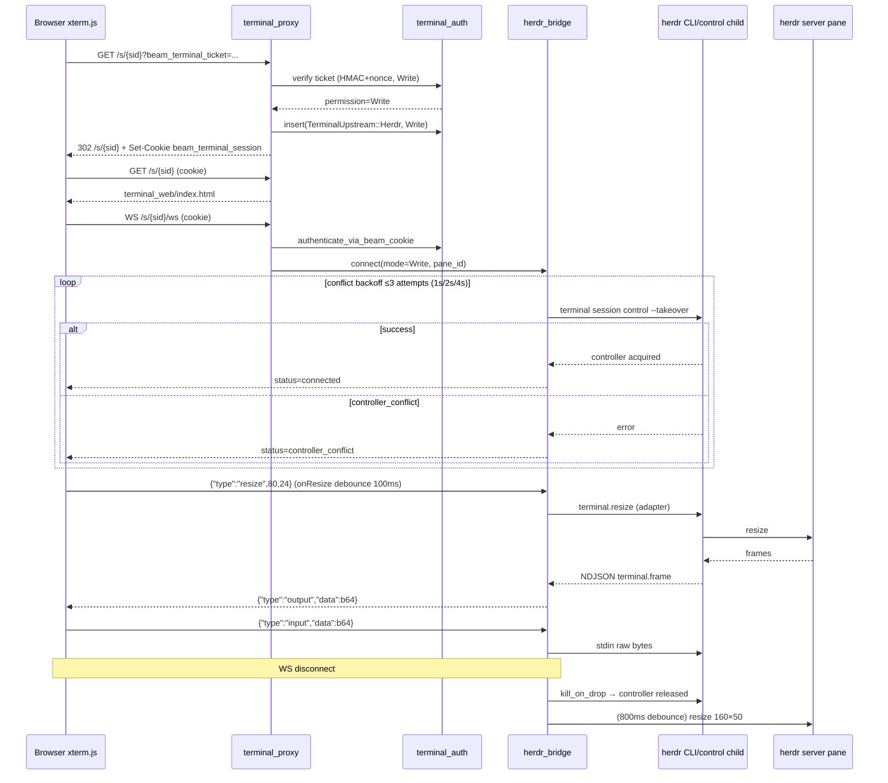

# Beam Herdr Web Terminal Access (v2 design)

Chinese: [herdr-web-access.md](herdr-web-access.md)

- Date: 2026-08-29
- Author: TBD
- Status: Draft
- Revision history: v1 (2026-08-29 initial draft) → v2 (2026-08-29, responding to round 1 review: filled the three implementation gaps `apply_ready_identity`/`handle_terminal_link`/assets routing, watchdog as an independent PR, write-path contract gate moved to W3a) → v3 (2026-08-29, responding to round 2 re-review: W3a probe is now a CLI subcommand surface scoped to `herdr_web=true`, button condition and W5a predicate made precise, `HERDR_SOCKET_PATH` added to the contract table, revision history added) → v4 (2026-08-29, responding to round 3 re-review: `--help` probe assumption added as contract row h with a version gate and tolerant matching, `probe_herdr_web_cli` fixed as the standalone module `herdr_probe_web.rs` with lazy first-WS execution and caching, W5a predicate extracted to a pure function keeping the status clause, WS status enum gains `unsupported` covering contract degradation and probe failure presentation) → v5 (2026-08-29, responding to round 4 re-review: probe returns per-capability `WebCapability{observe,control}` with separate gates, "read-only first when control is missing" degradation actually holds, failed values re-probed after TTL by default).
- Related: this is the v2 standalone design corresponding to the "Web terminal: phased, not a v1 blocker" section of [herdr-backend.md](herdr-backend.md) (the "v2 (separate design/PR)" row); the English mirror ships alongside this file.
- Scope: provide a Beam-owned browser terminal page (xterm.js) for sessions with `backend_kind = Herdr`, reusing the existing ticket/cookie auth, with the upstream swapped from zellij web to Beam's own herdr bridge. The Zellij web terminal path is unchanged.

## Overview

`docs/design/herdr-backend.md` makes Herdr a first-class `SessionBackend` (v1, PRs 1–5 landed) but explicitly defers the "web terminal" to v2: Herdr has no zellij-web-style browser UI, v1 Herdr cards only show the `herdr agent attach` hint, and `Session.terminal_url` stays `None`. This design fills that gap: **Beam builds its own xterm.js terminal page, served by the daemon's terminal proxy on the same port (`web.proxy_base_port`, default 8800)**, so the page and the WebSocket share origin and cookie domain; read-only viewers use `herdr terminal session observe`, writable viewers use `herdr terminal session control --takeover`; resize goes through `terminal.resize` JSON. **The herdr behaviors described in parentheses (multi-observer, no input/resize ownership, single-controller exclusivity, etc.) depend on the herdr 0.8.2 implementation and are all pending live verification in PR W3a (see contract table rows a–h); they are not treated as established fact before verification.**

Auth reuses the existing model wholesale: `beam_terminal_ticket` (HMAC + nonce + 5-minute TTL for write tickets) is exchanged for the `beam_terminal_session` cookie (HttpOnly / SameSite=Strict / Path=/s/), and the proxy keeps a server-side cookie jar. The change is generalizing the cookie jar's "upstream identity" from a zellij cookie string to `TerminalUpstream::{Zellij{cookie}, Herdr}`; the Herdr path skips the zellij `/command/login` and binds observe/takeover mode directly from the permission.

## Background & Motivation

### Current state (verified; the code is authoritative)

- `crates/beam-daemon/src/terminal_proxy/` (`mod.rs` / `auth.rs` / `http_forward.rs` / `ws_relay.rs` / `anchor.rs` / `tests.rs`): the outward-facing axum proxy. Routes `/s/{session_id}` (ticket/cookie login + proxy), `/s/{session_id}/ws`, `/s/{session_id}/ws/{*rest}`, `/s/{session_id}/{*path}`. `resolve_zellij_session` (`mod.rs`) returns `None` → 404 for sessions with `backend_kind == Herdr`, forbidding mapping onto a `beam-{sid8}` zellij name.
- `crates/beam-daemon/src/terminal_auth.rs`: ticket payload `session_id:permission:created_at:nonce`; write-ticket TTL 300s, read-only tickets do not expire by creation time, one-time nonce (used tickets remembered for 600s); ticket secret persisted at `$BEAM_HOME/state/ticket-secret`; `beam_terminal_session` cookie TTL 86400s; `TerminalAuthState` is an in-process `HashMap<beam_cookie, (zellij_cookie, session_id, permission, created_at)>` that is invalidated on daemon restart and requires a fresh ticket.
- `crates/beam-daemon/src/terminal_proxy/auth.rs`: `try_ticket_login` verifies the ticket → selects a zellij token by permission → `POST /command/login` captures `Set-Cookie` → stores in the jar → sets the beam cookie → 302 to a clean URL. Read-only login additionally builds an anchor (`anchor.rs`: a hidden normal web client that connects the terminal WS first, waits for the first frame, then the control WS, and sends `TerminalResize` 160×50 to fix the black screen; an 800ms debounce restores 160×50 when the viewer counter hits zero).
- `crates/beam-daemon/src/zellij_web.rs`: `start_zellij_web_if_enabled(enabled, port, tokens_path)` — with `web.zellij_web=false` it returns `ZellijWebTokens::disabled(port)` and the proxy still starts but has no upstream. A watchdog checks every 30s.
- `crates/beam-daemon/src/lib.rs` (~L173, ~L836–855): `probe_herdr_at_startup` forces a probe at daemon startup when herdr is configured; `start_zellij_web_if_enabled` + `terminal_proxy::start_proxy` wiring. The daemon local API binds `127.0.0.1:7893`; the dashboard serves static assets via `ServeDir::new("src/dashboard/web")`. Note: that dashboard directory is **not tracked by git** (`git ls-files crates/beam-daemon/src/dashboard/` is empty) and depends on a runtime CWD directory — a packaging antipattern we must not copy (see "xterm.js source").
- `crates/beam-worker/src/backend/herdr/observe.rs`: `run_herdr_observe` runs `herdr terminal session observe <pane> --cols N --rows M`, parsing NDJSON lines with `frame.data` / `data` / `bytes` support (the real 0.8.x frame is `{"type":"terminal.frame","bytes":"<b64>","full":true,"height":24,"width":80,"seq":1}`), exiting on `terminal.closed`; the child has `kill_on_drop` and strips `HERDR_PANE_ID`/`HERDR_TAB_ID`/`HERDR_WORKSPACE_ID`.
- `crates/beam-worker/src/backend/herdr/mod.rs`: `HerdrBackend` (managed; label `beam-{sid8}` dedupe + `pane run` launch spec) and `HerdrObserveBackend` (adopt; observe + drive only, never `pane run`). `kill()` only stops observe; `destroy_session()` force-closes the workspace for managed sessions.
- `crates/beam-core/src/config.rs`: `WebConfig { host("0.0.0.0"), proxy_base_port(8800), zellij_web(true) }`; `HerdrConfig { min_version("0.8.2"), session("default"), socket_path(None) }`.
- `crates/beam-core/src/session.rs` / `ipc.rs`: `Session` already has `terminal_url`, `backend_kind`, `herdr_workspace_id`, `herdr_pane_id` (persisted on Ready); `InitConfig` round-trips the same fields.
- `crates/beam-daemon/src/backend.rs` (~L28–44): `apply_ready_identity` hard-codes `if backend_kind == BackendKind::Zellij { session.terminal_url = terminal_url; }` inside the function body — **the real gate for writing the URL lives inside the function**, so changing only the call site has no effect (see round-1 Issue 1; PR W5 must change this file).
- `crates/beam-daemon/src/worker_lifecycle.rs` (~L120–235, ~L750–800): the Ready handler calls `apply_ready_identity` and only Zellij passes `Some(terminal_base_url(...))`. The worker-ready watchdog predicate is `session.terminal_url.is_some()` — always false for Herdr sessions, so it falsely reports "startup timeout" for healthy Herdr sessions (a known v1 wart). **This false report is unrelated to herdr web and must be fixed independently before `herdr_web` flips true (PR W5a, see PR Plan)**; it must not be claimed as "fixed along the way" by v2. The W5a predicate is `terminal_url.is_some() || (backend_kind == Herdr && herdr_workspace_id.is_some() && herdr_pane_id.is_some())`, without importing `session_card_ready`'s card-delivery semantics.
- `crates/beam-daemon/src/lark_replies.rs`: `session_card_ready` is already decoupled from `terminal_url` (Herdr uses the workspace/pane ids).
- `crates/beam-daemon/src/session_cards/streaming.rs` (~L74, ~L181–216): `build_streaming_card` does not emit the "Choose read-only terminal entry / Send write link privately" buttons for `backend_kind == Herdr`; it shows the `herdr agent attach` hint instead.
- `crates/beam-daemon/src/ip_resolver.rs`: `rewrite_session_terminal_urls` rewrites `terminal_url` when the external host changes — Herdr URLs are affected the same way (only scheme/host/port are touched).
- `crates/beam-daemon/src/lark_ingress/workflow_actions.rs` (~L112): the existing pattern `build_terminal_url_with_ticket` + `terminal_base_url` builds `/s/{session_id}?beam_terminal_ticket=...`.
- `crates/beam-daemon/src/lark_ingress/session_card_actions.rs` (~L220): `handle_terminal_link` **mandatorily checks zellij tokens** before issuing a terminal link — read-only via `load_zellij_web_tokens_for_card()` (`session_cards/terminal_links.rs:236`), write via `zellij_web::load_zellij_web_tokens(...)`, toasting "terminal not ready" when absent. Ticket issuance itself (`session_cards/terminal_links.rs:245` `build_terminal_url_with_ticket` → `generate_terminal_ticket`) is backend-agnostic. **Under a herdr-only deployment (`zellij_web=false`) this gate makes every restored button fail**, and if adopt read-only were only enforced on the validation side while the issuance side still mints write tickets, there would be a "clickable but always failing" transition window (see round-1 Issue 2; PR W5 must change this file).

### Why v2 must ship a Beam-owned page

Herdr officially ships only a CLI + Unix socket API; there is **no** HTTP terminal page; remote access is SSH / `herdr --remote`, not HTTP. Third parties wrapping HTTP around the socket (e.g. herdr-controller) are a community practice, and `herdr-backend.md` already states Beam does not depend on them. So the "browser → beam-daemon → herdr socket/CLI" bridge must be built in-house — that is the core of this design.

### Pain points

1. v1 Herdr users can only see screenshot cards in Feishu; there is no live browser terminal (only `herdr attach`).
2. `terminal_proxy` is zellij-specific (path rewriting, cookie injection, anchor) and can only 404 for Herdr.
3. `terminal_url` carried two meanings ("web terminal available" and "card deliverable"); after the v1 decoupling cards deliver but the browser entry point is missing.
4. With `web.zellij_web=false` (herdr-only deployment) the proxy has no upstream; until herdr web lands, that combination has no terminal capability.

## Goals & Non-Goals

### Goals

1. A Herdr session opens Beam's own xterm.js terminal page in the browser at the existing `terminal_base_url` shape: `http://{host}:{proxy_base_port}/s/{session_id}`.
2. Read-only viewers use `terminal session observe`: multi-observer by design, no input/resize ownership, no zellij-style hidden anchor (these semantics depend on herdr 0.8.2 behavior, pending PR W3a contract verification; degrade per the contract table if they do not hold).
3. Writable viewers use `terminal session control --takeover`: single-controller exclusivity (pending PR W3a verification, see contract row a), clear conflict error + bounded backoff retry; the controller is held by the daemon and released when the WS disconnects (release semantics pending contract row d).
4. Resize is initiated only by the controller via `terminal.resize` JSON; after all controllers leave, a debounce restores 160×50 (aligned with the existing `DEFAULT_TERMINAL_COLS/ROWS` and the anchor's 800ms semantics).
5. Reuse the ticket/cookie auth model wholesale by generalizing the cookie jar's upstream identity; zero behavior change for the Zellij path.
6. After v2 lands, Herdr sessions write `terminal_url` again and cards regain the read-only/writable buttons; `session_card_ready` semantics stay unchanged.
7. Adopt sessions are read-only by default (web write would steal the user's TUI input); managed sessions offer read-only + privately-sent write links.
8. Orthogonal to "daemon starts without zellij": `web.zellij_web=false` already exists; after herdr web lands, one live test locks the "no zellij binary + herdr web works" combination.

### Non-Goals

- No full Herdr TUI, remote SSH client, or `herdr --remote` relay.
- Do not expose the herdr socket directly to the browser (JSON-RPC passthrough) — the permission model must be enforced daemon-side.
- No dependency on third-party herdr HTTP bridges (e.g. herdr-controller).
- Do not change the existing Zellij web terminal path (proxy, anchor, cookie injection stay as-is).
- Do not change the worker input path: the web write viewer coexists with worker `pane send-*`, but web does not replace the adapter confirmation loop.
- No TypeScript / npm / frontend build chain (repo constraint).
- No "one observe stream per session with daemon-side fan-out to many viewers" optimization (per-viewer child processes are cheap enough).

## Proposed Design

### Overall architecture

```mermaid
flowchart LR
  subgraph browser [Browser]
    X[xterm.js page<br/>/s/{sid}]
    W[WS /s/{sid}/ws]
  end
  subgraph daemon [beam-daemon]
    TP[terminal_proxy<br/>web.proxy_base_port:8800]
    TICKET[ticket/cookie auth<br/>terminal_auth.rs]
    BR[herdr_bridge.rs<br/>observe / control child management]
    STAT[xterm.js static assets<br/>terminal_web/]
    ZP[zellij path<br/>http_forward + anchor unchanged]
    SESS[Session table<br/>backend_kind + herdr ids]
  end
  subgraph herdr [local herdr server]
    OB[observe stream<br/>terminal session observe]
    CT[controller<br/>terminal session control --takeover]
    PN[pane w1:p1<br/>AI CLI]
  end
  X -->|GET /s/{sid}| TP
  W -->|WS upgrade + cookie| TP
  TP --> TICKET
  TICKET --> SESS
  TP --> STAT
  TP --> ZP
  TP --> BR
  BR -->|read-only: one observe child per viewer| OB
  BR -->|writable: single control child| CT
  OB --> PN
  CT --> PN
```

Key points:

- The page and WS share origin and port, with cookie `Path=/s/`, `SameSite=Strict` — naturally same-origin; the browser only talks to the daemon and never touches the herdr socket/token.
- Dispatch by `Session.backend_kind`: Zellij → existing http_forward/anchor; Herdr → new bridge + static page.
- Bridge children strip `HERDR_PANE_ID` / `HERDR_TAB_ID` / `HERDR_WORKSPACE_ID` (following the `cli.rs` `clean_env` hygiene convention) and target the default session (`HerdrConfig.session`, default `default`).
- **Socket override propagation**: when `HerdrConfig.socket_path` is `Some`, bridge children point at that socket via the `HERDR_SOCKET_PATH` environment variable; `None` uses herdr default discovery (`~/.config/herdr/herdr.sock` or `$XDG_CONFIG_HOME`). **Whether herdr CLI recognizes `HERDR_SOCKET_PATH` is an unverified external convention; it is listed as contract row g for PR W3a live verification and is not treated as established fact beforehand**; if the env is not recognized, fall back to an explicit `--socket` CLI flag or default-socket-only (see row g fallback). The worker-side `cli.rs` currently does not read `socket_path`; this design gets the daemon bridge side right first, with worker-side alignment as a follow-up item (see Open Questions).

### Browser UI: Beam-owned xterm.js page

#### xterm.js source: vendor into the daemon, no CDN

Vendoring a pinned version, because:

| Option | Verdict |
| --- | --- |
| CDN (jsdelivr etc.) | Rejected: the daemon must work offline (air-gapped/corporate networks are a real Beam deployment surface); version drift is unauditable; CSP would have to allow an external origin |
| Vendor into the repo | Adopted: pinned version, offline, auditable; no build chain |

Implementation:

- Asset directory `crates/beam-daemon/src/terminal_web/`: `index.html`, `app.js` (page logic, no TypeScript), `assets/vendor/xterm@5.3.0/{xterm.min.js,xterm.css}` (pin the current stable version at implementation time, MIT license).
- **Compile the assets into the daemon binary with `include_dir!`**, serving bytes from memory (`Content-Type` by extension). **Do not** copy the dashboard's `ServeDir::new("src/dashboard/web")` pattern: that directory is untracked, depends on a runtime CWD, and is incompatible with the "single binary release asset" distribution (AGENTS: the beam-cli binary is the release upload artifact). `include_dir!` is a mature crates.io library, Rust-native, with no frontend build chain, matching the repo's "prefer mature libraries" rule.
- The page sets `Content-Security-Policy: default-src 'self'; connect-src 'self' ws://{host}; style-src 'self' 'unsafe-inline'`, with no inline scripts.
- Size: xterm.js minified ~350KB (gzip ~120KB), acceptable compiled into the binary.

#### Routing and dispatch (`terminal_proxy/mod.rs` extension)

New/changed routes (axum specificity first):

| Route | Herdr session | Zellij session (unchanged) |
| --- | --- | --- |
| `GET /s/{session_id}` and `/s/{session_id}/` | Serve `terminal_web/index.html` (ticket/cookie login as before; after login the same URL serves the page) | Existing proxy to `/{zellij_session}` |
| `GET /s/{session_id}/assets/{*path}` | **Herdr branch only**: serve beam static assets from the binary (no sensitive data, no cookie required) | **Keep the existing zellij assets proxy**: `http_forward.rs::rewrite_asset_paths` (~L95) rewrites `"/assets/` in zellij HTML to `/s/{sid}/assets/`, and `is_zellij_root_path("assets/...")` is true (`terminal_auth.rs:465`), so `handle_session_path` currently proxies these to the zellij web root (style.css/auth.js etc.). **Never mount one static `ServeDir` for all sessions — it would shadow and break zellij page assets** |
| `GET /s/{session_id}/ws` | herdr bridge WS (below) | Existing session WS |
| `GET /s/{session_id}/ws/{*rest}` | 404 | Existing root WS |
| `/s/{session_id}/{*path}` | 404 (except assets) | Existing path proxy |

Implementation notes:

- Change `resolve_zellij_session` (currently `None` → 404 for Herdr) into `resolve_terminal_target`: return enum `TerminalTarget::Zellij{...}` / `TerminalTarget::Herdr{workspace_id, pane_id}`, dispatched by handlers.
- `ProxyState` gains `herdr_bridge: HerdrBridge` (`Arc`) and `herdr_web_enabled: bool`; with `WebConfig.herdr_web=false`, Herdr sessions keep 404ing, i.e. back to v1.
- **PR W2 must add a regression test**: a Zellij session's `GET /s/{sid}/assets/style.css` still proxies to the zellij root (200 and from upstream), and a Herdr session's `/s/{sid}/assets/xterm.min.js` returns beam assets; the two paths must not pollute each other.

### Bridge: observe (read-only) and control --takeover (writable)

New module `crates/beam-daemon/src/terminal_proxy/herdr_bridge.rs` (about 500–700 lines; split into `resize.rs` / `observe.rs` / `control.rs` if it exceeds limits).

#### WS message contract (JSON frames, `b64` for binary safety)

```
daemon → browser:
  {"type":"output","data":"<b64 ansi>","full":bool}          # forwarded observe/control frames
  {"type":"resize","cols":N,"rows":M}                        # actual pane size change
  {"type":"status","state":"connecting|connected|reconnecting|controller_conflict|unsupported|closed","detail":"..."}

browser → daemon:
  {"type":"input","data":"<b64 raw bytes>"}                  # write viewers only
  {"type":"resize","cols":N,"rows":M}                        # write viewers only, onResize debounce 100ms
```

`status.state` semantics: `unsupported` (alias `write_unavailable`) means "this deployment/pane does not support the requested capability" — e.g. `probe_herdr_web_cli` probe failure (CLI missing the `terminal session` subcommand or too old), contract row a degradation (`control --takeover` absent), or a write viewer trying to take over on a read-only deployment. **`detail` differentiates by capability**: `control` missing → "This deployment does not support writable terminals; read-only is available" (the page offers a "fall back to read-only" button, via a read-only ticket or by degrading to the observe stream); `observe` missing → "Terminal stream unavailable" (read-only is unavailable too; the page stops reconnecting and asks the user to contact the admin). `unsupported` does not auto-reconnect. This state also covers `probe_herdr_web_cli` failure presentation (see "writable path" and the error table).

#### Read-only path (one observe child per viewer)

Why no zellij-style anchor:

- Zellij's black screen comes from its watcher client not rendering a first frame without a normal client; it needs a hidden normal client + `TerminalResize` to force frames.
- herdr `terminal session observe` is a long-lived connection designed for third-party bridges, **multi-observer, no input/resize ownership**; each viewer gets its own observe child and the full frame stream, with no "no client, no render" problem.
- Observe child `--cols N --rows M`: **v2 initial semantics are a fixed 160×50** (`DEFAULT_TERMINAL_COLS/ROWS`); the first full frame carries `height`/`width` and the browser corrects its terminal size after the first frame; after a controller resize the bridge restarts that session's observe children at the new size and broadcasts `{"type":"resize"}`. No command in the repo returns pane dimensions (`pane read` / `process-info` / `workspace get` do not guarantee it), so "current size" is not assumed to be available; "add a size query command" is a future enhancement (see Open Questions).
- No input, no resize permission: a read-only viewer's WS only receives `output`/`resize`/`status`; `input`/`resize` frames are dropped by the daemon with a debug log.

Child supervision: the bridge applies "unexpected exit → backoff reconnect (1s/2s/4s/8s, capped at 30s)" to each observe child; `terminal.closed` or `workspace get` confirming the pane is gone → state `closed`, the browser stops reconnecting and shows "terminal closed".

#### Writable path (single controller)

- When the WS authenticates as `Write`, the bridge tries `herdr terminal session control --takeover <pane>`.
- **Cannot acquire** (existing controller; nonzero CLI exit / socket error): return `status=controller_conflict`, show a hint; the bridge retries with backoff (1s/2s/4s) **within the same connection**, disconnects if still failing, and the user can click "retry". No queueing — a controller is interactive-exclusive and queueing would only accumulate stale input.
- **Controller ownership**: the daemon process (bridge task). Rationale: the daemon is the only long-lived process spanning workers, so worker exit/restart must not release the controller; on WS disconnect or daemon exit the child is killed by `kill_on_drop` and herdr releases the controller.
- Input: browser `input` frame → bridge writes raw bytes to the control child's stdin.
- Frames: the control child's stdout NDJSON → parsed with the same observe contract → `output` frames.
- Read-only viewers coexist with the controller: they keep their own observe children; a controller resize changes pane dimensions, the bridge detects it, **restarts all of that session's observe children** (new size), and broadcasts `{"type":"resize"}` to all viewers.
- **Degradation presentation (contract row a failure / `probe_herdr_web_cli` `control` capability failure)**: a write viewer's WS may only discover the capability gap after authenticating as Write; it must not simply disconnect (`closed` would be read by the page as "terminal closed"). The bridge sends `{"type":"status","state":"unsupported","detail":"This deployment does not support writable terminals; read-only is available"}`, **keeping the connection without auto-reconnect**; the page shows the `detail` text and offers a "fall back to read-only" button — re-login with a read-only ticket (or the bridge degrades the same connection to the observe stream and broadcasts `status=connected` + a mode change). **This degradation only affects write viewers: read-only viewers go through the `observe` capability gate and are not blocked by a missing `control`** (consistent with contract row a "read-only first"). When `probe_herdr_web_cli`'s `observe` capability fails, all herdr web connections (read-only included) return `status=unsupported` (with differentiating `detail`).

**Write-path load-bearing contracts (all "pending live verification"; gated by PR W3a)**. The behaviors below **cannot be verified on the current branch** (the fake shim only implements `terminal session observe`; `herdr_probe.rs`'s `REQUIRED_HERDR_METHODS` is a difference check over the **socket JSON-RPC methods** of `herdr api schema --json`, and the 0.8.2 schema fixture has only 10 methods and **no** `terminal.session.*` — `terminal session` is a **CLI subcommand surface**, not part of the socket schema; this is expected, not a gap), so the design does not treat them as established fact:

| # | Contract | Design points relying on it | Fallback on failure |
| --- | --- | --- | --- |
| a | `terminal session control --takeover` CLI existence and single-controller exclusivity | The writable path overall | No CLI → writable path degrades to "not supported", read-only first |
| b | Input goes to the control child's stdin as raw bytes; output is NDJSON on stdout | Input/frame forwarding | Input falls back to socket `pane.send_input` (the worker `cli.rs` comment already mentions this route); frame parsing reuses observe parsing |
| c | Conflict exit code/error shape (the design distinguishes `controller_conflict` by it) | Conflict backoff logic | stderr text matching as a fallback, e.g. "already controlled" / "controller" |
| d | herdr releases the controller immediately after WS disconnect (`kill_on_drop`) | Controller lifecycle | If release is delayed, the bridge self-holds backoff in the reconnect window; see also the SIGKILL row in the error table |
| e | `terminal.resize` transport (control-channel stdin JSON vs a separate CLI/socket call) | Resize | `HerdrControlTransport` adapter implements both; the live test pins the real shape; if neither works, resize degrades to "each write-viewer resize restarts observe via CLI" |
| f | Observe first frame is full-screen (the premise of reconnect resync) | Read-only reconnect | The worker `observe.rs` comment stresses "does not guarantee every frame is full screen"; if the first frame is partial, send a `{"type":"resize"}` to trigger a redraw or fetch one full frame via `pane read --source visible --format ansi` |
| g | Whether the herdr CLI recognizes the `HERDR_SOCKET_PATH` env (socket override convention) | `HerdrConfig.socket_path` propagation | If not recognized, use an explicit `--socket` CLI flag (if it exists), or v2 supports only the default socket and documents `socket_path` as ineffective |
| h | Existence and output shape of `herdr terminal session --help` (an assumption of the probe itself) | `probe_herdr_web_cli` criteria (per-capability) | Matching must be tolerant and **per capability**: case-insensitive substring `observe` decides the observe capability and `control` the control capability, independently; no dependence on exact help wording or localization; if `--help` is absent (nonzero exit), fall back to "run the `terminal session` subcommand directly and check the exit code"; if a single item is still uncertain, treat that capability as "available" with a WARN — a false negative (probe fails although the CLI works) is more damaging than a false positive, and one capability failing must not drag down the other (when `control` is missing, read-only must stay available) |

**Gate implementation (PR W3a, before W3/W4)**:

1. Add the ignored live test `live_herdr_web_contract` (calls the real herdr CLI directly) verifying rows a–h one by one; each failed assertion maps to an explicit degradation path.
2. **The probe targets the CLI subcommand surface, not the socket schema.** `terminal session` is a CLI subcommand (worker v1 always called it via the CLI and never probed the socket schema). Add the probe as a **standalone module `crates/beam-daemon/src/herdr_probe_web.rs`** (sibling to `herdr_probe.rs`, single responsibility; W3a precedes W3, so it **must not depend on the not-yet-existing `herdr_bridge.rs`**), function `probe_herdr_web_cli()` **returning a per-capability result** `WebCapability { observe: bool, control: bool }`: first run `herdr --version` as a `min_version` gate (reusing `herdr_probe.rs` version comparison, so we do not probe "whatever herdr happens to be on the machine"), then run `herdr terminal session --help` and judge the `observe` / `control` substrings **separately** per the tolerant rules of contract row h. **The read-only WS gate uses `observe`; the write WS gate uses `control`** — when `control` is missing, read-only viewers connect normally (consistent with "contract row a failure → read-only first"), and only when `observe` is missing are all herdr web connections unavailable. **Timing: lazily before the first Herdr WS connection; caching: successful values are cached permanently, failed values are re-probed after a TTL (default 5 minutes)** — so `herdr_web=true` never turns "no herdr CLI on this machine" into a daemon startup failure, and a fixed/upgraded CLI self-heals without a daemon restart. **Failure blast radius: only that capability's connection returns `status=unsupported` (see WS contract); the daemon and Zellij are unaffected.** **Never** add `terminal.session.*` to `REQUIRED_HERDR_METHODS`: that is a difference check over the socket schema, the 0.8.2 fixture lacks those methods, and adding them would hard-fail the daemon startup probe (`probe_herdr_at_startup`) and every Herdr worker spawn probe (`worker_lifecycle.rs` ~L126 `probe_herdr(...)?`) — v1 Herdr deployments that never use web would break too, and the existing `committed_schema_fixture_covers_required_methods` unit test (`herdr_probe.rs:252`) would fail immediately; "adding" methods to the fixture would be forging a real schema snapshot.
3. The fake shim gains minimal `terminal session control` and `terminal resize` implementations. **Daemon-side shim ownership**: copy one to `crates/beam-daemon/tests/support/fake_herdr.sh` (or a shared directory), reusing the worker's PATH injection pattern (`herdr/mod.rs` ~L518 `fake_herdr_env`: symlink the shim dir as `herdr` in PATH), for `herdr_bridge` hermetic tests; do not depend cross-crate on the worker's test directory.

#### Multiple write viewers

Two write-cookie browsers open for the same session → each tries takeover; herdr guarantees only one controller at a time, and the later one gets `controller_conflict`. The bridge does not add a virtual lock; conflicts surface as a hint. Acceptable semantics: write links are "sent privately", so simultaneous opens are a rare mistake.

### Resize protocol and timing

| Item | Value |
| --- | --- |
| Who may resize | Only the controller (write viewer); a read-only viewer's resize frames are dropped |
| Trigger | Browser `xterm.onResize` → 100ms debounce → `{"type":"resize"}` → bridge → `terminal.resize` |
| Initial size | Default 160×50 (`DEFAULT_TERMINAL_COLS/ROWS`); use the last recorded resize if any |
| All controllers leave | 800ms debounce, then `terminal.resize` back to 160×50 (aligned with anchor semantics) |
| Read-only viewer display size | Follows frame `height`/`width` and the `{"type":"resize"}` broadcast |

### Auth and authorization reuse

Kept chain: `?beam_terminal_ticket=` (HMAC-SHA256, payload `session_id:permission:created_at:nonce`) → verify (write-ticket TTL 300s, read-only does not expire, one-time nonce) → issue the `beam_terminal_session` cookie (HttpOnly / SameSite=Strict / Path=/s/ / Max-Age 86400) → subsequent requests use the cookie alone.

Changes (`terminal_auth.rs` + `auth.rs`):

1. The cookie jar value goes from `String` (zellij cookie) to:

```rust
enum TerminalUpstream {
    Zellij { cookie: String },
    Herdr,
}
```

2. `try_ticket_login` gains a Herdr branch: **do not call** the zellij `/command/login` (there is no HTTP upstream); directly `auth_state.insert(TerminalUpstream::Herdr, session_id, permission)` → set the cookie → 302.
3. `authenticate_via_beam_cookie` returns `(TerminalUpstream, permission)`; `ws_relay` / `http_forward` route the `Herdr` branch to the bridge.
4. **Tighten the write-cookie TTL** (new config `WebConfig.write_cookie_ttl_secs`, default 3600s): the jar stores `expires_at`; `Write` entries expire after 1 hour; read-only stays 24h. Rationale: takeover is exclusive and can interrupt human TUI input, so the write credential window should be shorter than the read-only one. **`Max-Age=86400` remains browser-side only**: `auth.rs::build_beam_set_cookie` hard-codes `Max-Age=86400` for the browser; after the jar-side 1h expiry the browser still holds the cookie but is rejected each time and must redo the ticket — this is **server-side jar enforcement**; the browser cookie shape is unchanged (zero `Set-Cookie` change for the zellij path). Optionally emitting permission-specific `Max-Age` from `build_beam_set_cookie` later is out of this design's default scope.
5. The WS upgrade gains **Origin validation**: `Origin` must be same-origin with `Host` (or missing for non-browser clients like curl, allowed with a WARN), else 403. Mitigates "a malicious page drives the terminal WS in the same browser" (CSRF surface). Add it to the zellij WS path in the same PR (same function, low risk).

### `terminal_url` semantics and cards

- **v2 contract**: a Herdr session's Ready now also writes `terminal_url = terminal_base_url(external_host, proxy_base_port, session_id)`. **The change must land inside the `backend.rs::apply_ready_identity` guard** (its `if backend_kind == BackendKind::Zellij` currently drops the Herdr `Some(url)`): change it to "write for Zellij or (Herdr and `herdr_web=true`)", or remove the guard entirely and let the caller decide whether to pass `Some(url)` (the latter is recommended; the function becomes pure). The caller's Ready handling in `worker_lifecycle.rs` opens up its argument condition in sync. `session_card_ready` keeps its current implementation (both paths hold; no change needed). PR W5 must include a unit test: a Herdr session with `herdr_web=true` has `terminal_url` written after Ready.
- `build_streaming_card` (`session_cards/streaming.rs`) button condition changes from `backend_kind == Zellij` to `backend_kind == Zellij || (backend_kind == Herdr && terminal_url.is_some())`, restoring both buttons ("Choose read-only terminal entry" / "Send write link privately") for Herdr; `herdr_web=false` or adopt degrade per the rules below. **Do not write only `terminal_url.is_some()`**: the Zellij no-URL edge case (zellij web down, pre-Ready sessions) would fall into the else branch and show the Herdr-specific `herdr agent attach` copy, violating "zero behavior change for the Zellij path". Tests: a Zellij session without a URL still shows buttons (at least no herdr copy); a Herdr session with a URL shows buttons.
- **Adopt sessions**: read-only entry only, no write ticket minted. **Both the issuance and validation sides are required**: issuance (`handle_terminal_link`'s "send write link privately" action in `session_card_actions.rs`, the resume/waiting write tickets in `workflow_actions.rs`, the `streaming.rs` button) does not mint write tickets / does not emit buttons when `adopted_from.is_some()`; the validation side (`auth.rs`) rejecting Write is a **safety net**, not the primary control — avoiding the "clickable but always failing" transition window.
- **The zellij token gate on card links must open (round-1 Issue 2)**: `session_card_actions.rs::handle_terminal_link` (~L220) mandatorily checks zellij tokens before issuance (read-only L239 / write L251, toasting "terminal not ready" when absent). Skip that check for sessions with `backend_kind == Herdr && herdr_web == true` (a herdr-only deployment with `zellij_web=false` has no zellij tokens; without the skip, all restored buttons fail); keep the check for the zellij path.
- **The watchdog false report is an independent problem, not fixed in this PR**: the worker-ready watchdog (`worker_lifecycle.rs` ~L761, predicate `terminal_url.is_some()`) false-reports Herdr regardless of herdr web, and the first release defaults `herdr_web` to `false`, so "fixing it along the way by writing back the URL" does not hold under the default config. Independent small PR W5a fixes it early: predicate `terminal_url.is_some() || (backend_kind == Herdr && herdr_workspace_id.is_some() && herdr_pane_id.is_some())`. **Do not use `session_card_ready`** (it mixes in `lark_app_id != "local"` and non-empty `root_message_id` card-delivery semantics; an empty `root_message_id` would mark an already-Ready zellij session as "not ready").
- `ip_resolver.rs` host/port rewriting applies to Herdr URLs as-is (only scheme/host/port are touched); no change needed.

### Shared herdr server across sessions + adopt semantics

Topology matches v1: one shared default session, one labeled workspace per beam session (`beam-{sid8}`). Web routing looks up `(herdr_workspace_id, herdr_pane_id)` from the `Session` table by `session_id`, naturally isolating per session.

**Adopt is read-only by default (product recommendation)**:

- An adopted workspace belongs to the user, who often has the herdr TUI open; web `--takeover` would steal the TUI's input/resize — a destructive operation.
- The beam worker already drives adopted panes via `pane send-*` (no controller needed), so the web write path adds no value.
- Implementation (issuance + validation, see above): when `Session.adopted_from.is_some()`, no write tickets are minted (no "send write link privately" button; `handle_terminal_link` rejects), while `terminal_url` is still written (the page opens read-only).

### Relationship to "daemon starts without zellij"

The `web.zellij_web=false` switch already landed with PR5 (`lib.rs` `start_zellij_web_if_enabled`) and is **independent** of herdr web:

- herdr web does not depend on the skip switch: mixed deployments (zellij web + herdr backend) keep the herdr page working.
- `zellij_web=false` + `daemon.backend=herdr` pure-herdr deployments get full browser terminal capability for the first time only after herdr web lands.
- Keep the PRs separate: herdr web ships as its own PR; the combination is locked by one `live_herdr_web_no_zellij` test (no zellij binary, `zellij_web=false`, managed herdr session, browser receives frames).

### Sequence diagram (writable viewer)



## API / Interface Changes

### Config (`crates/beam-core/src/config.rs`, TOML snake_case)

```toml
[web]
# existing
# proxy_base_port = 8800
# zellij_web = true
# v2 additions
herdr_web = true            # false = Herdr sessions back to v1 (no page / no buttons)
write_cookie_ttl_secs = 3600  # write-cookie validity; read-only stays 24h
```

### New modules / types

- `crates/beam-daemon/src/terminal_proxy/herdr_bridge.rs` (split into `observe.rs` / `control.rs` / `resize.rs` if over limit): bridge, child supervision, frame parsing/forwarding, controller lifecycle.
- `crates/beam-daemon/src/terminal_web/`: static assets (`index.html` / `app.js` / vendored xterm), compiled into the binary via `include_dir!`.
- `crates/beam-daemon/src/terminal_auth.rs`: `TerminalUpstream` enum; `TerminalAuthState::insert` signature change (compatible: the zellij branch behaves identically).
- `crates/beam-daemon/src/terminal_proxy/auth.rs`: the herdr branch of `try_ticket_login`.
- `crates/beam-daemon/src/terminal_proxy/mod.rs`: `resolve_terminal_target`, new routes, `ProxyState` fields.
- `crates/beam-daemon/src/terminal_proxy/ws_relay.rs`: dispatch to the bridge by `TerminalUpstream`; Origin validation.
- `crates/beam-daemon/src/backend.rs`: open up (or remove) the `apply_ready_identity` guard; caller decides (see "terminal_url semantics").
- `crates/beam-daemon/src/session_cards/streaming.rs`: button condition `backend_kind == Zellij || (backend_kind == Herdr && terminal_url.is_some())`; no write button for adopt.
- `crates/beam-daemon/src/lark_ingress/session_card_actions.rs`: skip the zellij token gate for Herdr + `herdr_web=true`; reject write-ticket issuance for adopt.
- `crates/beam-daemon/src/lark_ingress/workflow_actions.rs`: do not mint resume/waiting write tickets for adopt sessions.
- `crates/beam-daemon/src/worker_lifecycle.rs`: pass `Some(terminal_url)` on Herdr Ready when `herdr_web=true`; watchdog predicate (PR W5a).

**Write-cookie semantics (explicit)**: `Max-Age=86400` exists only in the browser `Set-Cookie` (`build_beam_set_cookie` unchanged; zero zellij-path change); the 1h tightening is **server-side jar enforcement** (`expires_at`); browsers holding an old cookie get rejected and must redo the ticket.

### Unchanged

- `BackendKind`, `Session` herdr fields, `InitConfig`, `WorkerToDaemon::Ready`, `session_card_ready`, the entire zellij path of `terminal_proxy`, ticket generation/verification/persistence, the `zellij_web` switch.

## Data Model Changes

- `Session`: no new fields — reuse `terminal_url` (written back in v2) plus existing `backend_kind` / `herdr_workspace_id` / `herdr_pane_id` / `adopted_from`.
- `TerminalAuthState` value type changes (in-process, not persisted; rebuilt on daemon restart, no migration). `TerminalUpstream` is an in-process enum, not serde-serialized.
- No `sessions.json` schema change.

## Alternatives Considered

### A. CDN-hosted xterm.js

Not offline-capable, CSP would need a third-party origin, version drift unauditable, blocked in air-gapped networks. **Rejected**; vendor a pinned version.

### B. Depend on a third-party HTTP bridge like herdr-controller

The external socket protocol version follows its own cadence; the auth model does not match Beam tickets (the third-party bridge signs its own tokens); upstream abandonment cuts supply. `herdr-backend.md` already states no such dependency. **Rejected**.

### C. Expose the herdr socket JSON-RPC directly to the browser (WS → socket proxy)

The browser would get the full socket API surface (spawn/pane control/agent state), the permission model could not be enforced daemon-side, takeover logic would be forced into JS, and the security surface would be out of control. **Rejected**; the daemon only exposes a narrow interface (output/input/resize/status).

### D. One observe stream per session + daemon-side fan-out

Saves child processes but couples all viewers' liveness: a disconnect forces a decision on whether to stop the stream; error isolation is poor. herdr observe is naturally multi-observer, and per-viewer children are cheap and isolated. **Per-viewer is the default**; fan-out is a future optimization (for large viewer counts).

### E. SSE for read-only, WS for writable

Adds a second transport; the xterm data model is inherently bidirectional byte streams, and SSE read-only one-way has no benefit. **Rejected**; one WS for both.

## Security & Privacy Considerations

| Risk | Severity | Mitigation |
| --- | --- | --- |
| Browser touches the herdr socket/token | High | Browser only connects to the daemon proxy; herdr bridge children run daemon-side and tokens never leave the process; reuse `clean_env` to strip pane-scoped env |
| Write cookie abused (takeover interrupts a human TUI) | Medium | 5-minute write-ticket TTL + write cookie default 1h (new config); full takeover acquire/release logging; herdr single-controller exclusivity as backstop (exclusivity itself pending PR W3a live verification, contract rows a/d) |
| CSRF / cross-site terminal driving | Medium | `SameSite=Strict` cookie; WS upgrade gains same-origin Origin validation (herdr + zellij paths in the same PR) |
| Read-only viewer steals terminal secrets | Medium (same level as zellij) | Read-only viewers have no input and no resize; the page renders nothing beyond `terminal_url`; known model: screenshot cards already expose the same screen to Feishu |
| herdr socket ACL | Low | Socket under `~/.config/herdr/`, same-user permissions; daemon children share the daemon's trust domain; never exposed to the browser |
| Observe child storm (many viewers) | Low | Per-viewer cap: **enforced in `herdr_bridge`'s per-session viewer registry** (`increment` after WS auth passes, `decrement` on disconnect, isomorphic to the zellij `viewer_counter`). Over 16 concurrent viewers per session: new read-only connections rejected (WS closed with 1013 Try Again Later, browser shows "viewer limit reached"), plus a `component="terminal_proxy" operation="viewer_limit"` WARN. Lands in PR W3 with tests; whether 16 is configurable is Open Q5 |
| Static page assets abused as a springboard | Low | Assets carry no sensitive data; CSP restricts script sources; user input is never interpolated into HTML (xterm content only enters canvas/text nodes) |

## Observability

- Logs (tracing `component="terminal_proxy"` style): ticket issuance (session/permission), WS connect/disconnect (mode), observe child start/stop (reason: clean close/stream break/timeout), takeover acquire/conflict/release, resize events (throttled: at most one per 10s per session).
- Metrics (counters via tracing or plain atomics): active viewers (per session), observe reconnects, takeover conflicts, `controller_conflict` rate, forwarded frame bytes.
- State surface: `GET /health` unchanged; optionally add a dashboard "web terminal online viewers" panel (reusing the `/api/overview` pattern).

## Error Handling & Recovery

| Failure | Behavior | Recovery |
| --- | --- | --- |
| observe stream break (not `terminal.closed`) | Backoff reconnect 1s/2s/4s/8s capped at 30s; browser shows reconnecting | Reconnect continues receiving frames (depends on full-first-frame resync; semantics pending PR W3a, contract row f; if it does not hold, fetch a full `pane read` frame) |
| herdr server restart | All observe/control children exit | Bridge marks the session terminal offline; the browser keeps backoff-reconnecting; worker-side `ensure_server` / label dedupe restores the workspace on the next ensure_worker |
| pane/workspace destroyed | Child `terminal.closed` / `workspace get` confirms gone | State `closed`, browser stops reconnecting; if the worker recreates the workspace by label, a viewer reopening uses the new ids in `Session` |
| control lost (controller child exited abnormally) | Release the controller flag; write viewer state `reconnecting` | Reconnect and re-takeover |
| `probe_herdr_web_cli` probe failure (CLI missing `terminal session` / too old) | **Per capability**: `control=false` → write viewer gets `status=unsupported` (detail "read-only available"), read-only viewers unaffected; `observe=false` → all herdr web connections (read-only included) get `unsupported` | Page hints per detail; **failed values are re-probed after a TTL (default 5 minutes); successful values cached permanently** — a fixed/upgraded CLI self-heals without a daemon restart; unit test uses the fake shim failing first then succeeding to verify re-probing |
| daemon restart | All bridge children exit with the daemon; herdr releases the controller; cookie jar cleared | Browser cookie invalid → redo the ticket login (existing model) |
| daemon crash / SIGKILL (`kill_on_drop` ineffective) | control/observe children orphaned; the controller may stay held | Mitigation depends on "the control child exits when its stdin pipe hits EOF" — included in PR W3a live contract verification (row d); if herdr does not exit on EOF, do an orphan cleanup at daemon startup: scan this user's `herdr terminal session control` processes whose parent is dead and SIGTERM them (matching beam-started processes) |
| Persistent takeover conflict | Disconnect after 3 backoff attempts; browser shows a hint | User retries or waits for the other side to release |

## Rollout Plan

1. Merge in the PR order below; each PR keeps the Zellij path and v1 Herdr behavior green.
2. `WebConfig.herdr_web` defaults to `true`, but **the first release ships it as "default false"** (see PR W1), flipping it only after live tests pass and dogfooding — same as `herdr-backend.md` PR5's handling of `zellij_web`.
3. Rollback: `herdr_web=false` returns to v1 (Herdr writes no `terminal_url`, no buttons, page 404), unrelated to zellij, removable on its own.
4. Combination verification: `zellij_web=false` + herdr web pure-herdr deployment (PR W6 live test).
5. **The watchdog fix (PR W5a) ships independently of this design**: predicate `terminal_url.is_some() || (backend_kind == Herdr && herdr_workspace_id.is_some() && herdr_pane_id.is_some())` (no `session_card_ready` card-delivery semantics), unrelated to `herdr_web`; can land early at any v2 stage; do not wait for `herdr_web` to flip true.

## Open Questions

1. **May adopt allow web write (takeover)?**: this design recommends read-only (destructive + no added value); if product wants adopt write, only send the write link privately to the adopt session owner, with copy explicitly stating "this will take over your terminal".
2. **Exact `terminal.resize` transport** (control-channel stdin JSON vs a separate CLI/socket call): moved forward to the PR W3a gate (contract row e); `HerdrControlTransport` implements both and the live test pins the real shape; does not block the rest of the design.
3. **xterm.js version**: pin the latest stable at implementation time and recheck the license (MIT); if the vendored size exceeds expectations (>1MB gzip), evaluate dropping addons.
4. **Uniform write-cookie TTL tightening**: this design only affects the new `write_cookie_ttl_secs` (default 1h); the zellij write cookie stays 24h; unifying is a separate product decision.
5. **Concurrent viewer cap per session (16)**: mechanism and enforcement location are defined in the security table (lands in PR W3); this question only concerns whether the value is appropriate/configurable.
6. **v1 watchdog false report** (`terminal_url.is_some()` predicate): handled by the independent PR W5a (predicate `terminal_url.is_some() || (Herdr && herdr_workspace_id.is_some() && herdr_pane_id.is_some())`, without `session_card_ready` card-delivery semantics), no longer tied to `herdr_web`. W5a also confirms no other code depends on "Herdr `terminal_url` is always None".
7. **Worker-side `HerdrConfig.socket_path` alignment**: this design propagates `HERDR_SOCKET_PATH` on the bridge side; the worker `cli.rs` currently does not read it; whether to align it in this v2 or a separate small PR is TBD.

## References

- Design: `docs/design/herdr-backend.md` (v2 Web Terminal section, Card-ready section, capability probe & setup, config, Open Questions Q3/Q6)
- Proxy current state: `crates/beam-daemon/src/terminal_proxy/{mod,auth,http_forward,ws_relay,anchor,tests}.rs`, `crates/beam-daemon/src/terminal_auth.rs`
- Auth: `crates/beam-daemon/src/lark_ingress/workflow_actions.rs` (`build_terminal_url_with_ticket`), `crates/beam-daemon/src/ip_resolver.rs`
- Herdr backend: `crates/beam-worker/src/backend/herdr/{mod,cli,observe,ids}.rs`, `crates/beam-daemon/src/{herdr_probe,herdr_lifecycle,herdr_adopt}.rs`
- Core: `crates/beam-core/src/{backend_kind,config,session,ipc}.rs`, `crates/beam-daemon/src/{backend,worker_lifecycle,lark_replies,session_cards/streaming}.rs`
- Static-asset pattern: `crates/beam-daemon/src/lib.rs`'s `ServeDir::new("src/dashboard/web")`
- zellij web current state: `crates/beam-daemon/src/zellij_web.rs`
- Docs (may drift; the code is authoritative): `docs/design/terminal-proxy.md`

## Key Decisions

1. **Beam owns the xterm.js page served same-origin by the terminal proxy**, vendoring a pinned version with no CDN. The page must share the WS cookie domain (`Path=/s/`, SameSite=Strict), so only the proxy port can serve it; it cannot move to the dashboard.
2. **Read-only = one `terminal session observe` child per viewer, no zellij-style anchor.** herdr observe is a multi-observer long-lived connection built for third-party bridges; no zellij watcher black-screen problem; per-viewer error isolation and natural resync. **"Multi-observer", "no input/resize ownership", and "full first frame" are herdr 0.8.2 behaviors pending PR W3a contract rows a/f; implement the in-table degradation if they do not hold.**
3. **Writable = `control --takeover`, controller held by the daemon and released on WS disconnect; bounded conflict backoff, no queueing.** Queueing is meaningless for an interactive-exclusive controller; the daemon is the only long-lived process spanning workers. **"Single-controller exclusivity" and "released on WS disconnect" depend on herdr 0.8.2 behavior pending PR W3a contract rows a/d; see the SIGKILL row in the error table for abnormal release.**
4. **Resize belongs only to the controller via `terminal.resize` JSON; an 800ms debounce restores 160×50 after all controllers leave.** Aligned with anchor semantics; read-only resize frames are dropped.
5. **Auth fully reuses ticket/cookie; the cookie jar's upstream identity generalizes to `TerminalUpstream::{Zellij, Herdr}`, skipping the zellij login for Herdr.** No new auth surface; zero behavior change for Zellij.
6. **v2 writes `terminal_url` back for Herdr (changing the `apply_ready_identity` internal guard), restores card buttons (condition `backend_kind == Zellij || (Herdr && terminal_url.is_some())`, so the Zellij edge case never lands in the Herdr copy branch) and opens `handle_terminal_link`'s zellij token gate, with `session_card_ready` unchanged.** `terminal_url` returns to the single meaning "web terminal available". **The watchdog false report is not tied to this design**: the independent PR W5a fixes it early with the predicate `terminal_url.is_some() || (Herdr && herdr_workspace_id.is_some() && herdr_pane_id.is_some())`, which holds under the first-release default `herdr_web=false` too.
7. **Adopt is read-only by default.** The user's workspace often has the TUI open; web takeover is destructive and adds no value (the worker already drives via `pane send-*`).
8. **herdr web is orthogonal to starting without zellij: an independent `herdr_web` switch and separate PRs; the `zellij_web=false` combination is locked by its own live test.** Do not bind the two into one PR.
9. **The write-path load-bearing contracts (`control --takeover` exclusivity / stdin input / conflict shape / release semantics / `terminal.resize` transport / full-first-frame observe / `HERDR_SOCKET_PATH` / `--help` output shape, table rows a–h) move forward as a PR W3a gate**: an ignored live exploration test plus **CLI-subcommand-surface probing in the standalone module `herdr_probe_web.rs` (`probe_herdr_web_cli` returns per-capability `WebCapability{observe,control}`: `herdr --version` through the `min_version` gate first, then `terminal session --help` matched tolerantly per capability; lazily before the first Herdr WS connection; successful values cached permanently, failed values re-probed after a 5-minute TTL), not in the global `probe_herdr` and not in `REQUIRED_HERDR_METHODS`** (which is the socket-schema difference check; the 0.8.2 fixture has no `terminal.session.*`). **The read-only gate checks `observe`, the write gate checks `control`; a missing `control` only degrades write viewers ("read-only first" actually holds)**; probe failure returns `status=unsupported` only for that capability's connection, leaving daemon and Zellij unaffected. Every contract has a failure fallback. Unverified herdr behavior is never treated as established fact.

## PR Plan

Each PR is independently reviewable and mergeable; the Zellij path and v1 Herdr behavior stay green throughout. The first release ships `herdr_web` default `false`; a separate PR flips it to `true` after live tests and dogfooding.

### PR W1 — Types and config: `TerminalUpstream`, `herdr_web`, write-cookie TTL

- **Title:** `feat(daemon): 泛化终端上游身份并新增 herdr web 配置`
- **Files / components:** `crates/beam-core/src/config.rs` (`WebConfig.herdr_web`, `write_cookie_ttl_secs`), `crates/beam-daemon/src/terminal_auth.rs` (`TerminalUpstream` enum, `insert`/`lookup` signatures, `expires_at`), `crates/beam-daemon/src/terminal_proxy/{mod,auth,ws_relay,http_forward}.rs` (compile adaptation + exhaustive matches)
- **Dependencies:** none
- **Notes:** pure type/config layer, no behavior change (Zellij still stores the zellij cookie; Herdr keeps 404ing while `herdr_web=false`). Unit tests: both jar shapes, write-cookie expiry rejection, default config deserialization.

### PR W2 — Static page + route dispatch

- **Title:** `feat(daemon): 提供 Beam 自有终端页并按 backend 分发`
- **Files / components:** `crates/beam-daemon/src/terminal_web/` (`index.html`, `app.js`, vendored `xterm@<pin>/`, embedded via `include_dir!`), `crates/beam-daemon/src/terminal_proxy/mod.rs` (`resolve_terminal_target`, `/s/{sid}/assets/{*path}` route **Herdr-branch only**, Herdr `/s/{sid}` serves the page), `tests.rs`
- **Dependencies:** PR W1
- **Notes:** page skeleton + static assets, showing "connecting" before the WS connects. **Note: the Herdr branch of `try_ticket_login` (`auth.rs`) lands only in W3; during W2, Herdr ticket login still goes through the zellij token path (503 "token unavailable" without tokens; cookie auth still 404s for Herdr), so production requests cannot reach the page. W2 verification is via axum route tests + injected auth state (auth_state), not end-to-end clicking.** axum route tests: Herdr page 200, Herdr `/s/{sid}/assets/xterm.min.js` 200 (from the binary); **regression: a Zellij session's `/s/{sid}/assets/style.css` still proxies to the zellij root (200 and from upstream); the two paths never pollute each other**. No real bridge in this PR.

### PR W3a — Contract gate: live exploration + capability probe (before W3/W4)

- **Title:** `feat(daemon): 钉死 herdr terminal session CLI 契约并限定探测作用域`
- **Files / components:** `tests/live_herdr_web_contract.rs` (ignored; calls the real herdr CLI and verifies contract rows a–h: `control --takeover` existence/exclusivity, stdin byte input, stdout NDJSON output, conflict exit codes/error shape, controller release on WS disconnect/EOF, `terminal.resize` transport, whether the first observe frame is full, whether `HERDR_SOCKET_PATH` is recognized, and the `terminal session --help` output shape containing observe/control separately), **`crates/beam-daemon/src/herdr_probe_web.rs` (new standalone module, sibling of `herdr_probe.rs`; `probe_herdr_web_cli() -> WebCapability{observe,control}`: `herdr --version` through the `min_version` gate, then `terminal session --help` matched tolerantly per capability; lazily before the first Herdr WS connection; successful values cached permanently, failed values re-probed after a 5-minute TTL; not in the global `probe_herdr`, not in `REQUIRED_HERDR_METHODS`)**, `crates/beam-daemon/tests/support/fake_herdr.sh` (**daemon-side shim**, copied from the worker or a shared directory, PATH injection like `herdr/mod.rs` `fake_herdr_env`; adds minimal `terminal session control` / `terminal resize` / `--help`)
- **Dependencies:** PR W2
- **Notes:** every contract assertion failure maps to an explicit degradation path (in-table fallbacks, e.g. input via socket `pane.send_input`, resize via CLI observe-restart). **The probe targets the CLI subcommand surface, not the socket schema**: `REQUIRED_HERDR_METHODS` is the `herdr api schema --json` difference check; the 0.8.2 fixture has only 10 methods and no `terminal.session.*` (the CLI surface is not in the schema), **never add `terminal.session.*` to that list** (it would break the daemon startup probe and every worker spawn, including v1 Herdr deployments that never use web, and would break the `committed_schema_fixture_covers_required_methods` test). **`probe_herdr_web_cli` returns per capability: `control=false` only makes write viewers get `status=unsupported` ("read-only first" holds); `observe=false` blocks all herdr web connections; the failure blast radius is only that capability's connection, daemon and Zellij unaffected; lazy execution with caching (success permanent, failure re-probed after a 5-minute TTL) means `herdr_web=true` never turns "no herdr CLI" into a daemon startup failure, and a fixed CLI self-heals without restart**. **This PR gates W3/W4**; W4 must not start before the contracts are verified.

### PR W3 — Read-only bridge (observe)

- **Title:** `feat(daemon): herdr 只读 web 终端（terminal session observe）`
- **Files / components:** `crates/beam-daemon/src/terminal_proxy/herdr_bridge.rs` (read-only path + **per-session viewer registry capped at 16**), `observe.rs` (child supervision + backoff reconnect), `auth.rs` (Herdr cookie branch), `ws_relay.rs` (dispatch + Origin validation), `crates/beam-daemon/src/terminal_proxy/tests.rs` (**uses the daemon-side fake shim from W3a** for contract + viewer-limit rejection tests), `tests/live_herdr_web_observe.rs` (ignored)
- **Dependencies:** PR W2, PR W3a
- **Notes:** read-only viewer: ticket → cookie → WS → observe child → frame forwarding; frame parsing reuses the `parse_herdr_frame_line` contract (same as worker-side; extract to shared or copy and pin a fixture). Initial size fixed 160×50 + first-frame `height/width` correction. Viewer cap: over 16 rejects new read-only connections (WS 1013 + `viewer_limit` WARN). `herdr_web=false` still 404s. Origin validation also enabled for the zellij WS path.

### PR W4 — Writable bridge (control --takeover) + resize

- **Title:** `feat(daemon): herdr 可写 web 终端（control --takeover 与 terminal.resize）`
- **Files / components:** `herdr_bridge/control.rs` (controller lifecycle, conflict backoff, input forwarding, **`unsupported` degradation path: sends `status=unsupported` + detail on contract-row-a failure or `probe_herdr_web_cli` failure, keeping the connection for page-level read-only fallback**), `resize.rs` (`terminal.resize` adapter, read-only observe restart, 800ms restore to 160×50), `live_herdr_web_control.rs` (ignored; pins the resize transport contract)
- **Dependencies:** PR W3, PR W3a
- **Notes:** single controller per write viewer; 3-attempt conflict backoff (1s/2s/4s); resize owned only by the controller; multiple write viewers conflict (later gets `controller_conflict`). **Capability gaps never silently disconnect**: write viewers get `status=unsupported` + detail (`control=false` detail "read-only available"), the page shows it and falls back to read-only (read-only ticket re-login or same-connection observe degradation); **read-only viewers go through the `observe` gate and are unaffected by a missing `control`**. **Validation-side safety net**: `auth.rs` rejects `Write` for `adopted_from.is_some()` in this PR (issuance-side primary control lands in W5).

### PR W5 — `terminal_url` semantics + card buttons + regression

- **Title:** `feat(daemon): herdr session 写回 terminal_url 并恢复卡片终端按钮`
- **Files / components:** `crates/beam-daemon/src/backend.rs` (**open `apply_ready_identity`'s guard**: remove the internal `if backend_kind == Zellij` filter or change it to "Zellij or Herdr+herdr_web"; removing it and letting the caller pass `Option<String>` is recommended), `crates/beam-daemon/src/worker_lifecycle.rs` (Ready passes `Some(terminal_url)` for Herdr+`herdr_web=true`), `crates/beam-daemon/src/session_cards/streaming.rs` (button condition `backend_kind == Zellij || (backend_kind == Herdr && terminal_url.is_some())`, no write button for adopt), `crates/beam-daemon/src/lark_ingress/session_card_actions.rs` (**`handle_terminal_link` skips the zellij token gate for Herdr+`herdr_web=true`**; reject write-ticket issuance for adopt), `crates/beam-daemon/src/session_cards/terminal_links.rs` and `crates/beam-daemon/src/lark_ingress/workflow_actions.rs` (no resume/waiting write tickets for adopt), `crates/beam-daemon/src/lark_replies.rs` (`session_card_ready` confirmed unchanged), unit tests
- **Dependencies:** PR W4
- **Notes:** card behavior regression (Herdr regains read-only/writable buttons; herdr-only issuance works without zellij tokens); adopt write tickets are **not minted on the issuance side** (the validation-side rejection in W4 is the safety net; issuance is the primary control). Tests: `terminal_url` written after Ready for a Herdr session with `herdr_web=true`; `handle_terminal_link` works herdr-only; adopt has no write button; **a Zellij session without a URL still shows buttons (at least no herdr copy)**. `ip_resolver` rewrite test for Herdr URLs. With `herdr_web=false`, button logic stays v1 (attach copy). **The watchdog false report is not in this PR** (see W5a).

### PR W5a — Watchdog predicate fix (independent, can land early)

- **Title:** `fix(daemon): worker ready watchdog 判据按 backend 区分`
- **Files / components:** `crates/beam-daemon/src/worker_lifecycle.rs` (~L761 watchdog: **first extract the pure function `fn worker_ready_reported(session: &Session) -> bool` with the predicate `terminal_url.is_some() || (backend_kind == Herdr && herdr_workspace_id.is_some() && herdr_pane_id.is_some()) || session.status != SessionStatus::Active` — the existing `status != Active` clause must be kept**; the watchdog closure calls the pure function), unit tests (**directly against the pure function, no 60s sleep**: healthy Herdr Active session true, Zellij without URL false, non-Active always true)
- **Dependencies:** none (can land before W1)
- **Notes:** decoupled from `herdr_web`: Zellij semantics unchanged (`terminal_url.is_some()`), Herdr predicate becomes workspace/pane id existence. **Do not use `session_card_ready`** — it mixes in `lark_app_id != "local"` and non-empty `root_message_id` card-delivery semantics; an empty `root_message_id` would mark an already-Ready Zellij session as "not ready". **The existing `|| session.status != SessionStatus::Active` clause must be kept** (non-Active sessions should not get the "startup timeout" notice); include it when extracting the pure function. **Do not wait for v2 or for `herdr_web` to flip true**; also confirm no other code depends on "Herdr `terminal_url` is always None".

### PR W6 — Pure-herdr deployment combination verification + observability + docs

- **Title:** `feat(daemon): 验证无 zellij 部署并完善 web 终端观测与文档`
- **Files / components:** `tests/live_herdr_web_no_zellij.rs` (ignored: no zellij binary + `zellij_web=false` + herdr managed + browser receives frames/input), optional dashboard observability panel, `docs/design/herdr-backend.md` v2 Web Terminal section update + `.en.md` mirror (this design is `docs/design/herdr-web-access.md`, already committed alongside its `.en.md`)
- **Dependencies:** PR W5
- **Notes:** locks "herdr-only can deploy standalone"; bilingual doc sync (including this design's own pair); then a separate PR flips `herdr_web` default to `true` (after dogfooding).
