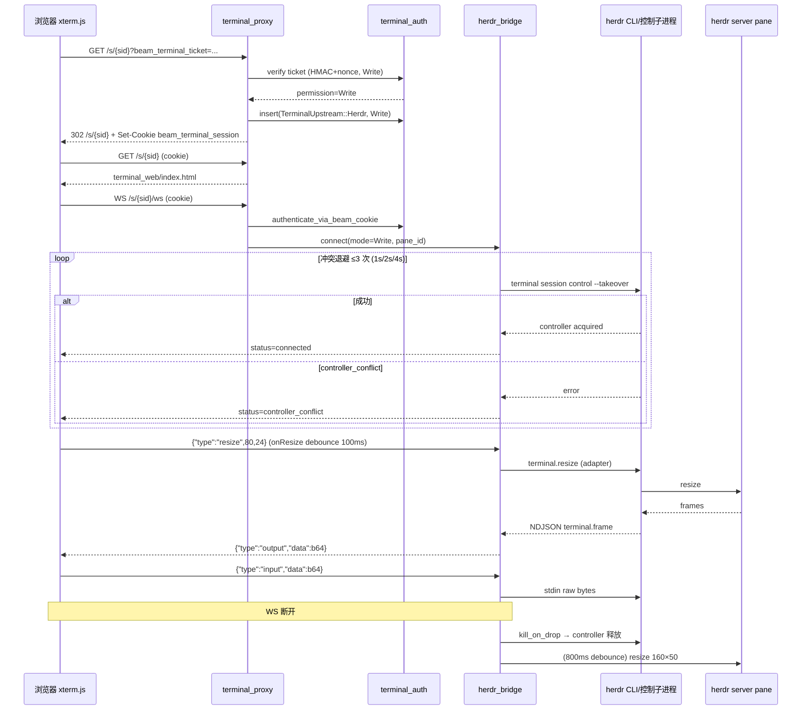

# Beam 支持 Herdr 的 Web 终端访问能力（v2 设计）

English: [herdr-web-access.en.md](herdr-web-access.en.md)

- 日期：2026-08-29
- 作者：待定
- 状态：Draft
- 修订记录：v1（2026-08-29 初稿）→ v2（2026-08-29，响应第一轮 review：补齐 `apply_ready_identity`/`handle_terminal_link`/assets 路由三处实现缺口、watchdog 独立 PR、可写契约前移门禁 W3a）→ v3（2026-08-29，响应第二轮 re-review：W3a 探测机制改为 CLI 子命令面且限定 `herdr_web=true` 作用域、按钮条件与 W5a 判据精确化、HERDR_SOCKET_PATH 入契约表验证、文档修订记录）→ v4（2026-08-29，响应第三轮 re-review：`--help` 探测假设入契约表 h 行并加版本 gate/容错匹配、`probe_herdr_web_cli` 定为独立模块 `herdr_probe_web.rs` 且首次 WS 懒执行带缓存、W5a 判据抽纯函数并显式保留 status 子句、WS status 枚举新增 `unsupported` 覆盖契约降级与探测失败呈现）→ v5（2026-08-29，响应第四轮 re-review：探测改为 per-capability 结果 `WebCapability{observe,control}` 分开门控、「control 缺失只读先行」降级真正成立、失败值 TTL 重探为默认）。
- 关联：对应 [herdr-backend.md](herdr-backend.md)「Web 终端：分阶段，不挡 v1」的 v2 独立设计（herdr-backend.md 中的「v2（单独设计/PR）」行）；英文镜像已随本文件成对提交。
- 范围：为 `backend_kind = Herdr` 的 session 提供 Beam 自有的浏览器终端页（xterm.js），复用现有 ticket/cookie 认证，上游从 zellij web 换成 Beam 自己的 herdr bridge。Zellij session 的 web 终端保持现状不动。

## Overview

`docs/design/herdr-backend.md` 把 Herdr 做成了一等 `SessionBackend`（v1，PR1–5 已落地），但明确把「web 终端」推迟到 v2：Herdr 没有 zellij-web 那样的浏览器 UI，v1 的 Herdr 卡片只显示 `herdr agent attach` 帮助文案、`Session.terminal_url` 保持 `None`。本设计补齐这一块：**Beam 自建一个 xterm.js 终端页，由 daemon 的 terminal proxy 在同一个端口（`web.proxy_base_port`，默认 8800）下服务**，页面与 WebSocket 同源同 cookie 域；只读 viewer 走 `herdr terminal session observe`，可写 viewer 走 `herdr terminal session control --takeover`；resize 走 `terminal.resize` JSON。**括号里描述的 herdr 行为（多观察者、不占 input/resize、单 controller 排他等）依赖 herdr 0.8.2 具体实现，全部待 PR W3a live 验证（见「承重契约」表 a–h），验证前不当作既定事实。**

认证授权完全复用现有模型：`beam_terminal_ticket`（HMAC + nonce + 写 ticket 5 分钟 TTL）换 `beam_terminal_session` cookie（HttpOnly / SameSite=Strict / Path=/s/），proxy 保留服务端 cookie jar。变化点是把 cookie jar 的「上游身份」从「zellij cookie」泛化为 `TerminalUpstream::{Zellij{cookie}, Herdr}`，Herdr 路径跳过 zellij `/command/login`，直接按 permission 绑定 observe / takeover 模式。

## Background & Motivation

### 现状（已核实，以代码为准）

- `crates/beam-daemon/src/terminal_proxy/`（`mod.rs` / `auth.rs` / `http_forward.rs` / `ws_relay.rs` / `anchor.rs` / `tests.rs`）：对外 axum proxy。路由 `/s/{session_id}`（ticket/cookie 登录 + 代理）、`/s/{session_id}/ws`、`/s/{session_id}/ws/{*rest}`、`/s/{session_id}/{*path}`。`resolve_zellij_session`（`mod.rs`）对 `backend_kind == Herdr` 的 session 直接返回 `None` → 404，禁止映射成 `beam-{sid8}` zellij 名。
- `crates/beam-daemon/src/terminal_auth.rs`：ticket payload `session_id:permission:created_at:nonce`；写 ticket TTL 300s、只读不按创建时间过期、nonce 一次性（used-ticket 记住 600s）；ticket secret 持久化在 `$BEAM_HOME/state/ticket-secret`；`beam_terminal_session` cookie TTL 86400s；`TerminalAuthState` 是进程内 `HashMap<beam_cookie, (zellij_cookie, session_id, permission, created_at)>`，daemon 重启即失效、需重新走 ticket。
- `crates/beam-daemon/src/terminal_proxy/auth.rs`：`try_ticket_login` 验证 ticket → 按 permission 选 zellij token → `POST /command/login` 抓 `Set-Cookie` → 存 jar → 发 beam cookie → 302 到干净 URL。只读登录会额外建 anchor（`anchor.rs`：隐藏普通 web client，先连 terminal WS 等首帧再连 control WS，发 `TerminalResize` 160×50 解决黑屏；viewer counter 归零后 800ms debounce 恢复 160×50）。
- `crates/beam-daemon/src/zellij_web.rs`：`start_zellij_web_if_enabled(enabled, port, tokens_path)`——`web.zellij_web=false` 时返回 `ZellijWebTokens::disabled(port)`，proxy 照常启动但没有上游。watchdog 每 30s 检查一次。
- `crates/beam-daemon/src/lib.rs`（~L173、~L836–855）：`probe_herdr_at_startup` 在 daemon 启动时若配置了 herdr 则强制探测；`start_zellij_web_if_enabled` + `terminal_proxy::start_proxy` 接线。daemon 本地 API 绑 `127.0.0.1:7893`；dashboard 用 `ServeDir::new("src/dashboard/web")` 提供静态资源。注意：该 dashboard 目录**未被 git 跟踪**（`git ls-files crates/beam-daemon/src/dashboard/` 为空），依赖运行时 CWD 下存在目录，是打包时不可复制的模式（见「xterm.js 来源」）。
- `crates/beam-worker/src/backend/herdr/observe.rs`：`run_herdr_observe` 跑 `herdr terminal session observe <pane> --cols N --rows M`，NDJSON 行解析支持 `frame.data` / `data` / `bytes` 三种字段（真实 0.8.x 帧是 `{"type":"terminal.frame","bytes":"<b64>","full":true,"height":24,"width":80,"seq":1}`），`terminal.closed` 退出；子进程带 `kill_on_drop`、剥 `HERDR_PANE_ID`/`HERDR_TAB_ID`/`HERDR_WORKSPACE_ID`。
- `crates/beam-worker/src/backend/herdr/mod.rs`：`HerdrBackend`（managed，label `beam-{sid8}` 去重 + `pane run` 启动 spec）、`HerdrObserveBackend`（adopt，只 observe + 驱动，永不 `pane run`）。`kill()` 只停 observe，`destroy_session()` 对 managed force-close workspace。
- `crates/beam-core/src/config.rs`：`WebConfig { host("0.0.0.0"), proxy_base_port(8800), zellij_web(true) }`；`HerdrConfig { min_version("0.8.2"), session("default"), socket_path(None) }`。
- `crates/beam-core/src/session.rs` / `ipc.rs`：`Session` 已有 `terminal_url`、`backend_kind`、`herdr_workspace_id`、`herdr_pane_id`（Ready 持久化）；`InitConfig` 同样往返。
- `crates/beam-daemon/src/backend.rs`（~L28–44）：`apply_ready_identity` 函数体内部硬编码 `if backend_kind == BackendKind::Zellij { session.terminal_url = terminal_url; }`——**写 URL 的真正门禁在函数内部**，只改调用方传参无效（见 Issue 1，PR W5 必须改这里）。
- `crates/beam-daemon/src/worker_lifecycle.rs`（~L120–235、~L750–800）：Ready 处理调用 `apply_ready_identity`，Zellij 才传 `Some(terminal_base_url(...))`。worker ready watchdog 的判据是 `session.terminal_url.is_some()`——对 Herdr session 恒为 false，watchdog 会对健康的 Herdr session 误报「启动超时」（v1 已知小坑）。**该误报与 herdr web 无关，必须在 `herdr_web` 翻 true 之前独立修复（PR W5a，见 PR Plan）**，不能宣称 v2 顺带修复。W5a 判据写为「`terminal_url.is_some() || (backend_kind == Herdr && herdr_workspace_id.is_some() && herdr_pane_id.is_some())`」，不引入 `session_card_ready` 的卡片投递语义。
- `crates/beam-daemon/src/lark_replies.rs`：`session_card_ready` 已与 `terminal_url` 解耦（Herdr 用 workspace/pane id）。
- `crates/beam-daemon/src/session_cards/streaming.rs`（~L74、~L181–216）：`build_streaming_card` 对 `backend_kind == Herdr` 不发「选择只读终端入口 / 私发可写链接」按钮，改发 `herdr agent attach` 帮助文案。
- `crates/beam-daemon/src/ip_resolver.rs`：`rewrite_session_terminal_urls` 在外部 host 变化时重写 `terminal_url`——Herdr URL 同样适用（重写只碰 scheme/host/port）。
- `crates/beam-daemon/src/lark_ingress/workflow_actions.rs`（~L112）：`build_terminal_url_with_ticket` + `terminal_base_url` 构造 `/s/{session_id}?beam_terminal_ticket=...` 的既有模式。
- `crates/beam-daemon/src/lark_ingress/session_card_actions.rs`（~L220）：`handle_terminal_link` 在签发终端链接前**强制检查 zellij token**——只读用 `load_zellij_web_tokens_for_card()`（`session_cards/terminal_links.rs:236`）、可写用 `zellij_web::load_zellij_web_tokens(...)`，拿不到就 toast「terminal not ready」。ticket 签发本身（`session_cards/terminal_links.rs:245` `build_terminal_url_with_ticket` → `generate_terminal_ticket`）与 backend 无关。**herdr-only 部署（`zellij_web=false`）下这个门禁会让恢复的按钮全部失效**，且 adopt 只读若只在验证侧拒绝、签发侧仍铸写 ticket，会出现「按钮可点但必然失败」的过渡态（见 Issue 2，PR W5 必须改这里）。

### 为什么 v2 必须由 Beam 自己提供页面

Herdr 官方只提供 CLI + Unix socket API，**没有** HTTP 终端页；远程访问是 SSH / `herdr --remote`，不是 HTTP。第三方在 socket 外包 HTTP（例如 herdr-controller）是社区做法，`herdr-backend.md` 已明确 Beam 不把它当依赖。所以「浏览器 → Beam daemon → herdr socket/CLI」这段桥必须自己写，这也是本设计的主体。

### 痛点

1. v1 Herdr 用户只能在飞书里看截图卡，无法在浏览器看实时终端（只能 `herdr attach`）。
2. `terminal_proxy` 是 zellij 特化的（路径重写、cookie 注入、anchor），对 Herdr 只能 404。
3. `terminal_url` 同时承担「web 终端可用」和「卡片可投递」两个语义，v1 解耦后卡片能投但浏览器入口缺失。
4. daemon 若 `web.zellij_web=false`（herdr-only 部署）时 proxy 没有上游，Herdr web 落地前这个组合没有终端能力。

## Goals & Non-Goals

### Goals

1. Herdr session 在浏览器里能打开 Beam 自有的 xterm.js 终端页，地址就是现有 `terminal_base_url` 形态：`http://{host}:{proxy_base_port}/s/{session_id}`。
2. 只读 viewer 走 `terminal session observe`：多观察者天然支持、不占 input/resize，不需要 zellij 那种隐藏 anchor（这些语义依赖 herdr 0.8.2 行为，待 PR W3a 契约验证；不成立时按契约表降级）。
3. 可写 viewer 走 `terminal session control --takeover`：单 controller 排他（待 PR W3a 验证，见契约表 a），冲突时明确报错 + 有限退避重试；controller 由 daemon 持有，WS 断开即释放（释放语义待契约表 d 验证）。
4. resize 只允许 controller 发起，走 `terminal.resize` JSON；controller 全部离开后 debounce 恢复 160×50（对齐现有 `DEFAULT_TERMINAL_COLS/ROWS` 与 anchor 的 800ms 语义）。
5. 完全复用 ticket/cookie 认证模型，把 cookie jar 的上游身份泛化，Zellij 路径零行为变化。
6. v2 落地后 Herdr session 重新写 `terminal_url`，卡片恢复只读/可写按钮；`session_card_ready` 语义不变。
7. adopt session 默认只读（web 可写会抢用户 TUI 的 input），managed session 提供只读 + 私发可写。
8. 与「daemon 无 zellij 也能启动」正交：`web.zellij_web=false` 开关已存在，herdr web 落地后用一条 live 测试锁住「无 zellij 二进制 + herdr web 可用」组合。

### Non-Goals

- 不为 Herdr 实现完整 TUI、远程 SSH 客户端或 `herdr --remote` 中转。
- 不把 herdr socket 直接暴露给浏览器（JSON-RPC 透传）——权限模型必须在 daemon 侧落地。
- 不依赖任何第三方 herdr HTTP 桥（如 herdr-controller）。
- 不改 Zellij session 的现有 web 终端路径（proxy、anchor、cookie 注入保持原样）。
- 不改 worker 的输入路径：web 写 viewer 与 worker 的 `pane send-*` 并存，但 web 不替代 adapter 确认环。
- 不引入 TypeScript / npm / 前端构建链（仓库约束）。
- 不做「一个会话一个观察流、daemon 内 fan-out 给多 viewer」的复杂优化（per-viewer 子进程足够便宜）。

## Proposed Design

### 总体架构

```mermaid
flowchart LR
  subgraph browser [浏览器]
    X[xterm.js 页<br/>/s/{sid}]
    W[WS /s/{sid}/ws]
  end
  subgraph daemon [beam-daemon]
    TP[terminal_proxy<br/>web.proxy_base_port:8800]
    TICKET[ticket/cookie 认证<br/>terminal_auth.rs]
    BR[herdr_bridge.rs<br/>observe / control 子进程管理]
    STAT[xterm.js 静态资源<br/>terminal_web/]
    ZP[zellij 路径<br/>http_forward + anchor 不变]
    SESS[Session 表<br/>backend_kind + herdr ids]
  end
  subgraph herdr [本机 herdr server]
    OB[observe 流<br/>terminal session observe]
    CT[controller<br/>terminal session control --takeover]
    PN[pane w1:p1<br/>AI CLI]
  end
  X -->|GET /s/{sid}| TP
  W -->|WS 升级 + cookie| TP
  TP --> TICKET
  TICKET --> SESS
  TP --> STAT
  TP --> ZP
  TP --> BR
  BR -->|只读: 每 viewer 一个 observe 子进程| OB
  BR -->|可写: 唯一 control 子进程| CT
  OB --> PN
  CT --> PN
```

关键点：

- 页面与 WS 同源同端口，cookie `Path=/s/`、`SameSite=Strict`，天然同源；浏览器只和 daemon 说话，永远不接触 herdr socket / token。
- 按 `Session.backend_kind` 分发：Zellij → 现有 http_forward/anchor；Herdr → 新 bridge + 静态页。
- 桥接子进程全部剥 `HERDR_PANE_ID` / `HERDR_TAB_ID` / `HERDR_WORKSPACE_ID`（沿用 `cli.rs` 的 `clean_env` 卫生约定），目标 server 走默认 session（`HerdrConfig.session`，默认 `default`）。
- **socket 覆盖传播**：`HerdrConfig.socket_path` 为 `Some` 时，bridge 子进程通过 `HERDR_SOCKET_PATH` 环境变量指向该 socket；`None` 时走 herdr 默认发现（`~/.config/herdr/herdr.sock` 或 `$XDG_CONFIG_HOME`）。**「`HERDR_SOCKET_PATH` 是否被 herdr CLI 识别」是未验证的外部约定，已列入契约表 g 由 PR W3a live 验证，验证前不当作既定事实**；若该 env 不被识别，改为 CLI 显式 `--socket` 参数或仅支持默认 socket（见契约表 g 失败备选）。worker 侧 `cli.rs` 目前未读 `socket_path`，本设计把 daemon 桥接侧先做对，worker 侧对齐作为附带小项（见 Open Questions）。

### 浏览器 UI：Beam 自有的 xterm.js 页

#### xterm.js 来源：vendor 进 daemon，不用 CDN

选择 **vendor 固定版本**，理由：

| 方案 | 结论 |
| --- | --- |
| CDN（jsdelivr 等） | 拒绝：daemon 应离线可用（内网/无外网机器是 Beam 的现实部署面）；版本漂移无法审计；CSP 需要放行外部源 |
| vendor 进仓库 | 采纳：固定版本、可离线、可审计；无构建链 |

落地：

- 资产目录 `crates/beam-daemon/src/terminal_web/`：`index.html`、`app.js`（页面逻辑，无 TypeScript）、`assets/vendor/xterm@5.3.0/{xterm.min.js,xterm.css}`（实现时钉当前稳定版，MIT 许可）。
- **用 `include_dir!` 把资产编译进 daemon 二进制**，路由从内存直接返回字节（`Content-Type` 按扩展名）。**不**复制 dashboard 的 `ServeDir::new("src/dashboard/web")` 模式：该目录未被 git 跟踪、依赖运行时 CWD 存在，与「单 binary release asset」的发布方式不兼容（AGENTS：beam-cli 二进制是 release 上传产物）。`include_dir!` 是成熟 crates.io 库、Rust 原生、无前端构建链，符合仓库「优先用成熟库」的约束。
- 页面设置 `Content-Security-Policy: default-src 'self'; connect-src 'self' ws://{host}; style-src 'self' 'unsafe-inline'`，不用内联脚本。
- 体积：xterm.js minified ~350KB（gzip ~120KB），编译进二进制可接受。

#### 路由与分发（`terminal_proxy/mod.rs` 扩展）

新增/改写的路由（按 axum 特异性优先）：

| 路由 | Herdr session | Zellij session（不变） |
| --- | --- | --- |
| `GET /s/{session_id}` 与 `/s/{session_id}/` | 服务 `terminal_web/index.html`（ticket/cookie 登录照旧，登录后同 URL 直接给页面） | 现有代理 `/{zellij_session}` |
| `GET /s/{session_id}/assets/{*path}` | **仅 Herdr 分支**：从二进制返回 beam 静态资源（无敏感信息，不要求 cookie） | **继续走现有 zellij assets 代理**：`http_forward.rs::rewrite_asset_paths`（~L95）会把 zellij HTML 里的 `"/assets/` 重写为 `/s/{sid}/assets/`，且 `is_zellij_root_path("assets/...")` 为 true（`terminal_auth.rs:465`），当前 `handle_session_path` 把这些请求代理到 zellij web root（style.css/auth.js 等）。**绝不能对所有 session 挂同一个静态 `ServeDir`，否则会遮蔽并破坏 zellij 页面资源** |
| `GET /s/{session_id}/ws` | herdr bridge WS（见下） | 现有 session WS |
| `GET /s/{session_id}/ws/{*rest}` | 404 | 现有 root WS |
| `/s/{session_id}/{*path}` | 404（除 assets） | 现有路径代理 |

实现要点：

- `resolve_zellij_session`（现对 Herdr 返回 `None` → 404）改成 `resolve_terminal_target`：返回 enum `TerminalTarget::Zellij{...}` / `TerminalTarget::Herdr{workspace_id, pane_id}`，由 handler 分发。
- `ProxyState` 增加 `herdr_bridge: HerdrBridge`（`Arc`）与 `herdr_web_enabled: bool`；`WebConfig.herdr_web=false` 时 Herdr session 继续 404，等于回到 v1。
- **PR W2 必须加回归测试**：Zellij session 的 `GET /s/{sid}/assets/style.css` 仍代理到 zellij root（200 且来自上游），Herdr session 的 `/s/{sid}/assets/xterm.min.js` 返回 beam 资产；两条路径不能互相污染。

### 桥接：observe（只读）与 control --takeover（可写）

新模块 `crates/beam-daemon/src/terminal_proxy/herdr_bridge.rs`（约 500–700 行，超限拆 `resize.rs` / `observe.rs` / `control.rs`）。

#### WS 消息契约（JSON 帧，`b64` 保证二进制安全）

```
daemon → browser:
  {"type":"output","data":"<b64 ansi>","full":bool}          # 转发 observe/control 帧
  {"type":"resize","cols":N,"rows":M}                        # pane 实际尺寸变化
  {"type":"status","state":"connecting|connected|reconnecting|controller_conflict|unsupported|closed","detail":"..."}

browser → daemon:
  {"type":"input","data":"<b64 raw bytes>"}                  # 仅 write viewer
  {"type":"resize","cols":N,"rows":M}                        # 仅 write viewer，onResize debounce 100ms
```

`status.state` 语义：`unsupported`（别名 `write_unavailable`）表示「该部署/该 pane 不支持请求的能力」——如 `probe_herdr_web_cli` 探测失败（CLI 缺 `terminal session` 子命令或版本过旧）、契约 a 降级（`control --takeover` 不存在）、或写 viewer 试图在只读部署上 takeover。**`detail` 按能力区分**：`control` 缺失 →「该部署不支持可写终端，可用只读」（页面提供「回退只读」按钮，用只读 ticket 或降级为 observe 流）；`observe` 缺失 →「终端流不可用」（只读也不可用，页面停止重连并提示联系管理员）。`unsupported` 不做自动重连。该状态同时覆盖 `probe_herdr_web_cli` 探测失败的呈现（见「可写路径」与错误表）。

#### 只读路径（每 viewer 一个 observe 子进程）

论证「不需要 zellij 式 anchor」：

- zellij 的黑屏源于其 watcher client 在无普通 client 时首帧不渲染，必须隐藏普通 client + `TerminalResize` 强制出帧。
- herdr `terminal session observe` 是为第三方桥设计的长连接，**多观察者、不占 input/resize**，每个 viewer 自己一个 observe 子进程即可拿到完整帧流，不存在「无 client 不渲染」的问题。
- observe 子进程 `--cols N --rows M`：**v2 初始语义固定 160×50**（`DEFAULT_TERMINAL_COLS/ROWS`），首帧全量帧自带 `height`/`width`，浏览器首帧后校正终端尺寸；controller resize 后 bridge 用新尺寸重启该 session 的 observe 子进程并广播 `{"type":"resize"}`。当前仓库没有任何命令返回 pane 尺寸（`pane read` / `process-info` / `workspace get` 均不保证），所以不假设「当前尺寸」可得；「新增尺寸查询命令」记为后续增强（Open Questions）。
- 无输入、无 resize 权限：只读 viewer 的 WS 只收 `output`/`resize`/`status`，`input`/`resize` 帧被 daemon 丢弃并 debug 日志。

子进程监督：bridge 对每个 observe 子进程做「意外退出 → 退避重连（1s/2s/4s/8s，封顶 30s）」；`terminal.closed` 或 `workspace get` 确认 pane 没了 → 状态 `closed`，浏览器停止重连并显示「终端已关闭」。

#### 可写路径（唯一 controller）

- WS 认证为 `Write` 时，bridge 尝试 `herdr terminal session control --takeover <pane>`。
- **抢不到**（已有 controller，CLI 退出非零 / socket 报错）：返回 `status=controller_conflict`，浏览器显示提示；bridge 在**同一连接内**做 3 次退避重试（1s/2s/4s），仍失败则断开，用户可点「重试」。不做排队——controller 语义是交互式独占，排队只会积压陈旧输入。
- **controller 归属**：daemon 进程（bridge task）。理由：daemon 是唯一跨 worker 存活的长进程，worker 退出/重启不应释放 controller；WS 断开或 daemon 退出时子进程 `kill_on_drop` 杀掉，herdr 释放 controller。
- 输入：浏览器 `input` 帧 → bridge 写 control 子进程 stdin（原始字节）。
- 帧输出：control 子进程 stdout 的 NDJSON → 同 observe 契约解析 → `output` 帧。
- 只读 viewer 与 controller 并存：只读 viewer 继续走各自 observe；controller 的 resize 会让 pane 尺寸变化，bridge 检测到后**重启该 session 的所有 observe 子进程**（新尺寸）并把 `{"type":"resize"}` 广播给所有 viewer。
- **降级呈现（契约 a 失败 / `probe_herdr_web_cli` 的 `control` 能力失败）**：写 viewer 的 WS 已按 Write 认证后才可能发现能力缺失，此时不能简单断开（`closed` 会被页面当作「终端已关闭」）。bridge 向该连接发送 `{"type":"status","state":"unsupported","detail":"该部署不支持可写终端，可用只读"}`，**保持连接不自动重连**；页面显示 `detail` 文案并提供「回退只读」按钮——用只读 ticket 重新登录（或由 bridge 在同一连接上降级为 observe 流并广播 `status=connected` + mode 变更）。**该降级只作用于写 viewer：只读 viewer 走 `observe` 能力门禁，`control` 缺失不影响它们连接**（与契约 a「只读先行」一致）。`probe_herdr_web_cli` 的 `observe` 能力失败时，所有 herdr web 连接（含只读）返回 `status=unsupported`（detail 区分）。

**可写路径承重契约（全部「待 live 验证」，门禁在 PR W3a）**。以下行为当前分支**无法验证**（fake shim 只实现 `terminal session observe`；`herdr_probe.rs` 的 `REQUIRED_HERDR_METHODS` 是对 `herdr api schema --json` 的 **socket JSON-RPC 方法**做差集检查，0.8.2 schema fixture 只有 10 个方法、**不含** `terminal.session.*`——`terminal session` 是 **CLI 子命令面**，不在 socket schema 里，这是预期而非缺失），设计不把它们当既定事实：

| # | 契约 | 依赖它的设计点 | 失败备选 |
| --- | --- | --- | --- |
| a | `terminal session control --takeover` 的 CLI 存在性与单 controller 排他语义 | 可写路径整体 | 无 CLI 则写路径降级为「暂不支持」，只读先行 |
| b | 输入走 control 子进程 stdin 原始字节、输出走 stdout NDJSON | 输入/帧转发 | 输入改走 socket `pane.send_input`（worker `cli.rs` 注释已提到此路）；帧解析复用 observe 解析 |
| c | 冲突时退出码/报错形态（设计靠它区分 `controller_conflict`） | 冲突退避逻辑 | 以 stderr 文本匹配兜底，如 "already controlled" / "controller" |
| d | WS 断开（`kill_on_drop`）后 herdr 立即释放 controller | controller 生命周期 | 若释放延迟，桥接在重连窗口内自持退避；同时见错误表 SIGKILL 行 |
| e | `terminal.resize` 的传输（control 通道 stdin JSON vs 单独 CLI/socket 调用） | resize | `HerdrControlTransport` adapter 双实现，live 钉真实形态；都不通则 resize 降级为「写 viewer 每次 resize 用 CLI 重启 observe」 |
| f | observe 首帧全量（重连 resync 的前提） | 只读重连 | worker `observe.rs` 注释强调「不保证每帧全屏」，若首帧非全量则重连后先发 `{"type":"resize"}` 触发或靠 `pane read --source visible --format ansi` 补一帧 |
| g | `HERDR_SOCKET_PATH` env 是否被 herdr CLI 识别（socket 覆盖约定） | `HerdrConfig.socket_path` 的传播 | 不被识别则改用 CLI 显式 `--socket` 参数（若存在），或 v2 仅支持默认 socket、`socket_path` 保持未生效并在文档标注 |
| h | `herdr terminal session --help` 的存在性与输出形状（探测方式自身的假设） | `probe_herdr_web_cli` 的判据（per-capability） | 匹配必须容错且**按能力分开**：大小写不敏感子串 `observe` 判 `observe` 能力、`control` 判 `control` 能力，互不影响；不依赖 help 文本的精确措辞或本地化；`--help` 不存在（退出码非 0）时回退「直接跑 `terminal session` 子命令看退出码」；单项仍不确定则按该能力「可用」放行并 WARN——假阴性（探测失败但 CLI 实际可用）比假阳性更伤，且单项失败不得拖累另一项（`control` 缺失时只读必须可用） |

**门禁落地（PR W3a，在 W3/W4 之前）**：

1. 新增 ignored live 测试 `live_herdr_web_contract`（直接调真实 herdr CLI）逐条验证上表 a–h，每个断言失败对应一个明确降级路径。
2. **探测的是 CLI 子命令面，不是 socket schema。** `terminal session` 是 CLI 子命令（worker v1 一直以 CLI 方式调用、从未靠 socket schema 探测）。新增探测 **独立模块 `crates/beam-daemon/src/herdr_probe_web.rs`**（与 `herdr_probe.rs` 并列、职责单一；W3a 在 W3 之前，**不得依赖尚不存在的 `herdr_bridge.rs`**），函数 `probe_herdr_web_cli()` **返回 per-capability 结果** `WebCapability { observe: bool, control: bool }`：先跑 `herdr --version` 做 `min_version` gate（复用 `herdr_probe.rs` 的版本比较，防止探测到「本机任意 herdr」），再跑 `herdr terminal session --help`，按契约表 h 的容错规则**分别**判断 `observe` / `control` 两个子串。**只读 WS 门禁用 `observe`、写 WS 门禁用 `control`**——`control` 缺失时只读 viewer 照常连接（与「契约 a 失败 → 只读先行」一致），`observe` 缺失时全部 herdr web 连接才不可用。**执行时机：首次 Herdr WS 连接前懒执行；结果缓存：成功值永久缓存，失败值带 TTL（默认 5 分钟）后允许重探**——避免 `herdr_web=true` 时把「本机没有 herdr CLI」变成 daemon 启动失败，也让 CLI 修复/升级后无需重启 daemon 即自愈。**失败影响面：仅对应能力的那次连接返回 `status=unsupported`（见 WS 契约），不影响 daemon 与 Zellij**。**绝不**把 `terminal.session.*` 塞进 `REQUIRED_HERDR_METHODS`：那是对 socket schema 的差集检查，0.8.2 fixture 没有这些方法，加了会让 daemon 启动探测（`probe_herdr_at_startup`）与每次 Herdr worker spawn 探测（`worker_lifecycle.rs` ~L126 的 `probe_herdr(...)?`）全部硬失败——v1 不用 web 的 Herdr 部署也一起挂，且现有单测 `committed_schema_fixture_covers_required_methods`（`herdr_probe.rs:252`）会立刻失败；往 fixture 里「补」方法则是伪造真实 schema 快照。
3. fake shim 补齐 `terminal session control` 与 `terminal resize` 的最小实现。**daemon 侧 shim 归属**：复制一份到 `crates/beam-daemon/tests/support/fake_herdr.sh`（或抽共享目录），沿用 worker 侧的 PATH 注入模式（`herdr/mod.rs` ~L518 的 `fake_herdr_env`：把 shim 目录 symlink 成 PATH 里的 `herdr`），供 `herdr_bridge` 的 hermetic 测试使用；不跨 crate 依赖 worker 的测试目录。

#### 多写 viewer

同一 session 同时有两个 write cookie 浏览器打开 → 各自尝试 takeover，herdr 保证同一时刻只有一个 controller，后到者 `controller_conflict`。bridge 不做虚拟锁；冲突即提示。可接受的语义：可写链接是「私发」的，同时打开是罕见误操作。

### Resize 协议与时机

| 项 | 值 |
| --- | --- |
| 谁可以 resize | 只有 controller（写 viewer）；只读 viewer 的 resize 帧被丢弃 |
| 触发 | 浏览器 `xterm.onResize` → debounce 100ms → `{"type":"resize"}` → bridge → `terminal.resize` |
| 初始尺寸 | 默认 160×50（`DEFAULT_TERMINAL_COLS/ROWS`）；有最近 resize 记录则用之 |
| controller 全部离开 | 800ms debounce 后 `terminal.resize` 回 160×50（对齐 anchor 语义） |
| 只读 viewer 的显示尺寸 | 跟随帧自带 `height`/`width` 与 `{"type":"resize"}` 广播 |

### 认证与授权复用

保留链路：`?beam_terminal_ticket=`（HMAC-SHA256，payload `session_id:permission:created_at:nonce`）→ 验证（写 ticket TTL 300s、只读不过期、nonce 单次）→ 签发 `beam_terminal_session` cookie（HttpOnly / SameSite=Strict / Path=/s/ / Max-Age 86400）→ 后续请求只凭 cookie。

改动（`terminal_auth.rs` + `auth.rs`）：

1. cookie jar 的 value 从 `String`（zellij cookie）泛化为：

```rust
enum TerminalUpstream {
    Zellij { cookie: String },
    Herdr,
}
```

2. `try_ticket_login` 增加 Herdr 分支：**不调用** zellij `/command/login`（没有 HTTP 上游），直接 `auth_state.insert(TerminalUpstream::Herdr, session_id, permission)` → 发 cookie → 302。
3. `authenticate_via_beam_cookie` 返回 `(TerminalUpstream, permission)`；`ws_relay` / `http_forward` 对 `Herdr` 分支路由到 bridge。
4. **写 cookie TTL 收紧**（新配置 `WebConfig.write_cookie_ttl_secs`，默认 3600s）：cookie jar 存 `expires_at`，`Write` 权限的 entry 1 小时过期；只读保持 24h。理由：takeover 是排他且会打断人类 TUI 输入的操作，写凭证窗口应小于只读凭证。**`Max-Age=86400` 只保留在浏览器侧**：`auth.rs::build_beam_set_cookie` 硬编码 `Max-Age=86400` 发给浏览器，jar 侧 1h 到期后浏览器仍持有 cookie、只是每次被拒需重新走 ticket——这是**服务端 jar 侧强制执行**的语义，浏览器 cookie 形状不变（zellij 路径 `Set-Cookie` 零变化）。后续可选把 `build_beam_set_cookie` 按 permission 输出不同 `Max-Age`，不在本设计默认范围。
5. WS 升级增加 **Origin 校验**：`Origin` 必须与 `Host` 同源（或缺失 Origin 的 curl 等非浏览器客户端放行并告警），否则 403。缓解「恶意页面驱动同一浏览器里的终端 WS」（CSRF 面）。Zellij WS 路径建议同 PR 一并加（同一函数，低风险）。

### `terminal_url` 语义变化与卡片

- **v2 契约**：Herdr session 的 Ready 现在也写 `terminal_url = terminal_base_url(external_host, proxy_base_port, session_id)`。**改动必须落在 `backend.rs::apply_ready_identity` 内部守卫**（当前 `if backend_kind == BackendKind::Zellij` 会把 Herdr 的 `Some(url)` 直接丢弃）：改为「Zellij 或（Herdr 且 `herdr_web=true`）时写」，或把守卫整体移除、由调用方决定传不传 `Some(url)`（推荐后者，函数变纯）。调用方 `worker_lifecycle.rs` Ready 处理同步放开传参条件。`session_card_ready` 保持现有实现（两路都成立，不需要改）。PR W5 必须带单测：`herdr_web=true` 的 Herdr session Ready 后 `terminal_url` 被写入。
- `build_streaming_card`（`session_cards/streaming.rs`）按钮条件从 `backend_kind == Zellij` 改为「`backend_kind == Zellij || (backend_kind == Herdr && terminal_url.is_some())`」，Herdr 恢复「选择只读终端入口 / 私发可写链接」两个按钮；`herdr_web=false` 或 adopt 时按下方规则降级。**不能只写 `terminal_url.is_some()`**：否则 Zellij 无 URL 的极端态（zellij web 起不来、Ready 前的会话）会掉进 else 分支显示 Herdr 专属的 `herdr agent attach` 文案，违背「Zellij 路径零行为变化」。单测：Zellij session 无 URL 时仍出按钮（至少不出 herdr 文案）；Herdr 有 URL 时出按钮。
- **adopt session**：只发只读入口，不签发写 ticket。**签发侧与验证侧都要做**：签发侧（`session_card_actions.rs::handle_terminal_link` 的「私发可写链接」动作、`workflow_actions.rs` 的 resume/waiting 写 ticket、`streaming.rs` 按钮）对 `adopted_from.is_some()` 不铸写 ticket/不发按钮；验证侧（`auth.rs`）拒绝 Write 是**兜底**，不是主控——避免「按钮可点但必然失败」的过渡态。
- **卡片链接的 zellij token 门禁必须放开（Issue 2）**：`session_card_actions.rs::handle_terminal_link`（~L220）在签发前强制检查 zellij token（只读 L239 / 可写 L251，拿不到 toast「terminal not ready」）。对 `backend_kind == Herdr && herdr_web == true` 的 session **跳过该检查**（herdr-only 部署 `zellij_web=false` 没有 zellij token，不跳过则恢复的按钮全部失效）；Zellij 路径检查保留。
- **watchdog 误报是独立问题，不在本 PR 修**：worker ready watchdog（`worker_lifecycle.rs` ~L761 判据 `terminal_url.is_some()`）对 Herdr 的误报与 herdr web 无关，且首版 `herdr_web` 默认 `false`，「写回 URL 顺带修复」在默认配置下不成立。独立小 PR W5a 提前修：判据改为 `terminal_url.is_some() || (backend_kind == Herdr && herdr_workspace_id.is_some() && herdr_pane_id.is_some())`。**不引入 `session_card_ready`**（它会混入 `lark_app_id != "local"` 与 `root_message_id` 非空等卡片投递语义，root_message_id 为空时会把已 Ready 的 Zellij 会话也判为「未就绪」）。
- `ip_resolver.rs` 的 host/port 重写对 Herdr URL 天然生效（只动 scheme/host/port），无需改动。

### 多 session 共享一个 herdr server + adopt 语义

拓扑与 v1 一致：共享 default session，每 beam session 一个 labeled workspace（`beam-{sid8}`）。web 路由按 `session_id` 查 `Session` 表拿 `(herdr_workspace_id, herdr_pane_id)`，天然按 session 隔离。

**adopt 默认只读（产品建议）**：

- adopt 的 workspace 归用户所有，用户往往开着 herdr TUI；web `--takeover` 会抢走 TUI 的 input/resize，这是破坏性操作。
- beam worker 驱动 adopt pane 已经走 `pane send-*`（不需要 controller），web 写路径没有增量价值。
- 落地（签发侧 + 验证侧，见上）：`Session.adopted_from.is_some()` 时写 ticket 不签发（卡片不发「私发可写链接」按钮、`handle_terminal_link` 拒绝），`terminal_url` 仍写（页面可打开，只读）。

### 与「daemon 无 zellij 也能启动」的关系

`web.zellij_web=false` 开关已随 PR5 落地（`lib.rs` `start_zellij_web_if_enabled`），与 herdr web **互相独立**：

- herdr web 不依赖 skip 开关：混合部署（zellij web + herdr backend）时 herdr 页面照常。
- `zellij_web=false` + `daemon.backend=herdr` 的纯 herdr 部署，在 herdr web 落地后才第一次拥有完整的浏览器终端能力。
- 建议不合并 PR：herdr web 单独 PR 上线；组合验证用一条 `live_herdr_web_no_zellij`（无 zellij 二进制、`zellij_web=false`、managed herdr session、浏览器收帧）锁死。

### 时序图（可写 viewer）



## API / Interface Changes

### 配置（`crates/beam-core/src/config.rs`，TOML snake_case）

```toml
[web]
# 现有
# proxy_base_port = 8800
# zellij_web = true
# v2 新增
herdr_web = true            # false = Herdr session 回到 v1（无页面/无按钮）
write_cookie_ttl_secs = 3600  # 写 cookie 有效期；只读仍 24h
```

### 新模块 / 类型

- `crates/beam-daemon/src/terminal_proxy/herdr_bridge.rs`（+ 超限拆 `observe.rs` / `control.rs` / `resize.rs`）：桥接、子进程监督、帧解析与转发、controller 生命周期。
- `crates/beam-daemon/src/terminal_web/`：静态资源（`index.html` / `app.js` / vendored xterm），经 `include_dir!` 编译进二进制。
- `crates/beam-daemon/src/terminal_auth.rs`：`TerminalUpstream` enum；`TerminalAuthState::insert` 签名变化（兼容：zellij 分支行为不变）。
- `crates/beam-daemon/src/terminal_proxy/auth.rs`：`try_ticket_login` herdr 分支。
- `crates/beam-daemon/src/terminal_proxy/mod.rs`：`resolve_terminal_target`、新路由、`ProxyState` 增字段。
- `crates/beam-daemon/src/terminal_proxy/ws_relay.rs`：按 `TerminalUpstream` 分发到 bridge；Origin 校验。
- `crates/beam-daemon/src/backend.rs`：`apply_ready_identity` 守卫放开（或移除、由调用方决定，见「terminal_url 语义」）。
- `crates/beam-daemon/src/session_cards/streaming.rs`：按钮条件改为「`backend_kind == Zellij || (backend_kind == Herdr && terminal_url.is_some())`」；adopt 不发写按钮。
- `crates/beam-daemon/src/lark_ingress/session_card_actions.rs`：`handle_terminal_link` 对 Herdr+`herdr_web=true` 跳过 zellij token 门禁；adopt 写 ticket 签发侧拒绝。
- `crates/beam-daemon/src/lark_ingress/workflow_actions.rs`：resume/waiting 的写 ticket 对 adopt session 不签发。
- `crates/beam-daemon/src/worker_lifecycle.rs`：Herdr（`herdr_web=true`）Ready 传 `Some(terminal_url)`；watchdog 判据（PR W5a）。

**写 cookie 语义（明确）**：`Max-Age=86400` 只存在于浏览器侧 `Set-Cookie`（`build_beam_set_cookie` 不变，zellij 路径零变化）；1h 收紧是 **jar 侧服务端强制执行**（`expires_at`），浏览器持有旧 cookie 会被拒并需重新走 ticket。

### 不变的部分

- `BackendKind`、`Session` herdr 字段、`InitConfig`、`WorkerToDaemon::Ready`、`session_card_ready`、`terminal_proxy` 的 Zellij 全部路径、ticket 生成/验证/持久化、`zellij_web` 开关。

## Data Model Changes

- `Session` 不新增字段：复用 `terminal_url`（v2 写回）+ 已有 `backend_kind` / `herdr_workspace_id` / `herdr_pane_id` / `adopted_from`。
- `TerminalAuthState` 的 value 类型变更（进程内，无持久化，daemon 重启即重建，无迁移问题）。`TerminalUpstream` 为进程内 enum，不参与 serde。
- 无 `sessions.json` schema 变更。

## Alternatives Considered

### A. CDN 提供 xterm.js

离线不可用、CSP 需放行第三方、版本漂移不可审计、内网部署被墙。**拒绝**，vendor 固定版本。

### B. 依赖 herdr-controller 一类第三方 HTTP 桥

外部依赖的 socket 协议版本跟随其自身节奏；认证模型与 Beam ticket 不匹配（第三方桥自己签 token）；一旦上游不维护即断供。herdr-backend.md 已明确不依赖。**拒绝**。

### C. 把 herdr socket JSON-RPC 直接透传给浏览器（WS → socket 代理）

浏览器会拿到完整的 socket API 面（spawn/pane 控制/agent 状态），权限模型无法在 daemon 侧落地，takeover 逻辑被迫写进 JS，安全面失控。**拒绝**，daemon 只暴露窄接口（output/input/resize/status）。

### D. 每 session 一个 observe 子进程 + daemon 内 fan-out

省子进程，但把所有 viewer 的 liveness 耦合在一起：一个 viewer 断开要判断是否该停流；错误隔离差。herdr observe 天然多观察者，per-viewer 子进程便宜且隔离。**per-viewer 为默认**，fan-out 记为后续优化（viewer 数量大时）。

### E. 只读用 SSE、可写用 WS

增加一种传输面，xterm 数据模型本质是双向字节流，SSE 只读单向下没有收益。**拒绝**，统一 WS。

## Security & Privacy Considerations

| 风险 | severity | 缓解 |
| --- | --- | --- |
| 浏览器接触 herdr socket/token | 高 | 浏览器只连 daemon proxy；herdr 桥接子进程在 daemon 侧，token 不出进程；沿用 `clean_env` 剥 pane 作用域 env |
| 写 cookie 被滥用（takeover 打断人类 TUI） | 中 | 写 ticket 5 分钟 TTL + 写 cookie 默认 1h（新配置）；takeover 获得/释放全量日志；herdr 单 controller 排他兜底（排他语义本身待 PR W3a live 验证，见契约表 a/d） |
| CSRF / 跨站驱动终端 | 中 | `SameSite=Strict` cookie；WS 升级新增 Origin 同源校验（herdr + zellij 路径同 PR） |
| 只读 viewer 窃取终端里的密钥 | 中（与 zellij 同等级） | 只读 viewer 无输入无 resize；页面不渲染 `terminal_url` 之外的内容；已知模型：截图卡已向飞书暴露同样画面 |
| herdr socket ACL | 低 | socket 在 `~/.config/herdr/`，同用户权限；daemon 子进程与 daemon 同信任域，不向浏览器开放 |
| observe 子进程风暴（很多 viewer） | 低 | per-viewer 子进程有上限：**上限强制在 `herdr_bridge` 的 per-session viewer registry**（WS 认证通过后 `increment`、断开 `decrement`，与 zellij `viewer_counter` 同构）。单 session 并发 viewer 超过 16：新只读连接拒绝（WS 以 1013 Try Again Later 关闭，浏览器显示「viewer 已达上限」），并打 `component="terminal_proxy" operation="viewer_limit"` WARN。该机制在 PR W3 落地并带测试；数值 16 是否可配见 Open Q5 |
| 页面静态资源被当跳板 | 低 | 资产无敏感数据；CSP 限制脚本来源；不解析用户输入到 HTML（xterm 内容只进 canvas/文本节点） |

## Observability

- 日志（沿用 tracing `component="terminal_proxy"` 风格）：ticket 签发（session/permission）、WS 连接/断开（mode）、observe 子进程启停（原因：正常关闭/断流/超时）、takeover 获得/冲突/释放、resize 事件（节流：同 session 每 10s 最多一条）。
- 指标（计数器可挂 tracing 或简单原子）：活跃 viewer 数（per session）、observe 重连次数、takeover 冲突次数、`controller_conflict` 率、帧转发字节数。
- 状态面：`GET /health` 不扩；建议 dashboard 增加「web 终端在线 viewer」面板（复用 `/api/overview` 模式，可选）。

## Error Handling & Recovery

| 故障 | 行为 | 恢复 |
| --- | --- | --- |
| observe 断流（非 `terminal.closed`） | 退避重连 1s/2s/4s/8s 封顶 30s；浏览器显示 reconnecting | 重连成功即继续收帧（依赖首帧全量 resync，语义待 PR W3a 验证，见契约表 f；不成立则补 `pane read` 全屏帧） |
| herdr server 重启 | 全部 observe/control 子进程退出 | bridge 标记 session 终端 offline；浏览器保持退避重连；worker 侧 `ensure_server` / label 去重在下一轮 ensure_worker 恢复 workspace |
| pane/workspace 被销毁 | 子进程 `terminal.closed` / `workspace get` 确认 gone | 状态 `closed`，浏览器停止重连；若 worker 按 label 重建 workspace，viewer 重新打开时用新 `Session` 里的 id |
| control 失联（controller 子进程异常退出） | 释放 controller 标记；写 viewer 状态 `reconnecting` | 浏览器重连后重新 takeover |
| `probe_herdr_web_cli` 探测失败（CLI 缺 `terminal session` / 版本过旧） | **按能力分开**：`control=false` → 写 viewer 返回 `status=unsupported`（detail「可用只读」），只读 viewer 照常；`observe=false` → 所有 herdr web 连接（含只读）返回 `unsupported` | 页面按 detail 提示；**失败值带 TTL（默认 5 分钟）后自动重探，成功值永久缓存**——CLI 修复/升级后无需重启 daemon 即自愈；单测用 fake shim 先失败后成功验证重探 |
| daemon 重启 | 所有桥接子进程随 daemon 退出，herdr 释放 controller；cookie jar 清空 | 浏览器 cookie 失效 → 重新走 ticket 登录（既有模型） |
| daemon 崩溃 / 被 SIGKILL（`kill_on_drop` 不生效） | control/observe 子进程被孤儿化，controller 可能被继续持有 | 缓解依赖「control 子进程在 stdin 管道 EOF 时退出」——该语义纳入 PR W3a live 契约验证（表 d）；若 herdr 不因 EOF 退出，则 daemon 启动时做一次孤儿清理：扫描本用户下父进程已死的 `herdr terminal session control` 进程并 SIGTERM（匹配 beam 启动的进程） |
| takeover 冲突持续 | 3 次退避后断开，浏览器显示提示 | 用户点重试或等对方释放 |

## Rollout Plan

1. 按下方 PR 顺序合并，每个 PR 保持 Zellij 路径与 v1 Herdr 行为为绿。
2. `WebConfig.herdr_web` 缺省 `true`，但**首个版本先合并「默认 false」**（见 PR W1），等 live 测试通过、狗食后再翻 true——与 `herdr-backend.md` PR5 的 `zellij_web` 处理方式一致。
3. 回滚：`herdr_web=false` 即回到 v1（Herdr 不写 `terminal_url`、不发按钮、页面 404），与 zellij 无关，可单独摘除。
4. 组合验证：`zellij_web=false` + herdr web 的纯 herdr 部署（PR W6 live 测试）。
5. **watchdog 误报修复（PR W5a）独立于本设计发布**：判据改为「`terminal_url.is_some() || (backend_kind == Herdr && herdr_workspace_id.is_some() && herdr_pane_id.is_some())`」（不引入 `session_card_ready` 的卡片投递语义），与 `herdr_web` 无关，可在 v2 任何阶段提前合，不要等 `herdr_web` 翻 true。

## Open Questions

1. **adopt 是否允许 web 写（takeover）**：本设计建议只读（破坏性 + 无增量价值）；如产品要求 adopt 可写，则只在 adopt session 的 owner 私发写链接，且文案明确「将接管你的终端」。
2. **`terminal.resize` 的确切传输**（control 通道 stdin JSON vs 单独 CLI/socket 调用）：已前移为 PR W3a 门禁（契约表 e），`HerdrControlTransport` adapter 双实现、live 测试钉真实形态；不阻塞后续设计。
3. **xterm.js 版本**：实现时钉最新稳定版并复核许可证（MIT）；vendor 体积如超预期（>1MB gzip）再评估剥离 addon。
4. **写 cookie TTL 统一收紧**：本设计只对新 `write_cookie_ttl_secs`（默认 1h）生效，zellij 写 cookie 仍 24h；是否统一是独立产品决策。
5. **同 session 并发 viewer 上限**（16）：机制与强制位置已在安全表定义（PR W3 落地），此问只留数值是否合适/是否可配。
6. **v1 watchdog 误报**（`terminal_url.is_some()` 判据）：已由独立 PR W5a 处理（判据改「`terminal_url.is_some() || (Herdr && herdr_workspace_id.is_some() && herdr_pane_id.is_some())`」，不引入 `session_card_ready` 的卡片投递语义），不再绑定 `herdr_web`。W5a 同时确认无其他依赖「Herdr terminal_url 恒 None」的代码。
7. **worker 侧 `HerdrConfig.socket_path` 对齐**：本设计 bridge 侧已传播 `HERDR_SOCKET_PATH`；worker `cli.rs` 目前未读该配置，是否在本 v2 或独立小 PR 对齐待定。

## References

- 设计：`docs/design/herdr-backend.md`（v2 Web 终端节、Card-ready 节、能力探测与 setup、配置、Open Questions Q3/Q6）
- Proxy 现状：`crates/beam-daemon/src/terminal_proxy/{mod,auth,http_forward,ws_relay,anchor,tests}.rs`、`crates/beam-daemon/src/terminal_auth.rs`
- 认证：`crates/beam-daemon/src/lark_ingress/workflow_actions.rs`（`build_terminal_url_with_ticket`）、`crates/beam-daemon/src/ip_resolver.rs`
- Herdr 后端：`crates/beam-worker/src/backend/herdr/{mod,cli,observe,ids}.rs`、`crates/beam-daemon/src/{herdr_probe,herdr_lifecycle,herdr_adopt}.rs`
- 核心：`crates/beam-core/src/{backend_kind,config,session,ipc}.rs`、`crates/beam-daemon/src/{backend,worker_lifecycle,lark_replies,session_cards/streaming}.rs`
- 静态资源模式：`crates/beam-daemon/src/lib.rs` 的 `ServeDir::new("src/dashboard/web")`
- zellij web 现状：`crates/beam-daemon/src/zellij_web.rs`
- 文档（可能漂移，以代码为准）：`docs/design/terminal-proxy.md`

## Key Decisions

1. **Beam 自建 xterm.js 页并由 terminal proxy 同源服务**，vendor 固定版本、不用 CDN。页面必须与 WS 同 cookie 域（`Path=/s/`、SameSite=Strict），所以只能由 `proxy_base_port` 上的 proxy 服务，不能挪到 dashboard。
2. **只读 = 每 viewer 一个 `terminal session observe` 子进程，不需要 zellij 式 anchor。** herdr observe 是专为第三方桥设计的多观察者长连接，不存在 zellij watcher 的黑屏问题；per-viewer 隔离错误、天然 resync。**「多观察者」「不占 input/resize」「首帧全量」均为 herdr 0.8.2 行为，待 PR W3a 契约表 a/f 验证；不成立时按表内降级路径实现。**
3. **可写 = `control --takeover`，controller 由 daemon 持有、WS 断开即释放；冲突有限退避重试，不排队。** 排队对交互式独占 controller 无意义；daemon 是唯一跨 worker 的长进程。**「单 controller 排他」「WS 断开即释放」依赖 herdr 0.8.2 行为，待 PR W3a 契约表 a/d 验证；释放异常时见错误表 SIGKILL 行。**
4. **resize 只归 controller，走 `terminal.resize` JSON；controller 全部离开后 800ms debounce 恢复 160×50。** 对齐 anchor 语义；只读 viewer 的 resize 帧丢弃。
5. **认证完全复用 ticket/cookie；cookie jar 上游身份泛化为 `TerminalUpstream::{Zellij, Herdr}`，Herdr 跳过 zellij login。** 无新认证面，Zellij 零行为变化。
6. **v2 给 Herdr 写回 `terminal_url`（改 `apply_ready_identity` 内部守卫），卡片按钮恢复（条件为 `backend_kind == Zellij || (Herdr && terminal_url.is_some())`，Zellij 极端态不进 Herdr 文案分支）并放开 `handle_terminal_link` 的 zellij token 门禁，`session_card_ready` 不变。** `terminal_url` 语义回归「web 终端可用」单一含义。**watchdog 误报不绑定本设计**：独立 PR W5a 提前修，判据为「`terminal_url.is_some() || (Herdr && herdr_workspace_id.is_some() && herdr_pane_id.is_some())`」，不引入卡片投递语义；首版 `herdr_web=false` 下同样成立。
7. **adopt 默认只读。** 用户 workspace + 常开 TUI，web takeover 是破坏性操作且无增量价值（worker 已能 `pane send-*` 驱动）。
8. **与无 zellij 启动正交：`herdr_web` 独立开关，`zellij_web=false` 组合用 live 测试单独锁。** 不把两者绑进同一 PR。
9. **可写路径承重契约（`control --takeover` 排他/输入 stdin/冲突形态/释放语义/`terminal.resize` 传输/observe 首帧全量/`HERDR_SOCKET_PATH`/`--help` 输出形状，表 a–h）在 PR W3a 前移为门禁**：ignored live 探路测试 + **CLI 子命令面探测落在独立模块 `herdr_probe_web.rs`（`probe_herdr_web_cli` 返回 per-capability `WebCapability{observe,control}`：先 `herdr --version` 过 `min_version` gate，再 `terminal session --help` 按能力分别容错匹配；首次 Herdr WS 连接前懒执行，成功值永久缓存、失败值 TTL 5 分钟重探），不进全局 `probe_herdr`、不进 `REQUIRED_HERDR_METHODS`**（那是 socket schema 差集，0.8.2 fixture 无 `terminal.session.*`）。**只读门禁看 `observe`、写门禁看 `control`，`control` 缺失只降级写 viewer（只读先行真正成立）**；探测失败仅对应能力的那次连接返回 `status=unsupported`，不影响 daemon 与 Zellij。每条契约带失败备选。设计不把未验证的 herdr 行为当既定事实。

## PR Plan

每个 PR 可独立评审、独立合并；Zellij 路径与 v1 Herdr 行为始终为绿。首个版本 `herdr_web` 默认 `false`，live 测试与狗食通过后单独 PR 翻 `true`。

### PR W1 — 类型与配置：`TerminalUpstream`、`herdr_web`、写 cookie TTL

- **标题：** `feat(daemon): 泛化终端上游身份并新增 herdr web 配置`
- **文件 / 组件：** `crates/beam-core/src/config.rs`（`WebConfig.herdr_web`、`write_cookie_ttl_secs`）、`crates/beam-daemon/src/terminal_auth.rs`（`TerminalUpstream` enum、`insert`/`lookup` 签名、`expires_at`）、`crates/beam-daemon/src/terminal_proxy/{mod,auth,ws_relay,http_forward}.rs`（编译适配 + 穷尽 match）
- **依赖：** 无
- **说明：** 纯类型/配置层，行为不变（Zellij 仍存 zellij cookie；`herdr_web=false` 时 Herdr 仍 404）。单测覆盖：jar 双形态、写 cookie 到期拒绝、缺省配置反序列化。

### PR W2 — 静态页面 + 路由分发

- **标题：** `feat(daemon): 提供 Beam 自有终端页并按 backend 分发`
- **文件 / 组件：** `crates/beam-daemon/src/terminal_web/`（`index.html`、`app.js`、vendored `xterm@<pin>/`，`include_dir!` 嵌入）、`crates/beam-daemon/src/terminal_proxy/mod.rs`（`resolve_terminal_target`、`/s/{sid}/assets/{*path}` 路由**仅 Herdr 分支**、Herdr `/s/{sid}` serve 页面）、`tests.rs`
- **依赖：** PR W1
- **说明：** 页面骨架 + 静态资源，WS 未接时显示「连接中」。**注意：`try_ticket_login` 的 Herdr 分支（`auth.rs`）到 W3 才实现；W2 期间 Herdr ticket 登录仍走 zellij token 路径（无 token 返回 503、cookie 认证对 Herdr 仍 404），生产请求到不了该页面。W2 的验证以 axum 路由测试 + 注入认证状态（auth_state）为准，不要求端到端可点。** axum 路由测试：Herdr 页面 200、Herdr `/s/{sid}/assets/xterm.min.js` 200（来自二进制）；**回归测试：Zellij session 的 `/s/{sid}/assets/style.css` 仍代理到 zellij root（200 且来自上游），两条路径互不污染**。此 PR 不含真实桥接。

### PR W3a — 契约门禁：live 探路 + 能力探测扩展（在 W3/W4 之前）

- **标题：** `feat(daemon): 钉死 herdr terminal session CLI 契约并限定探测作用域`
- **文件 / 组件：** `tests/live_herdr_web_contract.rs`（ignored，直接调真实 herdr CLI，逐条验证契约表 a–h：`control --takeover` 存在性与排他、输入走 stdin 字节、输出走 stdout NDJSON、冲突退出码/报错形态、WS 断开/EOF 后 controller 释放、`terminal.resize` 传输、observe 首帧是否全量、`HERDR_SOCKET_PATH` 是否被识别、`terminal session --help` 分别含 observe/control 的输出形状）、**`crates/beam-daemon/src/herdr_probe_web.rs`（新独立模块，与 `herdr_probe.rs` 并列；`probe_herdr_web_cli() -> WebCapability{observe,control}`：先 `herdr --version` 过 `min_version` gate，再 `terminal session --help` 按能力分别容错匹配；首次 Herdr WS 连接前懒执行，成功值永久缓存、失败值 TTL 5 分钟重探；不进全局 `probe_herdr`、不进 `REQUIRED_HERDR_METHODS`）**、`crates/beam-daemon/tests/support/fake_herdr.sh`（**daemon 侧 shim**，复制自 worker 或抽共享目录，PATH 注入模式同 `herdr/mod.rs` `fake_herdr_env`；补 `terminal session control` / `terminal resize` / `--help` 最小实现）
- **依赖：** PR W2
- **说明：** 每条契约断言失败对应明确降级路径（表内备选，如输入改走 socket `pane.send_input`、resize 降级为 CLI 重启 observe）。**探测能力面是 CLI 子命令，不是 socket schema**：`REQUIRED_HERDR_METHODS` 是 `herdr api schema --json` 的差集检查，0.8.2 fixture 只有 10 个方法、无 `terminal.session.*`（CLI 面不在 schema 里），**绝不往该列表加 `terminal.session.*`**（会打爆 daemon 启动探测与每次 worker spawn，连 v1 不用 web 的 Herdr 部署也挂，且破坏 `committed_schema_fixture_covers_required_methods` 单测）。**`probe_herdr_web_cli` 按能力返回：`control=false` 只让写 viewer 拿 `status=unsupported`（只读先行成立），`observe=false` 才拦全部 herdr web 连接；失败影响面仅对应能力的那次连接，不影响 daemon 与 Zellij；懒执行带缓存（成功永久、失败 TTL 5 分钟重探），`herdr_web=true` 也不会把「本机无 herdr CLI」变成 daemon 启动失败，CLI 修复后无需重启自愈**。**本 PR 是 W3/W4 的前置门禁**，W4 不得在契约未验证前开工。

### PR W3 — 只读桥接（observe）

- **标题：** `feat(daemon): herdr 只读 web 终端（terminal session observe）`
- **文件 / 组件：** `crates/beam-daemon/src/terminal_proxy/herdr_bridge.rs`（只读路径 + **per-session viewer registry 上限 16**）、`observe.rs`（子进程监督 + 退避重连）、`auth.rs`（Herdr cookie 分支）、`ws_relay.rs`（分发 + Origin 校验）、`crates/beam-daemon/src/terminal_proxy/tests.rs`（**用 W3a 落地的 daemon 侧 fake shim** 做契约 + viewer 上限拒绝测试）、`tests/live_herdr_web_observe.rs`（ignored）
- **依赖：** PR W2、PR W3a
- **说明：** 只读 viewer：ticket → cookie → WS → observe 子进程 → 帧转发；帧解析复用 `parse_herdr_frame_line` 契约（worker 侧同款，抽到共享或复制并钉 fixture）。初始尺寸固定 160×50 + 帧 `height/width` 首帧校正。viewer 上限：超过 16 拒绝新只读连接（WS 1013 + `viewer_limit` WARN）。`herdr_web=false` 仍 404。Origin 校验对 zellij WS 一并启用。

### PR W4 — 可写桥接（control --takeover）+ resize

- **标题：** `feat(daemon): herdr 可写 web 终端（control --takeover 与 terminal.resize）`
- **文件 / 组件：** `herdr_bridge/control.rs`（controller 生命周期、冲突退避、输入转发、**`unsupported` 降级路径：契约 a 失败或 `probe_herdr_web_cli` 失败时发 `status=unsupported` + detail，保持连接供页面回退只读**）、`resize.rs`（`terminal.resize` adapter、只读 observe 重启、800ms 恢复 160×50）、`live_herdr_web_control.rs`（ignored，钉 resize 传输契约）
- **依赖：** PR W3、PR W3a
- **说明：** 写 viewer 唯一 controller；冲突 3 次退避（1s/2s/4s）；resize 只归 controller；多写 viewer 语义（后到冲突）。**能力缺失不静默断开**：写 viewer 收到 `status=unsupported` + detail（`control=false` 时 detail「可用只读」），页面显示并回退只读（只读 ticket 重新登录或同连接降级 observe）；**只读 viewer 走 `observe` 门禁，`control` 缺失不影响它们**。**验证侧兜底**：`auth.rs` 对 `adopted_from.is_some()` 的 `Write` 拒绝在此 PR 实现（签发侧主控在 W5）。

### PR W5 — `terminal_url` 语义 + 卡片按钮 + 回归

- **标题：** `feat(daemon): herdr session 写回 terminal_url 并恢复卡片终端按钮`
- **文件 / 组件：** `crates/beam-daemon/src/backend.rs`（**`apply_ready_identity` 守卫放开**：移除内部 `if backend_kind == Zellij` 过滤或改为「Zellij 或 Herdr+herdr_web」；推荐移除、由调用方传 `Option<String>`）、`crates/beam-daemon/src/worker_lifecycle.rs`（Ready 处理对 Herdr+`herdr_web=true` 传 `Some(terminal_url)`）、`crates/beam-daemon/src/session_cards/streaming.rs`（按钮条件改为「`backend_kind == Zellij || (backend_kind == Herdr && terminal_url.is_some())`」、adopt 无写按钮）、`crates/beam-daemon/src/lark_ingress/session_card_actions.rs`（**`handle_terminal_link` 对 Herdr+`herdr_web=true` 跳过 zellij token 门禁**；adopt 写 ticket 签发侧拒绝）、`crates/beam-daemon/src/session_cards/terminal_links.rs` 与 `crates/beam-daemon/src/lark_ingress/workflow_actions.rs`（resume/waiting 写 ticket 对 adopt 不签发）、`crates/beam-daemon/src/lark_replies.rs`（`session_card_ready` 确认不变）、单测
- **依赖：** PR W4
- **说明：** 卡片行为回归（Herdr 重新有只读/可写按钮，herdr-only 无 zellij token 也能签发）；adopt 的写 ticket 在**签发侧**不铸（验证侧拒绝是 W4 兜底，签发侧才是主控）。单测：`herdr_web=true` 的 Herdr session Ready 后 `terminal_url` 被写入；`handle_terminal_link` herdr-only 走通；adopt 无写按钮；**Zellij session 无 URL 时仍出按钮（至少不出 herdr attach 文案）**。`ip_resolver` 重写对 herdr URL 的测试。`herdr_web=false` 时按钮逻辑保持 v1（attach 文案）。**watchdog 误报不在此 PR**（见 W5a）。

### PR W5a — watchdog 判据修复（独立，可提前合）

- **标题：** `fix(daemon): worker ready watchdog 判据按 backend 区分`
- **文件 / 组件：** `crates/beam-daemon/src/worker_lifecycle.rs`（~L761 watchdog：**先抽取纯函数 `fn worker_ready_reported(session: &Session) -> bool`，判据为 `terminal_url.is_some() || (backend_kind == Herdr && herdr_workspace_id.is_some() && herdr_pane_id.is_some()) || session.status != SessionStatus::Active`——现有 `status != Active` 子句必须保留**；watchdog 闭包改为调用该纯函数）、单测（**直接对纯函数单测，不依赖 60s 睡眠**：Herdr 健康 Active 会话 true、Zellij 无 URL false、非 Active 恒 true）
- **依赖：** 无（可早于 W1 合）
- **说明：** 与 `herdr_web` 解耦：Zellij 语义不变（`terminal_url.is_some()`），Herdr 判据改为 workspace/pane id 存在。**不引入 `session_card_ready`**——它混入 `lark_app_id != "local"` 与 `root_message_id` 非空等卡片投递语义，`root_message_id` 为空时会把已 Ready 的 Zellij 会话也判为「未就绪」。**现有 `|| session.status != SessionStatus::Active` 子句必须保留**（非 Active 会话不该走「启动超时」通知），抽取纯函数时一并纳入。**不要等 v2 或 `herdr_web` 翻 true**；同时确认无其他依赖「Herdr terminal_url 恒 None」的代码。

### PR W6 — 纯 herdr 部署组合验证 + 可观测性 + 文档

- **标题：** `feat(daemon): 验证无 zellij 部署并完善 web 终端观测与文档`
- **文件 / 组件：** `tests/live_herdr_web_no_zellij.rs`（ignored：无 zellij 二进制 + `zellij_web=false` + herdr managed + 浏览器收帧/输入）、dashboard 观测面板（可选）、`docs/design/herdr-backend.md` 的 v2 Web 终端章节更新 + `.en.md` 镜像（本设计即 `docs/design/herdr-web-access.md`，落库时已随 `.en.md` 成对提交）
- **依赖：** PR W5
- **说明：** 锁死「herdr-only 可独立部署」；文档双语同步（含本设计文档自身成对）；之后单独 PR 把 `herdr_web` 默认翻 `true`（狗食后）。
