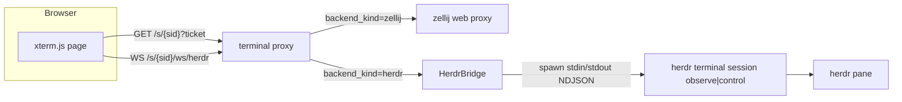

# Herdr Web Terminal (Webshell) Design

- Author: TBD
- Date: 2026-08-29
- Status: Implemented (PR-A1…PR-A5 landed; live test: `crates/beam-daemon/tests/live_herdr_terminal.rs`)
- Scope: On top of the Herdr first-class backend (managed / adopt / screenshot cards / `blocked` → attention, merged to `main` in commit `7b4861d`), fill in the browser web terminal so Herdr sessions get the same read-only / writable terminal entries as zellij, while staying compatible with the existing zellij web path.

## Overview

The Herdr backend can already run a CLI inside a Herdr pane, deliver screenshot cards, and map `blocked` to Feishu attention. The only remaining gap is the browser terminal: Herdr has no zellij-web-style HTTP frontend, so Herdr cards currently show a `herdr agent attach` hint instead of buttons that open a read-only or writable terminal page.

This document defines the v2 web terminal: Beam builds a minimal xterm.js terminal page (no TypeScript source enters the repo) served by the daemon. The browser WebSocket connects to the daemon terminal proxy, which bridges to a `herdr terminal session observe` (read-only) or `herdr terminal session control` (writable) subprocess. Authentication fully reuses the existing HMAC ticket + `beam_terminal_session` cookie machinery, only generalizing the cookie mapping from "zellij cookie" to a "backend-specific upstream identity". Routing dispatches on `Session.backend_kind`: Zellij keeps the existing proxy, Herdr uses the new WS bridge, and the two do not affect each other.

Implementation notes: `WebConfig` gained `herdr_terminal` (default true) and two observe concurrency caps; `terminal_auth` was generalized to `UpstreamTarget::{Zellij,Herdr}`; the `/s/{session_id}/ws/herdr` bridge and the `/terminal-static/{*path}` built-in assets are mounted on the terminal proxy router; cards regain read-only/write buttons once the pane is ready, and `get_write_link` now issues a write ticket (fixing the old bug where it issued a read-only ticket). Live-test observations: Herdr's actual rejection shape for a second `control` (no `--takeover`) is a `terminal.closed` line on stdout followed by exit (the daemon maps that to close 1001); Beam-internal controller conflicts fail fast via `HerdrControllerRegistry` with close 4001; after a graceful disconnect writes `terminal.release`, the next writable connection can take over.

The core tradeoff is holding two constraints together: "do not break the zellij web path" and "Herdr has no upstream HTTP/cookie". Zellij stays as-is; Herdr's "upstream" changes from HTTP + `Set-Cookie` to a stdin/stdout NDJSON child process.

## Background & Motivation

### Current state (Rust code is authoritative)

The zellij web terminal path is complete:

- Entry point `GET /s/{session_id}?beam_terminal_ticket=...`; the ticket is an HMAC-SHA256-signed `session_id:permission:created_at:nonce`, single-use, write tickets TTL 5 minutes, read-only tickets do not expire by creation time. See `generate_terminal_ticket` / `verify_terminal_ticket` in `crates/beam-daemon/src/terminal_auth.rs`.
- Cookie bridge: the browser only holds `beam_terminal_session` (HttpOnly + SameSite=Strict + Path=/s/, Max-Age 86400); the daemon's in-process `TerminalAuthState` maps `beam_cookie -> { zellij_cookie, session_id, permission }`, injects the zellij cookie upstream, and strips upstream `Set-Cookie`. See `terminal_auth.rs` and `crates/beam-daemon/src/terminal_proxy/auth.rs`.
- Read-only anchor: zellij 0.44's read-only watcher first frame can be black; the daemon keeps an internal hidden anchor (write-token login + normal web client + `TerminalResize` 160×50), and viewer counting with an 800 ms debounce triggers `ResizeToDefault`. See `crates/beam-daemon/src/terminal_proxy/anchor.rs`.
- Routing: `/s/{session_id}` → zellij web `/{zellij_session}`, `/s/{session_id}/ws/{*rest}` → `/ws/terminal` / `/ws/control`, non-session paths 404. See `terminal_proxy/mod.rs` and `terminal_proxy/http_forward.rs`.

Key Herdr facts (`crates/beam-worker/src/backend/herdr/`):

- `herdr terminal session observe <pane> --cols N --rows M`: read-only, outputs NDJSON `terminal.frame` (base64 ANSI bytes + `full` flag), ends with `terminal.closed`. Multiple observers may coexist and do not own input/resize/scroll/takeover.
- `herdr terminal session control <pane>`: writable, outputs the same NDJSON frames, reads NDJSON commands from stdin: `terminal.input` (text or base64 bytes), `terminal.resize` (controller viewport), `terminal.scroll`, `terminal.release`. Only one controller owns input/resize at a time; `--takeover` can replace the current owner.
- The worker already has `run_herdr_observe` (`observe.rs`) consuming frames for the screenshot coordinator; it unsets `HERDR_PANE_ID` and the other scoped env vars when spawning.

> Protocol verifiability: the observe/control NDJSON shapes, the rejection shape of `control` without `--takeover` when a controller already exists (error code/message/exit code), and `--takeover` replacing the owner all come from the external herdr.dev persistence-remote documentation; this repo has no implementation to verify them locally. The worker's `parse_herdr_frame_line` (`observe.rs`) already covers the `terminal.frame` field compatibility, but the `control` conflict shape and the `terminal.release` release contract must be pinned by PR-A6's live test (see the References footnote).

Session and card state:

- Herdr `Ready` does not write `terminal_url` (`apply_ready_identity` in `crates/beam-daemon/src/backend.rs` skips it for Herdr); `card-ready` is already decoupled from `terminal_url` (`session_card_ready` in `lark_replies.rs`).
- `Session.backend_kind: Zellij|Herdr`, `Session.herdr_session`, `Session.herdr_workspace_id` / `herdr_pane_id` are already persisted (`crates/beam-core/src/session.rs`); `InitConfig` / `WorkerToDaemon::Ready` already carry `backend_kind` + herdr ids (`crates/beam-core/src/ipc.rs`).
- `HerdrIds.workspace_pane()` produces the `w1:p1` form (`ids.rs`).
- `build_streaming_card` (`crates/beam-daemon/src/session_cards/streaming.rs`) currently does not emit terminal buttons for Herdr, only the `herdr agent attach` hint. The button actions `choose_read_only_terminal_link` / `get_write_link` are handled by `handle_terminal_link` (`lark_ingress/session_card_actions.rs`), whose readiness check currently only recognizes zellij tokens.
- Daemon startup still hard-depends on `ensure_zellij_web` (`lib.rs` ~833-843), but `start_proxy` still starts when zellij web is off (`start_zellij_web_if_enabled` returns disabled tokens). `WebConfig.zellij_web=false` is the herdr-only escape hatch from herdr-backend's PR5 (unrelated to this design's PR-A5).

### Why add the web terminal

1. Users are already used to zellij's "read-only entry + privately sent writable link" on Feishu cards; Herdr sessions regressing to a single `herdr agent attach` line is a clear UX regression.
2. Herdr's `observe` / `control` are NDJSON protocols explicitly built for third-party bridges, a natural fit for Beam's existing "browser WS → daemon proxy" architecture; no need to fork Herdr.
3. Read-only/writable permissions map directly onto observe/control, giving clearer and stronger permission semantics than zellij's "token picks the cookie, but the cookie may be global".

### Key constraints

- Pure Rust workspace; AGENTS.md forbids adding TypeScript to this repo.
- Do not vendor / fork Herdr; depend on the installed `herdr >= 0.8.2` binary at runtime.
- Do not break the zellij web path; both backends coexist.
- The ~800-line-per-file limit is a repo guideline.

## Goals & Non-Goals

### Goals

1. Herdr sessions have the same two Feishu entries as zellij: a read-only terminal button and a privately sent writable link.
2. The browser page can watch (read-only) and operate (writable) the Herdr pane in two distinct modes.
3. Reuse the existing ticket/cookie auth, the `beam_terminal_session` cookie name, and the `beam_terminal_ticket` parameter; do not introduce a second auth system.
4. The terminal proxy dispatches on `backend_kind`; the zellij path behavior is unchanged.
5. Add no new dependency on zellij web; the Herdr web terminal works when `web.zellij_web=false`.
6. Page assets (xterm.js) are auditable, offline-capable, and require no TypeScript build chain.

### Non-Goals

- No full Herdr TUI, no SSH / `herdr --remote` client.
- No promotion of Herdr to the default backend, no silent migration of existing zellij sessions.
- No TypeScript; no node/npm build step.
- No multi-user collaborative editing in v2 (a controller remains single-writer; `--takeover` is not used by default).
- No changes to adapters, transcript, screenshot renderer, or the `blocked` → attention behavior.

## Proposed Design

### Overview



The core idea: Herdr's "upstream" is not an HTTP service but a long-lived child process. On the Herdr branch, the daemon terminal proxy maps the browser WS bidirectionally to the child's stdin (control commands) and stdout (NDJSON frames). Tickets/cookies are still issued and verified by `terminal_auth.rs`; the cookie entry generalizes from "zellij cookie" to "backend-specific upstream identity".

### Page assets

#### Decision: vendor prebuilt xterm.js, serve from the binary, no TypeScript

xterm.js (MIT/Apache-2.0) is the mature terminal frontend; do not hand-roll a terminal emulator. Among the three options, vendoring wins:

| Option | Pros | Cons | Verdict |
| --- | --- | --- | --- |
| CDN (jsDelivr/unpkg) | Zero repo footprint | Leaks user traffic to a third party; offline/intranet unavailable; supply chain not pinned without manual SRI upkeep | Rejected |
| Reuse the `herdr-web` npm package | Directly matches Herdr's official frontend | TypeScript/Node project; TS is banned; adds a node build chain | Reference only, not reused |
| Vendor prebuilt assets + daemon-internal serving | Single binary, offline, auditable, version-pinned | Third-party minified JS in the repo | **Adopted** |

Proposed layout and modules (respecting the ~800-line/file guideline):

```text
crates/beam-daemon/assets/terminal/
  index.html                    # terminal page skeleton; inline glue JS or references app.js
  app.js                        # plain ES module, no TS: xterm init + WS protocol
  terminal.css                  # terminal styles (small override of xterm.css)
  vendor/
    xterm@5.3.0/xterm.min.js
    xterm@5.3.0/xterm.css
    xterm-addon-fit@0.8.0/xterm-addon-fit.min.js
    xterm-addon-web-links@0.9.0/xterm-addon-web-links.min.js
  THIRD_PARTY_NOTICES.md        # versions, licenses, SHA-256
```

Serving should use a daemon-internal static-assets module with `include_bytes!` / `include_str!` to bake assets into the binary, responding through axum with the right content type. Compared to `tower-http::fs::ServeDir` (reads from disk) and `rust-embed` (new dependency), `include_bytes!` adds zero dependencies, keeps a single deployable binary, and cannot be path-traversed. Revisit `rust-embed` if assets grow or hot reload becomes necessary.

Static assets are public and contain no secrets; serve them on a public route (e.g. `GET /terminal-static/{*path}`) without cookie auth. The page body `GET /s/{session_id}` still requires ticket/cookie. The zellij "non-session path → 404" fallback must let this one static prefix through.

`index.html` carries no business copy; the page learns `readonly` vs `write` from the first server message after the WS handshake and hides/disables input accordingly.

### WS bridge

#### Subprocess model: one child process per browser connection

Herdr `observe` explicitly supports multiple concurrent observers and owns nothing, so "one observe subprocess per browser connection" is the simplest, clearest-lifecycle choice: one tab dropping only affects its own subprocess, with no shared fan-out state machine, no backpressure merging, and no replay cursor.

The cost is that subprocess count grows with open tabs. Bound it with two limits:

- Per-session concurrent observe limit `8`.
- Daemon-wide concurrent observe limit `64`.
- Above the limit, return `503` + `Retry-After: 5`; the page prompts to retry shortly.

Add `WebConfig.herdr_terminal_max_observers_per_session = 8` and `..._max_observers_global = 64` (serde defaults) for tuning.

observe is fixed at `--cols 160 --rows 50` (reuse `beam_core::DEFAULT_TERMINAL_COLS/ROWS`). Read-only viewers cannot resize; this is a Herdr observe protocol limit and matches zellij's anchor holding 160×50.

#### Controller single-ownership and conflict handling

A writable connection spawns `herdr terminal session control <pane>`. Herdr itself enforces one controller owning input/resize at a time. Conflict policy:

1. **Do not pass `--takeover` by default.** A second controller is rejected by Herdr; the daemon catches that specific failure, closes the browser WS (custom close code, e.g. `4001`) with `{"error":"controller in use"}`.
2. The page shows "a writable session is active; downgraded to read-only" and keeps a read-only reconnect entry.
3. **Do not auto-`--takeover`.** `--takeover` would steal input/resize from a human `herdr attach` TUI or another Beam writable tab, violating herdr-backend.md's "do not open control --takeover for managed input" principle. If the product later requires preemption, make it an explicit "take over" button action, not login-time preemption.

The daemon additionally keeps an in-process `HerdrControllerRegistry` (`Arc<Mutex<HashMap<pane_id, ()>>>`) for fast failure and friendlier errors, but the final authority is Herdr's own controller check. The registry is UX only, not a security boundary.

#### Controller release semantics

Writable connection release has two layers: on a graceful disconnect (the browser closes the WS normally), the daemon first best-effort writes `{"type":"terminal.release"}` to the control child's stdin, then ends the child via `kill_on_drop`; on an abrupt disconnect (network drop/refresh/hard kill), writing `terminal.release` cannot be guaranteed, so release relies on the child's stdin closing (EOF) to trigger Herdr release. Whether Herdr releases the controller immediately on EOF or requires an explicit `terminal.release` is external-protocol behavior that cannot be verified locally: this design first implements "EOF releases" and marks it for live verification; PR-A6's live test must pin "when a controller can be taken over after an abrupt disconnect". If Herdr turns out to require explicit release and this causes persistent 4001s, the fallback is for the daemon to record the owner and explicitly `--takeover` before the next writable login (needs product sign-off). See Open Questions item 5.

#### Resize semantics

- observe: `--cols/--rows` are fixed at spawn; read-only viewers never change the pane size.
- control: the browser xterm uses the fit addon to compute `{cols,rows}`, sends `{"type":"resize","cols":N,"rows":M}` over WS; the daemon writes NDJSON `{"type":"terminal.resize","rows":M,"cols":N}` to the control child's stdin. This changes the real pane size as the controller viewport.
- When switching back to read-only, the pane stays at the last controller size; v1 can keep observe at 160×50, later reading the pane's actual size.

#### `terminal.closed` / pane-closed behavior and reconnect

- When observe or control stdout emits `terminal.closed`, the daemon sends `{"type":"closed"}` to the browser and closes the WS (close code `1001`).
- The page shows a "terminal closed" overlay with a "reconnect" button. Reconnecting re-opens `/s/{session_id}/ws/herdr`; as long as the `beam_terminal_session` cookie is valid and the pane still exists, the daemon re-spawns the child.
- If the pane/workspace no longer exists (session was `/close`d), ticket/cookie verification fails to resolve `Session.herdr_pane_id`, and the daemon returns `404 session ended`; the page shows "session ended".
- After daemon restart: cookies are in-process state, so old browser cookies are invalid and require re-login via ticket (same as zellij today). Tickets themselves survive restart via the persisted secret and nonce anti-replay.

#### WS message protocol (daemon ↔ browser)

```jsonc
// browser -> daemon (write mode only; input ignored in readonly)
{"type":"input","text":"ls\r"}                       // UTF-8 text
{"type":"input","bytes":"<base64>"}                  // binary / escaped bytes
{"type":"resize","cols":160,"rows":50}
{"type":"ping"}

// daemon -> browser
{"type":"hello","mode":"readonly|write","cols":160,"rows":50}  // cols/rows are initial suggestions
{"type":"frame","bytes":"<base64 ANSI>","full":true}
{"type":"closed"}
{"type":"error","message":"controller in use"}
```

`hello`'s `cols/rows` are only initial suggestions: read-only mode is fixed at 160×50; in write mode the page's fit addon computes the size and sends `resize`, so the `hello` values get overridden by the subsequent `resize`. The daemon-side frame parser reuses the worker's tolerant logic (`parse_herdr_frame_line` handling `frame.data` / `data` / `bytes`), but `terminal.closed` must be detected at the raw line level first (`line.contains("terminal.closed")`) before parsing frames; `parse_herdr_frame_line` returns `None` for both `terminal.closed` and garbage lines, so it cannot distinguish a close event. Control writes use fixed `terminal.input` / `terminal.resize` NDJSON.

Backpressure: when the browser is a slow consumer, the daemon uses a bounded channel per WS (e.g. `mpsc::channel(256)`); when full, drop frames and increment `frames_dropped` instead of unbounded buffering. A dropped frame may miss an incremental update, but the next `full:true` frame self-heals.

### Auth

#### Reuse, do not rebuild

Ticket format, single-use nonce, write TTL 5 minutes, read-only no-expiry, persisted `ticket-secret`, and `UsedTickets` anti-replay all stay in `terminal_auth.rs`. The ticket does not carry a backend field; backend is resolved from `Session.backend_kind` at verify time.

The cookie side must generalize. `BeamCookieEntry` currently stores `zellij_cookie: String`; change it to a backend-specific upstream identity:

```rust
// terminal_auth.rs (conceptual, not implementation)
pub(crate) enum UpstreamTarget {
    Zellij { cookie: String },
    Herdr { workspace_id: String, pane_id: String },
}

pub(crate) struct BeamCookieEntry {
    pub backend_kind: BackendKind, // redundant derived cache, from upstream.backend_kind()
    pub upstream: UpstreamTarget,
    pub session_id: String,
    pub permission: TerminalPermission,
    pub created_at: Instant,
}
```

`insert` / `lookup` change from returning `(zellij_cookie, session_id, permission)` to `AuthenticatedTerminal { backend_kind, upstream, permission }`, and `auth::authenticate_via_beam_cookie` plus the two handler call sites update accordingly.

`insert(session_id, permission, upstream)` derives `backend_kind` internally via `upstream.backend_kind()` (`UpstreamTarget::Zellij` → `BackendKind::Zellij`, `UpstreamTarget::Herdr` → `BackendKind::Herdr`); `BeamCookieEntry.backend_kind` is a redundant derived cache and may be kept or removed. If kept, it must be derived from that discriminant, never passed separately by the caller.

#### `try_ticket_login` dispatches by backend

Currently `try_ticket_login` (`terminal_proxy/auth.rs:161-234`) immediately calls `zellij_token_for_permission` (empty token → 503) → `zellij_web_login` → `should_ensure_read_only_anchor` after verifying the ticket. With `web.zellij_web=false`, `start_zellij_web_if_enabled` returns `ZellijWebTokens::disabled(port)`, so tokens are empty and Herdr's first login would stably 503, conflicting with Goal 5. Dispatch rules:

- `backend_kind == Zellij`: keep the current flow (pick token → login → anchor → `insert(UpstreamTarget::Zellij{cookie})` → 302).
- `backend_kind == Herdr`: skip zellij token selection / `zellij_web_login` / anchor, and directly call `insert` with `UpstreamTarget::Herdr { workspace_id, pane_id }` then 302; empty `pane_id` → 404.

#### Permission mapping

| ticket permission | Herdr subprocess | Notes |
| --- | --- | --- |
| `ReadOnly` | `observe` | multi-observer, no input/resize |
| `Write` | `control` (no `--takeover`) | single controller; conflict returns 4001 |

The privately sent writable link keeps its 5-minute TTL; the read-only entry stays long-lived. `handle_terminal_link` readiness changes from "zellij token exists" to backend dispatch: Zellij still checks tokens, Herdr checks `session.herdr_pane_id.is_some()`. **The ticket permission must also be passed into link generation**: today `handle_terminal_link`'s `read_only` parameter is only used for the token availability check, then it unconditionally signs `TerminalPermission::ReadOnly` (`lark_ingress/session_card_actions.rs:264-279`), so the existing `get_write_link` actually also signs a read-only ticket (an existing zellij-side bug). PR-A5 must use `TerminalPermission::Write` when `read_only=false` and generate the "writable terminal entry" copy, fixing the zellij write entry as well.

#### Threat model

| Risk | Severity | Mitigation |
| --- | --- | --- |
| Writable link leak lets a third party type arbitrary commands into the agent terminal | High | single-use nonce; write TTL 5 min; private (DM/ephemeral) delivery; cookie `HttpOnly; SameSite=Strict; Path=/s/`; no default `--takeover` |
| Writable link preempts a human TUI or another writable tab | High | no `--takeover`; Herdr single-controller enforcement; daemon registry fast-fails |
| Daemon in-process cookie map leak | Medium | same in-process isolation as zellij; Herdr has no upstream cookie to leak (bridge is child stdin/stdout) |
| xterm.js supply chain | Medium | pinned version + SHA-256 + license manifest; periodic manual updates |

### Routing and dispatch

Keep the existing `/s/{session_id}` route family, add a Herdr branch:

| Proxy route | backend_kind=Zellij | backend_kind=Herdr |
| --- | --- | --- |
| `GET /s/{session_id}` | proxy zellij web `/{zellij_session}` | return the built-in `index.html` |
| `GET /s/{session_id}/ws/{*rest}` | proxy `/ws/terminal`, `/ws/control` | `rest=herdr` goes to the `herdr_ws` bridge |
| `GET /terminal-static/{*path}` | not used (zellij assets come from zellij web) | return built-in xterm.js assets |
| non-session paths | 404 (preserved; only `/terminal-static` is allowed) | 404 |

Implementation points:

- Session existence must be dispatched by backend (critical change point). `handle_session_terminal`'s first statement is `if resolve_zellij_session(...).is_none() { return 404 }` (`http_forward.rs:313-316`), and `resolve_zellij_session` always returns `None` for Herdr (`terminal_proxy/mod.rs`). So inserting the Herdr check "before the cookie-verified branch" is unreachable. PR-A2 must first rewrite the top 404 gate: for Herdr, skip `resolve_zellij_session`, continue ticket/cookie verification, and serve the built-in page; only for Zellij require `resolve_zellij_session` to be non-empty.
- Add a WS route more specific than the wildcard: `/s/{session_id}/ws/herdr`, matched before `ws_relay::handle_session_root_ws`; alternatively dispatch inside that handler when `rest == "herdr"`. The former is clearer.
- `terminal_url` stays `None` for Herdr. Link cards are generated on the fly from `terminal_base_url(host, port, sid)` + ticket (`terminal_links.rs`) and do not depend on `terminal_url`, so links work without writing a URL. This also keeps `external_host_watcher` / `ip_resolver::rewrite_session_terminal_urls` from mis-rewriting a Herdr URL as a zellij URL.

### Compatibility

- Zellij path is unchanged in observable behavior, but the code structure is refactored to be backend-agnostic: ticket, cookie, anchor, path rewriting, and header handling behaviors stay the same; `BeamCookieEntry` changes from `zellij_cookie: String` to `upstream: UpstreamTarget`, and `lookup` returns `AuthenticatedTerminal`, mechanically touching all zellij call sites in `authenticate_via_beam_cookie` and the HTTP/WS handlers (each must `match UpstreamTarget::Zellij { cookie }`). This is not zero-diff, but externally equivalent.
- Tickets/cookies share the same secret, the same cookie name, and the same ticket parameter; backend only affects the cookie entry's upstream type. Sessions of both backends can be opened in the same daemon simultaneously without interference.
- The zellij cookie remains daemon-process-only; Herdr produces no upstream cookie (the bridge is a child process), so there is no `Set-Cookie`-stripping equivalent.
- Whether the daemon still depends on zellij web: it still starts it by default (`web.zellij_web=true`, unchanged for existing deployments); the Herdr web terminal does not depend on zellij web. With `web.zellij_web=false` the terminal proxy still starts (the existing `start_zellij_web_if_enabled` disabled branch), the Herdr bridge works, and zellij session terminal entries show "terminal not ready".

### Concurrency and resources

| Dimension | Constraint |
| --- | --- |
| observe subprocesses | 8 per session, 64 global; above → 503 |
| controller | 1 per pane (Herdr-enforced + daemon registry fast-fail) |
| observe/control child lifecycle | killed on WS disconnect via `kill_on_drop`; exits on stdout EOF / `terminal.closed` |
| daemon restart | cookie invalid, re-login via ticket; pane identity comes from persisted `Session.herdr_pane_id`, reconnect works if the pane still exists |
| pane identity holder | daemon (read from `Session`), independent of worker liveness; web bridge and worker observe spawn independently |
| child timeouts | first-frame wait 5 s after spawn (aligns with anchor); the frame stream itself has no per-read timeout and relies on `terminal.frame`/keepalive heartbeats for liveness. `HERDR_ACTION_TIMEOUT=8s` is only for one-shot CLI calls, never for the long-lived observe/control stream |

### Counter lifecycle and state placement

- The active-observer counter lives in `ProxyState` (a new `herdr_observer_limiter: HerdrObserverLimiter` next to the existing `viewer_counter` in `terminal_proxy/mod.rs`), global and unique; `HerdrControllerRegistry` also lives in `ProxyState`.
- Increment when an observe child spawns successfully; decrement on WS disconnect / `kill_on_drop` teardown / child exit using a `Drop` guard or the `select` teardown arm, so a disconnect cannot leak and permanently 503.
- Control connections are **not counted** against the observe limit (they are bounded by the single-controller rule and consume no observe slots); per-session write connections are naturally bounded to 1 by Herdr.
- The registry key is the `pane_id` string; a pane theoretically belongs to one Beam session (managed is a `beam-{sid8}` workspace, adopt is a user pane). If the same pane anomalously appears in multiple sessions, the registry records the last owner and logs a warning, but does not refuse on that basis (the security boundary is Herdr's own controller check).

## API / Interface Changes

### New routes

```text
GET  /s/{session_id}                 # for Herdr, returns the built-in index.html
GET  /s/{session_id}/ws/herdr        # Herdr WS bridge (observe/control)
GET  /terminal-static/{*path}        # public xterm.js assets
```

### terminal_auth generalization

```rust
// existing (zellij-specific)
pub async fn insert(&self, zellij_cookie: String, session_id: String, permission: TerminalPermission) -> String;
pub async fn lookup(&self, beam_cookie: &str) -> Option<(String, String, TerminalPermission)>;

// generalized
pub async fn insert(&self, session_id: String, permission: TerminalPermission, upstream: UpstreamTarget) -> String;
pub async fn lookup(&self, beam_cookie: &str) -> Option<AuthenticatedTerminal>;
```

`BackendKind` is already available in `beam-core` (`crates/beam-core/src/backend_kind.rs`); `terminal_auth.rs` imports it directly.

### `try_ticket_login` dispatch

```text
try_ticket_login(state, session_id, ticket):
  payload = verify_and_consume_ticket(ticket, session_id)   // single-use + TTL unchanged
  session = resolve session by id
  match session.backend_kind:
    Zellij -> token = zellij_token_for_permission(...) ?: 503
              cookie = zellij_web_login(...)
              ensure_read_only_anchor(...) if ReadOnly
              upstream = UpstreamTarget::Zellij { cookie }
    Herdr  -> workspace_id = session.herdr_workspace_id ?: 404
              pane_id = session.herdr_pane_id ?: 404
              upstream = UpstreamTarget::Herdr { workspace_id, pane_id }
  beam_cookie = auth_state.insert(session_id, permission, upstream)
  redirect 302 /s/{session_id} + Set-Cookie beam_terminal_session
```

### Herdr bridge core pseudocode

```text
handle_herdr_ws(session, permission):
  pane_id = session.herdr_pane_id?          // None -> 404 session ended
  cmd = permission == Write ? ["control", pane_id]
                            : ["observe", pane_id, "--cols","160","--rows","50"]
  child = spawn("herdr", "terminal", "session", ...cmd,
                env_remove HERDR_PANE_ID/TAB_ID/WORKSPACE_ID,
                stdin=PIPE, stdout=PIPE, kill_on_drop=true)
  send(browser, {"type":"hello","mode":permission,...})
  loop select:
    browser_msg -> if Write: write_ndjson(child.stdin, translate(browser_msg))
    child_stdout line ->
        if line contains "terminal.closed": send(browser, {"type":"closed"}); close(1001); break
        elif frame = parse_herdr_frame_line(line): send(browser, {"type":"frame","bytes":frame_b64,"full":full})
    browser_close(graceful) -> if Write: write_ndjson(child.stdin, {"type":"terminal.release"}); kill(child); break
    browser_disconnect(abrupt) -> kill(child); break
```

Control NDJSON translation:

```text
browser {"type":"input","text":"ls"}        -> child {"type":"terminal.input","text":"ls"}
browser {"type":"input","bytes":...}        -> child {"type":"terminal.input","bytes":...}
browser {"type":"resize","cols":N,"rows":M} -> child {"type":"terminal.resize","rows":M,"cols":N}
```

## Data Model Changes

- `Session`: no new fields. `backend_kind`, `herdr_workspace_id`, `herdr_pane_id`, `herdr_session` already exist and persist; the web bridge reads them directly.
- `terminal_auth::BeamCookieEntry`: add `backend_kind`, replace `zellij_cookie: String` with `upstream: UpstreamTarget`. This is in-process state, not persisted; no migration.
- `WebConfig`: add the `herdr_terminal` kill switch and two concurrency-limit fields (three total, serde defaults, backward compatible).

No new `terminal_url` semantics; Herdr continues to not write `terminal_url`.

## Alternatives Considered

### A. Serve xterm.js from a CDN

Pros: zero third-party assets in the repo, minimal diff. Cons: every terminal visit sends requests to a third-party CDN, leaking usage patterns and IP; offline/intranet unavailable; supply chain not pinned without manual SRI upkeep. Verdict: rejected; adopt vendored in-binary serving.

### B. Reuse or fork the `herdr-web` npm package

Pros: directly matches Herdr's official frontend. Cons: it is a TypeScript/Node project and TS is banned in this repo; introduces a node build chain and a JS source mirror. Verdict: reference only; do not reuse or vendor.

### C. A shared observe publisher (fan-out) instead of one child per connection

Pros: subprocess count does not grow with tabs, saving resources. Cons: requires a shared child, frame replication, slow-consumer backpressure, disconnect handling that does not kill the publisher, and "clients joining after the first frame need a full-screen replay" complexity. Since observe natively supports multiple observers and is cheap, v1 uses one child per connection for lifecycle isolation and simpler correctness, with resource caps as a backstop. Verdict: keep the shared publisher as a future optimization for high viewer counts, not in v2.

### D. Auto-`--takeover` on writable conflict

Pros: the user can "always write". Cons: silently steals input ownership from a human `herdr attach` TUI or another writable tab. **Note: this design revises the v2 decision in `docs/design/herdr-backend.md:562/778/1001`** (which previously said writable uses `control --takeover`). Verdict: this design uses `control` (no `--takeover`), returns 4001 + read-only downgrade on conflict, and adds an explicit "take over" button only if the product requires it. herdr-backend must be synced forward to PR-A0 (see PR-A0).

## Security & Privacy Considerations

See the "Auth - threat model" table. Additional points:

- All Herdr subprocess spawns unset `HERDR_PANE_ID` / `HERDR_TAB_ID` / `HERDR_WORKSPACE_ID`, so if the daemon was itself started from inside a Herdr TUI via `beam restart`, `--current` does not resolve to the wrong pane.
- Child stderr is not sent to the browser, avoiding leaking internal Herdr errors (which may contain paths/env); only daemon logs get it, and the user sees a generic error code.
- ticket secret, used tickets, and cookie mapping all use the same in-process/persisted approach as zellij; no new key material.

## Observability

- Structured logs (reuse the existing `tracing` field style):
  - `component=terminal_proxy operation=herdr_ws outcome=... backend=herdr pane_id=...`
  - observe/control child spawn/exit reason, stdout EOF, `terminal.closed`, controller conflict.
- Metrics (reuse the daemon's existing metrics style where present):
  - active observe subprocess count, active controller count, `frames_dropped` (backpressure), conflict count (4001), pane-missing count (404).
- Alerts: 503 rate when the global observe cap is hit, controller conflict rate.

## Rollout Plan

- No separate feature flag is required for correctness: behavior is driven by `session.backend_kind`, so the zellij path is naturally unaffected. Add `WebConfig.herdr_terminal` (default true) as an emergency kill switch.
- Stages:
  1. Assets + static page + read-only observe bridge (zellij unaffected).
  2. Writable control bridge + conflict policy.
  3. Restore the Herdr card buttons + readiness dispatch.
  4. Bilingual docs + live tests + concurrency-limit tuning.
- Rollback: `WebConfig.herdr_terminal=false` restores 404 on `/s/{session_id}` for Herdr and the `herdr attach` hint on cards; the zellij path is unaffected by any switch.

## Open Questions

1. Should a writable terminal offer an explicit "take over" button when already in use? Default is to refuse; needs product sign-off.
2. Should read-only viewers show the pane's real size (read back the pane size) or stay fixed at 160×50? v1 suggests fixed 160×50 until Herdr offers a pane-size query.
3. `workflow_actions.rs` attempt-resume terminal `url` currently always builds a write ticket with zellij semantics; whether Herdr sessions go through the workflow-resume terminal path needs confirmation (v2 leaves that path untouched).
4. Do we need a Herdr equivalent of zellij's read-only anchor (a persistent normal controller to hold the size)? Herdr observe owns nothing, so no anchor is needed yet.
5. After an abrupt disconnect, when does Herdr release the controller (EOF release vs explicit `terminal.release`)? This design first implements "EOF releases" and best-effort writes `terminal.release`; PR-A6's live test must pin it. If explicit release is required and causes persistent 4001s, product sign-off is needed for an explicit `--takeover` before reconnect.

## References

- Authoritative zellij web terminal description: `docs/design/terminal-proxy.md`
- Herdr backend design: `docs/design/herdr-backend.md` (herdr-backend's PR6, Open Questions Q3, Non-Goals, Key Decision 11)
- Code: `crates/beam-daemon/src/terminal_auth.rs`, `terminal_proxy/{mod,auth,http_forward,ws_relay,anchor}.rs`, `zellij_web.rs`, `backend.rs`, `session_cards/streaming.rs`, `session_cards/terminal_links.rs`, `lark_ingress/session_card_actions.rs`, `lib.rs`
- Core/worker: `crates/beam-core/src/{session,ipc,backend_kind,config}.rs`, `crates/beam-worker/src/backend/herdr/{mod,observe,cli,ids}.rs`
- Herdr protocol: https://herdr.dev/docs/ (persistence-remote)

> External protocol facts (observe/control NDJSON shapes, the `control`-without-`--takeover` conflict shape, and the `terminal.release` release contract) come from herdr.dev documentation, not this repo's implementation; PR-A6's live test pins these external contracts, especially how `control` without `--takeover` fails and how the daemon recognizes it as 4001.

## Key Decisions

1. **Vendor prebuilt xterm.js and serve it from the binary; no TypeScript, no CDN, no `herdr-web` reuse.** Single binary, offline, pinned versions and SHA-256, avoiding third-party requests and a TS build chain.
2. **Reuse the existing HMAC ticket + `beam_terminal_session` cookie; do not add a new auth path.** Ticket format, nonce, TTL, secret persistence, and anti-replay are reused; only the cookie upstream generalizes from a zellij cookie to `UpstreamTarget::{Zellij,Herdr}`.
3. **Permission mapping: ReadOnly → `observe`, Write → `control`.** observe is multi-observer and ownership-free; control is single-controller, single-writer.
4. **One observe subprocess per browser connection, no shared publisher.** Trade lifecycle isolation and correctness for resources, bounded by 8 per session / 64 global.
5. **Do not auto-`--takeover` on writable conflict.** Return 4001 + read-only downgrade; use `--takeover` only in an explicit product-approved action to avoid preempting a human TUI.
6. **Resize goes only through control's `terminal.resize`; observe is fixed at `--cols 160 --rows 50`.** Read-only viewers never resize the pane, matching the zellij anchor.
7. **`terminal_url` stays `None` for Herdr.** Links are generated on the fly from `terminal_base_url` + ticket, keeping zellij-specific URL rewriting away from Herdr.
8. **Routing dispatches on `backend_kind`; the zellij path is unchanged in observable behavior.** Zellij keeps the original proxy, Herdr uses the new WS bridge + built-in page; `BeamCookieEntry` generalization mechanically refactors zellij call sites but remains behaviorally equivalent.
9. **Herder pane identity is read by the daemon from persisted `Session.herdr_pane_id`, independent of worker liveness.** The web bridge and worker observe spawn independently.
10. **The Herdr bridge uses a stdin/stdout NDJSON child process, with no upstream cookie.** No `Set-Cookie` stripping needed; unset Herdr-scoped env when spawning.
11. **The page learns readonly/write from the WS `hello` message, not from the ticket UI.** One page, permissions decided server-side.
12. **`terminal.closed` closes WS(1001); missing pane returns 404.** The page shows "closed"/"session ended" and supports reconnect.
13. **Static assets are served publicly; the page body still requires ticket/cookie.** Assets hold no secrets; the session page does.
14. **The Herdr web terminal does not depend on zellij web and works with `web.zellij_web=false`.** The daemon still starts zellij web by default, unchanged for existing deployments.

## PR Plan

### PR-A0 — Docs: record the Herdr web terminal path and sync the herdr-backend v2 decision

- Title: `docs: record the Herdr web terminal / zellij proxy dispatch boundary and revise herdr-backend's v2 decision`
- Files: `docs/design/terminal-proxy.md` / `terminal-proxy.en.md` (add the Herdr branch routing table and subprocess bridge), `docs/design/herdr-backend.md` / `.en.md` (turn the old "later PR6" into "this design", and revise v2 writable from `control --takeover` to `control` without `--takeover` + conflict 4001)
- Depends on: none
- Description: no code change; land the bilingual docs first, so the two authoritative docs do not contradict during implementation.

### PR-A1 — Terminal assets and static page skeleton

- Title: `feat(web): built-in xterm.js terminal assets and read-only page skeleton`
- Files: `crates/beam-daemon/assets/terminal/{index.html,app.js,terminal.css,vendor/*,THIRD_PARTY_NOTICES.md}`; new `crates/beam-daemon/src/terminal_proxy/static_assets.rs`; wire the `/terminal-static/{*path}` route in `lib.rs`; add `herdr_terminal`, `herdr_terminal_max_observers_per_session`, `herdr_terminal_max_observers_global` to `WebConfig` in `crates/beam-core/src/config.rs` (`config.rs:36-47`)
- Depends on: none
- Description: serves only the public static assets `/terminal-static/{*path}`, no WS; the authenticated page `/s/{session_id}` lands in PR-A2. Zellij unchanged.

### PR-A2 — Auth generalization and `/s/{session_id}` dispatch

- Title: `feat(daemon): generalize terminal auth and serve the Herdr terminal page`
- Files: `terminal_auth.rs` (`UpstreamTarget`, `BeamCookieEntry`, `insert/lookup` signatures), `terminal_proxy/auth.rs` (`try_ticket_login` backend dispatch), `terminal_proxy/http_forward.rs` (rewrite the top 404 gate to dispatch by backend + the Herdr branch in `handle_session_terminal`), `terminal_proxy/mod.rs`
- Depends on: PR-A1
- Description: ticket verification unchanged; cookie entries carry `backend_kind` + Herdr pane identity; `try_ticket_login` and the top 404 gate dispatch by backend, with Herdr skipping zellij token/login/anchor, directly inserting `UpstreamTarget::Herdr`, then 302 and serve `index.html`. Unit tests cover `UpstreamTarget` roundtrip, Herdr not calling zellij login, and Herdr being able to log in with `web.zellij_web=false`.

### PR-A3 — Read-only observe WS bridge

- Title: `feat(web): Herdr observe read-only terminal WS bridge`
- Files: new `crates/beam-daemon/src/terminal_proxy/herdr_ws.rs` (or `herdr/{mod,observe}.rs`); wire `/s/{session_id}/ws/herdr` in `mod.rs`
- Depends on: PR-A2
- Description: ReadOnly → spawn observe → forward `terminal.frame` to the browser; `terminal.closed` → close(1001); disconnect kills the child. Hermetic tests use a fake `herdr` shim emitting NDJSON.

### PR-A4 — Writable control WS bridge and conflict policy

- Title: `feat(web): Herdr control writable terminal and controller conflict handling`
- Files: same `herdr_ws.rs` (control branch); new `HerdrControllerRegistry` under `terminal_proxy`
- Depends on: PR-A3
- Description: Write → spawn control (no `--takeover`) → forward `terminal.input`/`terminal.resize`; controller conflict returns close 4001 + `{"error":"controller in use"}`; on graceful disconnect, best-effort write `terminal.release`. Tests cover input/resize translation, the conflict path, and release writing.

### PR-A5 — Restore card buttons and readiness dispatch

- Title: `feat(daemon): restore read-only/writable terminal entries on Herdr cards`
- Files: `session_cards/streaming.rs` (drop the attach-only Herdr branch, restore both buttons), `lark_ingress/session_card_actions.rs` (`handle_terminal_link` backend-aware readiness and pass the permission into link generation), `session_cards/terminal_links.rs`
- Depends on: PR-A2 (parallelizable with PR-A3/PR-A4)
- Description: Herdr's `choose_read_only_terminal_link` / `get_write_link` reuse the existing ticket-link generation, but `get_write_link` must sign `TerminalPermission::Write` and generate the "writable terminal entry" copy (also fixing the existing zellij-side bug where `get_write_link` currently signs a read-only ticket); readiness checks `herdr_pane_id`. Keep the `herdr agent attach` hint only when the pane is not ready.

### PR-A6 — Live tests and bilingual docs wrap-up

- Title: `test(web): Herdr web terminal live tests and bilingual doc sync`
- Files: `tests/live_herdr_terminal.rs` (ignored, real `herdr`); tune `config.rs` concurrency limits
- Depends on: PR-A4, PR-A5
- Description: live tests pin observe/control frame shapes, controller conflict (especially how `control` without `--takeover` fails and maps to 4001), the controller release contract (when it can be taken over after an abrupt disconnect), pane close, and post-restart reconnect; hermetic coverage already landed in earlier PRs.
