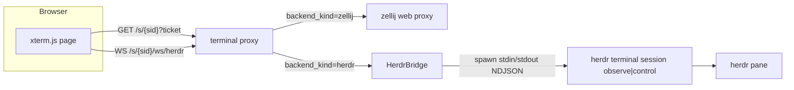

# Herdr Web 终端（webshell）设计

- 作者：待定
- 日期：2026-08-29
- 状态：Implemented（PR-A1…PR-A5 已落地，live 测试见 `crates/beam-daemon/tests/live_herdr_terminal.rs`）
- 范围：在 Herdr 一等后端（managed / adopt / 截图卡片 / `blocked` → attention，commit `7b4861d` 已合入 `main`）之上，补齐浏览器 web 终端能力，对标 zellij web 的只读/可写两种入口，并保持与 zellij web 路径的兼容。

## Overview

Herder 后端已经能在 Herdr pane 里跑 CLI、投递截图卡片、把 `blocked` 映射成飞书 attention。当前唯一缺的是浏览器终端：Herdr 没有 zellij-web 那样的 HTTP 前端，所以飞书卡片在 Herdr 会话上只能显示 `herdr agent attach` 帮助文案，不能像 zellij 会话那样点按钮打开只读/可写终端页。

本文给出 v2 的 web 终端方案：Beam 自建一个极简 xterm.js 终端页（无 TypeScript 源码进仓库），由 daemon 内置 serving；浏览器 WebSocket 连到 daemon 的 terminal proxy，daemon 再桥接到 `herdr terminal session observe`（只读）或 `herdr terminal session control`（可写）子进程。鉴权完全复用现有 HMAC ticket + `beam_terminal_session` cookie 设施，只把 cookie 映射从“zellij cookie”泛化为“后端相关的上游身份”。路由按 `Session.backend_kind` 分派：Zellij 走原 zellij web 代理，Herdr 走新的 WS 桥，互不影响。

实现状态说明：`WebConfig` 新增 `herdr_terminal`（默认 true）与两个 observe 并发上限；`terminal_auth` 泛化为 `UpstreamTarget::{Zellij,Herdr}`；`/s/{session_id}/ws/herdr` 桥与 `/terminal-static/{*path}` 内置资产已挂在 terminal proxy 路由上；卡片在 pane 就绪后恢复只读/可写按钮，`get_write_link` 同时修复了旧版误签只读 ticket 的问题。live 测试观测：Herder 对第二个 control（不带 `--takeover`）的实际拒绝形态是 stdout 输出 `terminal.closed` 并退出（daemon 映射为 close 1001）；Beam 内部的 controller 冲突由 `HerdrControllerRegistry` 快速失败为 close 4001；graceful 断开写 `terminal.release` 后控制器可被下一个可写连接接管。

核心权衡是“不破坏 zellij web 路径”与“Herdr 没有上游 HTTP/cookie”这两个约束的并存：zellij 路径保持原样，Herdr 的“上游”从 HTTP+Set-Cookie 变成 stdin/stdout NDJSON 子进程。

## Background & Motivation

### 现状（以 Rust 代码为准）

zellij web 终端链路已经完整：

- 入口 `GET /s/{session_id}?beam_terminal_ticket=...`，ticket 是 HMAC-SHA256 签名的 `session_id:permission:created_at:nonce`，单次使用，write ticket TTL 5 分钟，read-only 不按创建时间过期。见 `crates/beam-daemon/src/terminal_auth.rs` 的 `generate_terminal_ticket` / `verify_terminal_ticket`。
- cookie bridge：浏览器只持有 `beam_terminal_session`（HttpOnly + SameSite=Strict + Path=/s/，Max-Age 86400）；daemon 进程内 `TerminalAuthState` 保存 `beam_cookie -> { zellij_cookie, session_id, permission }`，转发时注入 zellij cookie，剥离上游 `Set-Cookie`。见 `terminal_auth.rs` 与 `crates/beam-daemon/src/terminal_proxy/auth.rs`。
- read-only anchor：zellij 0.44 只读 watcher 首屏黑屏，由 daemon 内部 hidden anchor（write token 登录 + 普通 web client + `TerminalResize` 160×50）解决，viewer 计数 800ms debounce 后 `ResizeToDefault`。见 `crates/beam-daemon/src/terminal_proxy/anchor.rs`。
- 路由：`/s/{session_id}` → zellij web `/{zellij_session}`，`/s/{session_id}/ws/{*rest}` → `/ws/terminal` / `/ws/control`，非 session 路径 404。见 `terminal_proxy/mod.rs` 与 `terminal_proxy/http_forward.rs`。

Herder 侧的关键事实（`crates/beam-worker/src/backend/herdr/`）：

- `herdr terminal session observe <pane> --cols N --rows M`：只读，输出 NDJSON `terminal.frame`（base64 ANSI bytes + `full` 标志），结束发 `terminal.closed`。多个 observer 可并存，不占 input/resize/scroll/takeover 所有权。
- `herdr terminal session control <pane>`：可写，输出同样 NDJSON frames，stdin 读 NDJSON 命令：`terminal.input`（text 或 base64 bytes）、`terminal.resize`（controller viewport）、`terminal.scroll`、`terminal.release`。同一时刻只有一个 controller 拥有 input/resize；`--takeover` 可替换现有 owner。
- worker 已有 `run_herdr_observe`（`observe.rs`）为截图协调器消费帧，spawn 时 unset `HERDR_PANE_ID` 等作用域 env。

> 协议可验证性：上述 observe/control 的 NDJSON 形状、`control` 不带 `--takeover` 时对“已存在 controller”的拒绝形态（错误码/消息/退出码），以及 `--takeover` 替换 owner 的行为，均来自 herdr.dev persistence-remote 外部文档，本仓库无实现可本地核对。worker 的 `parse_herdr_frame_line`（`observe.rs`）已覆盖 `terminal.frame` 的字段兼容，但 `control` 的冲突形态与 `terminal.release` 的释放契约必须由 PR-A6 的 live 测试钉住（见 References 脚注）。

会话与卡片现状：

- Herdr session 的 `Ready` 不写 `terminal_url`（`crates/beam-daemon/src/backend.rs` 的 `apply_ready_identity`，Herdr 分支跳过 `terminal_url`）；`card-ready` 已经与 `terminal_url` 解耦（`lark_replies.rs` 的 `session_card_ready`）。
- `Session.backend_kind: Zellij|Herdr`、`Session.herdr_session`、`Session.herdr_workspace_id` / `herdr_pane_id` 已持久化（`crates/beam-core/src/session.rs`）；`InitConfig` / `WorkerToDaemon::Ready` 已带 `backend_kind` + herdr ids（`crates/beam-core/src/ipc.rs`）。
- `HerdrIds.workspace_pane()` 给出 `w1:p1` 形式（`ids.rs`）。
- 卡片 `build_streaming_card`（`crates/beam-daemon/src/session_cards/streaming.rs`）当前对 Herdr 分支不发放终端按钮，只给 `herdr agent attach` 提示；按钮动作 `choose_read_only_terminal_link` / `get_write_link` 由 `handle_terminal_link`（`lark_ingress/session_card_actions.rs`）处理，其中 readiness 检查目前只认 zellij token。
- daemon 启动仍硬依赖 `ensure_zellij_web`（`lib.rs` ~833-843），但 `start_proxy` 在 zellij web 关闭时也会启动（`start_zellij_web_if_enabled` 返回 disabled tokens）。`WebConfig.zellij_web=false` 是 herdr-backend 设计里 PR5 的 herdr-only 逃生门（与本设计的 PR-A5 无关联）。

### 为什么需要补 web 终端

1. 用户已经在飞书卡片上习惯了 zellij 的“只读入口 + 私发可写链接”体验；Herder 会话突然退化成一行 `herdr agent attach`，是明显的 UX 回归。
2. Herdr 的 `observe` / `control` 就是为第三方桥设计的 NDJSON 协议，与 Beam 现有的“浏览器 WS → daemon 代理”架构天然契合，不需要 fork Herdr。
3. 只读/可写权限可以直接映射到 observe/control，权限语义比 zellij 的“token 决定 cookie，但 cookie 可能是全局”更清晰、更强。

### 关键约束

- 纯 Rust workspace；AGENTS.md 明确“不要往本仓库加 TypeScript 代码”。
- 不 vendor / fork Herdr；运行时依赖已安装的 `herdr >= 0.8.2`。
- 不破坏 zellij web 路径；两个 backend 并存。
- `~800` 行/文件是仓库规范。

## Goals & Non-Goals

### Goals

1. Herdr 会话有与 zellij 对齐的两个飞书入口：只读终端按钮、私发可写链接。
2. 浏览器页能实时查看（只读）和操作（可写）Herdr pane，分只读/可写两种模式。
3. 复用现有 ticket/cookie 鉴权设施与 `beam_terminal_session` cookie 名、`beam_terminal_ticket` 参数，避免引入第二套认证。
4. 终端代理按 `backend_kind` 分派，zellij 路径行为不变。
5. 不新增对 zellij web 的依赖；herdr web 终端在 `web.zellij_web=false` 时也能工作。
6. 页面资产（xterm.js）落地方式可审计、可离线、无 TS 构建链。

### Non-Goals

- 不实现完整 Herdr TUI，不做 SSH / `herdr --remote` 客户端。
- 不把 Herdr 变成默认后端，不静默迁移现有 zellij 会话。
- 不写 TypeScript；不引入 node/npm 构建步骤。
- 不在 v2 里做多用户协同编辑（同一个 controller 仍是单写者，`--takeover` 不默认使用）。
- 不改 adapter、transcript、截图渲染器、`blocked` → attention 的既有行为。

## Proposed Design

### 总览



核心思路：Herdr 的“上游”不是一个 HTTP 服务，而是一个长驻子进程。daemon 的 terminal proxy 在 Herdr 分支上，把浏览器 WS 双向映射到子进程的 stdin（控制命令）与 stdout（NDJSON frames）。ticket/cookie 仍由 `terminal_auth.rs` 签发和校验，cookie 条目从“zellij cookie”泛化为“后端相关的上游身份”。

### 页面资产

#### 决策：vendor 预编译 xterm.js，内置 serving，不写 TS

xterm.js（MIT/Apache-2.0）是成熟的终端前端库，不自行实现终端仿真器。落地方式三选一，最终选 vendor：

| 方案 | 优点 | 缺点 | 结论 |
| --- | --- | --- | --- |
| CDN（jsDelivr/unpkg） | 仓库零体积 | 泄漏用户访问轨迹给第三方；离线/内网不可用；供应链不可固定（除非 SRI 且每次人工更新） | 拒绝 |
| 复用 `herdr-web` npm 包 | 直接对齐 Herdr 官方前端 | 是 TypeScript/Node 项目；仓库禁 TS；引入 node 构建链 | 仅参考，不复用 |
| vendor 预编译资产 + daemon 内置 serving | 单二进制、离线、可审计、可固定版本 | 仓库里有第三方压缩 JS | **采用** |

落地目录与模块建议（遵守 ~800 行/文件）：

```text
crates/beam-daemon/assets/terminal/
  index.html                    # 终端页骨架，内联少量 glue JS 或引用 app.js
  app.js                        # 普通 ES 模块，无 TS，负责 xterm 实例化 + WS 协议
  terminal.css                  # 终端样式（xterm.css 的少量覆写）
  vendor/
    xterm@5.3.0/xterm.min.js
    xterm@5.3.0/xterm.css
    xterm-addon-fit@0.8.0/xterm-addon-fit.min.js
    xterm-addon-web-links@0.9.0/xterm-addon-web-links.min.js
  THIRD_PARTY_NOTICES.md        # 版本、许可证、SHA-256
```

serving 建议用一个 daemon 内部静态资产模块，`include_bytes!` / `include_str!` 把资产编译进 binary，通过 axum 响应，映射 content-type。相比 `tower-http::fs::ServeDir`（读磁盘）与 `rust-embed`（新依赖），`include_bytes!` 零新依赖、部署单文件、路径不可被遍历。若后续资产变多、需要热更新，再评估 `rust-embed`。

静态资产是无秘的公共资源，建议用一条公开路由（例如 `GET /terminal-static/{*path}`）serving，不加 cookie 校验；页面主体 `GET /s/{session_id}` 仍需 ticket/cookie。这样 zellij 的“非 session 路径 404”fallback 需要让开这一条静态前缀。

页面 `index.html` 不承载业务文案，只做终端渲染；权限由 ticket 决定，页面从 WS 握手后的首条服务端消息获知自己是 `readonly` 还是 `write`，据此隐藏/禁用输入。

### WS 桥

#### 子进程模型：每浏览器连接一个子进程

Herdr `observe` 明确支持多个 observer 并存，且不占所有权，因此“每浏览器连接 spawn 一个 observe 子进程”是最简单、生命周期最清晰的选择：一个标签页断线只影响它自己的子进程，无需共享 fan-out 状态机、背压归并、重放游标。

代价是子进程数量随打开的标签页线性增长。用两级上限兜底：

- 每 session 并发 observe 上限 `8`。
- daemon 全局并发 observe 上限 `64`。
- 超限返回 `503` + `Retry-After: 5`，页面提示稍后重试。

config 新增 `WebConfig.herdr_terminal_max_observers_per_session = 8` 与 `..._max_observers_global = 64`（serde default），便于调参。

observe 固定 `--cols 160 --rows 50`（复用 `beam_core::DEFAULT_TERMINAL_COLS/ROWS`）。只读观众不能 resize，这是 Herdr observe 的协议限制，与 zellij 只读观众由 anchor 固定 160×50 的语义一致。

#### controller 单一性与冲突处理

可写连接 spawn `herdr terminal session control <pane>`。Herdr 自己保证同一时刻只有一个 controller 拥有 input/resize。冲突策略：

1. **默认不带 `--takeover`**。第二个 controller 会被 Herdr 拒绝；daemon 捕获该特定失败，向浏览器关闭 WS（close code 自定义，例如 `4001`）并附 `{"error":"controller in use"}`。
2. 页面收到后展示“已有可写会话占用，当前降级为只读”，并保留一个只读重连入口。
3. **不自动 `--takeover`**。原因：`--takeover` 会抢走人类 `herdr attach` TUI 或另一个 Beam 可写标签的 input/resize，违背 herdr-backend.md 里“不要对托管输入开 control --takeover”的既有原则。若未来产品要求抢占，做成显式的“接管”按钮动作，而不是登录即抢。

daemon 额外维护一个进程内 `HerdrControllerRegistry`（`Arc<Mutex<HashMap<pane_id, ()>>>`）做快速失败与友好报错，但最终裁决权在 Herdr 自己的 controller 校验。registry 只用于体验，不构成安全边界。

#### controller 释放语义

可写连接的释放分两层：daemon 在 graceful 断开（浏览器正常关闭 WS）时，先尽力向 control 子进程 stdin 写一条 `{"type":"terminal.release"}`，再 `kill_on_drop` 结束子进程；abrupt 断开（网络断/刷新/强杀）无法保证写入 `terminal.release`，只能依赖子进程 stdin 关闭（EOF）触发 Herdr 释放。Herder 是否在 EOF 时立即释放 controller、还是需要显式 `terminal.release`，属于外部协议，本仓库无法本地核实：本设计先按“EOF 即释放”实现并注明待实测；PR-A6 的 live 测试必须钉住“abrupt disconnect 后 controller 何时可被下一个可写连接接管”，若发现 Herdr 依赖显式释放导致长期 4001，则降级方案是 daemon 记录 owner，并在下次可写登录前显式 `--takeover`（需产品确认）。见 Open Questions 第 5 条。

#### resize 语义

- observe：`--cols/--rows` 在 spawn 时固定，只读观众不改 pane 尺寸。
- control：浏览器 xterm 用 fit addon 算出 `{cols,rows}`，通过 WS 发 `{"type":"resize","cols":N,"rows":M}`；daemon 转成 NDJSON `{"type":"terminal.resize","rows":M,"cols":N}` 写入 control 子进程 stdin。这改变真实 pane 尺寸，属于 controller viewport。
- 读写模式切到只读时，pane 尺寸停在最后 controller 设的值；重新进入只读后 observe 用新的 `--cols/--rows` 抓当前尺寸（v1 可先固定 160×50，后续按 pane 实际尺寸读回）。

#### `terminal.closed` / pane 关闭后的表现与重连

- observe 或 control stdout 出现 `terminal.closed`，daemon 向浏览器发 `{"type":"closed"}` 并关闭 WS（close code `1001`）。
- 页面显示“终端已关闭”覆盖层 + “重新连接”按钮。重连重新走 `/s/{session_id}/ws/herdr`，只要 `beam_terminal_session` cookie 未过期且 pane 仍在，就能重建子进程。
- 若 pane/workspace 已不存在（session 被 `/close`），daemon 在 ticket/cookie 校验阶段解析 `Session.herdr_pane_id` 失败，返回 `404 session ended`，页面显示“会话已结束”。
- daemon 重启后：cookie 是进程内状态，浏览器旧 cookie 失效，需重新用 ticket 登录（与 zellij 现状一致）。ticket 本身靠持久化的 secret 与 nonce 反重放，重启后仍可验证新签发的 ticket。

#### WS 消息协议（daemon ↔ 浏览器）

```jsonc
// browser -> daemon（write 模式有效；readonly 忽略 input）
{"type":"input","text":"ls\r"}                       // UTF-8 文本
{"type":"input","bytes":"<base64>"}                  // 二进制/含转义字节
{"type":"resize","cols":160,"rows":50}
{"type":"ping"}

// daemon -> browser
{"type":"hello","mode":"readonly|write","cols":160,"rows":50}  // cols/rows 是初始建议值
{"type":"frame","bytes":"<base64 ANSI>","full":true}
{"type":"closed"}
{"type":"error","message":"controller in use"}
```

`hello` 的 `cols/rows` 只作为初始建议值：readonly 模式固定 160×50；write 模式由页面 fit addon 计算后发送 `resize`，`hello` 里的值在 write 模式下会被随后的 `resize` 覆盖。daemon 侧帧解析复用 worker 已有的容忍逻辑（`parse_herdr_frame_line` 的 `frame.data` / `data` / `bytes` 兼容），但 `terminal.closed` 必须先做原始行级判断（`line.contains("terminal.closed")`）再解析帧；`parse_herdr_frame_line` 对 `terminal.closed` 与垃圾行都返回 `None`，不能靠它区分关闭事件。控制子进程写入用固定 `terminal.input` / `terminal.resize` NDJSON。

背压：浏览器慢消费时，daemon 对每个 WS 用有界 channel（如 `mpsc::channel(256)`），队列满则丢弃帧并递增 `frames_dropped` 计数，而不是无界堆积。丢弃帧后 xterm 可能缺增量，页面下一次 `full:true` 帧会自愈。

### 鉴权

#### 复用而非新建

ticket 格式、nonce 单次使用、write TTL 5 分钟、read-only 不过期、`ticket-secret` 持久化、`UsedTickets` 反重放全部复用 `terminal_auth.rs`。ticket 里不塞 backend 字段；backend 在 verify 时从 `Session.backend_kind` 解析。

cookie 侧需要泛化。当前 `BeamCookieEntry` 存 `zellij_cookie: String`；改为后端相关的上游身份：

```rust
// terminal_auth.rs（概念，非实现）
pub(crate) enum UpstreamTarget {
    Zellij { cookie: String },
    Herdr { workspace_id: String, pane_id: String },
}

pub(crate) struct BeamCookieEntry {
    pub backend_kind: BackendKind, // 冗余派生缓存，由 upstream.backend_kind() 派生
    pub upstream: UpstreamTarget,
    pub session_id: String,
    pub permission: TerminalPermission,
    pub created_at: Instant,
}
```

`insert` / `lookup` 的返回从 `(zellij_cookie, session_id, permission)` 改为 `AuthenticatedTerminal { backend_kind, upstream, permission }`，并同步改 `auth::authenticate_via_beam_cookie` 与两个 handler 的调用点。

`insert(session_id, permission, upstream)` 内部用 `upstream.backend_kind()` 派生 `backend_kind`（`UpstreamTarget::Zellij` → `BackendKind::Zellij`，`UpstreamTarget::Herdr` → `BackendKind::Herdr`）；`BeamCookieEntry.backend_kind` 是冗余的派生缓存，可选保留。若保留，必须由该判别式派生，不能由调用方另行传入。

#### `try_ticket_login` 按 backend 分派

现状 `try_ticket_login`（`terminal_proxy/auth.rs:161-234`）在 verify ticket 后立即 `zellij_token_for_permission`（token 空 → 503）→ `zellij_web_login` → `should_ensure_read_only_anchor`。`web.zellij_web=false` 时 `start_zellij_web_if_enabled` 返回 `ZellijWebTokens::disabled(port)`，token 为空，Herder 首次登录会稳定 503，与 Goal 5 冲突。分派规则：

- `backend_kind == Zellij`：保持现状（选 token → login → anchor → `insert(UpstreamTarget::Zellij{cookie})` → 302）。
- `backend_kind == Herdr`：跳过 zellij token 选择 / `zellij_web_login` / anchor，直接以 `UpstreamTarget::Herdr { workspace_id, pane_id }` 调 `insert` 后 302；`pane_id` 为空则 404。

#### 权限映射

| ticket permission | Herdr 子进程 | 说明 |
| --- | --- | --- |
| `ReadOnly` | `observe` | 多观察者，无 input/resize |
| `Write` | `control`（无 `--takeover`） | 单 controller，冲突返回 4001 |

私发可写链接的 5 分钟 TTL 沿用不变；read-only 入口长期有效。`handle_terminal_link` 的 readiness 检查从“zellij token 是否存在”改成按 backend 分派：Zellij 仍查 token，Herdr 查 `session.herdr_pane_id.is_some()`。**同时必须把 ticket 权限参数传入链接生成**：当前 `handle_terminal_link` 的 `read_only` 参数只用于 token 可用性检查，随后无条件用 `TerminalPermission::ReadOnly` 签发（`lark_ingress/session_card_actions.rs:264-279`），即现有 `get_write_link` 实际签发的也是只读 ticket（zellij 侧既存 bug）。PR-A5 要改为 `read_only=false` 时用 `TerminalPermission::Write` 并生成“可写终端入口”文案，一并修复 zellij 的写入口。

#### 威胁模型

| 风险 | 严重度 | 缓解 |
| --- | --- | --- |
| 可写链接泄露，第三人输入任意命令到 agent 终端 | 高 | 单次使用 nonce；write TTL 5 分钟；私发（DM/ephemeral）投递；cookie `HttpOnly; SameSite=Strict; Path=/s/`；`--takeover` 不默认开启 |
| 可写链接抢占人类 TUI 或另一个可写标签 | 高 | 不 `--takeover`；Herdr 单 controller 强制；daemon registry 快速失败 |
| daemon 进程内 cookie 映射泄漏 | 中 | 与 zellij 相同的进程内隔离；Herdr 无上游 cookie 可泄漏（桥是子进程 stdin/stdout） |
| xterm.js 供应链 | 中 | 固定版本 + SHA-256 + 许可证清单；定期手动更新 |

### 路由与分发

保持现有 `/s/{session_id}` 一族路由，新增 Herdr 分支：

| Proxy route | backend_kind=Zellij | backend_kind=Herdr |
| --- | --- | --- |
| `GET /s/{session_id}` | 代理 zellij web `/{zellij_session}` | 返回 Beam 内置 `index.html` |
| `GET /s/{session_id}/ws/{*rest}` | 代理 `/ws/terminal`、`/ws/control` | `rest=herdr` 时走 `herdr_ws` 桥 |
| `GET /terminal-static/{*path}` | 不适用（zellij 资产走 zellij web） | 返回内置 xterm.js 资产 |
| 非 session 路径 | 404（保留，仅放行 `/terminal-static`） | 404 |

实现点：

- 会话存在性判断必须按 backend 分派（关键改动点）。`handle_session_terminal` 的第一条语句是 `if resolve_zellij_session(...).is_none() { return 404 }`（`http_forward.rs:313-316`），而 `resolve_zellij_session` 对 Herdr 恒返回 `None`（`terminal_proxy/mod.rs`）。因此仅“在 cookie 校验成功分支之前插入 Herdr 判断”不可达。PR-A2 必须先把顶部 404 门禁改写为：Herdr 跳过 `resolve_zellij_session` 继续 ticket/cookie 校验并服务内置页；Zellij 才要求 `resolve_zellij_session` 非空。
- WS 路由新增一条比通配符更具体的 `/s/{session_id}/ws/herdr`，在 `ws_relay::handle_session_root_ws` 之前匹配；或在该 handler 内按 `rest == "herdr"` 分派。前者更清晰。
- `terminal_url` 对 Herdr 继续保持 `None`。链接卡片由 `terminal_base_url(host, port, sid)` + ticket 现场生成（`terminal_links.rs`），不依赖 `terminal_url`，因此不写 URL 也能发链接。这样也避免 `external_host_watcher` / `ip_resolver` 的 `rewrite_session_terminal_urls` 把 Herdr 的 URL 误当 zellij URL 重写。

### 兼容性

- zellij 路径可观察行为不变，但代码结构做后端无关化改造：ticket、cookie、anchor、路径重写、header 处理的行为都不变；`BeamCookieEntry` 由 `zellij_cookie: String` 改为 `upstream: UpstreamTarget`，`lookup` 返回 `AuthenticatedTerminal`，会机械性改动 `authenticate_via_beam_cookie` 与 HTTP/WS handler 的所有 zellij 调用点（需 `match UpstreamTarget::Zellij { cookie }`）。这不是零改动，但对外行为等价。
- ticket/cookie 共用同一套 secret、同一 cookie 名、同一 ticket 参数；backend 只影响 cookie 条目的 upstream 类型。两个 backend 的会话可以在同一 daemon 里同时被浏览器打开，互不干扰。
- zellij cookie 仍只在 daemon 进程内存在；Herdr 不产生任何上游 cookie，桥是子进程，因此不存在“剥离 Set-Cookie”的等价需求。
- daemon 是否继续依赖 zellij web：默认仍启动（`web.zellij_web=true`，不改变现有部署）；Herdr web 终端不依赖 zellij web。`web.zellij_web=false` 时 terminal proxy 仍启动（已有 `start_zellij_web_if_enabled` disabled 分支），Herdr 桥照常工作，zellij session 的终端入口显示“terminal not ready”。

### 并发与资源

| 维度 | 约束 |
| --- | --- |
| observe 子进程 | 每 session 8，全局 64；超限 503 |
| controller | 每 pane 1（Herdr 强制 + daemon registry 快速失败） |
| observe/control 子进程生命周期 | WS 断开时 `kill_on_drop` 杀掉；stdout EOF / `terminal.closed` 主动退出 |
| daemon 重启 | cookie 失效需重新 ticket 登录；pane 身份来自持久化的 `Session.herdr_pane_id`，重连只要 pane 还在即可 |
| pane 身份持有者 | daemon（从 `Session` 读），不依赖 worker 存活；web 桥与 worker 的 observe 各自独立 spawn，互不影响 |
| 子进程超时 | spawn 后首帧等待 5s（对齐 anchor）；帧流本身无每读超时，靠 `terminal.frame`/keepalive 心跳判活。`HERDR_ACTION_TIMEOUT=8s` 只用于单发 CLI，绝不套用于 observe/control 长驻流 |

### 计数器生命周期与状态存放

- active-observer 计数器放在 `ProxyState`（`terminal_proxy/mod.rs` 现有 `viewer_counter` 旁新增 `herdr_observer_limiter: HerdrObserverLimiter`），全局唯一；`HerdrControllerRegistry` 也放 `ProxyState`。
- observe 子进程 spawn 成功时 +1；WS 断开 / `kill_on_drop` 收尾 / 子进程退出时用 `Drop` guard 或 `select` 的收尾分支保证 -1，避免断线泄漏导致 503 永久化。
- control 连接**不计入** observe 上限（它受单 controller 约束，不消耗 observe 名额）；每个 session 的写连接数自然被 Herdr 单 controller 限为 1。
- registry 键用 `pane_id` 字符串；同一 pane 理论上只属于一个 Beam session（managed 是 `beam-{sid8}` workspace，adopt 是用户 pane），若异常出现同 pane 多 session，registry 只记最后 owner 并打 warning，不据此拒绝（安全边界在 Herdr 自己的 controller 校验）。

## API / Interface Changes

### 新增路由

```text
GET  /s/{session_id}                 # Herdr 时返回内置 index.html
GET  /s/{session_id}/ws/herdr        # Herdr WS 桥（observe/control）
GET  /terminal-static/{*path}        # 公开 xterm.js 资产
```

### terminal_auth 泛化

```rust
// 现有（zellij 专用）
pub async fn insert(&self, zellij_cookie: String, session_id: String, permission: TerminalPermission) -> String;
pub async fn lookup(&self, beam_cookie: &str) -> Option<(String, String, TerminalPermission)>;

// 泛化后
pub async fn insert(&self, session_id: String, permission: TerminalPermission, upstream: UpstreamTarget) -> String;
pub async fn lookup(&self, beam_cookie: &str) -> Option<AuthenticatedTerminal>;
```

`BackendKind` 已在 `beam-core` 中可用（`crates/beam-core/src/backend_kind.rs`），`terminal_auth.rs` 直接 import。

### `try_ticket_login` 分派

```text
try_ticket_login(state, session_id, ticket):
  payload = verify_and_consume_ticket(ticket, session_id)   // 单次使用 + TTL 不变
  session = resolve session by id
  match session.backend_kind:
    Zellij -> token = zellij_token_for_permission(...) ?: 503
              cookie = zellij_web_login(...)
              ensure_read_only_anchor(...) if ReadOnly
              upstream = UpstreamTarget::Zellij { cookie }
    Herdr  -> workspace_id = session.herdr_workspace_id ?: 404
              pane_id = session.herdr_pane_id ?: 404
              upstream = UpstreamTarget::Herdr { workspace_id, pane_id }
  beam_cookie = auth_state.insert(session_id, permission, upstream)
  redirect 302 /s/{session_id} + Set-Cookie beam_terminal_session
```

### Herdr 桥核心伪代码

```text
handle_herdr_ws(session, permission):
  pane_id = session.herdr_pane_id?          // None -> 404 session ended
  cmd = permission == Write ? ["control", pane_id]
                            : ["observe", pane_id, "--cols","160","--rows","50"]
  child = spawn("herdr", "terminal", "session", ...cmd,
                env_remove HERDR_PANE_ID/TAB_ID/WORKSPACE_ID,
                stdin=PIPE, stdout=PIPE, kill_on_drop=true)
  send(browser, {"type":"hello","mode":permission,...})
  loop select:
    browser_msg -> if Write: write_ndjson(child.stdin, translate(browser_msg))
    child_stdout line ->
        if line contains "terminal.closed": send(browser, {"type":"closed"}); close(1001); break
        elif frame = parse_herdr_frame_line(line): send(browser, {"type":"frame","bytes":frame_b64,"full":full})
    browser_close(graceful) -> if Write: write_ndjson(child.stdin, {"type":"terminal.release"}); kill(child); break
    browser_disconnect(abrupt) -> kill(child); break
```

控制子进程写入的 NDJSON 翻译：

```text
browser {"type":"input","text":"ls"}        -> child {"type":"terminal.input","text":"ls"}
browser {"type":"input","bytes":...}        -> child {"type":"terminal.input","bytes":...}
browser {"type":"resize","cols":N,"rows":M} -> child {"type":"terminal.resize","rows":M,"cols":N}
```

## Data Model Changes

- `Session`：无需新增字段。`backend_kind`、`herdr_workspace_id`、`herdr_pane_id`、`herdr_session` 已存在并持久化，web 桥直接读取。
- `terminal_auth::BeamCookieEntry`：新增 `backend_kind`，`zellij_cookie: String` 改为 `upstream: UpstreamTarget`。这是进程内状态，不落盘，无迁移。
- `WebConfig`：新增 `herdr_terminal` 熔断开关与两个并发上限字段（共三个，serde default，向后兼容）。

不新增 `terminal_url` 语义；Herder 继续不写 `terminal_url`。

## Alternatives Considered

### A. xterm.js 走 CDN

优点：仓库零第三方资产，改动最小。缺点：每次终端访问把请求发往第三方 CDN，泄漏用户终端使用轨迹与 IP；内网/离线不可用；供应链不可固定（SRI 需每次人工同步）。结论：拒绝，选用 vendor 内置 serving。

### B. 复用 `herdr-web` npm 包或 fork 其前端

优点：直接对齐 Herdr 官方前端。缺点：它是 TypeScript/Node 项目，本仓库禁 TS；会引入 node 构建链、产生一份 JS 源码镜像。结论：仅作为协议/UI 参考，不复用、不 vendor。

### C. observe 共享 publisher（fan-out），而不是每连接一个子进程

优点：子进程数量不随标签页增长，节省资源。缺点：需要共享子进程、帧复制、慢消费者背压、断线不影响发布者、以及“谁在首帧后接入需要重放全屏”的复杂度。鉴于 observe 原生支持多观察者且廉价，v1 用每连接一个子进程换取生命周期隔离与更简单的正确性，资源用并发上限兜底。结论：保留共享 publisher 作为未来高 viewer 数的优化项，不进入 v2。

### D. 可写冲突时自动 `--takeover`

优点：用户体验“总能写”。缺点：会静默抢走人类 `herdr attach` TUI 或另一个可写标签的输入所有权。**注意：本设计在此修订了 `docs/design/herdr-backend.md:562/778/1001` 的 v2 定案**（旧文写“可写用 `control --takeover`”）。结论：本设计改为可写用 `control`（不带 `--takeover`），冲突报 4001 + 只读降级；如产品需要，再做显式“接管”按钮。herdr-backend 的同步必须前移到 PR-A0（见 PR-A0）。

## Security & Privacy Considerations

见“鉴权 - 威胁模型”表。补充：

- 所有 Herdr 子进程 spawn 时 unset `HERDR_PANE_ID` / `HERDR_TAB_ID` / `HERDR_WORKSPACE_ID`，避免 daemon 本身若从某个 Herdr TUI 内 `beam restart` 拉起，`--current` 解析到错误 pane。
- 子进程 stderr 不写浏览器，避免把 Herdr 内部错误（可能含路径/环境）泄露给前端；只记录 daemon 日志并给用户一个通用错误码。
- ticket secret、used tickets、cookie 映射全部进程内/持久化方式与 zellij 一致，不新增密钥材料。

## Observability

- 结构化日志（沿用现有 `tracing` field 风格）：
  - `component=terminal_proxy operation=herdr_ws outcome=... backend=herdr pane_id=...`。
  - observe/control 子进程 spawn/exit 原因、stdout EOF、`terminal.closed`、controller 冲突。
- 指标（沿用 daemon 现有 metrics 风格，若已有）：
  - 活跃 observe 子进程数、活跃 controller 数、`frames_dropped`（背压）、冲突计数（4001）、pane 不存在（404）。
- 告警：全局 observe 上限触发的 503 率、controller 冲突率。

## Rollout Plan

- 默认关闭？不需要独立 feature flag：行为由 `session.backend_kind` 决定，zellij 路径天然不受影响。可在 `WebConfig` 加 `herdr_terminal`（default true）作为紧急熔断开关。
- 阶段：
  1. 资产 + 静态页 + 只读 observe 桥（zellij 不受影响）。
  2. 可写 control 桥 + 冲突策略。
  3. 卡片按钮恢复（Herdr）+ readiness 分派。
  4. 双语文档 + live 测试 + 并发上限调参。
- 回滚：`WebConfig.herdr_terminal=false` 让 `/s/{session_id}` 对 Herdr 恢复 404 + 卡片恢复 `herdr attach` 提示；zellij 路径不受任何开关影响。

## Open Questions

1. 产品是否允许“可写终端在被占用时提供显式接管按钮”？默认是拒绝接管，需产品确认。
2. 只读观众是否要显示 pane 真实尺寸（读回 pane 尺寸）还是固定 160×50？v1 建议固定 160×50，待 Herdr 提供“pane 尺寸查询”后决定。
3. `workflow_actions.rs` 的 attempt-resume 终端的 `url` 目前总按 zellij 语义生成写 ticket；Herder session 是否走 workflow resume 终端链路需确认（v2 暂不动该路径）。
4. 是否需要把 Herdr web 终端与 zellij 的 read-only anchor 等价物（一个常驻普通 controller 来维持尺寸）统一？Herder observe 不占所有权，暂不需要 anchor。
5. abrupt disconnect 后 Herdr 何时释放 controller（EOF 即释放 vs 需显式 `terminal.release`）？本设计先按“EOF 即释放”实现并尽力写 `terminal.release`，PR-A6 live 测试必须钉住；若依赖显式释放导致长期 4001，需产品确认是否在重连前显式 `--takeover`。

## References

- zellij web 终端权威描述：`docs/design/terminal-proxy.md`
- Herdr 后端设计：`docs/design/herdr-backend.md`（herdr-backend 的 PR6 小节、Open Questions Q3、Non-Goals、Key Decisions 11）
- 代码：`crates/beam-daemon/src/terminal_auth.rs`、`terminal_proxy/{mod,auth,http_forward,ws_relay,anchor}.rs`、`zellij_web.rs`、`backend.rs`、`session_cards/streaming.rs`、`session_cards/terminal_links.rs`、`lark_ingress/session_card_actions.rs`、`lib.rs`
- 核心/worker：`crates/beam-core/src/{session,ipc,backend_kind,config}.rs`、`crates/beam-worker/src/backend/herdr/{mod,observe,cli,ids}.rs`
- Herdr 协议：https://herdr.dev/docs/ （persistence-remote）

> 外部协议事实（observe/control 的 NDJSON 形状、`control` 不带 `--takeover` 的冲突形态、`terminal.release` 释放契约）来自 herdr.dev 文档，非本仓库实现；PR-A6 live 测试负责钉住这些外部契约，尤其 `control` 不带 `--takeover` 的失败形态如何被 daemon 识别为 4001。

## Key Decisions

1. **vendor 预编译 xterm.js 并内置 serving，不写 TS、不接 CDN、不复用 `herdr-web`。** 单二进制、离线、可固定版本与 SHA-256，避免第三方请求与 TS 构建链。
2. **复用现有 HMAC ticket + `beam_terminal_session` cookie，不新建认证链路。** ticket 格式、nonce、TTL、secret 持久化、反重放全部复用；只把 cookie 上游从 zellij cookie 泛化为 `UpstreamTarget::{Zellij,Herdr}`。
3. **权限映射：ReadOnly → `observe`，Write → `control`。** observe 多观察者、无所有权；control 单 controller、单写者。
4. **每浏览器连接一个 observe 子进程，不做共享 publisher。** 换生命周期隔离与正确性，资源用每 session 8 / 全局 64 上限兜底。
5. **可写冲突不自动 `--takeover`。** 冲突返回 4001 + 只读降级；`--takeover` 只在产品确认的显式“接管”动作里使用，避免抢人类 TUI。
6. **resize 只走 control 的 `terminal.resize`；observe 固定 `--cols 160 --rows 50`。** 只读观众不改 pane 尺寸，语义对齐 zellij anchor。
7. **`terminal_url` 对 Herdr 保持 `None`。** 链接由 `terminal_base_url` + ticket 现场生成，避免 zellij 特化的 URL 重写逻辑污染 Herdr。
8. **路由按 `backend_kind` 分派，zellij 路径可观察行为不变。** zellij 走原代理，Herdr 走新 WS 桥 + 内置页；`BeamCookieEntry` 泛化会机械性重构 zellij 调用点但行为等价。
9. **Herdr 的 pane 身份由 daemon 从持久化的 `Session.herdr_pane_id` 读取，不依赖 worker 存活。** web 桥与 worker observe 各自独立 spawn。
10. **Herder 桥用 stdin/stdout NDJSON 子进程，无上游 cookie。** 无需 Set-Cookie 剥离；spawn 时 unset Herdr 作用域 env。
11. **页面从 WS `hello` 消息获知 readonly/write，而不是从 ticket 推断 UI。** 单页复用，权限服务端裁决。
12. **`terminal.closed` / pane 不存在分别关闭 WS(1001) 与返回 404。** 页面据此显示“已关闭/会话已结束”并支持重连。
13. **静态资产公开 serving，页面主体仍要求 ticket/cookie。** 资产无秘；会话页有秘。
14. **Herdr web 终端不依赖 zellij web，`web.zellij_web=false` 时可用。** daemon 默认仍启动 zellij web，不改变现有部署。

## PR Plan

### PR-A0 — 文档：登记 Herdr web 终端路径并同步 herdr-backend v2 定案

- 标题：`docs: 记录 Herdr web 终端与 zellij proxy 的分派边界，并修订 herdr-backend 的 v2 定案`
- 文件：`docs/design/terminal-proxy.md` / `terminal-proxy.en.md`（补 Herdr 分支路由表与子进程桥说明）、`docs/design/herdr-backend.md` / `.en.md`（把旧“后期 PR6”改为“本设计”，并把 v2 可写从 `control --takeover` 修订为 `control` 不带 `--takeover` + 冲突 4001）
- 依赖：无
- 说明：不改代码；锁定双语文档先行，避免实现期间两份权威文档矛盾。

### PR-A1 — 终端资产与静态页骨架

- 标题：`feat(web): 内置 xterm.js 终端资产与只读页面骨架`
- 文件：`crates/beam-daemon/assets/terminal/{index.html,app.js,terminal.css,vendor/*,THIRD_PARTY_NOTICES.md}`；新增 `crates/beam-daemon/src/terminal_proxy/static_assets.rs`；`lib.rs` 挂 `/terminal-static/{*path}` 路由；`crates/beam-core/src/config.rs` 的 `WebConfig`（`config.rs:36-47`）新增 `herdr_terminal`、`herdr_terminal_max_observers_per_session`、`herdr_terminal_max_observers_global` 字段
- 依赖：无
- 说明：先只 serving 公开静态资产 `/terminal-static/{*path}`，无 WS；鉴权页 `/s/{session_id}` 在 PR-A2 接入。zellij 路径不变。

### PR-A2 — 鉴权泛化与 `/s/{session_id}` 分派

- 标题：`feat(daemon): terminal auth 泛化并支持 Herdr 终端页`
- 文件：`terminal_auth.rs`（`UpstreamTarget`、`BeamCookieEntry`、`insert/lookup` 签名）、`terminal_proxy/auth.rs`（`try_ticket_login` 按 backend 分派）、`terminal_proxy/http_forward.rs`（改写顶部 404 门禁为按 backend 分派 + `handle_session_terminal` 的 Herdr 分支）、`terminal_proxy/mod.rs`
- 依赖：PR-A1
- 说明：ticket 校验不变；cookie 条目携带 backend_kind + Herdr pane 身份；`try_ticket_login` 与顶部 404 门禁按 backend 分派，Herder 跳过 zellij token/login/anchor，直接 `UpstreamTarget::Herdr` 后 302 并服务 `index.html`。单元测试覆盖 `UpstreamTarget` roundtrip、Herder 无 zellij login、以及 `web.zellij_web=false` 时 Herdr 可登录。

### PR-A3 — 只读 observe WS 桥

- 标题：`feat(web): Herdr observe 只读终端 WS 桥`
- 文件：新增 `crates/beam-daemon/src/terminal_proxy/herdr_ws.rs`（或 `herdr/{mod,observe}.rs`）；`mod.rs` 挂 `/s/{session_id}/ws/herdr`
- 依赖：PR-A2
- 说明：ReadOnly → spawn observe → 转发 `terminal.frame` 到浏览器；`terminal.closed` → close(1001)；断开 kill 子进程。hermetic 测试用 fake `herdr` shim 输出 NDJSON。

### PR-A4 — 可写 control WS 桥与冲突策略

- 标题：`feat(web): Herdr control 可写终端与 controller 冲突处理`
- 文件：同 `herdr_ws.rs`（control 分支）、`terminal_proxy` 新增 `HerdrControllerRegistry`
- 依赖：PR-A3
- 说明：Write → spawn control（无 `--takeover`）→ 转发 `terminal.input`/`terminal.resize`；controller 冲突返回 close 4001 + `{"error":"controller in use"}`；graceful 断开先尽力写 `terminal.release`。测试覆盖 input/resize 翻译、冲突路径、release 写入。

### PR-A5 — 恢复卡片按钮与 readiness 分派

- 标题：`feat(daemon): Herdr 卡片恢复只读/可写终端入口`
- 文件：`session_cards/streaming.rs`（移除 Herdr 分支的 attach-only 分支，恢复两个按钮）、`lark_ingress/session_card_actions.rs`（`handle_terminal_link` 按 backend 做 readiness，并把权限参数传入链接生成）、`session_cards/terminal_links.rs`
- 依赖：PR-A2（与 PR-A3/PR-A4 可并行）
- 说明：Herder 的 `choose_read_only_terminal_link` / `get_write_link` 复用既有 ticket 链接生成，但 `get_write_link` 必须用 `TerminalPermission::Write` 签发“可写终端入口”（顺带修复 zellij 侧 `get_write_link` 目前误签只读 ticket 的既存 bug）；readiness 检查 `herdr_pane_id` 存在。pane 未 ready 时仍显示 `herdr agent attach` 提示。

### PR-A6 — live 测试与双语文档收尾

- 标题：`test(web): Herdr web 终端 live 测试与文档双语同步`
- 文件：`tests/live_herdr_terminal.rs`（ignored，真实 `herdr`）；`config.rs` 并发上限调参
- 依赖：PR-A4、PR-A5
- 说明：live 测试钉 observe/control 帧形状、controller 冲突（尤其 `control` 不带 `--takeover` 的失败形态如何映射到 4001）、controller 释放契约（abrupt disconnect 后何时可被接管）、pane 关闭、daemon 重启后重连；hermetic 覆盖已在前序 PR 落地。
