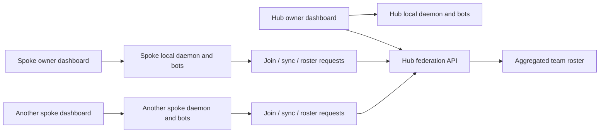
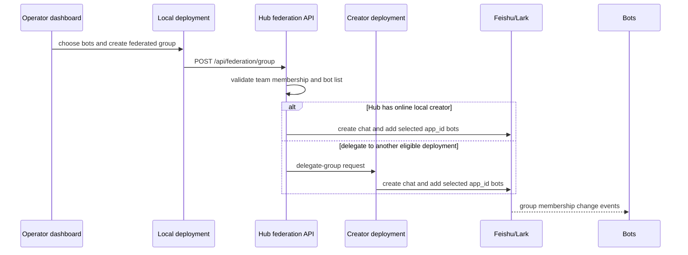

# beam Federation Design

English: [federation-design.en.md](federation-design.en.md)

> 目标：让多套**彼此独立的 beam 部署**组成一个共享团队，先解决“看见彼此的 bot”，再解决“把不同部署的 bot 拉进同一个飞书群协作”。

## 1. 这份文档解决什么

`beam` 的单部署协作已经成立：同一套 daemon 下，多个 bot 可以进同一个群，被点名、接力、参与 workflow。

联邦（federation）解决的是下一层问题：

- 不同人的 beam 部署彼此独立
- 每套部署只管自己的 daemon、bot、凭证和本地 CLI
- 但这些部署仍希望组成同一个团队，在同一个飞书租户里协作

联邦的核心不是“远程控制别人的 daemon”，而是：

1. **发现**：看到别的部署有哪些 bot、擅长什么、是否在线
2. **协作入口**：把跨部署选中的 bot 拉进同一个飞书群

真正的协作仍然发生在**飞书群本身**，不是发生在 hub 的控制平面里。

## 2. 核心结论

联邦设计只抓住两个事实：

- **bot 天然已经能在飞书群里协作**。只要它们都被拉进同一个群，各自所属部署的 daemon 就会感知并参与。
- **跨部署真正需要共享的只有元数据，不是运行时控制权**。共享的是名册、能力、归属、在线性；不是把某套部署的本地 API 全部开放给别人。

因此联邦模型保持克制：

- 每套部署仍只暴露最小联邦 API
- 每个 owner 仍在**自己的 dashboard** 上操作
- hub 负责聚合团队视图，不接管 spoke 的日常运行

## 3. 前提与边界

### 3.1 前提

1. **同一飞书租户**  
   `union_id` 在联邦参与方之间可稳定使用；不同部署的 bot 可以进同一个飞书群。

2. **网络可达**  
   spoke 能通过 HTTP 访问 hub。主方向是 **spoke -> hub**。是否需要 hub -> spoke 的回调能力，取决于是否启用委托建群。

3. **一套部署 = 一个 owner**  
   联邦不试图解决“多个人共同操作同一套 daemon”的问题。那是另一层权限模型。

### 3.2 不做什么

联邦不做以下事情：

- 不把某个部署的本地 daemon 直接暴露给其他团队成员
- 不把 session 级别的终端控制跨部署共享
- 不在联邦层做细粒度逐 bot ACL
- 不把跨部署协作建模成“远程 RPC 驱动别人的 agent”

## 4. 总体模型

### 4.1 Hub / Spoke

- **Hub**：团队的聚合中心。持有团队成员、联邦部署、聚合花名册。
- **Spoke**：加入某个团队的远端部署。保留自己的 daemon、dashboard、bot 凭证和本地运行时。



### 4.2 为什么不是 peer-to-peer

因为联邦需要一个稳定的“团队视图”：

- 谁已经加入团队
- 每个部署有哪些 bot
- 哪些 bot 当前可用
- 哪些信息应该统一展示给团队成员

这类聚合天然适合有一个中心节点。Hub 不是运行时控制器，而是**团队目录服务**。

## 5. 身份与信任

### 5.1 部署身份

每套部署拥有自己的部署身份：

- `deploymentId`：稳定 uuid，写入本地身份文件
- `name`：人类可读名称，用于 roster 展示
- `ownerUnionId` / `ownerName`：部署 owner 的飞书身份（若已绑定）

### 5.2 加入凭证

spoke 通过 hub 发出的**邀请码**加入团队：

- 邀请码只用于首次加入
- 加入成功后，hub 为该 spoke 颁发长期 `syncToken`
- 后续同步、拉花名册、退出，都使用 `syncToken`

### 5.3 信任边界

联邦仍延续 beam 平台的基本假设：**团队内互信**。

这意味着：

- 不为每次“看 roster”“发起联邦拉群”做复杂审批
- 重点放在“谁能加入团队”“谁代表哪个部署”
- 通过 token、幂等、限流、审计降低误用和重复执行风险

## 6. 数据模型

### 6.1 Hub 侧

Hub 需要记录每个已加入的远端部署，以及它最近同步上来的 bot 摘要：

```ts
interface FederatedDeployment {
  deploymentId: string;
  name: string;
  syncToken: string;
  ownerUnionId?: string;
  ownerName?: string;
  callbackUrl?: string;
  delegationToken?: string;
  bots: FederatedBot[];
  joinedAt: number;
  lastSeenAt: number;
}

interface FederatedBot {
  larkAppId: string;
  botName: string;
  cliId: string;
  capability?: string;
  hasTeamRole?: boolean;
  ownerUnionId?: string;
  ownerName?: string;
}
```

### 6.2 Spoke 侧

Spoke 只需要记住“我加入了哪些远端团队”：

```ts
interface RemoteMembership {
  hubUrl: string;
  teamId: string;
  teamName: string;
  syncToken: string;
  deploymentId: string;
  joinedAt: number;
}
```

## 7. 联邦 API

### 7.1 Hub 侧 API

Hub 暴露最小联邦面：

- `POST /api/federation/join`  
  首次加入。校验邀请码，创建 spoke 记录，返回 `syncToken`。

- `POST /api/federation/sync`  
  spoke 周期性推送本地 bot 摘要、owner 信息和心跳。

- `GET /api/federation/roster`  
  返回聚合花名册。认证使用 `Authorization: Bearer <syncToken>`。

- `POST /api/federation/leave`  
  spoke 主动离开团队，幂等。

- `POST /api/federation/group`  
  spoke 从自己的 dashboard 发起跨部署拉群时，请 hub 代为编排。

### 7.2 Spoke 侧 API / 本地动作

Spoke 不需要为所有人开放完整 dashboard，只需要本地 owner 能做这些动作：

- 加入远端团队
- 主动同步本地 bot 摘要
- 拉取自己所属远端团队的 roster
- 主动退出远端团队
- 发起“对远端团队的联邦拉群”

## 8. 聚合花名册

联邦的第一性产物是**聚合花名册**，不是拉群。

花名册需要回答：

- 这个团队当前有哪些部署
- 每个部署有哪些 bot
- bot 的能力标签、角色摘要、owner 是谁
- 这个部署最近有没有心跳，是否可能离线

建议返回结构里显式带上部署信息：

```ts
interface AggregatedRosterBot {
  larkAppId: string;
  botName: string;
  cliId: string;
  capability?: string;
  ownerUnionId?: string;
  ownerName?: string;
  deployment: {
    id: string;
    name: string;
    local: boolean;
    stale: boolean;
  };
}
```

### 8.1 UI 语义上的关键点

`deployment.local` 只能表示“对 hub 来说是否本地”，不能被 spoke 端 UI 直接当作“对我来说是否本地”。

因此前端做“是否可编辑”的判断时，应该比较：

- `bot.deployment.id === currentDeploymentId`

而不是直接看：

- `bot.deployment.local`

否则 spoke 端会把 hub 本地 bot 误判成“自己可编辑”。

## 9. 跨部署拉群

### 9.1 基本事实

把 bot 加进飞书群时，用的是 **app_id**，不是 `union_id`。

这意味着联邦拉群不需要发明新机制，只需要：

1. 从聚合花名册里拿到要加入的 `larkAppId`
2. 找到一个**当前在线、且有对应 app 凭证**的部署来发起建群
3. 调用现有建群链路，把这些 app_id 加进群

### 9.2 基本流程



### 9.3 Creator 选择

建群必须由某个**真实持有 app 凭证**的部署发起。

优先级：

1. 优先使用 hub 自己的在线本地 bot
2. 若 hub 当前没有合适 creator，则委托给某个可达 spoke
3. 如果没有任何部署满足条件，返回 `no_creator_available`

### 9.4 幂等和超时

拉群属于有副作用操作，必须显式加护栏：

- 每次联邦拉群带 `requestId`
- hub 和 delegate 侧都按 `requestId` 做短 TTL 幂等缓存
- 若 delegate 超时，hub 不应继续试下一个 creator

否则网络抖动时很容易建出重复群。

## 10. 邀请 owner 一起进群

只把 bot 拉进群还不够。很多时候，真正需要进群的人还包括：

- 发起这次联邦拉群的操作者本人
- 每个被选中 bot 的 owner

所以群成员应拆成两类：

1. **bot**：按 `larkAppId` 加入
2. **人**：按 `union_id` 加入

这样可以避免 open_id 的 app 隔离问题。

## 10.1 为什么需要 owner 身份绑定

如果部署没有绑定 owner 的飞书身份，hub 无法可靠知道：

- 谁是这套部署的操作者
- 拉群时应该把谁一起邀请进来

因此部署身份里需要支持：

- `ownerUnionId`
- `ownerName`

这个身份可以复用现有 `/pair` 能力完成绑定。

## 10.2 降级行为

未绑定身份时，联邦拉群仍可继续执行：

- 群可以建
- bot 可以进
- 但无法保证相关 owner 一定被邀请进群

这类降级必须在返回结果和 UI 上显式标出，例如：

- `missingOperatorIdentity`
- `missingOwnerIdentity`

否则用户会误以为“系统已经按预期把人也拉进去了”。

## 11. 对称视图

联邦不应该只有 hub 端才看得到完整团队。

一个团队中的任意成员，都应该能在自己的 dashboard 里看到：

- 自己本地 bot
- hub 本地 bot
- 其他 spoke 的 bot

区别只在于：

- **谁可编辑**：仅自己本地部署的 bot
- **谁可发起实际建群**：由 hub 编排，creator 可以是 hub 或其他部署

这就是“对称花名册、集中编排、分布式执行”的基本模型。

## 12. 失败语义

联邦设计里需要明确几类错误，不要把一切都糊成 `500`：

- `deployment_already_joined`
- `hub_unreachable`
- `hub_timeout`
- `no_online_daemon`
- `no_creator_available`
- `delegation_timeout`
- `missingOperatorIdentity`
- `missingOwnerIdentity`

这样前端和操作者才能区分：

- 是网络问题
- 是权限/成员资格问题
- 是 creator 不在线
- 还是群已经建成但邀请人信息不完整

## 13. 分期建议

### P1：联邦基础

- 部署身份
- 邀请码加入
- 周期同步与心跳
- 聚合花名册

目标：**先让大家看见彼此的 bot**

### P2：跨部署拉群

- 复用现有建群链路
- 按 `larkAppId` 加 bot
- hub 编排 / delegate 执行
- 基本幂等和超时控制

目标：**让跨部署 bot 真正进到同一个飞书群**

### P3：身份和 owner 邀请补全

- 部署 owner 身份绑定
- 拉群同时邀请操作者和 bot owner
- 完善降级提示

目标：**不只让 bot 进群，也让相关人进群**

### P4：更高层能力

- 共享 connector / 团队角色
- 更完整的审计与可观测
- 更丰富的团队 UI

## 14. 与平台设计的关系

联邦不是独立产品，而是 `docs/platform-design.md` 的跨部署扩展。

平台设计解决：

- 同一团队里如何发现、组队、协作
- 团队名册和角色如何组织
- 团队平台与个人 dashboard 如何分层

联邦设计则回答：

- 当这些 bot 不在同一套部署里时，团队名册怎样聚合
- 谁来负责跨部署拉群
- 怎样在不共享本地运行时控制权的前提下完成团队协作

## 15. 实现约束

联邦实现应尽量复用现有 beam 资产：

- 邀请码机制
- team store / roster
- bot profile / owner 信息
- 现有建群链路
- 现有 dashboard token 与本地 daemon 管理模型

联邦真正新增的应当只有：

- deployment identity
- federated deployment store
- remote membership store
- 最小联邦 API
- 联邦建群编排逻辑

## 16. 一句话总结

联邦的本质不是“远程调用别人的 beam”，而是：

**把多套独立 beam 部署组织成一个共享团队目录，再借助飞书群把这些 bot 拉到同一个协作现场。**
